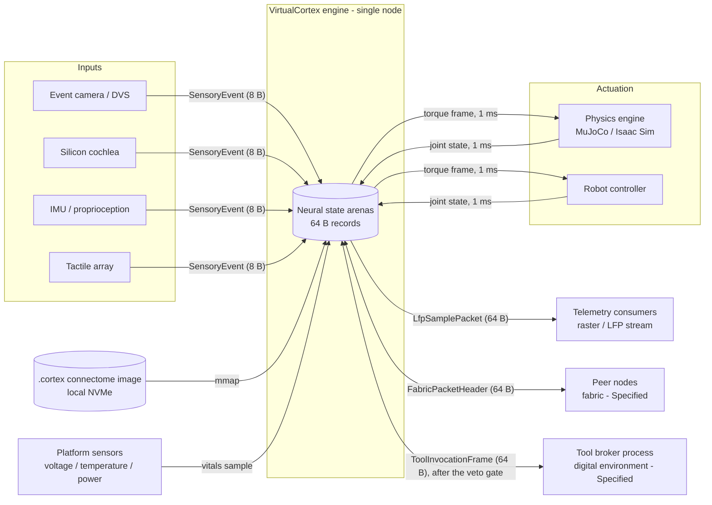
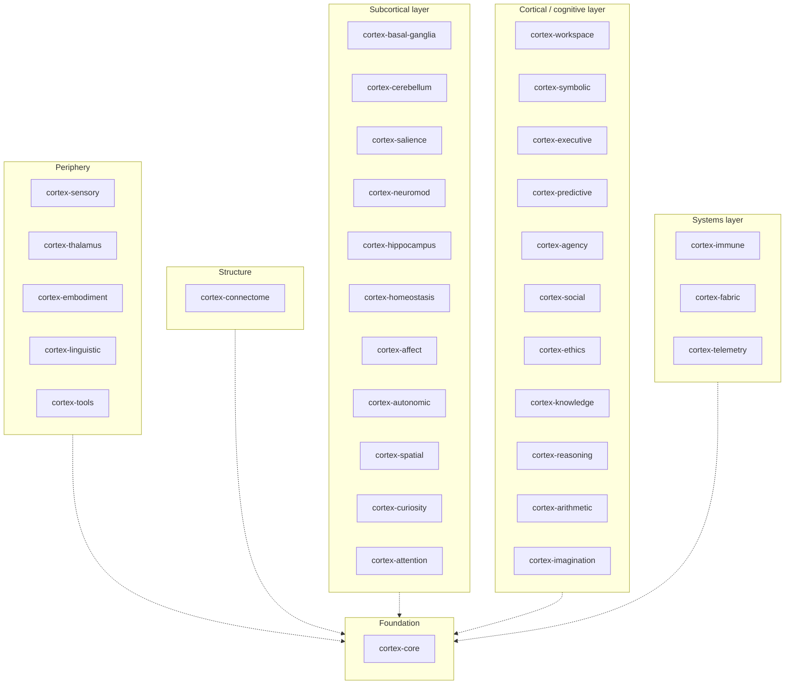

# VirtualCortex Architecture Whitepaper

**A deterministic, single-node neuromorphic virtual-actor engine for spiking neural computation, written in Rust.**

| Document control | |
| :--- | :--- |
| Version | 4.0.0 |
| Status | Active (living document; amended by ADR) |
| Date | 2026-09-10 |
| Supersedes | Whitepaper 3.0.0 (2026-09-10; eighteen crates), which superseded Specification 2.8.0 |
| Canonical language | English (this file). A [Traditional Chinese reader's guide](zh-TW/README.md) points into it and carries no layouts or figures of its own. |
| Structure | [arc42](https://arc42.org) template v8 with [C4](https://c4model.com) views |
| Decision log | [docs/adr/](adr/README.md) ([MADR](https://adr.github.io/madr/) format) |
| Governance | [ADR-0008](adr/0008-documentation-governance.md) |
| Requirement language | The key words MUST, MUST NOT, SHOULD, SHOULD NOT and MAY are to be interpreted as described in [BCP 14](https://www.rfc-editor.org/info/bcp14) (RFC 2119, RFC 8174) when, and only when, they appear in capitals. |
| Toolchain verified against | `rustc 1.97.1`, `cargo 1.97.1` (pinned in `rust-toolchain.toml`), Node 24; minimum supported Rust 1.85, edition 2024 ([ADR-0009](adr/0009-rust-edition-and-msrv.md)); see [Appendix B](#appendix-b-verification-and-conformance) |
| License | Apache-2.0 OR MIT |

## How to read this document

Every claim about the system carries one of four **status labels**, which state its maturity. They are the most important convention in this document, and a claim without one is a defect. (In tables the column is headed *Maturity*, because *status* is the word the decision records use for their lifecycle.)

| Label | Meaning | Evidence required |
| :--- | :--- | :--- |
| **Implemented** | Exists in `crates/` today and is checked by the compiler, a test, or an executable assertion in this document. | Source path, plus a `const` assertion, a unit test, or a `@assert-*` directive. |
| **Specified** | The design is fixed here or in an ADR (interfaces, formats, invariants), but no code exists yet. | A section of this document or an ADR. |
| **Target** | A measurable quality goal with a stated measurement protocol. **Not yet measured.** | An entry in [§10](#10-quality-requirements) with a protocol. |
| **Hypothesis** | A research assumption the architecture rests on. It must be validated before anything that depends on it can become a Target. | An entry in [§11](#11-risks-and-technical-debt). |

**Where this document and the repository disagree, the repository is authoritative**, and the disagreement is recorded as a numbered finding in [§11](#11-risks-and-technical-debt) rather than resolved silently. The claims this document makes about the source tree are executable: `npx spec-guard` runs the `<!-- @assert-* -->` directives embedded below against `crates/` and fails CI when they drift ([Appendix B](#appendix-b-verification-and-conformance)).

**No performance figure in this document has been measured.** Every number in [§10](#10-quality-requirements) is a Target with a protocol, and stays one until a benchmark exists in the repository.

---

## Table of contents

- [Executive summary](#executive-summary)
- [1. Introduction and goals](#1-introduction-and-goals)
- [2. Constraints](#2-constraints)
- [3. Context and scope](#3-context-and-scope)
- [4. Solution strategy](#4-solution-strategy)
- [5. Building block view](#5-building-block-view)
- [6. Runtime view](#6-runtime-view)
- [7. Deployment view](#7-deployment-view)
- [8. Cross-cutting concepts](#8-cross-cutting-concepts)
- [9. Architecture decisions](#9-architecture-decisions)
- [10. Quality requirements](#10-quality-requirements)
- [11. Risks and technical debt](#11-risks-and-technical-debt)
- [12. Glossary](#12-glossary)
- [Appendix A. Capacity model](#appendix-a-capacity-model)
- [Appendix B. Verification and conformance](#appendix-b-verification-and-conformance)
- [Appendix C. Roadmap](#appendix-c-roadmap)
- [Appendix D. References](#appendix-d-references)
- [License](#license)

---

## Executive summary

VirtualCortex is a Rust workspace for building a **spiking neural network (SNN) engine on the virtual-actor model, constrained to a single physical server**. Its design premise is that biological neural tissue is sparse, event-driven, asynchronous and defined by its connectivity, and that a general-purpose CPU can execute such a system efficiently only when every data structure respects the physical realities of the machine: the 64-byte cache line, the memory wall, the branch predictor, and the cost of a heap allocation or a system call on a hot path.

The engine therefore rests on five axioms (§4): neural units exist virtually and are materialised on demand; state and compute are decoupled, so that a fixed pool of worker threads services tens of millions of passive records; each record is owned by at most one worker per tick, enforced by an atomic gate; axonal conduction delay is a constant-time index into a timing wheel, never an operating-system timer; and inactive tissue is evicted to local storage by a metabolic sweep. Around this core, the workspace defines subsystems that mirror the functional anatomy of the mammalian brain: sensory ingestion, embodiment, basal-ganglia action selection, cerebellar forward models, amygdalar salience, a global workspace, a vector-symbolic bridge, prefrontal planning, predictive coding, agency attribution, neuromodulation, hippocampal memory, homeostasis, an immune scrubber, a scale-out fabric and telemetry; and, admitted by [ADR-0016](adr/0016-thirty-two-crate-architecture.md) on 2026-09-10, a thalamic relay, native construction-grammar frames, brokered tool invocation, foveal attention, interoception, autonomic vitals, a metric cognitive map, epistemic curiosity, social perspective, an ethical veto gate, a semantic ontology, symbolic rules, an exact arithmetic scratchpad and a counterfactual canvas.

**What exists today (Implemented).** Thirty-two `#![no_std]` crates with no external dependencies and no `unsafe` code. Each crate defines its primary state record as a `#[repr(C)]` plain-old-data structure: thirty 64-byte cache-line records, one 16-byte neuromodulator record and one 8-byte sensory event. Size and alignment are asserted at compile time for all of them; every record without atomics is `Copy` and `Eq`. Twenty-two crates carry small, deterministic, integer-only update rules with boundary tests (the Logic column of §1.6), and every crate carries a test module. The workspace compiles cleanly on stable Rust and its layout invariants are verified by `cargo test` and by the executable assertions in this document.

**What is designed but not built (Specified).** The worker executor, the delivery path from the timing wheel into mailboxes, the `.cortex` memory-mapped image loader, the shared-memory mappings of the embodiment and tool rings and the broker process behind the tool ring, the lexicon that realises linguistic frames as tokens, epoch-based reclamation for structural plasticity, the fabric transport, and every subsystem's dynamics beyond the rules noted in §5.

**What must be proved (Hypothesis).** That multi-compartment "super-neuron" records can condense the behaviour of point-neuron populations at a ratio that makes whole-brain-scale behaviour reachable within a single 64 GB server. The capacity model in Appendix A is parameterised on that ratio and is a plan, not a measurement.

---

## 1. Introduction and goals

### 1.1 Problem statement

Dense-tensor deep learning maps well to GPUs and poorly to the operating principles of nervous tissue, which is roughly 1–2 % active at any instant, communicates by discrete events, and computes through topology and timing. Existing academic SNN simulators model that tissue faithfully but pay for it with pointer-based sparse graphs and IEEE-754 floating point: at scale they thrash the cache hierarchy, saturate the DRAM bus, and produce results that differ across CPU vendors.

A naive whole-brain point-neuron model illustrates the memory wall. With $N \approx 8.6 \times 10^{10}$ neurons and $S \approx 10^{14}$ synapses, even a minimal 8-byte pointer per synapse costs

$$
M_{\text{naive}} \;\ge\; S \cdot 8\ \text{B} \;=\; 8 \times 10^{14}\ \text{B} \;\approx\; 800\ \text{TB},
$$

and every synapse traversal is a dependent load. On a 3.2 GHz core a DRAM miss costs roughly 80 ns, about 256 cycles, so a pointer-chasing inner loop is stalled for more than 99 % of its cycles:

$$
\frac{t_{\text{DRAM}}}{t_{\text{ALU}}} \;=\; \frac{80\ \text{ns}}{0.3125\ \text{ns}} \;\approx\; 256, \qquad
\text{stall fraction} \;\approx\; \frac{256 - 1}{256} \;\approx\; 99.6\ \%.
$$

VirtualCortex attacks the problem from the hardware upward. The target is not to reproduce every point neuron but to build an engine whose unit of state is a cache line, whose arithmetic is bit-exact across platforms, whose hot path never allocates, and whose scale is bounded by memory density rather than by pointer traffic.

### 1.2 Functional requirements

| ID | Requirement | Maturity |
| :--- | :--- | :--- |
| FR-1 | Represent a neural unit as a fixed-size, 64-byte, `#[repr(C)]` record with no heap pointers. | Implemented (§5.2.1) |
| FR-2 | Represent synaptic fan-out as fixed-size 64-byte blocks chained by index, not by pointer. | Implemented (§5.2.1) |
| FR-3 | Schedule delayed spike delivery in $O(1)$ time using a two-tier timing wheel. | Implemented (structure) · Specified (dispatch) (§5.2.1, §6.2) |
| FR-4 | Load a whole connectome image by memory mapping, without a deserialisation pass. | Specified (§8.7) |
| FR-5 | Ingest events from hot-pluggable peripherals through a trait-based hardware abstraction layer. | Implemented (trait) · Specified (runtime) (§5.2.3) |
| FR-6 | Exchange motor commands and proprioceptive feedback with a physics engine or robot under a 1 ms period. | Implemented (frames, ring protocol) · Specified (mapping, loop, torque decoder) (§5.2.4, §6.4) |
| FR-7 | Provide subcortical, cortical and systemic subsystems as independent crates with 64-byte state records. | Implemented (records; one or more tested rules in 22 crates) · Specified (the full dynamics of §8.8) (§5.2) |
| FR-8 | Verify all layout invariants at compile time and all documentation claims in CI. | Implemented (Appendix B) |
| FR-9 | Act on a digital environment through a broker outside the engine process, as 64-byte shared-memory frames that pass an in-engine veto gate first; and realise language natively, from hypervector unbinding into construction-grammar frames, with no external language model. | Implemented (frames, gate rule, frame assembly) · Specified (broker, ring mapping, unbinding, lexicon) (§5.2.20, §5.2.21, §5.2.28, §6.8, §6.9) |

### 1.3 Quality goals

Ordered by priority. Each is refined into measurable scenarios in §10.

| Priority | Quality goal | Motivation |
| :--- | :--- | :--- |
| 1 | **Determinism.** The same seed and inputs MUST produce bit-identical state on x86-64 and AArch64. | Scientific reproducibility; safety of embodied control; testability. |
| 2 | **Memory density.** State per neural unit MUST be exactly one cache line; the engine MUST run a reference configuration within a single commodity server. | The memory wall (§1.1) is the binding constraint, not arithmetic throughput. |
| 3 | **Latency.** Per-event dispatch MUST be free of allocation, system calls and pointer chasing. | Tail latency is dominated by exactly those three things. |
| 4 | **Real-time embodiment.** The sensorimotor loop MUST hold a fixed 1 ms period with bounded jitter. | Physical stability of rigid-body control. |
| 5 | **Verifiability.** Every architectural claim MUST be checkable by a tool that runs in CI. | Documentation that cannot fail a build rots ([ADR-0008](adr/0008-documentation-governance.md)). |

### 1.4 Stakeholders

| Stakeholder | Concern |
| :--- | :--- |
| Systems engineers implementing the runtime | Exact record layouts (§5.2), numeric model (§8.1), concurrency rules (§8.5). |
| Computational neuroscientists | Which biological mechanism each subsystem models and with what simplifications (§8.8). |
| Robotics integrators | The embodiment interface and its timing contract (§5.2.4, §6.4, §10). |
| Reviewers and maintainers | Status of every claim, open findings (§11), and how the document is verified (Appendix B). |
| Coding agents | Ground truth that cannot mislead: every assertion in this file is executable. |

### 1.5 Scope and non-goals

In scope: a single-node engine, its state model, its subsystems, its interfaces to the outside world (sensors, a body, platform vitals and a brokered digital environment), its native language realisation, and its verification.

Out of scope, by design. These are the boundaries the founding design note drew and they still hold:

- **Dense synchronous matrix workloads.** Transformer-style training is a GPU problem. An asynchronous discrete-event engine on CPUs is the wrong tool for it and this document does not pretend otherwise.
- **Cross-machine fault tolerance inside the engine.** The engine assumes a node does not partially fail. High availability, if needed, wraps the engine with snapshots; it is not built into the tick loop. Multi-node *scale-out* (§5.2.17) is a data-plane concern and is Specified, not Implemented.
- **All-to-all connectivity.** Mailboxes assume the small-world sparsity of biological tissue. A dense graph exhausts memory bandwidth by construction.
- **A general-purpose actor framework.** Actors here are passive 64-byte records, not objects with behaviour; there is no supervision tree, no message serialisation and no location transparency beyond the node.

One boundary moved on 2026-09-10 ([ADR-0016](adr/0016-thirty-two-crate-architecture.md)): the engine may act on a digital environment, through a broker process outside its own seccomp filter (§8.10). That does not make the engine a general-purpose framework: a tool call is a 64-byte frame in a shared-memory ring, exactly as a motor command is. Language stays inside the engine: frames are assembled natively from hypervector unbinding (§5.2.20) and no external language model is part of the system.

### 1.6 Implementation status at a glance

Verified against the tree on 2026-09-10. "Layout" means the record's size and alignment are asserted at compile time; "Test" means a `#[cfg(test)]` unit test exists; "Logic" means at least one non-trivial update function exists.

| Crate | Primary public type(s) | Size | `no_std` | Layout | Test | Logic |
| :--- | :--- | ---: | :---: | :---: | :---: | :---: |
| `cortex-core` | `DendriticSuperNeuron`, `SynapseBlock`, `MailboxNode`, `FlatTimingWheel` (`WorkerWheel`), `synaptic_efficacy_q16` | 64 B, 64 B, 8 B, 4.2 MB | yes | yes | yes | membrane integration, short-term plasticity, turn gate and mailbox, wheel schedule and drain, efficacy |
| `cortex-connectome` | `CortexFileHeader` | 64 B | yes | yes | yes | — |
| `cortex-sensory` | `SensoryEvent`, `trait SensoryPeripheral` | 8 B | yes | yes | yes | — |
| `cortex-embodiment` | `EmbodimentRingBuffer`, `TorqueFrame`, `JointStateFrame` | 64 B each | yes | yes | yes | SPSC ring protocol |
| `cortex-basal-ganglia` | `BasalGangliaChannelState` | 64 B | yes | yes | yes | `compute_gating` |
| `cortex-cerebellum` | `CerebellarMicrozone` | 64 B | yes | yes | yes | `step_forward_model` |
| `cortex-salience` | `SalienceNodeState` | 64 B | yes | yes | yes | `evaluate_threat` |
| `cortex-workspace` | `GlobalWorkspaceSlot` | 64 B | yes | yes | yes | `step_ignition` |
| `cortex-symbolic` | `SymbolicHypervectorHeader` | 64 B | yes | yes | yes | `bind` |
| `cortex-executive` | `ExecutivePlanNode` | 64 B | yes | yes | yes | — |
| `cortex-predictive` | `PredictiveErrorState` | 64 B | yes | yes | yes | — |
| `cortex-agency` | `AgentPerspectiveState` | 64 B | yes | yes | yes | — |
| `cortex-immune` | `ImmuneScrubNode` | 64 B | yes | yes | yes | — |
| `cortex-neuromod` | `NeuromodulatorState` | 16 B | yes | yes | yes | — |
| `cortex-hippocampus` | `HippocampalAttractorState` | 64 B | yes | yes | yes | — |
| `cortex-homeostasis` | `HomeostaticDrivePool` | 64 B | yes | yes | yes | `update_circadian_tick` |
| `cortex-fabric` | `FabricPacketHeader` | 64 B | yes | yes | yes | — |
| `cortex-telemetry` | `LfpSamplePacket` | 64 B | yes | yes | yes | — |
| `cortex-thalamus` | `ThalamicRelayNode` | 64 B | yes | yes | yes | `relay` gate (tonic / burst / closed) |
| `cortex-linguistic` | `LinguisticFrameSlot` | 64 B | yes | yes | yes | `bind_role`, `realisation_order`, `advance_prosody` (recurrent cell) |
| `cortex-tools` | `ToolInvocationFrame` | 64 B | yes | yes | yes | frame state machine, `is_known_action`, `new_call` |
| `cortex-attention` | `FovealAttentionFocus` | 64 B | yes | yes | yes | saccade state machine, `document_target` |
| `cortex-affect` | `InteroceptiveState` | 64 B | yes | yes | yes | `integrate` |
| `cortex-autonomic` | `AutonomicVitalsState` | 64 B | yes | yes | yes | `sample` limit check |
| `cortex-spatial` | `SpatialGridCoordinate` | 64 B | yes | yes | yes | `integrate`, `fix` |
| `cortex-curiosity` | `CuriosityExplorationVector` | 64 B | yes | yes | yes | `visit` |
| `cortex-social` | `SocialPerspectiveNode` | 64 B | yes | yes | yes | `resonate`, `update_trust` |
| `cortex-ethics` | `EthicalEvaluationGate` | 64 B | yes | yes | yes | `evaluate` (veto) |
| `cortex-knowledge` | `SemanticOntologyNode` | 64 B | yes | yes | yes | `consolidate`, `affords`, `certify` |
| `cortex-reasoning` | `SymbolicRuleNode` | 64 B | yes | yes | yes | `evaluate` (truth table), `resolve`, `apply_resolution` |
| `cortex-arithmetic` | `ArithmeticScratchpadSlot` | 64 B | yes | yes | yes | `execute` (eight opcodes, 128-bit) |
| `cortex-imagination` | `MentalCanvasFrame` | 64 B | yes | yes | yes | `step`, `has_diverged` |

The workspace manifest lists exactly thirty-two state crates under `crates/` (eighteen from the founding decomposition and fourteen admitted by [ADR-0016](adr/0016-thirty-two-crate-architecture.md)), plus the benchmark crate `benches/cortex-bench` ([ADR-0014](adr/0014-benchmark-harness.md)), which is not a state crate and is never published. Every state crate declares an empty dependency list, inherits its version, edition (2024), minimum supported Rust version (1.85), authors, license and repository from `[workspace.package]`, carries a compile-time layout assertion block, and carries a unit-test module; every public function and associated constant has at least one test (brief 007).

<!-- @assert-count target="Cargo.toml" symbol="crates/cortex-" expected="32" reason="the workspace has thirty-two member crates (ADR-0016); update §1.6 and §5 if this changes" -->
<!-- @assert-count target="crates" symbol="const _: () = {" min="32" glob="*.rs" reason="every crate carries a compile-time layout assertion block (F-18 closed)" -->
<!-- @assert-count target="crates" symbol="license.workspace = true" expected="32" glob="Cargo.toml" reason="every crate inherits its metadata from [workspace.package] (F-9 closed)" -->
<!-- @assert-count target="crates/cortex-core" symbol="#[cfg(test)]" min="1" glob="*.rs" reason="F-14: every state crate carries a unit-test module" -->
<!-- @assert-count target="crates/cortex-connectome" symbol="#[cfg(test)]" min="1" glob="*.rs" reason="F-14: every state crate carries a unit-test module" -->
<!-- @assert-count target="crates/cortex-sensory" symbol="#[cfg(test)]" min="1" glob="*.rs" reason="F-14: every state crate carries a unit-test module" -->
<!-- @assert-count target="crates/cortex-embodiment" symbol="#[cfg(test)]" min="1" glob="*.rs" reason="F-14: every state crate carries a unit-test module" -->
<!-- @assert-count target="crates/cortex-basal-ganglia" symbol="#[cfg(test)]" min="1" glob="*.rs" reason="F-14: every state crate carries a unit-test module" -->
<!-- @assert-count target="crates/cortex-cerebellum" symbol="#[cfg(test)]" min="1" glob="*.rs" reason="F-14: every state crate carries a unit-test module" -->
<!-- @assert-count target="crates/cortex-salience" symbol="#[cfg(test)]" min="1" glob="*.rs" reason="F-14: every state crate carries a unit-test module" -->
<!-- @assert-count target="crates/cortex-workspace" symbol="#[cfg(test)]" min="1" glob="*.rs" reason="F-14: every state crate carries a unit-test module" -->
<!-- @assert-count target="crates/cortex-symbolic" symbol="#[cfg(test)]" min="1" glob="*.rs" reason="F-14: every state crate carries a unit-test module" -->
<!-- @assert-count target="crates/cortex-executive" symbol="#[cfg(test)]" min="1" glob="*.rs" reason="F-14: every state crate carries a unit-test module" -->
<!-- @assert-count target="crates/cortex-predictive" symbol="#[cfg(test)]" min="1" glob="*.rs" reason="F-14: every state crate carries a unit-test module" -->
<!-- @assert-count target="crates/cortex-agency" symbol="#[cfg(test)]" min="1" glob="*.rs" reason="F-14: every state crate carries a unit-test module" -->
<!-- @assert-count target="crates/cortex-immune" symbol="#[cfg(test)]" min="1" glob="*.rs" reason="F-14: every state crate carries a unit-test module" -->
<!-- @assert-count target="crates/cortex-neuromod" symbol="#[cfg(test)]" min="1" glob="*.rs" reason="F-14: every state crate carries a unit-test module" -->
<!-- @assert-count target="crates/cortex-hippocampus" symbol="#[cfg(test)]" min="1" glob="*.rs" reason="F-14: every state crate carries a unit-test module" -->
<!-- @assert-count target="crates/cortex-homeostasis" symbol="#[cfg(test)]" min="1" glob="*.rs" reason="F-14: every state crate carries a unit-test module" -->
<!-- @assert-count target="crates/cortex-fabric" symbol="#[cfg(test)]" min="1" glob="*.rs" reason="F-14: every state crate carries a unit-test module" -->
<!-- @assert-count target="crates/cortex-telemetry" symbol="#[cfg(test)]" min="1" glob="*.rs" reason="F-14: every state crate carries a unit-test module" -->
<!-- @assert-count target="crates/cortex-thalamus" symbol="#[cfg(test)]" min="1" glob="*.rs" reason="F-14: every state crate carries a unit-test module" -->
<!-- @assert-count target="crates/cortex-linguistic" symbol="#[cfg(test)]" min="1" glob="*.rs" reason="F-14: every state crate carries a unit-test module" -->
<!-- @assert-count target="crates/cortex-tools" symbol="#[cfg(test)]" min="1" glob="*.rs" reason="F-14: every state crate carries a unit-test module" -->
<!-- @assert-count target="crates/cortex-attention" symbol="#[cfg(test)]" min="1" glob="*.rs" reason="F-14: every state crate carries a unit-test module" -->
<!-- @assert-count target="crates/cortex-affect" symbol="#[cfg(test)]" min="1" glob="*.rs" reason="F-14: every state crate carries a unit-test module" -->
<!-- @assert-count target="crates/cortex-autonomic" symbol="#[cfg(test)]" min="1" glob="*.rs" reason="F-14: every state crate carries a unit-test module" -->
<!-- @assert-count target="crates/cortex-spatial" symbol="#[cfg(test)]" min="1" glob="*.rs" reason="F-14: every state crate carries a unit-test module" -->
<!-- @assert-count target="crates/cortex-curiosity" symbol="#[cfg(test)]" min="1" glob="*.rs" reason="F-14: every state crate carries a unit-test module" -->
<!-- @assert-count target="crates/cortex-social" symbol="#[cfg(test)]" min="1" glob="*.rs" reason="F-14: every state crate carries a unit-test module" -->
<!-- @assert-count target="crates/cortex-ethics" symbol="#[cfg(test)]" min="1" glob="*.rs" reason="F-14: every state crate carries a unit-test module" -->
<!-- @assert-count target="crates/cortex-knowledge" symbol="#[cfg(test)]" min="1" glob="*.rs" reason="F-14: every state crate carries a unit-test module" -->
<!-- @assert-count target="crates/cortex-reasoning" symbol="#[cfg(test)]" min="1" glob="*.rs" reason="F-14: every state crate carries a unit-test module" -->
<!-- @assert-count target="crates/cortex-arithmetic" symbol="#[cfg(test)]" min="1" glob="*.rs" reason="F-14: every state crate carries a unit-test module" -->
<!-- @assert-count target="crates/cortex-imagination" symbol="#[cfg(test)]" min="1" glob="*.rs" reason="F-14: every state crate carries a unit-test module" -->
<!-- @assert-absence target="crates" symbol="unsafe" word="true" glob="*.rs" reason="no unsafe code exists yet; introducing it requires an ADR (§8.10)" -->

---

## 2. Constraints

### 2.1 Engineering doctrine: "Latest ≠ Newest"

The project's founding rule is that **the newest technology is rarely the best-understood one**, and that a mission-critical engine is built from foundations whose failure modes are already known. Concretely, a technology is admissible on the hot path only if it satisfies all of:

1. a stable, published specification or ABI;
2. at least two years of production use under load by parties other than its authors;
3. failure modes that are documented, not discovered;
4. a mechanical-sympathy argument: it maps onto what the CPU, the memory controller and the kernel actually do.

This rule is why the foundations below were chosen over their newer alternatives.

| Foundation | Stable since | Why it is admissible |
| :--- | :--- | :--- |
| 64-byte cache-line-aligned POD records | x86 P6 (1995); all current x86-64 and AArch64 server cores | The transfer quantum of every modern memory subsystem. |
| Q16.16 fixed-point arithmetic | Decades of DSP and game-engine practice | Bit-exact, associative in the integer domain, SIMD-friendly. |
| Hashed / hierarchical timing wheels | Varghese & Lauck, 1987 | $O(1)$ insert and expiry; the standard for kernel and network timers. |
| Epoch-based reclamation | Fraser, 2004; `crossbeam-epoch` in production since 2017 | Lock-free reader path for structural mutation. |
| `mmap` of an image whose layout equals the in-memory layout | POSIX | Zero-copy hydration; the page cache does the work. |
| Rust, edition 2024 | Rust 1.85, February 2025 | Memory safety without a runtime; the edition is the current stable one, not a nightly feature. |
| arc42, C4, MADR, BCP 14 | 2005 / 2018 / 2018 / 1997 | Mature documentation standards with tooling and a reader base. |

What the rule excludes: language features gated on nightly, crates below 1.0 without a documented stability policy, kernel interfaces younger than two LTS releases on the hot path, and any performance claim that has not been reproduced on the reference platform.

### 2.2 Technical constraints

| ID | Constraint | Maturity |
| :--- | :--- | :--- |
| TC-1 | The engine is written in Rust and builds on stable `rustc`. Nightly features MUST NOT be required. | Implemented |
| TC-2 | State crates MUST declare no external dependencies. Runtime crates MAY depend on a vetted allow-list ([ADR-0005](adr/0005-crate-per-subsystem.md)). | Implemented (all 32 state crates; the only third-party dependency in the workspace is the benchmark harness, a dev-dependency of `benches/cortex-bench`, [ADR-0014](adr/0014-benchmark-harness.md)) |
| TC-3 | Every primary state record MUST be `#[repr(C)]`, and its size and alignment MUST be asserted at compile time. | Implemented (§5.2) |
| TC-4 | `f32` and `f64` MUST NOT appear in any crate under `crates/`. Dynamics use Q16.16 (§8.1). | Implemented |
| TC-5 | The simulation hot path MUST NOT allocate, MUST NOT block, and MUST NOT make system calls after initialisation. | Specified (no hot path exists yet; §8.6) |
| TC-6 | State crates MUST be `#![no_std]`. | Implemented (32 of 32; brief 002, ADR-0016) |
| TC-7 | The runtime target is Linux on x86-64-v4 or ARMv9-A; state crates MUST remain portable to any target with 64-bit atomics. | Specified |
| TC-8 | Crates MUST declare `edition = "2024"` and `rust-version = "1.85"` by inheritance from `[workspace.package]`; the toolchain CI builds with MUST be pinned in `rust-toolchain.toml` and moved only deliberately. | Implemented ([ADR-0009](adr/0009-rust-edition-and-msrv.md); finding F-5 closed; a CI job builds and tests on the MSRV) |
| TC-9 | `unsafe` MUST NOT be introduced without an ADR that names the invariant it upholds and the test that checks it. | Implemented (zero `unsafe` today) |

<!-- @assert-absence target="crates" symbol="f32" word="true" glob="*.rs" reason="TC-4: no IEEE-754 in any crate" -->
<!-- @assert-absence target="crates" symbol="f64" word="true" glob="*.rs" reason="TC-4: no IEEE-754 in any crate" -->
<!-- @assert-absence target="crates" symbol="std::thread" glob="*.rs" exclude="tests" reason="TC-5: state crates do not spawn threads; the executor is a separate runtime concern; integration tests under crates/*/tests/ are excluded" -->
<!-- @assert-count target="crates" symbol="#![no_std]" glob="*.rs" expected="32" reason="TC-6: every crate is no_std (F-6 closed by brief 002; ADR-0016)" -->
<!-- @assert-absence target="crates" symbol="Box<" glob="*.rs" exclude="tests" reason="TC-5: no heap-owning types in state crates; integration tests under crates/*/tests/ are excluded" -->
<!-- @assert-absence target="crates" symbol="Vec<" glob="*.rs" exclude="tests" reason="TC-5: no heap-owning types in state crates; integration tests under crates/*/tests/ are excluded" -->
<!-- @assert-absence target="crates" symbol="String" word="true" glob="*.rs" exclude="tests" reason="TC-5: no heap-owning types in state crates (ADR-0016 restated the rule); integration tests under crates/*/tests/ are excluded" -->
<!-- @assert-count target="Cargo.toml" symbol='edition = "2024"' expected="1" reason="TC-8: the workspace edition is 2024 (ADR-0009)" -->
<!-- @assert-count target="Cargo.toml" symbol='rust-version = "1.85"' expected="1" reason="TC-8: the minimum supported Rust version is 1.85 (ADR-0009)" -->
<!-- @assert-count target="crates" symbol="rust-version.workspace = true" expected="32" glob="Cargo.toml" reason="TC-8: every state crate inherits the MSRV (ADR-0009)" -->

### 2.3 Conventions

- **Field offsets** are written as half-open byte ranges `[a..b)` from the start of the record.
- **Q16.16** values are `i32` (or `u32` for non-negative quantities) with 16 fractional bits; `0x0001_0000` is 1.0 (§8.1). Sixteen-bit synaptic weights are **Q1.15** and eight-bit plasticity factors are **Q0.8**; a field whose comment names a format its width cannot hold is a finding (F-3 was one).
- **Ticks** are the engine's discrete time unit. The tick duration is a configuration parameter; current code assumes 10 µs fine ticks and 100 µs coarse ticks in the timing wheel (§8.4).
- **Identifiers**: crates are `cortex-<subsystem>`; primary records are `PascalCase` nouns; Q-format suffixes (`_q16`) are used where the field name would otherwise be ambiguous.
- **Naming of biological analogues** is descriptive, not a claim of equivalence. `cortex-workspace` implements a competitive broadcast slot; it does not implement consciousness, and this document does not use that word for it.

---

## 3. Context and scope

### 3.1 System context (C4 level 1)



### 3.2 External interfaces

| Interface | Direction | Unit of exchange | Crate | Status |
| :--- | :--- | :--- | :--- | :--- |
| Sensory ingestion | in | `SensoryEvent`, 8 B, batched via `SensoryPeripheral::poll_batch` | `cortex-sensory` | Implemented (types) · Specified (drivers) |
| Embodiment | bidirectional | 64-byte `TorqueFrame` out and `JointStateFrame` in, one per 1 ms period, through rings of 16 governed by a 64-byte `EmbodimentRingBuffer` control block ([ADR-0015](adr/0015-embodiment-frame-abi.md)); the shared-memory mapping is the runtime's | `cortex-embodiment` | Implemented (records, protocol) · Specified (mapping, loop, torque decoder) |
| Connectome image | in | `.cortex` file, `CortexFileHeader` + 64-byte-aligned sections | `cortex-connectome` | Implemented (header) · Specified (sections, loader) |
| Telemetry | out | `LfpSamplePacket`, 64 B, single-producer single-consumer ring | `cortex-telemetry` | Implemented (type) · Specified (ring, eBPF taps) |
| Fabric | bidirectional | `FabricPacketHeader`, 64 B, over RDMA verbs or CXL shared memory | `cortex-fabric` | Implemented (header) · Specified (transport) |
| Tool broker | bidirectional | `ToolInvocationFrame`, 64 B, through a ring read by a separate broker process that holds the credentials and the allow-list (§8.10); every frame passes the veto gate of `cortex-ethics` first | `cortex-tools` | Implemented (frame state machine, gate rule) · Specified (broker, ring mapping) |
| Platform vitals | in | Voltage, temperature and power samples from the platform's sensors into `AutonomicVitalsState::sample` | `cortex-autonomic` | Implemented (limit check) · Specified (sensor driver, shedding policy) |
| Formal prover or solver co-processor | bidirectional | A `ToolInvocationFrame` with `TOOL_CATEGORY_FORMAL_PROVER` (0x0004) and `ACTION_VERIFY_PROOF` (0x0001, check a proof term against axioms), `ACTION_SOLVE_CONSTRAINTS` (0x0002, decide a formula by constraint or SMT solving) or `ACTION_SYMBOLIC_EVAL` (0x0003, simplify and rewrite a term); the conjecture is named by `param_hash`, the certificate hash returns in the payload (§6.10). The opcodes name mathematical actions, never a product | `cortex-tools` | Implemented (constants, frame) · Specified (the broker; which prover or solver it runs is its configuration, judged under §2.1 when chosen) |
| Document engine | bidirectional | A `ToolInvocationFrame` with `TOOL_CATEGORY_DOC_ENGINE` (0x0005) and `ACTION_PARSE_STRUCTURE`, `ACTION_EXTRACT_ENTITIES` or `ACTION_SEARCH_CROSS_REF`; foveal queries from `cortex-attention`, triples into `cortex-knowledge` (§6.11) | `cortex-tools` | Implemented (constants, frame) · Specified (the broker, its parsers and its index) |

---

## 4. Solution strategy

### 4.1 The five axioms

The founding design note fixed five axioms. Every later subsystem is built on them, and the fields of `DendriticSuperNeuron` (§5.2.1) are their direct expression.

| # | Axiom | Consequence in the design | Where it lives |
| :--- | :--- | :--- | :--- |
| A1 | **Virtual existence.** A neural unit always exists logically; it occupies memory only when a spike addresses it. | Units are addressed by a 64-bit packed identifier; cold units are evicted and re-hydrated lazily. | `id` field; eviction (Specified, §8.6) |
| A2 | **State and compute are decoupled.** Records are passive data; workers are stateless, core-pinned threads. | Resource use scales with instantaneous activity, not with total capacity. | Executor (Specified, §6.1) |
| A3 | **Turn-based single-writer invariant.** At most one worker touches a record in any tick, enforced by a compare-and-swap gate. | No mutex, no deadlock, no data race on membrane dynamics. | `gate_state: AtomicU8`; mailbox head as index + 1, no tag (§8.5, [ADR-0017](adr/0017-mailbox-and-gate-protocol.md)) |
| A4 | **Discrete axonal delay.** Time is ticks; delay is an index into a ring, never a kernel timer. | $O(1)$ scheduling; deterministic ordering. | `FlatTimingWheel` (§5.2.1, §8.4) |
| A5 | **Metabolic tiering.** A background sweep evicts long-quiet tissue to local storage and keeps hot circuits in cache-friendly arenas. | Memory bounded by activity; persistence falls out of the same mechanism. | Clock sweep and `.cortex` image (Specified, §8.6, §8.7) |

### 4.2 How the quality goals are met

| Quality goal | Strategy | Decision record |
| :--- | :--- | :--- |
| Determinism | Integer-only Q16.16 dynamics; fixed tick ordering; seeded structural growth. | [ADR-0002](adr/0002-q16-16-fixed-point.md) |
| Memory density | One 64-byte record per unit; index-chained 64-byte synapse blocks; explicit reserved padding. | [ADR-0001](adr/0001-64-byte-pod-records.md) |
| Latency | Zero allocation and zero syscalls on the hot path; timing wheel instead of a heap; SIMD-friendly layouts. | [ADR-0003](adr/0003-zero-allocation-hot-path.md), [ADR-0004](adr/0004-two-tier-timing-wheel.md) |
| Real-time embodiment | Shared-memory ring with atomic cursors; `clock_nanosleep` on `CLOCK_MONOTONIC`; hardware watchdog as fail-safe. | §5.2.4, §8.9 |
| Verifiability | Compile-time layout assertions; executable documentation; ADRs with lifecycle checked by `spec-graph`. | [ADR-0008](adr/0008-documentation-governance.md), [ADR-0010](adr/0010-measured-or-target.md) |

### 4.3 Decomposition principle

One crate per functional subsystem, each exporting a single primary 64-byte record and, where the dynamics are settled, one deterministic update function ([ADR-0005](adr/0005-crate-per-subsystem.md)). Crates do not depend on one another today. When a runtime crate is introduced it will compose them; state crates MUST NOT gain dependencies on each other to keep the layout contracts independently testable.

The number of crates is not a design parameter. A new state crate is admitted only by a record that names the gap it fills, with no Responsibility row in §5.2 already covering the quantity and its mechanism written in §8.8 in the same change as its layout ([ADR-0016](adr/0016-thirty-two-crate-architecture.md)); a quantity that belongs to an existing subsystem is a field in that record's reserved bytes, not a crate. Fourteen crates were admitted under that test on 2026-09-10 (§5.2.19 to §5.2.32): the boundaries of §1.5, §8.9 and §8.10 were moved to make room for three of them (the tool broker, the veto gate and the vitals flags), and the responsibilities of six existing crates were narrowed so that every quantity keeps one owner; the record lists each crate with the responsibility it took and what its neighbour kept.

---

## 5. Building block view

### 5.1 Level 1: workspace layering



Dotted edges are the *intended* dependency direction for a future runtime; today every crate's dependency list is empty and the diagram is a layering rule, not a `Cargo.lock` fact.

| Layer | Crates | Responsibility |
| :--- | :--- | :--- |
| Foundation | `cortex-core` | Neuron and synapse records; timing wheel. |
| Structure | `cortex-connectome` | Image format and anatomical priors. |
| Periphery | `cortex-sensory`, `cortex-thalamus`, `cortex-embodiment`, `cortex-linguistic`, `cortex-tools` | Ingress from sensors and its relay gate; egress to actuators, to a lexicon (native language frames) and, through a broker, to a digital environment. |
| Subcortical | `cortex-basal-ganglia`, `cortex-cerebellum`, `cortex-salience`, `cortex-neuromod`, `cortex-hippocampus`, `cortex-homeostasis`, `cortex-affect`, `cortex-autonomic`, `cortex-spatial`, `cortex-curiosity`, `cortex-attention` | Action selection, motor prediction, threat, value, memory, drives, interoception, hardware vitals, the metric map, epistemic drive, gaze. |
| Cortical / cognitive | `cortex-workspace`, `cortex-symbolic`, `cortex-executive`, `cortex-predictive`, `cortex-agency`, `cortex-social`, `cortex-ethics`, `cortex-knowledge`, `cortex-reasoning`, `cortex-arithmetic`, `cortex-imagination` | Broadcast, symbols, planning, prediction, self/other, other minds, the veto gate, world knowledge, rules, exact arithmetic, counterfactual rehearsal. |
| Systems | `cortex-immune`, `cortex-fabric`, `cortex-telemetry` | Memory hygiene, scale-out, observability. |

### 5.2 Level 2: crates

Each entry gives the crate's responsibility, its public API as it exists in the tree, the exact record layout, the status of the layout and of the dynamics, and the executable assertion that keeps this section honest. Layout tables are transcribed from `crates/*/src/*.rs`; the reserved padding fields are part of the ABI and MUST NOT be repurposed without bumping the image format version (§8.7). Every record without atomics derives `Clone, Copy, Debug, PartialEq, Eq`; the two control records (`DendriticSuperNeuron`, `EmbodimentRingBuffer`) and the per-worker `FlatTimingWheel` derive `Debug` only (rule L-5, §8.2).

#### 5.2.1 `cortex-core` — neural state and dispatch

| | |
| :--- | :--- |
| Responsibility | The two arena record types every other subsystem indexes into, and the timing wheel that orders delayed delivery. |
| Source | `crates/cortex-core/src/dynamics/neuron.rs`, `crates/cortex-core/src/dispatch/wheel.rs` |
| Public API | `DendriticSuperNeuron::{new, integrate, ticks_since_spike, step_stp, gate, try_schedule, begin_turn, end_turn, mailbox_is_empty, mailbox_push, mailbox_drain}` and `Default`; membrane constants `SOMA_LEAK_SHIFT` (11), `BASAL_LEAK_SHIFT` (9), `APICAL_LEAK_SHIFT` (10), `COUPLING_SHIFT` (4), `PLATEAU_COUPLING_SHIFT` (2), `V_RESET` (−0.25), `REFRACTORY_TICKS` (200), `BURST_REFRACTORY_TICKS` (50), `BAC_APICAL_THRESHOLD` (0.5), `BAC_PLATEAU_TICKS` (200), `THRESHOLD_BASE` (1.0), `THRESHOLD_STEP` (0.02), `THRESHOLD_DECAY_SHIFT` (12), `FLAG_BURST_MODE` (bit 0), `FLAG_INHIBITORY` (bit 1) ([ADR-0018](adr/0018-membrane-integration.md)); plasticity constants `STP_U` (51/256), `STP_TAU_F_SHIFT` (14), `STP_TAU_D_SHIFT` (15), `STP_MAX` (255) and `stp_decay_factor_q16(elapsed, tau_shift)` ([ADR-0019](adr/0019-short-term-plasticity.md)); `GateState`, `MailboxNode::new` and `Default`, `MailboxDrain`, `MAILBOX_EMPTY`, `MAILBOX_NIL` ([ADR-0017](adr/0017-mailbox-and-gate-protocol.md)); `SynapseBlock`; `FlatTimingWheel<CAP>::{new, schedule, advance, tick, horizon_ticks}` and `Default`, `WorkerWheel` (= `FlatTimingWheel<2048>`), `ScheduleError`; `synaptic_efficacy_q16(w_q1_15, u_q0_8, r_q0_8) -> i32` (`const fn`, [ADR-0012](adr/0012-synaptic-weight-q1-15.md)) |
| Status | Layout: Implemented · Turn gate and mailbox: Implemented ([ADR-0017](adr/0017-mailbox-and-gate-protocol.md)) · Wheel schedule and drain: Implemented ([ADR-0013](adr/0013-timing-wheel-geometry.md)) · Membrane integration (leaks, coupling, threshold, refractory window, BAC plateau, threshold adaptation): Implemented ([ADR-0018](adr/0018-membrane-integration.md)) · Short-term plasticity update: Implemented ([ADR-0019](adr/0019-short-term-plasticity.md)) · Delivery from the wheel into mailboxes and the executor: Specified (§6.1) |

**`DendriticSuperNeuron`** — 64 B, align 64. A two-compartment pyramidal model (basal and apical dendrites plus soma) with short-term-plasticity state and the virtual-actor control fields.

| Offset | Field | Type | Format | Meaning |
| :--- | :--- | :--- | :--- | :--- |
| `[0..8)` | `id` | `u64` | packed id | Global unit identifier (region · column · unit). |
| `[8..16)` | `mailbox_head_ptr` | `AtomicU64` | index + 1 | Head of the lock-free MPSC mailbox: node index + 1, `MAILBOX_EMPTY` (0) when empty, so an image at rest is empty (A3, [ADR-0017](adr/0017-mailbox-and-gate-protocol.md)). An index despite the suffix; rule L-3 reserves `_ptr` for it. |
| `[16..24)` | `mailbox_reserved` | `u64` | — | Reserved; MUST be zero. The ABA tag of ADR-0006 lived here until [ADR-0017](adr/0017-mailbox-and-gate-protocol.md) showed that a stack pushed and drained whole needs none (finding F-19); image format version 4. |
| `[24..28)` | `v_soma` | `i32` | Q16.16 | Somatic membrane potential, relative to rest (0); reset to −0.25 at a spike. |
| `[28..32)` | `v_basal` | `i32` | Q16.16 | Basal (feed-forward) compartment potential, relative to rest. |
| `[32..36)` | `v_apical` | `i32` | Q16.16 | Apical (context / feedback) compartment potential, relative to rest. |
| `[36..40)` | `v_thresh` | `i32` | Q16.16 | Adaptive firing threshold: steps up 0.02 per spike and decays to the base 1.0; at or below zero the unit is unconfigured and never fires. |
| `[40..42)` | `bac_plateau_ticks` | `u16` | ticks | Remaining duration of a dendritic calcium plateau (BAC burst). |
| `[42..44)` | `refractory_ticks` | `u16` | ticks | Absolute refractory countdown. |
| `[44..48)` | `last_soma_spike_tick` | `u32` | tick | Time of the last somatic spike (STDP, BAC coincidence). |
| `[48..52)` | `synapse_slab_idx` | `u32` | index | First `SynapseBlock` of this unit's fan-out. |
| `[52..54)` | `plastic_delta_head` | `u16` | index | Head of the far-memory plastic-delta list (Specified; finding F-20: sixteen bits cannot address the table Appendix A sizes). |
| `[54..56)` | `spatial_voxel_morton` | `u16` | Morton code | Spatial voxel for structural growth (Specified). |
| `[56..57)` | `gate_state` | `AtomicU8` | enum | Turn gate, a `GateState` byte: idle 0 · scheduled 1 · running 2 (A3, [ADR-0017](adr/0017-mailbox-and-gate-protocol.md)). |
| `[57..58)` | `flags` | `u8` | bitfield | Bit 0 burst mode (a BAC plateau is in progress) · bit 1 inhibitory (read by the runtime). |
| `[58..59)` | `stp_r_ves` | `u8` | Q0.8 | Tsodyks–Markram available resource $R$; 255 at rest, depleted by $uR$ at each spike, recovering with $\tau_d = 2^{15}$ ticks. |
| `[59..60)` | `stp_u_rel` | `u8` | Q0.8 | Tsodyks–Markram utilisation $u$; $U = 51/256$ at rest, facilitated by $U(1-u)$ at each spike, relaxing with $\tau_f = 2^{14}$ ticks. |
| `[60..64)` | `_reserved` | `[u8; 4]` | — | Reserved; MUST be zero. |

Because the record contains atomics it is not `Copy` and cannot derive `Pod`; it is a *control record* under the rules of §8.2 and derives `Debug` only. `new(id)` and `Default` give a unit at rest: idle gate, empty mailbox, every other field zero.

**Turn gate and mailbox** ([ADR-0017](adr/0017-mailbox-and-gate-protocol.md), Implemented). A pusher writes its message into a node of a per-worker arena and pushes the node with `mailbox_push` (one compare-exchange on the head; the payload and link are stored before it and ordered by it), then calls `try_schedule` (idle → scheduled) and, when that succeeds, enqueues the unit on a worker deque (the deque is the executor's, Specified). The worker that claims the unit calls `begin_turn` (scheduled → running, acquire), takes the whole mailbox with `mailbox_drain` (one swap; the walk yields the most recently pushed node first), integrates, and calls `end_turn`, which stores idle and then re-reads the head: a message that arrived while the unit was running is caught there and the worker re-schedules the unit itself. The head compare-exchange, the schedule compare-exchange, the idle store and the head load are sequentially consistent; everything else is acquire/release or relaxed (§8.5). No tag is needed: no participant dereferences a node it will later compare against a recycled one. A push refuses a node outside the arena; a drain terminates on a corrupt or cyclic list. Six unit tests and one integration test (four producer threads, one consumer, 100 000 messages delivered exactly once with none left behind) hold this; two benchmarks measure it.

**Membrane integration** ([ADR-0018](adr/0018-membrane-integration.md), Implemented). `integrate(basal, apical, now_tick)` is one fine tick: each compartment leaks by a power-of-two fraction of itself (soma $2^{-11}$, basal $2^{-9}$, apical $2^{-10}$ per tick, each taking at least one LSB so that rest is reached exactly) and takes its input; the soma leaks and gains $2^{-4}$ of its difference to each compartment; the threshold decays toward 1.0 by $2^{-12}$ of its excess. In the refractory window inputs are dropped and nothing fires. A soma at or above a positive threshold fires: the tick is stamped, the soma resets to −0.25, the window is 200 ticks, the threshold steps up 0.02, and an apical compartment at or above 0.5 starts a 200-tick plateau during which the apical coupling is $2^{-2}$ and the window 50 ticks, a burst. A threshold at or below zero never fires, so the resting record fails closed. Fixed points: $v_b^* = 2^9 I_b$ under a constant per-tick input, and the soma settles near half of it; a constant 0.002 per tick settles below threshold and 0.008 per tick fires in 300 to 600 ticks. Ten tests, including determinism over 10⁵ ticks and the tick wrap of `ticks_since_spike`; one benchmark.

**Short-term plasticity** ([ADR-0019](adr/0019-short-term-plasticity.md), Implemented). `step_stp(elapsed_ticks)` is one presynaptic spike of the unit, `elapsed_ticks` after the previous one: $u$ relaxes toward $U$ and $R$ toward its rest by the fraction of each gap that the interval has removed, $(1 - 2^{-k})^{\Delta t}$ in Q16.16 by binary exponentiation (at most 32 multiplications, no table, no division), rounded to nearest and by at least one LSB, so a rest is reached exactly; then $u$ facilitates by $U(1-u)$, the method returns the pair $(u, R)$ the release uses, the input of `synaptic_efficacy_q16`, and $R$ is depleted by $uR$. The fields stay Q0.8. From rest the first spike gives (92, 255) and leaves $R = 163$; a 50 Hz train reaches its fixed point within sixty spikes with depression dominant. Six tests; one benchmark.

**`MailboxNode`** — 8 B, align 4; in an arena the caller owns. Both fields are atomics so that a producer can write them through a shared reference; it is not a §5.2 arena record and is not part of the `.cortex` image.

| Offset | Field | Type | Format | Meaning |
| :--- | :--- | :--- | :--- | :--- |
| `[0..4)` | `next` | `AtomicU32` | index + 1 | The next node of the list; `MAILBOX_NIL` (0) at the end. |
| `[4..8)` | `payload` | `AtomicU32` | token | The message: an opaque token (a `SynapseBlock` offset or a unit index). |

**`SynapseBlock`** — 64 B, align 64. Four outgoing synapses per block; blocks chain by index.

| Offset | Field | Type | Format | Meaning |
| :--- | :--- | :--- | :--- | :--- |
| `[0..16)` | `target_neuron_ids` | `[u32; 4]` | index | Post-synaptic unit indices. |
| `[16..24)` | `weights_q1_15` | `[i16; 4]` | Q1.15 | Base weight as a signed fraction of the firing threshold, in $[-1, 1)$ ([ADR-0012](adr/0012-synaptic-weight-q1-15.md)). Combined with the Q0.8 STP factors by `synaptic_efficacy_q16`. |
| `[24..32)` | `delays_ticks` | `[u16; 4]` | ticks | Axonal conduction delay per synapse. |
| `[32..36)` | `next_block_idx` | `u32` | index | Next block in the chain; sentinel for end. |
| `[36..40)` | `last_spike_tick` | `u32` | tick | Pre-synaptic spike time for STDP. |
| `[40..64)` | `_reserved` | `[u8; 24]` | — | Reserved; MUST be zero. |

**`FlatTimingWheel<CAP>`** — one per worker; `WorkerWheel = FlatTimingWheel<2048>` is 4 195 336 B ([ADR-0013](adr/0013-timing-wheel-geometry.md)). Two rings of fixed-capacity token lists: 256 fine slots of 10 µs (2.56 ms) and 256 coarse slots of 100 µs (25.6 ms), both powers of two so that slot selection is a mask. A token is an opaque 28-bit value (a `SynapseBlock` offset or a unit index); in the coarse ring its top four bits carry the fine residual. `schedule(delay_ticks, token)` places the token in the fine ring for delays below 256 ticks and in the coarse ring otherwise, and returns `ZeroDelay`, `BeyondHorizon` (2 560 ticks), `TokenTooLarge` or `SlotFull` without mutating the wheel. `advance()` clears the slot consumed at the previous tick, steps the tick, cascades the coarse window that begins at that tick into the fine ring, and returns the due slot in a deterministic order (tokens already in the fine slot, then the cascaded tokens, each group in scheduling order). Two wheels fed the same sequence produce identical slots; eight unit tests cover both rings, both wrap boundaries, the order and the rejections.

<!-- @assert-count target="crates/cortex-core" symbol="DendriticSuperNeuron" min="1" word="true" -->
<!-- @assert-count target="crates/cortex-core" symbol="SynapseBlock" min="1" word="true" -->
<!-- @assert-count target="crates/cortex-core" symbol="FlatTimingWheel" min="1" word="true" -->
<!-- @assert-count target="crates/cortex-core" symbol="WorkerWheel" min="1" word="true" reason="ADR-0013: the production wheel geometry is a named alias" -->
<!-- @assert-count target="crates/cortex-core" symbol="ScheduleError" min="1" word="true" reason="ADR-0013: scheduling failures are explicit" -->
<!-- @assert-count target="crates/cortex-core" symbol="weights_q1_15" min="1" word="true" reason="ADR-0012: the weight field names its format" -->
<!-- @assert-count target="crates/cortex-core" symbol="synaptic_efficacy_q16" min="1" word="true" reason="ADR-0012: the widening arithmetic is implemented and tested" -->
<!-- @assert-count target="crates/cortex-core" symbol="try_schedule" min="1" word="true" reason="ADR-0017: the turn gate is implemented" -->
<!-- @assert-count target="crates/cortex-core" symbol="MailboxNode" min="1" word="true" reason="ADR-0017: the mailbox is implemented" -->
<!-- @assert-absence target="crates/cortex-core" symbol="mailbox_tag" word="true" reason="ADR-0017: the ABA tag is gone (finding F-19)" -->
<!-- @assert-count target="crates/cortex-core" symbol="fn integrate" min="1" reason="ADR-0018: membrane integration is implemented" -->
<!-- @assert-count target="crates/cortex-core" symbol="step_stp" min="1" word="true" reason="ADR-0019: the short-term plasticity update is implemented" -->

#### 5.2.2 `cortex-connectome` — image format and anatomical priors

| | |
| :--- | :--- |
| Responsibility | The on-disk container whose layout equals the in-memory arenas, and the laminar microcolumn priors that populate it. |
| Source | `crates/cortex-connectome/src/lib.rs` |
| Public API | `CortexFileHeader`, `CortexFileHeader::MAGIC` (`VCORTEX1`), `CortexFileHeader::FORMAT_VERSION` (4) |
| Status | Header layout: Implemented · Sections, CRC, loader: Specified (§8.7) · Atlas-derived priors: Specified |

**`CortexFileHeader`** — 64 B, align 64. The first 64 bytes of every `.cortex` file.

| Offset | Field | Type | Meaning |
| :--- | :--- | :--- | :--- |
| `[0..8)` | `magic` | `[u8; 8]` | ASCII `VCORTEX1` (big-endian `0x5643_4F52_5445_5831`). |
| `[8..12)` | `version` | `u32` | Format version, `CortexFileHeader::FORMAT_VERSION`; bumped on any change to any record, including field semantics. Currently 4. Version 1 is the whitepaper 3.0.0 layout; 2 made synaptic weights Q1.15 ([ADR-0012](adr/0012-synaptic-weight-q1-15.md)); 3 turned `CerebellarMicrozone`'s reserved bytes into its delay line (§5.2.6); 4 replaced `DendriticSuperNeuron`'s ABA tag with reserved bytes and re-encoded the mailbox head as index + 1 ([ADR-0017](adr/0017-mailbox-and-gate-protocol.md)). |
| `[12..16)` | `reserved_flags` | `u32` | Feature flags; MUST be zero in version 1. |
| `[16..24)` | `num_columns` | `u64` | Cortical hyper-column count. |
| `[24..32)` | `num_neurons` | `u64` | `DendriticSuperNeuron` record count. |
| `[32..40)` | `num_synapses` | `u64` | Initial synapse count. |
| `[40..48)` | `layers_offset` | `u64` | Byte offset of the laminar section. |
| `[48..56)` | `crc64` | `u64` | Header integrity checksum (bytes `[0..48)`). |
| `[56..64)` | `_padding` | `[u8; 8]` | Reserved; MUST be zero. |

<!-- @assert-count target="crates/cortex-connectome" symbol="CortexFileHeader" min="1" word="true" -->
<!-- @assert-count target="crates/cortex-connectome" symbol="FORMAT_VERSION: u32 = 4" min="1" reason="§5.2.2 states the current image format version; update both together" -->

#### 5.2.3 `cortex-sensory` — peripheral ingestion

| | |
| :--- | :--- |
| Responsibility | The event type every peripheral produces and the trait every peripheral driver implements. |
| Source | `crates/cortex-sensory/src/lib.rs` |
| Public API | `SensoryEvent`, `trait SensoryPeripheral: Send + Sync { poll_batch, peripheral_name, channel_count }` |
| Status | Types: Implemented · Hot-plug slot swap: Specified (§6.3) · The relay gate is `cortex-thalamus` (§5.2.19) |

**`SensoryEvent`** — 8 B, align 8, `Clone + Copy + Debug + Default + PartialEq + Eq`. An address-event representation (AER) sample.

| Offset | Field | Type | Meaning |
| :--- | :--- | :--- | :--- |
| `[0..4)` | `timestamp_us` | `u32` | Microsecond timestamp (wraps every ~71.6 min; consumers MUST handle wrap). |
| `[4..6)` | `address` | `u16` | Channel or pixel address within the peripheral. |
| `[6..7)` | `peripheral_type` | `u8` | Modality discriminator. |
| `[7..8)` | `payload` | `u8` | Polarity, intensity or measurement. |

Drivers fill a caller-provided slice through `poll_batch(&mut self, &mut [SensoryEvent]) -> usize`, so ingestion never allocates. Hot-plugging a peripheral is an atomic swap of the driver slot in the thalamic relay table; the simulation loop is never paused (Target T-6).

<!-- @assert-count target="crates/cortex-sensory" symbol="SensoryEvent" min="1" word="true" -->
<!-- @assert-count target="crates/cortex-sensory" symbol="SensoryPeripheral" min="1" word="true" -->

#### 5.2.4 `cortex-embodiment` — sensorimotor loop

| | |
| :--- | :--- |
| Responsibility | The control block of the shared-memory ring that couples layer-5 motor output to a physics engine or robot at a fixed 1 ms period. |
| Source | `crates/cortex-embodiment/src/lib.rs` |
| Public API | `TorqueFrame` (`Copy + Default + Eq`) and `TorqueFrame::from_burst_counts(epoch, agonist, antagonist, gain_q16)`, `JointStateFrame` (`Copy + Default + Eq`); `EmbodimentRingBuffer::{new, is_compatible, len, is_empty, is_full, producer_claim, producer_publish, consumer_peek, consumer_release}` and `Default`; constants `DOF` (12), `CAPACITY` (16), `FRAME_ABI_VERSION` (1) |
| Status | Frame records and SPSC protocol: Implemented ([ADR-0015](adr/0015-embodiment-frame-abi.md)) · Torque decoder (push–pull rate code): Implemented · Shared-memory mapping, 1 ms loop, watchdog integration, population-vector decoding: Specified (§6.4, §8.9) |

**`TorqueFrame`** (engine → plant) and **`JointStateFrame`** (plant → engine) — 64 B, align 64 each; one of each per 1 ms period.

| Offset | Field | Type | Format | Meaning |
| :--- | :--- | :--- | :--- | :--- |
| `[0..8)` | `epoch` | `u64` | epoch | Simulation epoch (torque) or plant epoch (joint state). |
| `[8..56)` | `torques_q16` / `positions_q16` | `[i32; 12]` | Q16.16 | Twelve joints in joint order; unused entries zero. Velocities are the consumer's finite difference of consecutive positions at the fixed period. |
| `[56..64)` | `_reserved` | `[u8; 8]` | — | Reserved; MUST be zero. |

**`EmbodimentRingBuffer`** — 64 B, align 64. The control block of one ring of 16 frames; the frame storage follows it in the shared mapping and is the runtime's.

| Offset | Field | Type | Meaning |
| :--- | :--- | :--- | :--- |
| `[0..8)` | `write_cursor` | `AtomicU64` | Frames published; release-stored by the producer, acquire-loaded by the consumer. |
| `[8..16)` | `read_cursor` | `AtomicU64` | Frames released; release-stored by the consumer, acquire-loaded by the producer. |
| `[16..24)` | `epoch_id` | `AtomicU64` | Epoch of the last published frame. |
| `[24..32)` | `heartbeat_ms` | `AtomicU64` | Producer's monotonic clock in ms at the last publish (§8.9). |
| `[32..36)` | `abi_version` | `u32` | `FRAME_ABI_VERSION`, written once by `new()`; consumers MUST check `is_compatible()`. |
| `[36..40)` | `capacity` | `u32` | `CAPACITY`, written once by `new()`. |
| `[40..64)` | `reserved` | `[u8; 24]` | Reserved; MUST be zero. |

The decoder: `from_burst_counts(epoch, agonist, antagonist, gain)` gives each joint `(agonist − antagonist) × gain` in Q16.16, widened and clamped, so an agonist and its antagonist cancel, an empty period is the zero frame, and a runaway count saturates instead of wrapping; the burst counts per joint are the runtime's tally of layer-5 bursts (`FLAG_BURST_MODE`, §5.2.1) over the period (Specified). Four tests. Cursors are monotonic; the slot of a cursor value is `cursor & 15`; the ring is empty when the cursors are equal and full when they differ by 16. The release/acquire pair on each cursor orders the plain frame writes before the plain frame reads, so the payload needs no synchronisation of its own; the protocol is index-only and contains no `unsafe`, and its two-thread integration test (`tests/spsc.rs`) drives 10⁵ frames through it over atomic slots ordered only by the cursors.

<!-- @assert-count target="crates/cortex-embodiment" symbol="EmbodimentRingBuffer" min="1" word="true" -->
<!-- @assert-count target="crates/cortex-embodiment" symbol="TorqueFrame" min="1" word="true" reason="ADR-0015: the frame ABI exists" -->
<!-- @assert-count target="crates/cortex-embodiment" symbol="JointStateFrame" min="1" word="true" reason="ADR-0015: the frame ABI exists" -->
<!-- @assert-count target="crates/cortex-embodiment" symbol="producer_claim" min="1" word="true" reason="ADR-0015: the SPSC protocol exists" -->
<!-- @assert-count target="crates/cortex-embodiment" symbol="from_burst_counts" min="1" word="true" reason="§6.4 step 2: the torque decoder exists (F-17 narrowed)" -->

#### 5.2.5 `cortex-basal-ganglia` — action selection

| | |
| :--- | :--- |
| Responsibility | Winner-take-all gating among competing action channels through direct (D1), indirect (D2) and hyperdirect (STN) pathways. |
| Source | `crates/cortex-basal-ganglia/src/lib.rs` |
| Public API | `BasalGangliaChannelState::compute_gating(&mut self) -> bool` |
| Status | Layout: Implemented · Gating rule: Implemented (linear form) · Lateral competition and dopamine modulation: Specified (§8.8) |

**`BasalGangliaChannelState`** — 64 B, align 64.

| Offset | Field | Type | Format | Meaning |
| :--- | :--- | :--- | :--- | :--- |
| `[0..4)` | `channel_id` | `u32` | index | Action channel. |
| `[4..8)` | `striatal_d1_drive` | `i32` | Q16.16 | Direct-pathway "Go" activation. |
| `[8..12)` | `striatal_d2_drive` | `i32` | Q16.16 | Indirect-pathway "No-Go" activation. |
| `[12..16)` | `stn_hyperdirect_drive` | `i32` | Q16.16 | Hyperdirect brake. |
| `[16..20)` | `gpi_snr_inhibition` | `i32` | Q16.16 | Net output to thalamus (computed). |
| `[20..24)` | `dopamine_modulation` | `i32` | Q16.16 | Local striatal dopamine. |
| `[24..28)` | `habit_strength` | `u32` | Q16.16 | Procedural chunking weight. |
| `[28..32)` | `selected_flag` | `u32` | 0 / 1 | Set when the channel is released. |
| `[32..64)` | `_reserved` | `[u8; 32]` | — | Reserved; MUST be zero. |

The implemented rule is $g = d_2 + s - d_1$, stored in `gpi_snr_inhibition`; the channel is selected when $g < 0$ (thalamic disinhibition). The arithmetic is saturating, so an extreme drive clamps rather than wraps and the sign of $g$, hence the selection, is preserved; a unit test pins this at both extremes.

<!-- @assert-count target="crates/cortex-basal-ganglia" symbol="BasalGangliaChannelState" min="1" word="true" -->
<!-- @assert-count target="crates/cortex-basal-ganglia" symbol="compute_gating" min="1" word="true" -->

#### 5.2.6 `cortex-cerebellum` — forward models

| | |
| :--- | :--- |
| Responsibility | Per-microzone internal forward model that predicts the sensory consequence of a motor command ahead of physical feedback (Smith-predictor role). |
| Source | `crates/cortex-cerebellum/src/lib.rs` |
| Public API | `CerebellarMicrozone::step_forward_model(&mut self, current_sensory: i32, motor_command: i32) -> i32`, `set_plant_delay(&mut self, d: u8)`, `plant_delay()`, `filled()`, `MAX_PLANT_DELAY` (7) |
| Status | Layout: Implemented · Forward model with delay line and climbing-fibre adaptation of a scalar gain: Implemented (brief 004) · Granule expansion and Smith-predictor lead: Specified (§8.8) |

**`CerebellarMicrozone`** — 64 B, align 64.

| Offset | Field | Type | Format | Meaning |
| :--- | :--- | :--- | :--- | :--- |
| `[0..4)` | `microzone_id` | `u32` | index | Anatomical microzone. |
| `[4..8)` | `purkinje_output_rate` | `i32` | Q16.16 | Predicted sensory change for the current command (the compensation signal); the function's return value. |
| `[8..12)` | `mossy_fiber_input` | `i32` | Q16.16 | Sensorimotor input (the command). |
| `[12..16)` | `granule_expansion_code` | `u32` | hash | Sparse high-dimensional code (Specified). |
| `[16..20)` | `climbing_fiber_error` | `i32` | Q16.16 | Observation now minus the prediction made $d$ steps ago; 0 until the delay line holds $d$ entries. |
| `[20..24)` | `ltd_synaptic_weight` | `i32` | Q16.16 | Learned forward gain $w$. |
| `[24..28)` | `forward_model_pred` | `i32` | Q16.16 | Predicted observation $d$ steps ahead. |
| `[28..32)` | `lead_compensation_q16` | `i32` | Q16.16 | Smith-predictor lead (Specified; unused by the current rule). |
| `[32..60)` | `pred_ring` | `[i32; 7]` | Q16.16 | Delay line: the predictions made at the last seven steps. |
| `[60..64)` | `delay_ctl` | `u32` | packed | Bits 0–7 ring head; 8–15 plant delay $d$ (0 disables learning, clamped to 7); 16–23 entries filled; 24–30 sign of the command per slot; bit 31 reserved zero. |

The rule, per step, with gain $w$, observation $y$ and command $u$: $\delta = w u$ (Q16.16 product, widened and clamped), $\hat{y} = y + \delta$ is pushed into the delay line and returned as $\delta$; if the line holds a prediction from $d$ steps ago, $e = y - \hat{y}_{t-d}$ and $w \leftarrow w + \operatorname{sgn}(u_{t-d})\, \operatorname{round}(e / 16)$. On the plant $y_{t+d} = y_t + k u_t$ this converges to $w = k$ within half a learning step; the unit tests show $|e| \le 8$ LSB and $|w - k| \le 8$ LSB after 400 steps for $(k, d) \in \{(0.5, 2), (0.25, 7), (0.75, 1)\}$ and for an alternating-sign command. The step is the caller's period, intended to be the 1 ms embodiment epoch (R-4), so the in-record line covers plant delays up to 7 ms; longer delays are an open question in §11.1.

<!-- @assert-count target="crates/cortex-cerebellum" symbol="CerebellarMicrozone" min="1" word="true" -->

#### 5.2.7 `cortex-salience` — threat and salience

| | |
| :--- | :--- |
| Responsibility | A fast subcortical route that can pre-empt cortical processing with a defensive reflex and tag the episode for prioritised consolidation. |
| Source | `crates/cortex-salience/src/lib.rs` |
| Public API | `SalienceNodeState::evaluate_threat(&mut self, sensory_shock: i32) -> bool` |
| Status | Layout: Implemented · Threshold rule: Implemented · Kernel integration and conditioning: Specified (§8.8) |

**`SalienceNodeState`** — 64 B, align 64.

| Offset | Field | Type | Format | Meaning |
| :--- | :--- | :--- | :--- | :--- |
| `[0..4)` | `node_id` | `u32` | index | Salience node. |
| `[4..8)` | `threat_valence` | `i32` | Q16.16 | Threat intensity in $[-1, 1]$. |
| `[8..12)` | `low_road_ticks` | `u32` | ticks | Reflex countdown. |
| `[12..16)` | `fear_conditioning_w` | `i32` | Q16.16 | Conditioned-stimulus weight. |
| `[16..20)` | `defense_mode_flags` | `u32` | enum | 0 none · 1 freeze · 2 flight · 3 fight. |
| `[20..24)` | `emotional_tag_priority` | `u32` | priority | Replay priority boost for the hippocampus. |
| `[24..28)` | `unconditioned_stimulus` | `i32` | Q16.16 | Immediate aversive input. |
| `[28..32)` | `override_active` | `u32` | 0 / 1 | Motor override engaged. |
| `[32..64)` | `_reserved` | `[u8; 32]` | — | Reserved; MUST be zero. |

Implemented rule: a shock above 2.0, or a conditioned weight above 1.0, sets valence to 1.0, selects *freeze*, engages the override and sets the replay priority to 255.

<!-- @assert-count target="crates/cortex-salience" symbol="SalienceNodeState" min="1" word="true" -->

#### 5.2.8 `cortex-workspace` — global workspace

| | |
| :--- | :--- |
| Responsibility | A small set of competitive broadcast slots; a slot that crosses an ignition threshold is broadcast to subscribed columns and held for a persistence window. |
| Source | `crates/cortex-workspace/src/lib.rs` |
| Public API | `GlobalWorkspaceSlot::IGNITION_THRESHOLD` (1.5), `step_ignition(&mut self, bottom_up_evidence: i32) -> bool` |
| Status | Layout: Implemented · Threshold rule: Implemented · Lateral competition and decay: Specified (§8.8) |

**`GlobalWorkspaceSlot`** — 64 B, align 64.

| Offset | Field | Type | Format | Meaning |
| :--- | :--- | :--- | :--- | :--- |
| `[0..4)` | `slot_id` | `u32` | index | Slot index; the slot count is a configuration parameter, not a property of the type. |
| `[4..8)` | `binding_hash` | `u32` | hash | Bound content. |
| `[8..12)` | `ignition_potential` | `i32` | Q16.16 | Accumulated evidence. |
| `[12..16)` | `persistence_ticks` | `u32` | ticks | Remaining hold time after ignition. |
| `[16..20)` | `confidence_q16` | `u32` | Q16.16 | Metacognitive confidence in $[0, 1]$. |
| `[20..24)` | `broadcast_channel_mask` | `u32` | bitmask | Recipient columns. |
| `[24..28)` | `p300_wave_phase` | `u32` | phase | Ignition oscillation phase. |
| `[28..32)` | `is_ignited` | `u32` | 0 / 1 | Ignited this tick. |
| `[32..64)` | `_reserved` | `[u8; 32]` | — | Reserved; MUST be zero. |

Implemented rule: evidence accumulates; at or above 1.5 the slot ignites and is held for 300 ticks. The accumulator has no decay and no competition term yet.

<!-- @assert-count target="crates/cortex-workspace" symbol="GlobalWorkspaceSlot" min="1" word="true" -->

#### 5.2.9 `cortex-symbolic` — vector-symbolic bridge

| | |
| :--- | :--- |
| Responsibility | Metadata for 10 000-dimensional bipolar hypervectors that bind spiking activity to discrete symbols (roles, fillers, tokens) with a clean-up codebook. |
| Source | `crates/cortex-symbolic/src/lib.rs` |
| Public API | `SymbolicHypervectorHeader::DIMENSIONS` (10 000), `bind(&mut self, role_id, filler_id)` |
| Status | Header layout: Implemented · Binding, bundling, permutation and codebook: Specified (§8.8) |

**`SymbolicHypervectorHeader`** — 64 B, align 64. The vector body (1 250 bytes at 10 000 bits) lives in a separate arena addressed by `vector_id`.

| Offset | Field | Type | Meaning |
| :--- | :--- | :--- | :--- |
| `[0..4)` | `vector_id` | `u32` | Concept index. |
| `[4..8)` | `dimensionality` | `u32` | Vector width in bits. |
| `[8..12)` | `binding_role_id` | `u32` | Bound role. |
| `[12..16)` | `filler_concept_id` | `u32` | Bound filler. |
| `[16..20)` | `token_vocab_id` | `u32` | Grounded token. |
| `[20..24)` | `hamming_distance_cache` | `u32` | Distance to nearest codebook entry. |
| `[24..26)` | `permutation_shift` | `u16` | Cyclic shift $\Pi^k$ for sequence position. |
| `[26..28)` | `flags` | `u16` | bit 0 bound; further bits reserved. |
| `[28..32)` | `confidence_score` | `u32` | Q16.16 decode confidence. |
| `[32..64)` | `_reserved` | `[u8; 32]` | Reserved; MUST be zero. |

<!-- @assert-count target="crates/cortex-symbolic" symbol="SymbolicHypervectorHeader" min="1" word="true" -->

#### 5.2.10 `cortex-executive` — planning

| | |
| :--- | :--- |
| Responsibility | Nodes of a lookahead search tree evaluated in an internal sandbox that never drives the motor channel. |
| Source | `crates/cortex-executive/src/lib.rs` |
| Public API | `ExecutivePlanNode` (`Copy + Eq`) |
| Status | Layout: Implemented (`no_std`, tested) · Search and regret evaluation: Specified (§8.8) |

**`ExecutivePlanNode`** — 64 B, align 64.

| Offset | Field | Type | Format | Meaning |
| :--- | :--- | :--- | :--- | :--- |
| `[0..8)` | `goal_hash` | `u64` | hash | Goal representation. |
| `[8..12)` | `parent_node_offset` | `u32` | index | Parent node. |
| `[12..16)` | `branch_confidence` | `i32` | Q16.16 | Branch value estimate. |
| `[16..20)` | `counterfactual_regret` | `i32` | Q16.16 | Cumulative regret. |
| `[20..22)` | `tree_depth` | `u16` | depth | Lookahead depth. |
| `[22..23)` | `pruned_flag` | `u8` | 0 / 1 | Pruned. |
| `[23..64)` | `padding` | `[u8; 41]` | — | Reserved; MUST be zero. |

<!-- @assert-count target="crates/cortex-executive" symbol="ExecutivePlanNode" min="1" word="true" -->

#### 5.2.11 `cortex-predictive` — predictive coding

| | |
| :--- | :--- |
| Responsibility | Per-level residual state for a hierarchical predictive-coding stack: top-down prediction, precision-weighted error, convergence. |
| Source | `crates/cortex-predictive/src/lib.rs` |
| Public API | `PredictiveErrorState` (`Copy + Eq`) |
| Status | Layout: Implemented (`no_std`, tested) · Error propagation: Specified (§8.8) |

**`PredictiveErrorState`** — 64 B, align 64.

| Offset | Field | Type | Format | Meaning |
| :--- | :--- | :--- | :--- | :--- |
| `[0..8)` | `prior_prediction_hash` | `u64` | hash | Top-down prediction. |
| `[8..12)` | `prediction_error` | `i32` | Q16.16 | Residual magnitude. |
| `[12..16)` | `precision_weight` | `i32` | Q16.16 | Precision $\Pi_l$. |
| `[16..18)` | `ascending_layer_id` | `u16` | index | Hierarchy level. |
| `[18..19)` | `convergence_flag` | `u8` | 0 / 1 | Error cancelled. |
| `[19..64)` | `padding` | `[u8; 45]` | — | Reserved; MUST be zero. |

<!-- @assert-count target="crates/cortex-predictive" symbol="PredictiveErrorState" min="1" word="true" -->

#### 5.2.12 `cortex-agency` — self / other attribution

| | |
| :--- | :--- |
| Responsibility | Efference-copy cancellation that attributes sensory change to the self or to an external agent, and a per-agent perspective record for theory-of-mind modelling. |
| Source | `crates/cortex-agency/src/lib.rs` |
| Public API | `AgentPerspectiveState` (`Copy + Eq`) |
| Status | Layout: Implemented (`no_std`, tested) · Cancellation and intention decoding: Specified (§8.8) |

**`AgentPerspectiveState`** — 64 B, align 64.

| Offset | Field | Type | Format | Meaning |
| :--- | :--- | :--- | :--- | :--- |
| `[0..8)` | `perspective_frame_hash` | `u64` | hash | Spatial frame transform. |
| `[8..16)` | `intention_vector_idx` | `u64` | index | Arena index of the intention hypervector. |
| `[16..20)` | `agent_id` | `u32` | id | 0 self; otherwise an external agent. |
| `[20..24)` | `trust_score` | `i32` | Q16.16 | Trust. |
| `[24..25)` | `efference_copy_flag` | `u8` | 0 / 1 | Self-generated. |
| `[25..64)` | `padding` | `[u8; 39]` | — | Reserved; MUST be zero. |

<!-- @assert-count target="crates/cortex-agency" symbol="AgentPerspectiveState" min="1" word="true" -->

#### 5.2.13 `cortex-immune` — memory hygiene

| | |
| :--- | :--- |
| Responsibility | Background scrubbing during sleep phases: reclaim dead synapse blocks, compact arenas, and audit checksums against silent data corruption. |
| Source | `crates/cortex-immune/src/lib.rs` |
| Public API | `ImmuneScrubNode` (`Copy + Eq`) |
| Status | Layout: Implemented (`no_std`, tested) · Scrub daemon and compaction: Specified (§8.6) |

**`ImmuneScrubNode`** — 64 B, align 64.

| Offset | Field | Type | Format | Meaning |
| :--- | :--- | :--- | :--- | :--- |
| `[0..8)` | `ecc_checksum_hash` | `u64` | hash | Segment checksum. |
| `[8..12)` | `arena_segment_id` | `u32` | index | Arena segment. |
| `[12..16)` | `page_health_score` | `i32` | Q16.16 | Health index; compaction below 0.25. |
| `[16..20)` | `degenerate_synapse_count` | `u32` | count | Dead synapses found. |
| `[20..21)` | `reclamation_active` | `u8` | 0 / 1 | Under compaction. |
| `[21..64)` | `padding` | `[u8; 43]` | — | Reserved; MUST be zero. |

<!-- @assert-count target="crates/cortex-immune" symbol="ImmuneScrubNode" min="1" word="true" -->

#### 5.2.14 `cortex-neuromod` — neuromodulation

| | |
| :--- | :--- |
| Responsibility | The global modulator vector that gates three-factor plasticity. One record per macro-column. |
| Source | `crates/cortex-neuromod/src/lib.rs` |
| Public API | `NeuromodulatorState` |
| Status | Layout: Implemented · Three-factor rule: Specified (§8.8) |

**`NeuromodulatorState`** — 16 B, align 16.

| Offset | Field | Type | Format | Meaning |
| :--- | :--- | :--- | :--- | :--- |
| `[0..4)` | `dopamine_rpe` | `i32` | Q16.16 | Reward-prediction error (signed). |
| `[4..8)` | `norepinephrine` | `u32` | Q16.16 | Arousal / unexpected uncertainty. |
| `[8..12)` | `serotonin` | `u32` | Q16.16 | Discounting / harm aversion. |
| `[12..16)` | `acetylcholine` | `u32` | Q16.16 | Sensory precision / learning-rate gate. |

<!-- @assert-count target="crates/cortex-neuromod" symbol="NeuromodulatorState" min="1" word="true" -->

#### 5.2.15 `cortex-hippocampus` — episodic memory and navigation

| | |
| :--- | :--- |
| Responsibility | Dentate-gyrus pattern separation, CA3 attractor recall, CA1 comparison, sharp-wave-ripple replay scheduling, and grid/place-cell spatial state. |
| Source | `crates/cortex-hippocampus/src/lib.rs` |
| Public API | `HippocampalAttractorState` |
| Status | Layout: Implemented · Attractor dynamics and replay: Specified (§8.8) |

**`HippocampalAttractorState`** — 64 B, align 64.

| Offset | Field | Type | Format | Meaning |
| :--- | :--- | :--- | :--- | :--- |
| `[0..4)` | `dg_sparsity_bits` | `u32` | count | Active bits after separation. |
| `[4..8)` | `ca3_recurrent_energy` | `i32` | Q16.16 | Attractor energy. |
| `[8..12)` | `ca1_comparator_error` | `i32` | Q16.16 | Match error. |
| `[12..16)` | `swr_replay_ticks` | `u32` | ticks | Replay countdown. |
| `[16..20)` | `grid_theta_phase` | `u32` | phase | Grid-cell theta phase. |
| `[20..24)` | `place_field_id` | `u32` | index | Current place field. |
| `[24..64)` | `_reserved` | `[u8; 40]` | — | Reserved; MUST be zero. |

<!-- @assert-count target="crates/cortex-hippocampus" symbol="HippocampalAttractorState" min="1" word="true" -->

#### 5.2.16 `cortex-homeostasis` — drives and circadian state

| | |
| :--- | :--- |
| Responsibility | Metabolic drive pools, a circadian phase counter that gates sleep, and the self-organised-criticality branching-ratio controller. |
| Source | `crates/cortex-homeostasis/src/lib.rs` |
| Public API | `HomeostaticDrivePool::update_circadian_tick(&mut self, dt_ticks: u32)` |
| Status | Layout: Implemented · Circadian gate: Implemented · Synaptic scaling: Specified (§8.8) |

**`HomeostaticDrivePool`** — 64 B, align 64.

| Offset | Field | Type | Format | Meaning |
| :--- | :--- | :--- | :--- | :--- |
| `[0..4)` | `energy_level` | `u32` | Q16.16 | Energy reserve. |
| `[4..8)` | `sensory_fatigue` | `u32` | Q16.16 | Accumulated load. |
| `[8..12)` | `curiosity_drive` | `u32` | Q16.16 | Intrinsic novelty drive. |
| `[12..16)` | `thermal_stress` | `u32` | Q16.16 | Thermal / processing strain. |
| `[16..20)` | `circadian_phase` | `u32` | 0..65535 | Phase angle; wraps at 16 bits. |
| `[20..24)` | `sleep_mode_active` | `u32` | 0 / 1 | Sleep gate. |
| `[24..28)` | `branching_ratio_q16` | `u32` | Q16.16 | Branching ratio $\sigma$ (target 1.0). |
| `[28..32)` | `target_threshold_bias` | `i32` | Q16.16 | Global threshold correction. |
| `[32..64)` | `_reserved` | `[u8; 32]` | — | Reserved; MUST be zero. |

Implemented rule: `circadian_phase` advances by `dt_ticks` modulo $2^{16}$; sleep is active when fatigue exceeds `0x8000_0000` or the phase exceeds `0xC000` (the last quarter of the cycle).

<!-- @assert-count target="crates/cortex-homeostasis" symbol="HomeostaticDrivePool" min="1" word="true" -->

#### 5.2.17 `cortex-fabric` — scale-out transport

| | |
| :--- | :--- |
| Responsibility | The 64-byte envelope every inter-node message carries, and the causal epoch barrier that keeps multi-node runs deterministic. |
| Source | `crates/cortex-fabric/src/lib.rs` |
| Public API | `FabricPacketHeader::MAGIC` (`VCFB`) |
| Status | Header layout: Implemented · RDMA / CXL transport and barrier protocol: Specified |

**`FabricPacketHeader`** — 64 B, align 64.

| Offset | Field | Type | Meaning |
| :--- | :--- | :--- | :--- |
| `[0..4)` | `magic` | `[u8; 4]` | ASCII `VCFB`. |
| `[4..6)` | `src_node_id` | `u16` | Source node. |
| `[6..8)` | `dst_node_id` | `u16` | Destination node. |
| `[8..16)` | `epoch_barrier_id` | `u64` | Causal epoch (Chandy–Lamport style cut). |
| `[16..24)` | `sequence_number` | `u64` | Per-flow sequence for loss detection. |
| `[24..28)` | `payload_bytes` | `u32` | Payload length following the header. |
| `[28..30)` | `packet_type` | `u16` | 0 spike batch · 1 neuromodulator broadcast · 2 barrier. |
| `[30..32)` | `checksum_crc16` | `u16` | Header CRC. |
| `[32..64)` | `_reserved` | `[u8; 32]` | Reserved; MUST be zero. |

<!-- @assert-count target="crates/cortex-fabric" symbol="FabricPacketHeader" min="1" word="true" -->

#### 5.2.18 `cortex-telemetry` — observability

| | |
| :--- | :--- |
| Responsibility | Non-invasive introspection: a 64-byte local-field-potential sample written to a single-producer single-consumer ring by the worker and consumed on a separate core. |
| Source | `crates/cortex-telemetry/src/lib.rs` |
| Public API | `LfpSamplePacket` (`Copy + Eq`) |
| Status | Layout: Implemented · Ring, band synthesis, eBPF taps and streaming: Specified |

**`LfpSamplePacket`** — 64 B, align 64.

| Offset | Field | Type | Meaning |
| :--- | :--- | :--- | :--- |
| `[0..8)` | `timestamp_us` | `u64` | Microsecond timestamp. |
| `[8..12)` | `column_id` | `u32` | Macro-column. |
| `[12..16)` | `lfp_voltage_uv` | `i32` | Synthesised extracellular potential, µV. |
| `[16..20)` | `band_delta` | `u32` | Band power, 0.5–4 Hz. |
| `[20..24)` | `band_theta` | `u32` | 4–8 Hz. |
| `[24..28)` | `band_alpha` | `u32` | 8–12 Hz. |
| `[28..32)` | `band_beta` | `u32` | 12–30 Hz. |
| `[32..36)` | `band_gamma` | `u32` | 30–80 Hz. |
| `[36..40)` | `spike_count` | `u32` | Spikes in the window. |
| `[40..64)` | `_padding` | `[u8; 24]` | Reserved; MUST be zero. |

<!-- @assert-count target="crates/cortex-telemetry" symbol="LfpSamplePacket" min="1" word="true" -->

#### 5.2.19 `cortex-thalamus` — sensory relay and gating

| | |
| :--- | :--- |
| Responsibility | The gate between a relayed `SensoryEvent` and the cortical column it reaches: tonic, burst (decimating) or closed, with a gain. `cortex-sensory` keeps the event type and the driver trait; this crate keeps the routing decision. |
| Source | `crates/cortex-thalamus/src/lib.rs` |
| Public API | `ThalamicRelayNode::{set_gating_mode, relay}`; constants `GATING_TONIC` (0), `GATING_BURST` (1), `GATING_CLOSED` (2), `BURST_LENGTH` (4) |
| Status | Layout: Implemented · Gate rule: Implemented · Burst waveform and corticothalamic synchrony: Specified (§8.8) |

**`ThalamicRelayNode`** — 64 B, align 64. One per relay channel.

| Offset | Field | Type | Format | Meaning |
| :--- | :--- | :--- | :--- | :--- |
| `[0..4)` | `relay_channel_id` | `u32` | index | Relay channel. |
| `[4..8)` | `target_cortical_column` | `u32` | index | Column the relayed input reaches. |
| `[8..12)` | `sensory_gain_q16` | `u32` | Q16.16 | Multiplier applied to a relayed input. |
| `[12..16)` | `oscillation_phase_q16` | `u32` | phase | Corticothalamic phase; wraps at 16 bits (Specified). |
| `[16..18)` | `source_address` | `u16` | address | `SensoryEvent::address` this node relays. |
| `[18..19)` | `source_peripheral_type` | `u8` | enum | `SensoryEvent::peripheral_type` this node relays. |
| `[19..20)` | `gating_mode` | `u8` | enum | 0 tonic · 1 burst · 2 closed. |
| `[20..21)` | `burst_spikes_pending` | `u8` | count | Inputs withheld toward the next burst. |
| `[21..64)` | `_reserved` | `[u8; 43]` | — | Reserved; MUST be zero. |

Implemented rule: `relay(input)` returns `input × gain` (widened, clamped) in tonic mode; in burst mode returns it for every fourth input and `None` otherwise; in closed mode returns `None` and changes nothing. `set_gating_mode` refuses an unknown mode and resets the burst counter. Six tests, including the clamp at both `i32` extremes.

<!-- @assert-count target="crates/cortex-thalamus" symbol="ThalamicRelayNode" min="1" word="true" reason="ADR-0016" -->

#### 5.2.20 `cortex-linguistic` — native language: grounding, framing, prosody

| | |
| :--- | :--- |
| Responsibility | The record of the engine's three-layer language pipeline, entirely inside the engine: **Layer 1**, semantic grounding, unbinds a hypervector by role, $\text{Concept} \approx S \otimes \text{Role}^{-1}$ (`cortex-symbolic`, Specified); **Layer 2**, syntactic framing, fills construction-grammar templates with strict role slots and fixes the order a lexicon emits them in (this crate, Implemented); **Layer 3**, temporal flow and prosody, runs a linear recurrent cell in saturating Q16.16, $s_{t+1} = \alpha\, s_t + k_t v_t$, whose energy band selects the particle class that fills the frame's particle slot (this crate, Implemented for the scalar cell; the fixed-dimension state vector is an arena, Specified). No external language model, transformer runtime or heap is part of the system. |
| Source | `crates/cortex-linguistic/src/lib.rs` |
| Public API | `LinguisticFrameSlot::{new, bind_role, filled_roles, is_complete, seal, is_sealed, realisation_order, advance_prosody}`, `required_roles(template)`, `role_order(template)`; roles `ROLE_SUBJECT`, `ROLE_ACTION`, `ROLE_OBJECT`, `ROLE_AFFECT` (bits 0–3); templates `TEMPLATE_STATE` (0), `TEMPLATE_REQUEST` (1), `TEMPLATE_NEED` (2), `TEMPLATE_CAUSATIVE` (3), `TEMPLATE_EPISTEMIC` (4); speech acts `SPEECH_ACT_ASSERTIVE` (0), `SPEECH_ACT_DIRECTIVE` (1), `SPEECH_ACT_COMMISSIVE` (2), `SPEECH_ACT_EXPRESSIVE` (3); markers `PROSODY_NONE` (0), `PROSODY_SOFTEN` (1), `PROSODY_SUGGEST` (2), `PROSODY_REFLECT` (3), `PROSODY_TOPIC_SHIFT` (4); gate bits `GATE_PARTICLE_OPEN`, `GATE_SEALED`, `GATE_ROLES_SHIFT` (4); `Q16_ONE` |
| Status | Layout: Implemented · Layer 2 (binding, completeness, sealing, realisation order): Implemented · Layer 3 scalar cell, marker bands and trajectory hash: Implemented · Layer 1 unbinding in `cortex-symbolic`, the state-vector arena, the lexicon (Chinese and English) and the placement of the marker bands: Specified (§6.9, §8.8) |

**`LinguisticFrameSlot`** — 64 B, align 64. One frame per utterance under assembly. The layout is the proposal's, byte for byte.

| Offset | Field | Type | Format | Meaning |
| :--- | :--- | :--- | :--- | :--- |
| `[0..2)` | `frame_template_id` | `u16` | enum | `TEMPLATE_*`. |
| `[2..3)` | `speech_act_type` | `u8` | enum | `SPEECH_ACT_*` (assertive, directive, commissive, expressive). |
| `[3..4)` | `politeness_level` | `u8` | level | Register; 0 plain, higher more polite; the lexicon reads it. |
| `[4..8)` | `subject_concept_id` | `u32` | index | Concept unbound into the subject role. |
| `[8..12)` | `action_predicate_id` | `u32` | index | Concept unbound into the action role. |
| `[12..16)` | `object_concept_id` | `u32` | index | Concept unbound into the object role. |
| `[16..18)` | `affect_modifier_id` | `u16` | index | Concept unbound into the affect role. |
| `[18..19)` | `prosody_tone_marker` | `u8` | enum | `PROSODY_*`, selected by the cell's energy band. |
| `[19..20)` | `syntax_gate_flags` | `u8` | bitfield | Bit 0 particle slot open · bit 1 sealed · bits 4–7 the `ROLE_*` bits bound so far. |
| `[20..24)` | `confidence_q16` | `u32` | Q16.16 | Frame confidence: the weakest binding, clamped to 1.0. |
| `[24..28)` | `recurrent_state_hash` | `u32` | hash | Running hash of the cell's trajectory, mixed on every step. |
| `[28..32)` | `surface_token_id` | `u32` | index | Surface token the lexicon last realised. |
| `[32..36)` | `linear_attention_energy_q16` | `i32` | Q16.16 | The cell's scalar energy $s_t$. |
| `[36..64)` | `_reserved` | `[u8; 28]` | — | Reserved; MUST be zero. |

Implemented rules. Layer 2: `bind_role(role, concept, confidence)` binds exactly one role (refused for a mask, an affect concept wider than sixteen bits, or a sealed frame) and lowers the frame's confidence to the weakest binding; `is_complete` holds when the roles the template requires are bound, never for an unknown template; `seal` closes a complete frame; `realisation_order` is the template's order restricted to the bound roles: subject–action–object with the affect as a trailing tag, except the epistemic template, where the affect is the hedge that opens the utterance. Layer 3: `advance_prosody(α, k, v)` computes $s \leftarrow \alpha s + k v$ with every product widened to `i64` and clamped, mixes $s$ into the trajectory hash, and selects the marker from the energy's band ($|s| < \tfrac14$ none; $s \ge 1$ suggest, $s \ge \tfrac14$ soften; $s \le -1$ topic shift, $s \le -\tfrac14$ reflect), opening the particle slot when a marker is selected. Nine tests, including the truth of every template, the hedge-first epistemic order, the decay by $\alpha$, the clamp at both `i32` extremes and the determinism of the hash.

<!-- @assert-count target="crates/cortex-linguistic" symbol="LinguisticFrameSlot" min="1" word="true" reason="ADR-0016" -->
<!-- @assert-count target="crates/cortex-linguistic" symbol="advance_prosody" min="1" word="true" reason="ADR-0016: the recurrent cell of the tri-hybrid pipeline is implemented" -->

#### 5.2.21 `cortex-tools` — brokered digital actuation

| | |
| :--- | :--- |
| Responsibility | The frame through which the engine acts on a digital environment, and its state machine. The engine writes a pending frame after the veto gate (§5.2.28); a broker process outside the engine's seccomp filter (§8.10) claims it, performs the action under its own allow-list and the frame's `authorization_level`, and writes the result back in place. |
| Source | `crates/cortex-tools/src/lib.rs` |
| Public API | `ToolInvocationFrame::{new_call, start, complete, fail, deny, is_terminal, payload}`, `is_known_action(category, opcode)`; statuses `STATUS_PENDING` (0), `STATUS_RUNNING` (1), `STATUS_COMPLETED` (2), `STATUS_FAILED` (3), `STATUS_DENIED` (4); `PAYLOAD_BYTES` (32); categories `TOOL_CATEGORY_FORMAL_PROVER` (0x0004: `ACTION_VERIFY_PROOF` 0x0001, `ACTION_SOLVE_CONSTRAINTS` 0x0002, `ACTION_SYMBOLIC_EVAL` 0x0003; mathematical actions, never a product) and `TOOL_CATEGORY_DOC_ENGINE` (0x0005: `ACTION_PARSE_STRUCTURE` 0x0001, `ACTION_EXTRACT_ENTITIES` 0x0002, `ACTION_SEARCH_CROSS_REF` 0x0003); categories 0x0001 to 0x0003 are reserved |
| Status | Layout: Implemented · State machine, the two named categories and the engine-side allow-list mirror: Implemented · Broker, ring mapping, the prover and document-engine services: Specified (§6.8, §6.10, §6.11, §8.10) |

**`ToolInvocationFrame`** — 64 B, align 64.

| Offset | Field | Type | Format | Meaning |
| :--- | :--- | :--- | :--- | :--- |
| `[0..8)` | `call_id` | `u64` | id | Unique call. |
| `[8..40)` | `return_payload` | `[u8; 32]` | bytes | Result, valid up to `payload_len`. |
| `[40..44)` | `param_hash` | `u32` | hash | Parameters, held elsewhere. |
| `[44..48)` | `execution_status` | `u32` | enum | `STATUS_*`. |
| `[48..50)` | `tool_category` | `u16` | enum | Broker-defined category. |
| `[50..52)` | `action_opcode` | `u16` | enum | Broker-defined action. |
| `[52..53)` | `authorization_level` | `u8` | level | Written by the ethics gate; checked by the broker. |
| `[53..54)` | `payload_len` | `u8` | count | Valid bytes of the payload. |
| `[54..64)` | `_reserved` | `[u8; 10]` | — | Reserved; MUST be zero. |

Implemented rule: pending → running (`start`) → completed (`complete`, at most 32 bytes, refused otherwise with the frame unchanged) or failed (`fail`); pending → denied (`deny`). A terminal frame refuses every transition; `deny` and `fail` clear the payload length. Five tests.

<!-- @assert-count target="crates/cortex-tools" symbol="ToolInvocationFrame" min="1" word="true" reason="ADR-0016" -->
<!-- @assert-count target="crates/cortex-tools" symbol="TOOL_CATEGORY_FORMAL_PROVER" min="1" word="true" reason="§6.10: the brokered prover is named" -->
<!-- @assert-count target="crates/cortex-tools" symbol="TOOL_CATEGORY_DOC_ENGINE" min="1" word="true" reason="§6.11: the document engine is named" -->
<!-- @assert-count target="crates/cortex-tools" symbol="ACTION_VERIFY_PROOF" min="1" word="true" reason="§6.10: the prover opcodes are mathematical actions" -->
<!-- @assert-absence target="crates" symbol="LEAN4" glob="*.rs" reason="§6.10: no product name is an opcode; which prover the broker runs is its configuration" -->
<!-- @assert-absence target="crates" symbol="SMT_Z3" glob="*.rs" reason="§6.10: no product name is an opcode; which solver the broker runs is its configuration" -->

#### 5.2.22 `cortex-attention` — foveal focus and saccades

| | |
| :--- | :--- |
| Responsibility | Where the sensory field is sampled at full resolution, and the saccades that move it: a flight of a fixed number of ticks during which the field is not sampled, then fixation. `cortex-salience` supplies the peak that selects a target; `cortex-thalamus` gains are what foveal gating modulates. |
| Source | `crates/cortex-attention/src/lib.rs` |
| Public API | `FovealAttentionFocus::{begin_saccade, tick, is_in_flight, document_target}`; constants `MODE_SMOOTH_PURSUIT` (bit 0), `MODE_DOCUMENT_FOVEATION` (bit 1) |
| Status | Layout: Implemented · Saccade state machine: Implemented · Salience-map selection and smooth pursuit: Specified (§8.8) |

**`FovealAttentionFocus`** — 64 B, align 64. One per attention field.

| Offset | Field | Type | Format | Meaning |
| :--- | :--- | :--- | :--- | :--- |
| `[0..4)` | `gaze_target_x_q16` | `i32` | Q16.16 | Target in the field. |
| `[4..8)` | `gaze_target_y_q16` | `i32` | Q16.16 | Target in the field. |
| `[8..12)` | `fixation_duration_ticks` | `u32` | ticks | Ticks since the last landing. |
| `[12..16)` | `saccade_remaining_ticks` | `u32` | ticks | Flight ticks left; 0 while fixating. |
| `[16..20)` | `salience_peak_magnitude_q16` | `u32` | Q16.16 | Salience that selected the target. |
| `[20..22)` | `attention_mode_flags` | `u16` | bitfield | Bit 0 smooth pursuit (Specified) · bit 1 document foveation: the field is a text, the target is (section index, span offset) in the integer parts of the coordinates, and a landing is a foveal query to the document engine (§6.11). |
| `[22..23)` | `saccade_in_flight` | `u8` | 0 / 1 | In flight. |
| `[23..64)` | `_reserved` | `[u8; 41]` | — | Reserved; MUST be zero. |

Implemented rule: `begin_saccade` is refused while in flight or for a zero-length flight; `tick` counts a flight down and returns `true` on the tick it lands, resetting fixation, and otherwise counts fixation up (saturating). Five tests.

<!-- @assert-count target="crates/cortex-attention" symbol="FovealAttentionFocus" min="1" word="true" reason="ADR-0016" -->

#### 5.2.23 `cortex-affect` — interoception

| | |
| :--- | :--- |
| Responsibility | What the body feels like: pain, strain and recovery integrated into an allostatic load, a comfort signal in $[-1, 1]$ and a slow mood baseline. `cortex-homeostasis` keeps the metabolic drives and the circadian gate; `cortex-salience` keeps the aversive input itself. |
| Source | `crates/cortex-affect/src/lib.rs` |
| Public API | `InteroceptiveState::integrate(&mut self, pain_burst_q16, thermal_strain_q16, recovery_q16) -> i32`; constants `Q16_ONE`, `MOOD_SHIFT` (6) |
| Status | Layout: Implemented · Integration rule: Implemented · Mood bias on `cortex-neuromod`: Specified (§8.8) |

**`InteroceptiveState`** — 64 B, align 64. One per interoceptive region.

| Offset | Field | Type | Format | Meaning |
| :--- | :--- | :--- | :--- | :--- |
| `[0..4)` | `somatic_comfort_q16` | `i32` | Q16.16 | $1 - 2\min(\text{load}, 1)$. |
| `[4..8)` | `allostatic_load_q16` | `u32` | Q16.16 | Strain not yet recovered. |
| `[8..12)` | `thermal_strain_q16` | `u32` | Q16.16 | Last strain input. |
| `[12..16)` | `energy_resilience_q16` | `u32` | Q16.16 | Reserve to absorb load (Specified). |
| `[16..20)` | `mood_baseline_q16` | `i32` | Q16.16 | Slow average of comfort. |
| `[20..24)` | `pain_signal_burst` | `u32` | Q16.16 | Last pain input. |
| `[24..64)` | `_reserved` | `[u8; 40]` | — | Reserved; MUST be zero. |

Implemented rule: load $\leftarrow$ saturating $(\text{load} + \text{pain} + \text{strain}) - \text{recovery}$, never below zero; comfort as above; mood $\leftarrow$ mood $+ (\text{comfort} - \text{mood}) \gg 6$. Five tests, including convergence of the mood to within one step of a held comfort.

<!-- @assert-count target="crates/cortex-affect" symbol="InteroceptiveState" min="1" word="true" reason="ADR-0016" -->

#### 5.2.24 `cortex-autonomic` — hardware vitals

| | |
| :--- | :--- |
| Responsibility | The substrate's voltage, temperature and power in their own units, the limits they are held against, and the emergency flags that cross them. One record per worker core; the runtime samples the platform sensors outside the tick loop. `cortex-homeostasis` keeps the normalised drives derived from these. |
| Source | `crates/cortex-autonomic/src/lib.rs` |
| Public API | `AutonomicVitalsState::{with_limits, sample, is_within_limits}`; constants `CUT_OVER_TEMPERATURE` (bit 0), `CUT_OVER_POWER` (bit 1), `CUT_UNDER_VOLTAGE` (bit 2) |
| Status | Layout: Implemented · Limit check: Implemented · Sensor driver, shedding and throttling policy, arousal coupling: Specified (§8.9) |

**`AutonomicVitalsState`** — 64 B, align 64.

| Offset | Field | Type | Format | Meaning |
| :--- | :--- | :--- | :--- | :--- |
| `[0..8)` | `watchdog_heartbeat_counter` | `u64` | counter | Samples taken; wraps. |
| `[8..12)` | `bus_voltage_mv` | `u32` | mV | Last sample. |
| `[12..16)` | `core_temperature_milli_c` | `i32` | m°C | Last sample. |
| `[16..20)` | `power_draw_mw` | `u32` | mW | Last sample. |
| `[20..24)` | `arousal_tone_q16` | `u32` | Q16.16 | Autonomic arousal (Specified). |
| `[24..28)` | `thermal_limit_milli_c` | `i32` | m°C | Cut above. |
| `[28..32)` | `power_limit_mw` | `u32` | mW | Cut above. |
| `[32..36)` | `voltage_floor_mv` | `u32` | mV | Cut below. |
| `[36..38)` | `emergency_cut_flags` | `u16` | bitfield | `CUT_*` from the last sample. |
| `[38..64)` | `_reserved` | `[u8; 26]` | — | Reserved; MUST be zero. |

Implemented rule: `sample` stores the three readings, advances the heartbeat (wrapping), and recomputes the flags from this sample alone, strictly beyond each limit; a flag does not latch, so the policy that acts on it is the runtime's. Five tests.

<!-- @assert-count target="crates/cortex-autonomic" symbol="AutonomicVitalsState" min="1" word="true" reason="ADR-0016" -->

#### 5.2.25 `cortex-spatial` — metric cognitive map

| | |
| :--- | :--- |
| Responsibility | Where the body is on a metric grid and which way it faces, maintained by dead-reckoning path integration between landmark fixes. `cortex-hippocampus` keeps the episodic attractor and the place field the body is in. |
| Source | `crates/cortex-spatial/src/lib.rs` |
| Public API | `SpatialGridCoordinate::{integrate, fix}`; constants `Q16_ONE`, `TURN_MASK` (`0xFFFF`), `CONFIDENCE_DECAY_SHIFT` (8) |
| Status | Layout: Implemented · Path integration and fix: Implemented · Grid-cell attractor correcting drift: Specified (§8.8) |

**`SpatialGridCoordinate`** — 64 B, align 64. One per navigating body.

| Offset | Field | Type | Format | Meaning |
| :--- | :--- | :--- | :--- | :--- |
| `[0..4)` | `grid_x_q16` | `i32` | Q16.16 | Position. |
| `[4..8)` | `grid_y_q16` | `i32` | Q16.16 | Position. |
| `[8..12)` | `grid_z_q16` | `i32` | Q16.16 | Position. |
| `[12..16)` | `heading_yaw_turns` | `u32` | 0..65535 | Yaw as a fraction of a turn; wraps (the phase-counter convention of §8.1). |
| `[16..20)` | `heading_pitch_q16` | `i32` | Q16.16 | Pitch. |
| `[20..24)` | `path_integration_confidence_q16` | `u32` | Q16.16 | 1.0 at a fix, decaying by $2^{-8}$ of itself per step. |
| `[24..28)` | `steps_since_fix` | `u32` | count | Steps since the last fix. |
| `[28..64)` | `_reserved` | `[u8; 36]` | — | Reserved; MUST be zero. |

Implemented rule: `integrate` adds the deltas (saturating), adds the yaw delta within the turn (wrapping), decays confidence and counts the step; `fix` sets position and yaw, restores confidence to 1.0 and zeroes the counter. Five tests, including monotone decay over 5 000 steps without wrap.

<!-- @assert-count target="crates/cortex-spatial" symbol="SpatialGridCoordinate" min="1" word="true" reason="ADR-0016" -->

#### 5.2.26 `cortex-curiosity` — epistemic drive

| | |
| :--- | :--- |
| Responsibility | One record per candidate target: its novelty, the uncertainty of the prediction about it, and the intrinsic urgency they produce, so that the organism's single `curiosity_drive` (`cortex-homeostasis`) can be pointed at something. |
| Source | `crates/cortex-curiosity/src/lib.rs` |
| Public API | `CuriosityExplorationVector::{new, visit}`; constants `Q16_ONE`, `NOVELTY_DECAY_SHIFT` (2) |
| Status | Layout: Implemented · Visit rule: Implemented · Competition of urgencies in `cortex-basal-ganglia`: Specified (§8.8) |

**`CuriosityExplorationVector`** — 64 B, align 64.

| Offset | Field | Type | Format | Meaning |
| :--- | :--- | :--- | :--- | :--- |
| `[0..4)` | `target_state_hash` | `u32` | hash | The target. |
| `[4..8)` | `novelty_magnitude_q16` | `u32` | Q16.16 | 1.0 before the first visit; loses a quarter of itself per visit. |
| `[8..12)` | `epistemic_entropy_q16` | `u32` | Q16.16 | Uncertainty of the prediction about the target. |
| `[12..16)` | `exploration_urgency_q16` | `u32` | Q16.16 | $\text{novelty}/2 + \text{error}/4 + \text{entropy}/4$. |
| `[16..20)` | `visited_count` | `u32` | count | Visits; saturating. |
| `[20..24)` | `prediction_error_q16` | `u32` | Q16.16 | Error of the last prediction. |
| `[24..64)` | `_reserved` | `[u8; 40]` | — | Reserved; MUST be zero. |

Implemented rule: `new(hash)` starts at full novelty; `visit(error, entropy)` decays novelty, counts the visit, stores the inputs and returns the urgency, which cannot overflow. Five tests, including exhaustion of a target after a hundred visits.

<!-- @assert-count target="crates/cortex-curiosity" symbol="CuriosityExplorationVector" min="1" word="true" reason="ADR-0016" -->

#### 5.2.27 `cortex-social` — other minds

| | |
| :--- | :--- |
| Responsibility | One record per *other* agent: the intention and belief attributed to it, the trust placed in it, and the affective resonance it evokes through an empathy gain. `cortex-agency` keeps the self/other attribution of a sensory change. |
| Source | `crates/cortex-social/src/lib.rs` |
| Public API | `SocialPerspectiveNode::{resonate, update_trust}`; constants `Q16_ONE`, `TRUST_GAIN_SHIFT` (4), `TRUST_LOSS_SHIFT` (3) |
| Status | Layout: Implemented · Resonance and trust rules: Implemented · Intention inference and false-belief tracking: Specified (§8.8) |

**`SocialPerspectiveNode`** — 64 B, align 64.

| Offset | Field | Type | Format | Meaning |
| :--- | :--- | :--- | :--- | :--- |
| `[0..4)` | `target_agent_id` | `u32` | id | The other agent; the self is agent 0 of `cortex-agency`. |
| `[4..8)` | `inferred_intention_id` | `u32` | index | Attributed intention (Specified). |
| `[8..12)` | `attention_focus_hash` | `u32` | hash | What the agent attends to (Specified). |
| `[12..16)` | `belief_state_hash` | `u32` | hash | What the agent is believed to believe (Specified). |
| `[16..20)` | `emotional_valence_q16` | `i32` | Q16.16 | The agent's last observed valence. |
| `[20..24)` | `trust_score_q16` | `u32` | Q16.16 | Trust in $[0, 1]$. |
| `[24..28)` | `empathy_gain_q16` | `u32` | Q16.16 | Fraction of the agent's valence mirrored. |
| `[28..32)` | `resonance_q16` | `i32` | Q16.16 | Mirrored valence from the last `resonate`. |
| `[32..33)` | `false_belief_flag` | `u8` | 0 / 1 | The agent's belief is known to be false (Specified). |
| `[33..64)` | `_reserved` | `[u8; 31]` | — | Reserved; MUST be zero. |

Implemented rule: `resonate(v)` stores $v$ and returns $v \times \text{gain}$ (widened, clamped); `update_trust(confirmed)` closes $1/16$ of the distance to 1.0 on a confirmation and removes $1/8$ of the trust on a disconfirmation, so trust breaks faster than it builds and stays in $[0, 1]$. Five tests.

<!-- @assert-count target="crates/cortex-social" symbol="SocialPerspectiveNode" min="1" word="true" reason="ADR-0016" -->

#### 5.2.28 `cortex-ethics` — veto gate

| | |
| :--- | :--- |
| Responsibility | The check every proposed motor or tool action passes before dispatch: a forbidden imperative vetoes first, then harm at or above the threshold, then insufficient authorization; benefit is recorded and never overrides a veto. A gate inside the engine, in front of the external watchdog of §8.9, not in place of it. |
| Source | `crates/cortex-ethics/src/lib.rs` |
| Public API | `EthicalEvaluationGate::{evaluate, is_permitted}`; constants `Q16_ONE`, `VETO_NONE` (0), `VETO_IMPERATIVE` (1), `VETO_HARM` (2), `VETO_AUTHORIZATION` (3) |
| Status | Layout: Implemented · Gate rule: Implemented · Harm and benefit estimation from `cortex-executive` rollouts, and the dispatch path that consults the gate: Specified (§6.8, §8.9) |

**`EthicalEvaluationGate`** — 64 B, align 64. One per proposal.

| Offset | Field | Type | Format | Meaning |
| :--- | :--- | :--- | :--- | :--- |
| `[0..4)` | `proposal_action_id` | `u32` | index | The proposed action. |
| `[4..8)` | `predicted_harm_risk_q16` | `u32` | Q16.16 | Predicted harm in $[0, 1]$. |
| `[8..12)` | `harm_threshold_q16` | `u32` | Q16.16 | Harm at or above which the proposal is vetoed; a zero threshold permits nothing. |
| `[12..16)` | `moral_imperative_mask` | `u32` | bitmask | Imperatives the proposal touches. |
| `[16..20)` | `utilitarian_benefit_q16` | `i32` | Q16.16 | Predicted benefit; never overrides a veto. |
| `[20..24)` | `deontology_score_q16` | `u32` | Q16.16 | $1 - \text{harm}$ when permitted, 0 when vetoed. The proposal's 16-bit field was a width defect; Q16.16 is 32 bits (§2.3). |
| `[24..25)` | `authorization_level` | `u8` | level | Level the proposal carries. |
| `[25..26)` | `veto_decision_flag` | `u8` | 0 / 1 | Vetoed. |
| `[26..27)` | `veto_reason` | `u8` | enum | `VETO_*`. |
| `[27..64)` | `_reserved` | `[u8; 37]` | — | Reserved; MUST be zero. |

Implemented rule: `evaluate(forbidden_mask, required_authorization)` applies the three checks in that order and returns `true` when the proposal is vetoed; a default gate (zero threshold) fails closed. Six tests, including that a maximal benefit does not override a forbidden imperative.

<!-- @assert-count target="crates/cortex-ethics" symbol="EthicalEvaluationGate" min="1" word="true" reason="ADR-0016" -->

#### 5.2.29 `cortex-knowledge` — semantic ontology

| | |
| :--- | :--- |
| Responsibility | What survives consolidation: one concept per record with its category, affordances, typical mass and hazard, in a tree by `parent_category_id`. `cortex-symbolic` keeps transient bindings and `cortex-hippocampus` the episodes they came from. |
| Source | `crates/cortex-knowledge/src/lib.rs` |
| Public API | `SemanticOntologyNode::{affords, is_root, consolidate, certify, is_certified_theorem}`; constant `AFFORDANCE_CERTIFIED_THEOREM` (bit 31) |
| Status | Layout: Implemented · Consolidation and affordance rules: Implemented · The replay that drives consolidation (§6.6): Specified |

**`SemanticOntologyNode`** — 64 B, align 64.

| Offset | Field | Type | Format | Meaning |
| :--- | :--- | :--- | :--- | :--- |
| `[0..4)` | `concept_node_id` | `u32` | index | This concept. |
| `[4..8)` | `parent_category_id` | `u32` | index | Its category; the root names itself. |
| `[8..12)` | `property_vector_hash` | `u32` | hash | Consolidated property hypervector (Specified); for a certified theorem, the hash of its statement. |
| `[12..16)` | `affordance_action_mask` | `u32` | bitmask | Actions afforded; bit 31 marks a certified theorem (§6.10). |
| `[16..20)` | `typical_mass_grams_q16` | `u32` | Q16.16 | Typical mass in grams. |
| `[20..24)` | `consolidation_count` | `u32` | count | Replays that reinforced the node; saturating. |
| `[24..25)` | `safety_hazard_level` | `u8` | level | 0 none; higher is more hazardous. |
| `[25..64)` | `_reserved` | `[u8; 39]` | — | Reserved; MUST be zero. |

Implemented rule: `affords(bits)` requires every requested bit; `consolidate(bits, hazard)` accumulates affordances, keeps the maximum hazard and counts the replay; `certify(statement_hash)` stores the statement and consolidates with the theorem bit, leaving the hazard alone. Five tests.

<!-- @assert-count target="crates/cortex-knowledge" symbol="SemanticOntologyNode" min="1" word="true" reason="ADR-0016" -->
<!-- @assert-count target="crates/cortex-knowledge" symbol="certify" min="1" word="true" reason="§6.10: certified theorems are consolidated" -->

#### 5.2.30 `cortex-reasoning` — rules and resolution

| | |
| :--- | :--- |
| Responsibility | One rule per record: a condition literal, a consequence literal, and the operator that combines the condition with the parent rule's satisfaction; and Robinson's resolution on clauses of up to two literals, whose chains are refutation proofs. `cortex-symbolic` grounds the literals; `cortex-executive` searches goals; a term arena for first-order unification is an open question (§11.1). |
| Source | `crates/cortex-reasoning/src/lib.rs` |
| Public API | `SymbolicRuleNode::{evaluate, clause, apply_resolution, is_refutation}`; `atom`, `negate`, `complementary`, `is_tautology`, `resolve(a, b) -> Option<Clause>`; `Clause = (u32, u32)`, `EMPTY_CLAUSE`, `LITERAL_NONE` (0), `LITERAL_NEGATED` (bit 31); operators `OP_AND` (0), `OP_OR` (1), `OP_NOT` (2), `OP_IMPLIES` (3), `OP_EQUIV` (4), `OP_RESOLVE` (5); states `STATE_UNKNOWN` (0), `STATE_SATISFIED` (1), `STATE_VIOLATED` (2) |
| Status | Layout: Implemented · Truth tables and the propositional resolution step: Implemented · First-order unification, clause search and constraint propagation: Specified (§6.10, §8.8) |

**`SymbolicRuleNode`** — 64 B, align 64. A literal is a `u32` atom with bit 31 as its sign; atom 0 is "no literal", so a unit clause is `(lit, 0)` and the empty clause `(0, 0)`.

| Offset | Field | Type | Format | Meaning |
| :--- | :--- | :--- | :--- | :--- |
| `[0..4)` | `rule_id` | `u32` | index | This rule. |
| `[4..8)` | `condition_predicate_id` | `u32` | literal | The condition, or a clause's first literal. |
| `[8..12)` | `consequence_action_id` | `u32` | literal | The consequence, or a clause's second literal. |
| `[12..16)` | `parent_rule_idx` | `u32` | index | The rule this one chains from; a resolvent's first parent. |
| `[16..20)` | `resolved_with_idx` | `u32` | index | A resolvent's second parent. |
| `[20..24)` | `support_count` | `u32` | count | Evaluations that satisfied the rule; saturating. |
| `[24..28)` | `confidence_q16` | `u32` | Q16.16 | Confidence in the rule (Specified). |
| `[28..29)` | `logical_operator` | `u8` | enum | `OP_*`. |
| `[29..30)` | `proof_depth` | `u8` | depth | Distance from the axiom; saturating. |
| `[30..31)` | `satisfaction_state` | `u8` | enum | `STATE_*`. |
| `[31..64)` | `_reserved` | `[u8; 33]` | — | Reserved; MUST be zero. |

Implemented rules. `evaluate(condition, parent)`: AND, OR, NOT (parent ignored), IMPLIES (`!parent || condition`), EQUIV (`condition == parent`); a RESOLVE node reads as the disjunction of its literals; a satisfied evaluation counts support; an unknown operator leaves the state unknown. `resolve(a, b)` cancels the first complementary pair across two clauses, in a fixed order, and returns the two remaining literals: two unit clauses resolve to the empty clause, and a resolvent may be a tautology, which `is_tautology` reports. `apply_resolution(parent, parent_idx, other, other_idx, depth)` makes the node the resolvent, one step deeper, satisfied, with both parents recorded; an invalid step marks it violated and leaves its literals. `is_refutation` holds for a resolvent that is the empty clause: the premises, which include the negated conjecture, are contradictory. Nine tests, including the full truth table and a two-step refutation of modus ponens.

<!-- @assert-count target="crates/cortex-reasoning" symbol="SymbolicRuleNode" min="1" word="true" reason="ADR-0016" -->
<!-- @assert-count target="crates/cortex-reasoning" symbol="OP_RESOLVE" min="1" word="true" reason="§6.10: resolution is a rule-node operator" -->
<!-- @assert-count target="crates/cortex-reasoning" symbol="fn resolve" min="1" reason="§6.10: the propositional resolution step is implemented" -->

#### 5.2.31 `cortex-arithmetic` — exact scratchpad

| | |
| :--- | :--- |
| Responsibility | Exact 128-bit integer and Q16.16 arithmetic with explicit error flags, for the calculations the spiking substrate cannot do exactly. Overflow and division by zero are reported, not saturated: a scratchpad is not a state field, and a wrong answer must be visible. |
| Source | `crates/cortex-arithmetic/src/lib.rs` |
| Public API | `ArithmeticScratchpadSlot::{operand_a, operand_b, result, set_operands, execute}`; opcodes `OP_NOP` (0), `OP_ADD` (1), `OP_SUB` (2), `OP_MUL` (3), `OP_DIV` (4), `OP_REM` (5), `OP_MUL_Q16` (6), `OP_DIV_Q16` (7); flags `ERR_OVERFLOW` (bit 0), `ERR_DIVIDE_BY_ZERO` (bit 1), `ERR_UNKNOWN_OP` (bit 2) |
| Status | Layout: Implemented · Eight opcodes: Implemented · Sequencing of slots into an expression: Specified (§8.8) |

**`ArithmeticScratchpadSlot`** — 64 B, align 64. Operands are 128-bit two's complement split into a `u64` low word and an `i64` high word, so that the record stays `#[repr(C)]`; the proposal's tuple fields had no defined layout (§8.2).

| Offset | Field | Type | Format | Meaning |
| :--- | :--- | :--- | :--- | :--- |
| `[0..8)` | `operand_a_lo` | `u64` | bits 0–63 | Operand A. |
| `[8..16)` | `operand_a_hi` | `i64` | bits 64–127 | Operand A (sign). |
| `[16..24)` | `operand_b_lo` | `u64` | bits 0–63 | Operand B. |
| `[24..32)` | `operand_b_hi` | `i64` | bits 64–127 | Operand B (sign). |
| `[32..40)` | `result_lo` | `u64` | bits 0–63 | Result. |
| `[40..48)` | `result_hi` | `i64` | bits 64–127 | Result (sign). |
| `[48..50)` | `error_flags` | `u16` | bitfield | `ERR_*` from the last `execute`. |
| `[50..51)` | `opcode` | `u8` | enum | `OP_*`. |
| `[51..52)` | `operand_type` | `u8` | enum | 0 integer · 1 Q16.16 (informational). |
| `[52..64)` | `_reserved` | `[u8; 12]` | — | Reserved; MUST be zero. |

Implemented rule: `execute` performs the opcode with `i128` checked arithmetic; `OP_MUL_Q16` is $(a \times b) \gg 16$ and `OP_DIV_Q16` is $(a \ll 16) / b$; on success the result is stored and the flags cleared, on any error the result is zero and one flag names it. Seven tests, including `i128::MIN / -1` and the pre-shift overflow of `OP_DIV_Q16`.

<!-- @assert-count target="crates/cortex-arithmetic" symbol="ArithmeticScratchpadSlot" min="1" word="true" reason="ADR-0016" -->

#### 5.2.32 `cortex-imagination` — counterfactual canvas

| | |
| :--- | :--- |
| Responsibility | One frame of an offline rollout with no goal, only a hypothetical action and where it leads; sandboxed by construction, since a frame whose `motor_release_flag` is set is invalid and refuses to step. `cortex-executive` keeps goal-directed plan trees. |
| Source | `crates/cortex-imagination/src/lib.rs` |
| Public API | `MentalCanvasFrame::{is_sandboxed, step, has_diverged}` |
| Status | Layout: Implemented · Step and divergence rules: Implemented · The generative model that supplies the deltas: Specified (§8.8) |

**`MentalCanvasFrame`** — 64 B, align 64.

| Offset | Field | Type | Format | Meaning |
| :--- | :--- | :--- | :--- | :--- |
| `[0..8)` | `simulation_id` | `u64` | id | The rollout. |
| `[8..12)` | `hypothetical_action_hash` | `u32` | hash | The imagined action. |
| `[12..16)` | `predicted_outcome_valence_q16` | `i32` | Q16.16 | Accumulated predicted valence. |
| `[16..20)` | `divergence_uncertainty_q16` | `u32` | Q16.16 | Accumulated uncertainty. |
| `[20..24)` | `canvas_epoch_ticks` | `u32` | ticks | Imagined time elapsed. |
| `[24..26)` | `rollout_depth` | `u16` | count | Steps taken. |
| `[26..27)` | `motor_release_flag` | `u8` | 0 | MUST be zero: the frame never reaches the egress. |
| `[27..64)` | `_reserved` | `[u8; 37]` | — | Reserved; MUST be zero. |

Implemented rule: `step` accumulates valence, uncertainty, time and depth, all saturating, and is refused for a frame that is not sandboxed; `has_diverged(limit)` is true once the uncertainty reaches the limit. Four tests.

<!-- @assert-count target="crates/cortex-imagination" symbol="MentalCanvasFrame" min="1" word="true" reason="ADR-0016" -->

---

## 6. Runtime view

Scenarios are written against the records of §5. Steps marked *(Specified)* have no code yet.

### 6.1 Scenario R-1: lifecycle of one spike

```text
[upstream unit fires]
      │
      ▼
[1] delay lookup ── delays_ticks[k] > 0 ──► FlatTimingWheel::schedule(d, token): fine or coarse ring   (Implemented)
      │                                          │ advance() drains the due slot, cascading coarse → fine (Implemented)
      └── delay == 0 ────────────────────────────┤
                                                 ▼
[2] mailbox push: mailbox_push, one CAS on mailbox_head_ptr, no tag (ADR-0017)         (Implemented)
                                                 │
[3] gate check: try_schedule on gate_state (AtomicU8), sequentially consistent      (Implemented)
      ├── idle      → set scheduled, push unit index to the worker deque (the deque: Specified)
      └── scheduled → return; the unit is already queued
                                                 ▼
[4] a worker claims the unit (begin_turn) and drains the whole mailbox (mailbox_drain) (Implemented)
                                                 ▼
[5] integrate: v_basal, v_apical, v_soma; refractory; BAC coincidence (§8.8, ADR-0018)   (Implemented)
      ├── below v_thresh → end_turn: idle, or re-scheduled if a message arrived meanwhile (Implemented)
      └── at/above       → emit, set last_soma_spike_tick, start refractory_ticks
                                                 ▼
[6] fan-out: walk SynapseBlock chain from synapse_slab_idx; for each target → step 1  (Specified)
```

The turn invariant (A3) guarantees that steps 4–6 for one unit never run on two workers at once, so no field of `DendriticSuperNeuron` other than the two atomics is ever written concurrently.

### 6.2 Scenario R-2: timing-wheel tick

On each fine tick the worker calls `advance()`: the slot consumed at the previous tick is cleared, the tick steps, and when the tick is a multiple of ten the coarse window that begins at it is cascaded into the fine ring (each token to the slot of its exact due tick, using the residual packed in its top four bits); the due slot is then returned as a slice in a deterministic order (fine-scheduled tokens, then cascaded tokens, each in scheduling order) and the worker dispatches each token (R-1 step 2). Schedule and advance are $O(1)$ apart from the length of one cascaded window every ten ticks; there is no heap, no comparison and no rebalancing ([ADR-0013](adr/0013-timing-wheel-geometry.md)). A delay at or beyond the horizon (2 560 fine ticks, 25.6 ms) is `ScheduleError::BeyondHorizon`; the connectome loader MUST reject such a delay at load time so that the error never occurs in the tick loop (Specified).

### 6.3 Scenario R-3: sensory ingestion and hot-plug

A peripheral thread calls `poll_batch` into a pre-allocated slice, stamps events, and hands the slice to the thalamic relay. The relay maps `(peripheral_type, address)` to a `ThalamicRelayNode` (§5.2.19), whose gate decides whether the event reaches its `target_cortical_column` and with what gain (Implemented rule); a relayed event is a zero-delay spike (R-1, step 2). Replacing a driver is an atomic pointer swap of the slot in the relay table; in-flight batches complete against the old driver. No lock is held by the simulation loop at any point (Target T-6).

### 6.4 Scenario R-4: embodiment period (Specified)

```text
 VirtualCortex worker (motor egress)              Physics engine / robot controller
 ┌─────────────────────────────────────────┐      ┌─────────────────────────────────────────┐
 │ 1. run one 1 ms neural epoch            │      │ 1. step rigid-body physics for 1 ms     │
 │ 2. decode layer-5 bursts to torque      │      │ 2. read the torque frame                │
 │ 3. write frame; release-store           │─────►│ 3. apply torques, resolve contacts      │
 │    write_cursor; bump heartbeat_ms      │      │ 4. write joint state; release-store     │
 │ 4. acquire-load joint state             │◄─────│    its own cursor                       │
 │ 5. clock_nanosleep(CLOCK_MONOTONIC,     │      │ 5. wait for the next 1 ms boundary      │
 │    TIMER_ABSTIME) to the next boundary  │      │                                         │
 └─────────────────────────────────────────┘      └─────────────────────────────────────────┘
```

Step 2 is `TorqueFrame::from_burst_counts` (Implemented; the per-joint burst tally that feeds it is the runtime's, Specified); steps 3 and 4 are the SPSC protocol of §5.2.4 and are Implemented (`producer_claim`, write the `TorqueFrame`, `producer_publish`; `consumer_peek`, read the `JointStateFrame`, `consumer_release`); steps 1 and 5, the mapping and the plant side are Specified. If `heartbeat_ms` falls 5 periods behind the watchdog's clock the watchdog engages dynamic braking (§8.9). The period and jitter bound are Targets T-4 and T-5.

### 6.5 Scenario R-5: action selection

Each candidate action channel's `BasalGangliaChannelState` is updated with cortical drive; `compute_gating` computes $g = d_2 + s - d_1$ and releases the channel when $g < 0$. Winner-take-all across channels, dopamine modulation of the D1/D2 balance, and the hyperdirect stop are Specified (§8.8). A released channel forwards its motor plan to the embodiment egress (R-4).

### 6.6 Scenario R-6: sleep, consolidation and scrubbing (Specified)

`update_circadian_tick` flips `sleep_mode_active`. While asleep: the hippocampus replays tagged episodes at compressed speed and drives slow neocortical plasticity; the homeostasis controller rescales weights toward $\sigma = 1$; the immune scrubber walks `SynapseBlock` arenas, reclaims blocks flagged dead, compacts pages whose health index is below 0.25, and re-verifies checksums. Readers are never blocked because reclamation is epoch-based ([ADR-0011](adr/0011-epoch-based-reclamation.md)).

### 6.7 Scenario R-7: cold boot from a `.cortex` image (Specified)

Open the file, validate `magic`, `version` and `crc64`, `mmap` it with `MAP_POPULATE`, apply `madvise(MADV_HUGEPAGE)` where the mapping is private and writable, pin the pages to the local NUMA node, and hand section offsets to the arenas. No per-record deserialisation happens; the file *is* the arena. Boot time is bounded by page-cache state and device bandwidth (Target T-7).

### 6.8 Scenario R-8: tool invocation (Specified)

```text
 VirtualCortex worker                                  Tool broker process (§8.10)
 ┌────────────────────────────────────────────────┐    ┌──────────────────────────────────────┐
 │ 1. a released action channel names a tool      │    │                                      │
 │ 2. EthicalEvaluationGate::evaluate (§5.2.28)   │    │                                      │
 │    vetoed → ToolInvocationFrame::deny, stop    │    │                                      │
 │ 3. write a pending frame with the gate's       │───►│ 4. start; check authorization_level  │
 │    authorization_level; release-store cursor   │    │    against the broker allow-list     │
 │                                                │    │ 5. perform the action with the       │
 │ 7. acquire-load; read complete / failed /      │◄───│    broker's own credentials          │
 │    denied; payload ≤ 32 B in place             │    │ 6. complete or fail; release-store   │
 └────────────────────────────────────────────────┘    └──────────────────────────────────────┘
```

The frame's transitions (steps 3 to 6) are Implemented (§5.2.21) and the gate rule (step 2) is Implemented (§5.2.28); the ring mapping, the broker and the channel that names a tool are Specified. The worker makes no system call: the broker is the only process that can, under its own filter (§8.10).

### 6.9 Scenario R-9: language realisation (Specified)

An ignited workspace slot (§5.2.8) names a hypervector. **Layer 1:** `cortex-symbolic` unbinds it by role, $\text{Concept} \approx S \otimes \text{Role}^{-1}$, into a subject, an action, an object and an affect with a confidence each (Specified). **Layer 2:** the runtime binds them into a `LinguisticFrameSlot` for the template the speech act calls for (`bind_role`, Implemented, §5.2.20) and seals it when complete; `realisation_order` yields the roles in the template's order. **Layer 3:** for each emitted role the recurrent cell advances, $s \leftarrow \alpha s + k v$, with $k$ and $v$ drawn from the concept and the affect (Specified), and its energy band selects the particle class for the frame's particle slot (`advance_prosody`, Implemented); a lexicon maps each concept, the politeness level and the marker to Chinese or English tokens (Specified) and writes the token into `surface_token_id`. No external language model is part of the system: every step is a deterministic integer operation on records in this workspace, in constant memory. An utterance has no period, since language is not a control loop, and no token leaves the engine except through the telemetry stream (§8.11) or a tool frame (R-8) that passed the veto gate.

### 6.10 Scenario R-10: mathematical deduction on two tracks (Specified)

Mathematics runs on two tracks. **Track 1 is native and always available**: propositional resolution, refutation proofs and exact 128-bit and Q16.16 arithmetic are code in `cortex-reasoning` and `cortex-arithmetic`, `#![no_std]`, dependency-free, offline. **Track 2 is optional acceleration through the broker**: for a search too large for the native track, a frame names a mathematical action, `ACTION_VERIFY_PROOF`, `ACTION_SOLVE_CONSTRAINTS` or `ACTION_SYMBOLIC_EVAL`, and the broker runs whichever formal verification system or solver its operator configured. No product is named anywhere in the engine; the admissibility of the operator's choice under §2.1 is the operator's question, and the engine's only dependency on it is a certificate hash.

1. `cortex-curiosity` finds an axiomatic gap: a target whose prediction error stays high after its novelty is exhausted (`visit`, Implemented) names a conjecture.
2. `cortex-imagination` searches for a proof sketch in a sandboxed rollout (`step`, `has_diverged`, Implemented; the search Specified).
3. **Track 1.** `cortex-reasoning` checks each propositional step by resolution (`apply_resolution`, Implemented): the negated conjecture and the premises are clauses, and a chain that reaches the empty clause (`is_refutation`) proves it; `cortex-arithmetic` recomputes every figure exactly (`execute`, Implemented). A theorem proved here is consolidated at once (`certify`, Implemented). First-order term unification is Specified and needs a term arena (§11.1).
4. **Track 2.** A conjecture the native track cannot close is dispatched as a `ToolInvocationFrame` (`new_call` with `TOOL_CATEGORY_FORMAL_PROVER` and one of the three actions, Implemented) after the veto gate (R-8); the broker runs its prover or solver under its own policy and returns the certificate hash in the payload, or `STATUS_FAILED`.
5. `cortex-knowledge` consolidates a theorem certified on either track (`certify`, Implemented). A failed check consolidates nothing.

No step trusts a prover's prose: the engine stores a certificate hash, and the theorem is a node it can name. The engine is complete without Track 2; Track 2 never changes what Track 1 would conclude, only how large a search the organism can afford.

### 6.11 Scenario R-11: saccadic document reading and auditing (Specified)

For any structured, long-form text (a clinical trial, a protocol RFC or a code tree, a maintenance manual, a financial report, a contract, a treatise):

1. `cortex-executive` holds the investigation goal as a plan tree (§5.2.10; Specified).
2. `cortex-attention` in document mode (`MODE_DOCUMENT_FOVEATION`, Implemented) targets a (section, span); each landing is a foveal query to the document engine: `ACTION_PARSE_STRUCTURE` for the hierarchy and cross-references, `ACTION_EXTRACT_ENTITIES` for tables, units, metrics and claims as triples $\text{Subject} \otimes \text{Relation} \otimes \text{Value}$, `ACTION_SEARCH_CROSS_REF` for premise–conclusion contradictions and citation validity. The raw text never enters the engine: only 64-byte frames and the triples they name do, so unbounded text and `#![no_std]` memory never meet.
3. `cortex-knowledge` consolidates the triples under the goal's category (`consolidate`, Implemented).
4. `cortex-arithmetic` re-computes every figure the text asserts, exactly (`execute`, Implemented): ratios, tolerances, margins, p-values as fractions; an overflow or a division by zero is a flag, not a rounding.
5. `cortex-reasoning` audits the claims for contradiction and circularity (resolution over the extracted clauses, Implemented for two-literal clauses; the search Specified).
6. `cortex-salience` tags a finding that crosses a risk threshold (`evaluate_threat`, Implemented as the threshold rule).
7. `cortex-linguistic` realises the evaluation as frames (R-9), grounded in the triples and the recomputed figures.

The exit test is milestone M8's: a document whose stated figure does not follow from its own table, and whose conclusion contradicts a premise, audited end to end through the broker.

---

## 7. Deployment view

### 7.1 Reference platform (Target)

| Component | Reference | Notes |
| :--- | :--- | :--- |
| CPU | 64 cores, x86-64-v4 (AVX-512) or ARMv9-A (SVE2) | Two cores reserved for the OS and telemetry; the rest isolated for workers. |
| Memory | 64 GB DDR5 ECC, single NUMA node preferred | The reference capacity model (Appendix A) fits in roughly 20 GB of local DRAM. |
| Far memory | CXL 3.0 memory pool (optional) | Plastic deltas (Specified) may live here; latency ~180 ns. |
| Storage | NVMe, PCIe 5.0 | `.cortex` images, epoch snapshots, write-ahead log. |
| OS | Linux with `isolcpus`, `nohz_full`, `rcu_nocbs` for worker cores; huge pages enabled | Kernel tuning is required for the latency targets; the crates themselves do not depend on it. |
| Interconnect (multi-node) | RoCEv2 / InfiniBand with kernel-bypass verbs | Specified only. |

### 7.2 Memory hierarchy mapping

```text
Tier 0  L1/L2 SRAM, per core          hot SynapseBlock lines, spike masks, one FlatTimingWheel per worker
Tier 1  local DDR5                    all 64-byte arenas of §5.2 (Appendix A, ~20 GB at reference parameters)
Tier 2  CXL far memory (optional)     plastic synapse deltas ΔW (Specified; no record type exists yet)
Tier 3  NVMe                          .cortex image, epoch snapshots, WAL; evicted cold units (A5)
```

### 7.3 Process and thread model (Specified)

One process per node. Worker threads are pinned one-per-isolated-core and run the executor of §6.1; a telemetry thread and a scrub thread run on non-isolated cores; peripheral drivers run on their own threads and communicate only through `SensoryEvent` batches. After initialisation the worker threads install a seccomp-BPF filter that forbids `execve`, `fork`, `socket`, `connect` and `bind` (§8.10).

---

## 8. Cross-cutting concepts

### 8.1 Numeric model: Q16.16

All dynamics use signed 32-bit fixed point with 16 fractional bits unless a field says otherwise.

- Representation: value $= \text{raw} / 2^{16}$; range $[-32768, 32767.99998]$; resolution $2^{-16} \approx 1.5 \times 10^{-5}$.
- Constants used in code: `0x0001_0000` = 1.0, `0x0001_8000` = 1.5, `0x0002_0000` = 2.0.
- Multiplication of two Q16.16 values MUST widen to `i64` and shift right by 16; division MUST widen and shift left by 16 before dividing.
- Arithmetic on state fields MUST be saturating (`saturating_add`, `saturating_sub`, `saturating_mul`) or explicitly wrapping where wrap is the intended semantics (phase counters). Plain operators, which panic in debug and wrap in release, are not permitted on the hot path. The five update functions comply, each with a boundary test (brief 001; F-4 closed).
- Right shifts of negative values are arithmetic in Rust (`>>` on `i32`), which is the intended rounding-toward-negative-infinity behaviour.
- Narrower fields: `u8` short-term-plasticity variables are Q0.8 (0..255 maps to 0..0.996); `[i16; 4]` synaptic base weights are Q1.15 ([ADR-0012](adr/0012-synaptic-weight-q1-15.md)). Their product is formed exactly in `i64` and shifted once by 15 to Q16.16 by `synaptic_efficacy_q16`; the STP factors, not the weight, are the resolution floor of that path. A Q0.8 field is updated in Q16.16 and rounded to nearest on the way back, and a relaxation toward a target moves by at least one LSB ([ADR-0019](adr/0019-short-term-plasticity.md)).
- Exponential relaxation over an interval of $\Delta t$ ticks with time constant $2^k$ ticks is the factor $(1 - 2^{-k})^{\Delta t}$, computed in Q16.16 by binary exponentiation: at most 32 multiplications for any interval, no table, no division ([ADR-0019](adr/0019-short-term-plasticity.md)).

Why not floating point: IEEE-754 addition is not associative, and the order in which a SIMD reduction sums its lanes differs between AVX-512 and SVE2 code paths and between compiler versions. Integer arithmetic is associative and its wrap and saturation semantics are defined bit-for-bit ([ADR-0002](adr/0002-q16-16-fixed-point.md)).

### 8.2 Record layout and ABI

| Rule | Statement |
| :--- | :--- |
| L-1 | Every primary state record MUST be `#[repr(C)]`. Arena records MUST also be `align(64)` and exactly 64 bytes. |
| L-2 | Size and alignment MUST be asserted in a `const _: () = { assert!(...) }` block in the defining crate, so that a violation is a compile error, not a test failure. |
| L-3 | Records MUST NOT contain references, raw pointers or heap-owning types. Cross-record links are 32-bit or 64-bit indices into an arena and are named `_idx`; `_ptr` is reserved for the two mailbox atomics (F-12 was the one violation, closed). |
| L-4 | Trailing padding MUST be an explicit `_reserved` / `padding` byte array so that the ABI is stable and the bytes are defined (zero). |
| L-5 | A record that contains atomics is a *control record*: it is `Sync`, not `Copy`, derives `Debug` only, and is excluded from the plain-old-data (`Pod`) contract. A record without atomics MUST derive `Clone, Copy, Debug, PartialEq, Eq` (all do; brief 002). |
| L-6 | Changing any field of any record in §5.2, including reserved bytes, MUST bump `CortexFileHeader::version` and be recorded in the changelog. |

### 8.3 Determinism model

A run is defined by `(image, seed, input trace)`. Two runs with equal inputs MUST produce bit-identical arena contents after any number of ticks on any supported target. This requires: integer-only dynamics (§8.1); a total order on event delivery within a tick: by wheel slot, then fine-scheduled tokens before cascaded ones, each group in scheduling order ([ADR-0013](adr/0013-timing-wheel-geometry.md)); a drained mailbox batch is applied in an order the executor fixes by sorting it on its payload key in a bounded buffer of its own, since the mailbox yields reverse arrival order and arrival is a race between workers ([ADR-0017](adr/0017-mailbox-and-gate-protocol.md); Specified, milestone M2); seeded pseudo-random structural growth; and no dependence on wall-clock time inside the tick loop. Cross-platform differential testing is Target T-1.

### 8.4 Time model

| Concept | Definition |
| :--- | :--- |
| Fine tick | 10 µs; one slot of the 256-slot fine ring. |
| Coarse tick | 100 µs; one slot of the 256-slot coarse ring, ten fine ticks; cascaded into the fine ring when its window begins. |
| Horizons | 2.56 ms fine, 25.6 ms coarse (2 560 fine ticks); a longer delay is `ScheduleError::BeyondHorizon` and MUST be rejected at load (§6.2, [ADR-0013](adr/0013-timing-wheel-geometry.md)). |
| Epoch | 1 ms; the embodiment period and the checkpoint granularity. |
| Timestamps | `u32` microseconds in `SensoryEvent` (wraps at ~71.6 min), `u32` ticks in neuron and synapse records, `u64` microseconds in telemetry. |
| Wrap | `u32` tick stamps wrap every $2^{32}$ ticks (≈ 11.9 h at 10 µs). A comparison of two stamps MUST be their wrapping difference read as signed (`a.wrapping_sub(b) as i32`), never `a < b`; a stamp older than $2^{31}$ ticks is indistinguishable from a future one, so anything that keeps a stamp that long MUST refresh it. Implemented for the neuron by `ticks_since_spike` ([ADR-0018](adr/0018-membrane-integration.md)), whose result is what `step_stp` takes as its interval ([ADR-0019](adr/0019-short-term-plasticity.md)). |

Tick sizes and the wheel geometry are `cortex-core` constants; the record types do not encode them. Changing them changes the meaning of every `*_ticks` field, so a self-describing image must carry the tick duration; where it lives is deferred to the loader milestone (§11.1).

### 8.5 Concurrency and ownership

- **A3, the turn invariant** (Implemented, [ADR-0017](adr/0017-mailbox-and-gate-protocol.md)). `gate_state` is the only synchronisation point for a unit. A pusher writes its message into the mailbox first, then `try_schedule` (compare-exchange idle → scheduled); on success it enqueues the unit; on failure the unit is already queued or running. A worker does `begin_turn` (scheduled → running, acquire) on claim, so it sees every plain-field write of the previous turn, drains and integrates, and `end_turn`, which stores idle (releasing this turn's writes) and then re-reads the mailbox head: a message that arrived while the unit was running is caught there and the worker re-schedules the unit itself. The four operations that close that window, the pusher's head and gate compare-exchanges and the worker's idle store and head load, are sequentially consistent: with acquire/release alone each side could store before the other loaded and a message would wait for an unrelated push. This is the one place in the workspace where acquire/release is not enough.
- **Mailboxes** (Implemented, [ADR-0017](adr/0017-mailbox-and-gate-protocol.md)) are lock-free MPSC stacks of node indices, drained whole: the head holds index + 1 so that zero is empty and an image at rest needs no fix-up; a push is one compare-exchange, a drain is one swap; no ABA guard is needed, because no participant compares a node it dereferenced with a node it will reuse. Nodes come from a per-worker pool, never from the allocator (TC-5). A drain yields reverse arrival order; the executor orders a batch before integrating it (§8.3, Specified).
- **Arenas** are single-writer per record and multi-reader across records. Readers never take a lock.
- **Structural plasticity** mutates `SynapseBlock` chains under epoch-based reclamation ([ADR-0011](adr/0011-epoch-based-reclamation.md)): a retired block is freed only after every worker has passed the epoch in which it was retired.
- **Shared-memory rings** (embodiment, telemetry) use acquire/release on their cursors and nothing else.

### 8.6 Memory management

No heap allocation occurs after initialisation (TC-5). Arenas are allocated once, from huge pages, and addressed by index. Free lists are intrusive (`next_block_idx`). The metabolic sweep (A5) walks unit records with a clock hand; a unit that is idle, unscheduled and quiet beyond a threshold has its 64 bytes written to the image or the write-ahead log and its slot returned to the free list; a later spike to its id re-hydrates it. The immune scrubber (§5.2.13) runs the same walk during sleep with compaction and checksum verification.

### 8.7 Persistence and serialisation

The `.cortex` container is a sequence of 64-byte-aligned sections whose bytes are the arenas. The current format version is `CortexFileHeader::FORMAT_VERSION` = 4; the version history is in §5.2.2. Layout (Specified except the header):

```text
[0..64)         CortexFileHeader
[64..)          section directory: (kind: u32, offset: u64, length: u64, crc64: u64) × n, padded to 64 B
                section MACRO_COLUMN     n_columns × 64 B
                section NEURON           num_neurons × 64 B      (DendriticSuperNeuron)
                section SYNAPSE          n_blocks × 64 B         (SynapseBlock)
                section LAMINAR          at layers_offset
                section ROUTING          offset table
```

Atomics inside `DendriticSuperNeuron` are stored as their plain integer values and MUST be zero (`idle`, empty mailbox) in an image at rest. Reading an image with a foreign `version` MUST fail closed. Serialisation frameworks that need a decode pass (Protobuf, JSON, FlatBuffers with verification) are rejected for the arenas by [ADR-0007](adr/0007-cortex-image-format.md); they MAY be used for configuration and telemetry sidecars.

### 8.8 Biological model mapping

Each mechanism is a design rationale for one crate. The equations state the intended dynamics; a mechanism is Implemented only where §5 says so.

| Mechanism | Crate · fields | Intended dynamics | Status |
| :--- | :--- | :--- | :--- |
| Leaky integrate-and-fire with refractory period | `cortex-core` · `v_soma`, `v_thresh`, `refractory_ticks` | Shift leak per tick with a one-LSB floor; the soma driven by its difference to each compartment; fire at an adaptive threshold; reset to −0.25; a 2 ms window that drops inputs. | Implemented ([ADR-0018](adr/0018-membrane-integration.md)) |
| Two-compartment BAC firing (Larkum) | `cortex-core` · `v_basal`, `v_apical`, `bac_plateau_ticks`, `last_soma_spike_tick` | A somatic spike with the apical compartment at or above 0.5 starts a 2 ms plateau: apical coupling ×4 and a 0.5 ms refractory window, so single spikes become a burst. | Implemented ([ADR-0018](adr/0018-membrane-integration.md)) |
| Short-term plasticity (Tsodyks–Markram) | `cortex-core` · `stp_r_ves`, `stp_u_rel` | Per presynaptic spike with the elapsed interval: relaxation by $(1 - 2^{-k})^{\Delta t}$, facilitation $U(1-u)$, release $uR$, depletion by the release; efficacy $\propto uR$ through `synaptic_efficacy_q16`. | Implemented ([ADR-0019](adr/0019-short-term-plasticity.md)) |
| STDP | `cortex-core` · `last_soma_spike_tick`, `SynapseBlock.last_spike_tick` | Pre-before-post potentiates; post-before-pre depresses; windowed by tick difference. | Specified |
| Three-factor plasticity | `cortex-neuromod` | $\Delta W = \eta \cdot e_{ij} \cdot M$, with an eligibility trace $e_{ij}$ and modulator $M$ from the neuromodulator record. | Specified |
| Striatal action selection | `cortex-basal-ganglia` | Linear gate (Implemented); lateral inhibition and dopamine-scaled D1/D2 balance (Specified). | Partial |
| Cerebellar forward model | `cortex-cerebellum` | Granule expansion, Purkinje readout, climbing-fibre LTD; prediction compared with delayed observation. | Partial: delay line and climbing-fibre adaptation of a scalar gain Implemented (brief 004); granule expansion Specified |
| Dual-route threat (LeDoux) | `cortex-salience` | Fast low-road threshold (Implemented) with cortical contextual suppression (Specified). | Partial |
| Global workspace (Dehaene–Changeux) | `cortex-workspace` | Threshold ignition (Implemented); decay and slot competition (Specified). | Partial |
| Vector-symbolic architecture (Plate, Kanerva) | `cortex-symbolic` | Binding by XOR / circular convolution, bundling by majority, permutation by cyclic shift, clean-up by nearest codebook entry. | Specified |
| Counterfactual lookahead | `cortex-executive` | Regret $\mathcal{R}(\pi) = \sum_t \max_{a'} [Q(s_t,a') - Q(s_t,a_t)]$; prune above a threshold; never drive the motor channel. | Specified |
| Hierarchical predictive coding (Rao–Ballard, Friston) | `cortex-predictive` | $\varepsilon_l = y_l - g_l(\mu_{l+1})$, precision-weighted, propagated upward. | Specified |
| Efference copy and agency | `cortex-agency` | $\Delta s = s_{\text{obs}} - \hat{s}_{\text{self}}$; self if $\lVert \Delta s \rVert < \theta$. | Specified |
| Complementary learning systems | `cortex-hippocampus` | Fast one-shot CA3 attractor; replay during slow-wave sleep into slow neocortical weights. | Specified |
| Self-organised criticality | `cortex-homeostasis` | Rescale weights by $1 - \kappa(\sigma - 1)$ during sleep to hold the branching ratio at 1. | Specified |
| Glymphatic clearance | `cortex-immune` | Sleep-phase reclamation, compaction and checksum audit. | Specified |
| Layer-5 burst to torque (push–pull rate code) | `cortex-embodiment` · `TorqueFrame::from_burst_counts` | Per joint, the net burst count of an agonist–antagonist pair over the period times a gain, saturating; a population-vector decode over more than two pools is the next step. | Partial: the push–pull decode Implemented; the burst tally and population vectors Specified |
| Thalamic relay and gating (Sherman–Guillery) | `cortex-thalamus` · `gating_mode`, `sensory_gain_q16`, `oscillation_phase_q16` | Tonic relay scaled by gain; burst mode as a decimating gate; closed during sleep; 40 Hz corticothalamic phase. | Partial: gate Implemented; burst waveform and synchrony Specified |
| Native language: vector-symbolic grounding, construction grammar, linear recurrence (Plate; Goldberg) | `cortex-linguistic` · `frame_template_id`, `syntax_gate_flags`, `linear_attention_energy_q16`, `prosody_tone_marker` | Layer 1: $\text{Concept} \approx S \otimes \text{Role}^{-1}$. Layer 2: a frame is complete when the roles its template requires are bound; the template fixes the emission order. Layer 3: $s_{t+1} = \alpha s_t + k_t v_t$ in saturating Q16.16, the leaky-integrator form that linear-attention and RWKV-style models share, whose energy band selects the particle class. | Partial: Layers 2 and 3 (scalar) Implemented; Layer 1, the state-vector arena and the lexicon Specified |
| Tool incorporation into the body schema | `cortex-tools` · `execution_status`, `authorization_level` | A tool call is a motor act with a result: pending → running → completed / failed, or denied by the gate. | Partial: state machine Implemented; broker Specified |
| Saccade and fixation (superior colliculus, FEF) | `cortex-attention` · `saccade_remaining_ticks`, `fixation_duration_ticks` | Flight of fixed ticks toward a salience peak, then fixation; smooth pursuit between saccades. | Partial: state machine Implemented; selection and pursuit Specified |
| Interoception and allostasis (Craig) | `cortex-affect` · `allostatic_load_q16`, `somatic_comfort_q16`, `mood_baseline_q16` | $L \leftarrow \max(0, L + p + s - r)$; comfort $= 1 - 2\min(L, 1)$; mood follows comfort with $\tau = 64$ steps. | Partial: integration Implemented; mood bias on modulators Specified |
| Brainstem vitals and arousal | `cortex-autonomic` · `emergency_cut_flags`, `arousal_tone_q16` | Each sample is checked against thermal, power and voltage limits; flags drive shedding and throttling. | Partial: limit check Implemented; policy and arousal Specified |
| Path integration and grid cells (Moser) | `cortex-spatial` · `grid_*_q16`, `heading_yaw_turns`, `path_integration_confidence_q16` | Dead reckoning with a wrapping heading; confidence decays by $2^{-8}$ per step and is restored by a landmark fix; a grid attractor corrects drift. | Partial: integration and fix Implemented; attractor Specified |
| Intrinsic motivation (Oudeyer) | `cortex-curiosity` · `novelty_magnitude_q16`, `exploration_urgency_q16` | Novelty decays by a quarter per visit; urgency $= n/2 + e/4 + h/4$ from novelty, prediction error and entropy. | Partial: visit rule Implemented; competition Specified |
| Mentalising and mirror resonance (Frith; Rizzolatti) | `cortex-social` · `resonance_q16`, `trust_score_q16` | Resonance $= v \times g$; trust gains $1/16$ of the remainder per confirmation and loses $1/8$ of itself per disconfirmation. | Partial: resonance and trust Implemented; intention and belief Specified |
| Deontological veto (OFC / vmPFC) | `cortex-ethics` · `veto_reason`, `deontology_score_q16` | Imperative, then harm $\ge$ threshold, then authorization; benefit never overrides. | Partial: gate Implemented; harm estimation Specified |
| Semantic hub (anterior temporal lobe) | `cortex-knowledge` · `affordance_action_mask`, `consolidation_count` | Replay accumulates affordances and the maximum hazard into a category tree. | Partial: consolidation Implemented; replay Specified |
| Propositional deduction | `cortex-reasoning` · `logical_operator`, `satisfaction_state` | AND, OR, NOT, IMPLIES over the condition and the parent rule; support counts satisfactions. | Partial: truth table Implemented; chain search Specified |
| Exact mental arithmetic (intraparietal sulcus) | `cortex-arithmetic` · `opcode`, `error_flags` | Checked 128-bit and Q16.16 arithmetic with explicit overflow and divide-by-zero flags. | Partial: opcodes Implemented; expression sequencing Specified |
| Default-mode rehearsal | `cortex-imagination` · `divergence_uncertainty_q16`, `motor_release_flag` | Saturating accumulation of valence and uncertainty along a rollout that can never release motor output. | Partial: step and divergence Implemented; generative model Specified |
| Mathematical deduction on two tracks (Robinson resolution; agnostic brokered verification) | `cortex-reasoning` · `apply_resolution`, `is_refutation`; `cortex-arithmetic` · `execute`; `cortex-tools` · `TOOL_CATEGORY_FORMAL_PROVER`; `cortex-knowledge` · `certify` | Track 1, native: refutation by resolution over two-literal clauses to the empty clause and exact arithmetic, consolidated at once. Track 2, optional: a conjecture too large for the native track sent as a mathematical action (verify a proof, solve constraints, evaluate symbolically) to whatever verification system the broker's operator configured; only a certificate hash returns (R-10). | Partial: the resolution step, the arithmetic, the three opcodes and certification Implemented; unification, search and the broker Specified |
| Saccadic document reading and auditing | `cortex-attention` · `MODE_DOCUMENT_FOVEATION`; `cortex-tools` · `TOOL_CATEGORY_DOC_ENGINE`; `cortex-knowledge`, `cortex-arithmetic`, `cortex-reasoning`, `cortex-salience`, `cortex-linguistic` | Foveal queries to a document engine return triples; figures are recomputed exactly; claims are audited by resolution; risks are tagged; the evaluation is realised as frames (R-11). | Partial: each crate's rule Implemented; the engine, its index and the pipeline Specified |

The reference equations, for implementers:

$$
V_{\text{soma}}(t+\Delta t) = V_{\text{soma}}(t) + \frac{\Delta t}{C_m}\Big[ g_L (E_L - V) + g_{\text{AMPA}} (E_{\text{exc}} - V) + g_{\text{GABA}} (E_{\text{inh}} - V) + I_{\text{bAP}} \Big]
$$

$$
u_{n+1} = u_n + \big[ U \cdot (2^{16} - u_n) \gg \tau_f \big], \qquad
R_{n+1} = R_n - \big[ (u_{n+1} R_n) \gg 16 \big] + \big[ (2^{16} - R_n) \gg \tau_d \big]
$$

$$
\tau \frac{dA_i}{dt} = -A_i + \sigma\Big( W_{\text{cort}} S_i + \lambda_{\text{DA}} D (1 - \text{type}_i) - \beta \sum_{j \ne i} A_j \Big)
$$

$$
\Delta W_{\text{PF-PC}} = -\eta_{\text{LTD}} \, \text{PF}(t) \, \text{CF}(t) + \eta_{\text{LTP}} \, \text{PF}(t) \, [1 - \text{CF}(t)]
$$

$$
\tau_w \frac{dW_i}{dt} = -W_i + \sigma\Big( \alpha W_i + I_i^{\text{bottom-up}} - \gamma \sum_{j \ne i} W_j - \theta_{\text{ignite}} \Big)
$$

$$
W_{ij}(t+1) = W_{ij}(t) \cdot \big[ 1 - \kappa (\sigma - 1) \big], \qquad \sigma = \frac{\langle N_{t+1} \rangle}{\langle N_t \rangle}
$$

All of the above are to be discretised in Q16.16 with the shift-based update forms shown for STP; the continuous forms are given for traceability to the literature (Appendix D).

### 8.9 Error handling and fail-safe

Inside the tick loop there are no recoverable errors: a violated invariant is a bug and MUST abort the process rather than continue with corrupted state. Outside the loop, image validation, driver attachment and fabric setup return `Result`. Two gates stand inside the engine, in front of the watchdog and not in place of it ([ADR-0016](adr/0016-thirty-two-crate-architecture.md)): every proposed motor or tool action passes the veto gate of `cortex-ethics` (§5.2.28) before dispatch, and the vitals of `cortex-autonomic` (§5.2.24) raise emergency flags that a shedding and throttling policy acts on (Specified). Embodied safety does not depend on the engine: an external hardware watchdog observes `heartbeat_ms`, which the producer sets to its monotonic clock in milliseconds at every publish ([ADR-0015](adr/0015-embodiment-frame-abi.md)), and engages dynamic braking when that value falls 5 periods behind the watchdog's own clock (watchdog integration Specified). The engine MUST NOT be the only thing standing between a robot and an unsafe configuration.

### 8.10 Security

- No `unsafe` code exists in the workspace today; introducing it requires an ADR (TC-9). The first legitimate uses will be SIMD intrinsics and `mmap`; each MUST be wrapped in a safe API with a documented invariant and a test.
- After initialisation, worker threads install a seccomp-BPF allow-list that excludes `execve`, `fork`, `socket`, `connect` and `bind` (Specified). Adversarial spike trains cannot escalate to process creation or network access.
- **Tool broker.** The engine acts on a digital environment only through `ToolInvocationFrame`s (§5.2.21) in a shared-memory ring read by a separate broker process. The broker holds the only credentials, enforces its own opcode allow-list and the `authorization_level` the veto gate wrote into the frame, and runs under its own seccomp profile; the worker filter above is unchanged, so spike trains still cannot escalate inside the engine process. The broker's policy is configuration and is reviewed like an ADR (Specified; [ADR-0016](adr/0016-thirty-two-crate-architecture.md)). Two brokered services are named today, a formal prover or solver (`TOOL_CATEGORY_FORMAL_PROVER`, §6.10) and a document engine (`TOOL_CATEGORY_DOC_ENGINE`, §6.11); `is_known_action` mirrors the allow-list on the engine's side, so that a frame the engine cannot name is never written. Every opcode names a mathematical or structural action, never a product: which prover, solver or parser the broker runs is its operator's configuration, judged under §2.1 when chosen, and an executable assertion holds that no product name is an identifier under `crates/`.
- Images and fabric packets carry checksums and MUST be rejected on mismatch; the engine never trusts a byte it did not verify.
- Vulnerability reporting: [SECURITY.md](../SECURITY.md).

### 8.11 Observability

Workers write `LfpSamplePacket` records into a per-worker SPSC ring with a single release-store; a consumer core synthesises band powers and streams rasters. Kernel-side eBPF tracepoints observe cache-miss and scheduling counters without instrumenting the worker (Specified). The observability path MUST NOT add a branch, a lock or a syscall to the tick loop; its cost budget is one 64-byte store per sample.

---

## 9. Architecture decisions

Decisions are recorded as MADR files under `docs/adr/`; their status is checked by `spec-graph`.

| ID | Title |
| :--- | :--- |
| [ADR-0001](adr/0001-64-byte-pod-records.md) | 64-byte cache-line POD records as the unit of state |
| [ADR-0002](adr/0002-q16-16-fixed-point.md) | Q16.16 fixed-point arithmetic; no IEEE-754 on the hot path |
| [ADR-0003](adr/0003-zero-allocation-hot-path.md) | Zero allocation and zero syscalls on the hot path |
| [ADR-0004](adr/0004-two-tier-timing-wheel.md) | Two-tier timing wheel for axonal delay |
| [ADR-0005](adr/0005-crate-per-subsystem.md) | One crate per subsystem with no inter-crate dependencies among state crates |
| [ADR-0006](adr/0006-virtual-actor-turn-invariant.md) | Virtual-actor turn invariant enforced by an atomic gate |
| [ADR-0007](adr/0007-cortex-image-format.md) | The `.cortex` memory-mappable image format |
| [ADR-0008](adr/0008-documentation-governance.md) | Documentation governance: arc42, MADR, BCP 14, executable assertions |
| [ADR-0009](adr/0009-rust-edition-and-msrv.md) | Rust edition 2024 and a pinned MSRV |
| [ADR-0010](adr/0010-measured-or-target.md) | Every performance figure is Measured or Target, never asserted |
| [ADR-0011](adr/0011-epoch-based-reclamation.md) | Epoch-based reclamation for structural plasticity |
| [ADR-0012](adr/0012-synaptic-weight-q1-15.md) | Sixteen-bit synaptic base weights are Q1.15 |
| [ADR-0013](adr/0013-timing-wheel-geometry.md) | Timing wheel geometry: 256 × 10 µs fine, 256 × 100 µs coarse, fixed-capacity token lists (amends ADR-0004) |
| [ADR-0014](adr/0014-benchmark-harness.md) | Benchmark harness: criterion 0.7, confined to a bench-only crate |
| [ADR-0015](adr/0015-embodiment-frame-abi.md) | Embodiment frame ABI and single-producer single-consumer ring protocol |
| [ADR-0016](adr/0016-thirty-two-crate-architecture.md) | Thirty-two state crates: fourteen subsystems admitted, three boundaries moved, and the admission test for the next one (amends ADR-0005) |
| [ADR-0017](adr/0017-mailbox-and-gate-protocol.md) | Mailbox and gate protocol: an index stack drained whole, no ABA tag, four sequentially consistent operations (amends ADR-0006) |
| [ADR-0018](adr/0018-membrane-integration.md) | Membrane integration: shift leaks with a one-LSB floor, difference coupling, a 2 ms refractory window, apical-gated plateaus, adaptive threshold |
| [ADR-0019](adr/0019-short-term-plasticity.md) | Short-term plasticity: event-driven Tsodyks–Markram on the Q0.8 fields, exponentials by binary exponentiation |

---

## 10. Quality requirements

### 10.1 Quality tree

```text
Quality
├── Determinism ── T-1 cross-platform bit-exactness
├── Memory density ── T-2 reference footprint (Appendix A)
├── Latency ── T-3 per-event dispatch cost
├── Real-time embodiment ── T-4 period · T-5 jitter
├── Availability of ingress ── T-6 hot-plug pause
├── Start-up ── T-7 cold boot
└── Verifiability ── V-1 layout assertions · V-2 executable docs · V-3 decision graph (Appendix B)
```

### 10.2 Scenarios and targets

Every row is a **Target** unless its "Measured" column has a value. A measurement is admissible only when it is produced by a benchmark in this repository on the reference platform of §7.1 and is reproducible from a committed command ([ADR-0010](adr/0010-measured-or-target.md)).

| ID | Stimulus | Response measure | Target | Measured | Protocol |
| :--- | :--- | :--- | :--- | :--- | :--- |
| T-1 | Same image, seed and input trace on x86-64-v4 and ARMv9-A | SHA-256 of all arenas after $10^6$ ticks | identical | — | Differential test in CI on two runners. |
| T-2 | Reference configuration of Appendix A loaded | Resident set size | ≤ 20 GB local DRAM | — | `/proc/self/status` `VmRSS` after load; huge pages enabled. |
| T-3 | One spike enqueued to a hot unit on an isolated core | Enqueue latency (R-1 steps 1–3) | median < 20 ns, p99.99 < 50 ns | — | `criterion` micro-benchmark plus `perf stat`; 10⁸ samples; isolated core, fixed frequency. |
| T-4 | Embodiment loop against a physics stub | Period | 1.000 ms | — | Timestamps in the shared ring over 10⁶ periods. |
| T-5 | Same | Jitter | p99.9 ≤ 20 µs; p100 ≤ 100 µs | — | Same; requires `isolcpus` and `nohz_full`. |
| T-6 | Driver swapped while ingesting at full rate | Simulation-loop stall | 0 ticks lost | — | Tick counter continuity across 10³ swaps. |
| T-7 | Reference image opened from NVMe | Time to first tick | warm page cache: < 100 ms; cold: bounded by device bandwidth (≈ 1 s at 12 GB/s for an 11 GB image) | — | Wall clock around R-7 with `MAP_POPULATE`. |
| T-8 | Sustained random spiking at 2 % activity | Delivered spikes per second per node | > 10⁸ | — | Throughput benchmark; report with T-3 conditions. |

Earlier revisions of this document stated stronger figures (for example "P99.99 < 35 ns" and "< 100 ms cold boot of 86 billion nodes") as achievements. They were never measured and are withdrawn; the targets above are the ones the design is expected to reach, with their preconditions stated.

**Benchmarks.** `benches/cortex-bench` ([ADR-0014](adr/0014-benchmark-harness.md)) measures the parts of T-3 that exist: wheel schedule and advance (R-1 step 1), `synaptic_efficacy_q16`, `compute_gating` and `step_ignition`, from a deterministic input sequence. The protocol for an admissible run and the results convention are in [`docs/benchmarks/README.md`](benchmarks/README.md); every results file begins with an `admissible:` line, and only an admissible file may be cited in the Measured column. No admissible run exists yet, so the column stays empty; the one recorded run is a developer-machine figure marked not admissible.

<!-- @assert-present file="benches/cortex-bench/Cargo.toml,benches/cortex-bench/benches/hot_path.rs,docs/benchmarks/README.md" -->

---

## 11. Risks and technical debt

Findings are numbered and carried forward until closed. Each names its owner (the crate or document) and its disposition.

| ID | Finding | Owner | Disposition |
| :--- | :--- | :--- | :--- |
| F-1 | Specification 2.8.0 reproduced struct definitions for 15 of 19 types that did not match the source (field names, widths, and in one case a 72-byte record described as 64 bytes). | this document | **Resolved** in 3.0.0: layouts transcribed from source; executable assertions added. |
| F-2 | Every LaTeX expression in 2.8.0 (both languages) contained control characters where `\t`, `\f`, `\r`, `\a`, `\b`, `\v` and `\n` escapes had been interpreted, so no equation rendered. | this document | **Resolved** in 3.0.0. |
| F-3 | `SynapseBlock::weights_q16` was `[i16; 4]` but commented as Q16.16, which needs 32 bits. | `cortex-core` | **Resolved** (brief 003, [ADR-0012](adr/0012-synaptic-weight-q1-15.md)): Q1.15, renamed `weights_q1_15`; the widening arithmetic is `synaptic_efficacy_q16` with seven tests; image format version 2. |
| F-4 | `compute_gating`, `step_forward_model`, `step_ignition` and `update_circadian_tick` used plain `+`/`-` on Q16.16 fields; `evaluate_threat` performs no arithmetic. | five crates | **Resolved** (brief 001): saturating operations in the first three, `wrapping_add` for the circadian phase counter, each with a boundary test that fails under plain arithmetic in a debug build. |
| F-5 | All crates declare `edition = "2021"` and no `rust-version`; the README badge claims "Rust 2024/2026". There is no 2026 edition. | workspace | **Resolved** ([ADR-0009](adr/0009-rust-edition-and-msrv.md) accepted): edition 2024 and `rust-version = "1.85"` are inherited by all nineteen manifests, the toolchain is pinned in `rust-toolchain.toml` (1.97.1), a CI job builds and tests on the MSRV, and the badge says 1.85+. |
| F-6 | Only 4 of 18 crates were `#![no_std]` (TC-6). | 14 crates | **Resolved** (brief 002): all eighteen are `#![no_std]`; an executable assertion in §2.2 holds the count at 18. |
| F-7 | Only 4 of 18 crates derived `Clone, Copy, Debug, PartialEq, Eq` on their records (L-5). | 12 crates | **Resolved** (brief 002): every record without atomics derives the five; the two control records and `FlatTimingWheel` derive `Debug` only, with a comment citing L-5. |
| F-8 | `CerebellarMicrozone::step_forward_model` computed its error from the sample it predicted from, so the error was constant. | `cortex-cerebellum` | **Resolved** (brief 004): a seven-slot delay line in the former reserved bytes; the error compares the prediction made $d$ steps ago with the observation now; a convergence test on a linear plant; image format version 3. |
| F-9 | Crate metadata (`authors`, `description`, `license`) was present on 4 crates and absent on 14. | 14 crates | **Resolved**: `version`, `edition`, `authors`, `license` and `repository` are inherited from `[workspace.package]`; each crate keeps only its `name` and `description`. |
| F-10 | `cargo fmt --check` reported diffs in twelve files; `cargo clippy` reported three warnings (`new_without_default` ×2, byte-string literal). | workspace | **Resolved**: formatted; `Default` implemented for `FlatTimingWheel` and `EmbodimentRingBuffer` (both delegate to `new`); `FabricPacketHeader::MAGIC` written as `*b"VCFB"`. Formatting and clippy are blocking in CI (Appendix B). |
| F-11 | `FlatTimingWheel` slots were 64-bit event masks, not `SynapseBlock` offset lists; ring length 200 was not a power of two; nothing drained the wheel. | `cortex-core` | **Resolved** (brief 005, [ADR-0013](adr/0013-timing-wheel-geometry.md)): 256 × 256 slots of fixed-capacity 28-bit tokens, `schedule` with explicit rejections, `advance` with the coarse-to-fine cascade, eight tests. |
| F-12 | `AgentPerspectiveState::intention_vector_ptr` was an index but named as a pointer (L-3). | `cortex-agency` | **Resolved** (brief 003): renamed `intention_vector_idx`; image format version 2. |
| F-13 | No benchmark existed; every performance figure is a Target (§10). | workspace | **Narrowed** (brief 006, [ADR-0014](adr/0014-benchmark-harness.md)): `benches/cortex-bench` measures the existing components of T-3 and a protocol defines an admissible run; no run on the reference platform exists, so every figure remains a Target. |
| F-14 | No unit test exercised any update function; only four layout tests existed. | five crates | **Resolved** (briefs 001, 005 and 007): every public function and associated constant has at least one unit test and every state crate carries a test module, held by eighteen executable assertions in §1.6; the per-item rule is a review rule in `CONTRIBUTING.md`. |
| F-15 | 2.8.0 cited a `spec-guard` binary at an absolute path on one developer's machine. | README | **Resolved**: pinned as a dev dependency in `package.json`; run via `npx`. |
| F-16 | `GlobalWorkspaceSlot` code comments say slots `0..7`; 2.8.0 said four slots. | `cortex-workspace` | **Resolved**: slot count declared a configuration parameter (§5.2.8). |
| F-17 | `EmbodimentRingBuffer` was a control block alone; the payload rings and the torque decoder did not exist. | `cortex-embodiment` | **Narrowed** (brief 008, [ADR-0015](adr/0015-embodiment-frame-abi.md); then the decoder): the frame ABI and the SPSC protocol exist with eight tests, and `TorqueFrame::from_burst_counts` decodes layer-5 burst counts by a push–pull rate code with four tests. The shared-memory mapping and the 1 ms loop remain Specified (milestone M6). |
| F-18 | `cortex-sensory` had no compile-time assertion that `SensoryEvent` is 8 bytes with 8-byte alignment; it was the only crate without one. The executable assertion in §1.6 was first written as "18" and failed on this. | `cortex-sensory` | **Resolved**: `const _` block added; the §1.6 directive requires 18 (32 since [ADR-0016](adr/0016-thirty-two-crate-architecture.md)). |
| F-19 | `DendriticSuperNeuron::mailbox_tag` is a plain `u64` beside the atomic `mailbox_head_ptr`; a tag that is not updated in the same atomic operation as the head cannot guard against ABA, so §8.5's "ABA guard" describes nothing the record can do. A stack that is only pushed and drained whole may need no tag at all. | `cortex-core` | **Resolved** (brief 009, [ADR-0017](adr/0017-mailbox-and-gate-protocol.md)): the tag is gone (`mailbox_reserved`, MUST be zero), the head encodes index + 1 with zero empty, the gate and the mailbox are Implemented with a lost-wakeup rule in `end_turn`, and the four operations that close the window are sequentially consistent; image format version 4. |
| F-20 | `DendriticSuperNeuron::plastic_delta_head` is a `u16` index into the far-memory delta table, which Appendix A sizes at 10⁹ entries; sixteen bits address 65 536. A width that cannot hold its index space is a finding of the F-3 class. | `cortex-core` | **Open**: decided with the Tier 2 delta record (milestone M4 / M5); until then the field is Specified and unused. Brief 015 is the round. |
| F-21 | §8.3 defined the delivery order within a tick as "(slot, lane, source index)"; lanes were removed with the wheel geometry of ADR-0013 (brief 005). | this document | **Resolved**: the order is by slot, then fine-scheduled before cascaded tokens, each in scheduling order; the mailbox batch order is brief 009's. |
| F-22 | Crate-level documentation in eleven crates stated capabilities or figures the crates do not implement (`cortex-predictive` asserted a traffic reduction that hypothesis H-2 calls unmeasured; four crates were "Engineered to 2026+ Systems Best Practice"; `neuron.rs` called a control record plain old data, contrary to rule L-5), and four manifest descriptions named responsibilities that ADR-0016 moved to other crates. `cargo doc` would have published all of it. | eleven crates | **Resolved**: every crate comment states what the crate holds, labels the rest Specified and points to its whitepaper section; the four descriptions are corrected. |

### 11.1 Hypotheses and open questions

- [ ] **H-1 (condensation ratio).** The reference capacity model assumes that 43 M two-compartment records reproduce the functional behaviour of a point-neuron population roughly 2 000× larger. No experiment supports a specific ratio. Until one does, any "whole-brain" statement is a hypothesis, and this document makes none.
- [ ] **H-2 (predictive-coding traffic reduction).** The claim that top-down cancellation removes more than 85 % of ascending spike traffic is plausible from the literature but unmeasured in this engine.
- [x] Should `FlatTimingWheel` rings be power-of-two length (256 / 64) so that slot selection is a mask? The cost is a 2.56 ms / 6.4 ms horizon instead of 2 ms / 8 ms.
      **Resolved (2026-09-10):** 256 fine and 256 coarse slots, 2.56 ms / 25.6 ms; [ADR-0013](adr/0013-timing-wheel-geometry.md).
- [~] Should tick sizes be recorded in `CortexFileHeader` so that an image is self-describing (§8.4)?
      **Narrowed (2026-09-10):** ADR-0013 fixes tick sizes and geometry as `cortex-core` constants and confirms a self-describing image needs the tick duration; where it lives is decided with the loader (milestone M4).
- [x] Which Q-format for `[i16; 4]` synaptic weights (F-3): Q8.8 for range or Q1.15 for resolution?
      **Resolved (2026-09-10):** Q1.15, because in-place STDP needs the resolution and summation supplies the range; [ADR-0012](adr/0012-synaptic-weight-q1-15.md).
- [ ] Should `NeuromodulatorState` be widened to 64 bytes so that one record per column shares the arena discipline, or kept at 16 bytes for density?
- [ ] The cerebellar delay line holds seven steps (7 ms at the embodiment epoch). A plant whose delay exceeds that needs a per-microzone delay arena addressed by index; nothing needs it yet, and adopting it would be an ADR.
- [x] Should the engine have a second, non-motor egress frame: a discrete command to a digital environment? [ADR-0015](adr/0015-embodiment-frame-abi.md) reserved a second ring for a new ADR.
      **Resolved (2026-09-10):** yes, `ToolInvocationFrame` (§5.2.21) through a broker outside the engine's seccomp filter (§8.10), every frame passing the veto gate first; [ADR-0016](adr/0016-thirty-two-crate-architecture.md).
- [ ] First-order term unification (R-10) needs a term arena: terms, variables and bindings that no 64-byte rule node can hold. A second record in `cortex-reasoning` is an ADR under the test of [ADR-0016](adr/0016-thirty-two-crate-architecture.md); until then resolution is propositional and unification is Specified. Brief 014 is the round.
- [ ] The fourteen crates of ADR-0016 carry one rule each. Which of them need a second record (a relay table for `cortex-thalamus`, an expression of slots for `cortex-arithmetic`, a rollout of frames for `cortex-imagination`) is decided when milestone M8 reaches each; a second record in a crate is an ADR.

---

## 12. Glossary

| Term | Definition |
| :--- | :--- |
| Arena | A contiguous, index-addressed array of fixed-size records allocated once at start-up. |
| BAC firing | Back-propagation-activated calcium spike: a dendritic plateau triggered by coincidence of a somatic spike and apical input, producing a burst (Larkum). |
| Broker | A process outside the engine that performs tool actions the engine requests through `ToolInvocationFrame`s, under its own credentials and allow-list (§8.10). |
| Control record | A 64-byte record containing atomics; `Sync` but not `Copy` (§8.2, L-5). |
| Efference copy | An internal copy of a motor command used to predict, and cancel, its sensory consequences. |
| Epoch (simulation) | 1 ms; the embodiment period and checkpoint granularity. |
| Epoch (reclamation) | A counter used by epoch-based reclamation to decide when a retired block can be reused. |
| Fine / coarse tick | 10 µs / 100 µs slot widths of the timing wheel. |
| Frame | One period's exchange with the plant: a 64-byte `TorqueFrame` out or `JointStateFrame` in ([ADR-0015](adr/0015-embodiment-frame-abi.md)). |
| Hypervector | A high-dimensional (here 10 000-bit) bipolar vector used for symbolic binding. |
| Macro-column | A cortical hyper-column; the granularity of the neuromodulator field. |
| Mailbox | A lock-free MPSC list of pending inputs to one unit. |
| MADR | Markdown Architectural Decision Records; the ADR template used in `docs/adr/`. |
| POD | Plain old data: a record with no pointers, destructors or invariants beyond its bytes. |
| Q0.8 | Unsigned 8-bit fixed point with 8 fractional bits, $[0, 1)$; the short-term-plasticity factors. |
| Q1.15 | Signed 16-bit fixed point with 15 fractional bits, $[-1, 1)$; the synaptic base weight ([ADR-0012](adr/0012-synaptic-weight-q1-15.md)). |
| Q16.16 | Signed 32-bit fixed point with 16 fractional bits; membrane potentials, drives and every other state quantity. |
| Record | One of the `#[repr(C)]` structures of §5.2. |
| Timing wheel | A ring of slots indexed by (current + delay) mod length; $O(1)$ timer insert and expiry. |
| Token | The opaque 28-bit payload a timing-wheel slot holds: a `SynapseBlock` offset or a unit index ([ADR-0013](adr/0013-timing-wheel-geometry.md)). |
| Turn invariant | At most one worker touches a record per tick (A3). |
| Unit | A `DendriticSuperNeuron` record; the engine's neural entity. |
| Veto gate | `EthicalEvaluationGate`: the in-engine check a proposed action passes before dispatch (§5.2.28); it stands in front of the watchdog, not in place of it. |
| Worker | A core-pinned, stateless thread that executes units (A2). |

---

## Appendix A. Capacity model

This is a **plan**, not a measurement. It multiplies record sizes (all from §5.2) by configuration counts. Counts for subsystems whose dynamics are Specified are placeholders chosen to bound the design; only `N_neuron` and `N_block` are derived from the reference scale.

Parameters: `N_col` = 860 000, `N_neuron` = 43 000 000, `N_block` = 128 000 000 (4 synapses each → 512 M synapse slots), workers = 64.

| # | Region | Count | Unit size | Bytes |
| :--- | :--- | ---: | ---: | ---: |
| 1 | Macro-column directory | 860 000 | 64 B | 55.0 MB |
| 2 | `DendriticSuperNeuron` arena | 43 000 000 | 64 B | 2.75 GB |
| 3 | `SynapseBlock` arena | 128 000 000 | 64 B | 8.19 GB |
| 4 | Column broadcast bitmaps | 860 000 | 512 B | 440 MB |
| 5 | `BasalGangliaChannelState` | 1 000 000 | 64 B | 64 MB |
| 6 | `CerebellarMicrozone` | 8 000 000 | 64 B | 512 MB |
| 7 | `SalienceNodeState` | 500 000 | 64 B | 32 MB |
| 8 | `GlobalWorkspaceSlot` | 250 000 | 64 B | 16 MB |
| 9 | Hypervector bodies | 1 000 000 | 1 250 B | 1.25 GB |
| 10 | `ExecutivePlanNode` | 500 000 | 64 B | 32 MB |
| 11 | `PredictiveErrorState` | 1 000 000 | 64 B | 64 MB |
| 12 | `AgentPerspectiveState` | 250 000 | 64 B | 16 MB |
| 13 | `ImmuneScrubNode` | 1 000 000 | 64 B | 64 MB |
| 14 | `HippocampalAttractorState` | 1 000 000 | 64 B | 64 MB |
| 15 | `NeuromodulatorState` | 860 000 | 16 B | 13.8 MB |
| 16 | `HomeostaticDrivePool` | 500 000 | 64 B | 32 MB |
| 17 | `FabricPacketHeader` queues | 2 000 000 | 64 B | 128 MB |
| 18 | `LfpSamplePacket` rings | 500 000 | 64 B | 32 MB |
| 19 | Timing wheels (`WorkerWheel`, 4 195 336 B each) | 64 | 4.2 MB | 268.5 MB |
| 20 | Spatial voxels | 1 048 576 | 16 B | 16.8 MB |
| 21 | Sensory / embodiment rings | 2 048 | 64 KB | 131 MB |
| 22 | `ThalamicRelayNode` | 1 048 576 | 64 B | 67.1 MB |
| 23 | `LinguisticFrameSlot` | 65 536 | 64 B | 4.2 MB |
| 24 | `ToolInvocationFrame` rings (2 × 4 096) | 8 192 | 64 B | 0.5 MB |
| 25 | `FovealAttentionFocus` | 4 096 | 64 B | 0.3 MB |
| 26 | `InteroceptiveState` | 250 000 | 64 B | 16 MB |
| 27 | `AutonomicVitalsState` (one per worker) | 64 | 64 B | 4.1 KB |
| 28 | `SpatialGridCoordinate` | 1 048 576 | 64 B | 67.1 MB |
| 29 | `CuriosityExplorationVector` | 1 000 000 | 64 B | 64 MB |
| 30 | `SocialPerspectiveNode` | 250 000 | 64 B | 16 MB |
| 31 | `EthicalEvaluationGate` | 1 000 000 | 64 B | 64 MB |
| 32 | `SemanticOntologyNode` | 4 000 000 | 64 B | 256 MB |
| 33 | `SymbolicRuleNode` | 1 000 000 | 64 B | 64 MB |
| 34 | `ArithmeticScratchpadSlot` | 65 536 | 64 B | 4.2 MB |
| 35 | `MentalCanvasFrame` | 500 000 | 64 B | 32 MB |
| 36 | Page tables, stacks, OS | — | — | ~4.8 GB |
| | **Tier 1 total** | | | **≈ 19.6 GB** |
| 37 | Plastic deltas ΔW (Tier 2, Specified; no record type yet) | 1 000 000 000 | 16 B | 16.0 GB |
| | **Total addressable** | | | **≈ 35.6 GB** |

Row 19 is the implemented `WorkerWheel` ([ADR-0013](adr/0013-timing-wheel-geometry.md)): 256 fine and 256 coarse slots of 2 048 tokens each, 4 195 336 bytes, asserted at compile time. Rows 22 to 35 are the arenas admitted by [ADR-0016](adr/0016-thirty-two-crate-architecture.md); their counts are placeholders like the others, and together they add 0.66 GB. Row 37 has no record type in the tree and is included so that the far-memory tier is sized. The 86-billion-neuron equivalence that earlier revisions attached to this table depends on hypothesis H-1 and is not claimed here.

---

## Appendix B. Verification and conformance

Three independent checks, each answering a different question.

| Level | Question | Tool | Gate |
| :--- | :--- | :--- | :--- |
| V-1 Layout | Do the records have the size and alignment the ABI requires? | `const _` assertions compiled by `cargo check`; layout unit tests by `cargo test` | CI, blocking |
| V-2 Vertical | Does the source tree still contain what this document says it contains? | [`@descent-vtt/spec-guard`](https://www.npmjs.com/package/@descent-vtt/spec-guard) executing the `@assert-*` directives in this file and the README | CI, blocking |
| V-3 Horizontal | Are the documents consistent with each other: do links resolve, are ADR statuses coherent, is any open question delegated to a retired decision? | [`@descent-vtt/spec-graph`](https://www.npmjs.com/package/@descent-vtt/spec-graph) over `docs/**/*.md`, `README.md`, `CONTRIBUTING.md`, `SECURITY.md` | CI, blocking |
| Hygiene | Formatting and lints | `cargo fmt --check`, `cargo clippy -D warnings` | CI, blocking |
| MSRV | Does the workspace still build and test on the minimum supported Rust version it declares? | `cargo check --all-targets` and `cargo test` on the `rust-version` read from `Cargo.toml` (1.85), selected with `rustup override` so that the pin in `rust-toolchain.toml` does not apply ([ADR-0009](adr/0009-rust-edition-and-msrv.md)) | CI, blocking |
| V-4 Intake | Does every live brief in `briefs/` carry its mandatory sections, so that a round handed to a fresh session is complete? | `scripts/check-briefs.mjs` (zero dependencies) | CI, blocking |
| Benchmarks | Do the benchmarks still build and execute? (No timing is asserted; see §10.2.) | `cargo bench -p cortex-bench --bench hot_path -- --test` | CI, blocking |

Both spec tools are pinned to exact versions in `package.json` (spec-guard 0.5.0, spec-graph 0.3.0) and have no runtime dependencies; they require Node 22 or newer. To run everything locally:

```bash
cargo check --workspace --all-targets
cargo test --workspace
npm ci
npm run spec
```

Planned, not yet present: T-1 differential testing across architectures, fault injection on the fabric and the sensory path, and the T-3 micro-benchmark.

<!-- @assert-present file="LICENSE-APACHE,LICENSE-MIT,Cargo.toml,rust-toolchain.toml,package.json,.spec-graph.json,.github/workflows/ci.yml,docs/adr/README.md,CONTRIBUTING.md,SECURITY.md,CHANGELOG.md,CLAUDE.md,briefs/README.md,scripts/check-briefs.mjs" -->

---

## Appendix C. Roadmap

Milestones follow the founding design note; each ends with a test that proves it.

| Milestone | Deliverable | Exit test | Status |
| :--- | :--- | :--- | :--- |
| M1 Memory and gating core | Packed ids; 64-byte records; layout assertions; lock-free mailbox; CAS gate. | Push → gate → callback unit test. | Records, assertions, mailbox and gate done (brief 009, [ADR-0017](adr/0017-mailbox-and-gate-protocol.md)); the exit test passes as `crates/cortex-core/tests/mailbox.rs`; packed-id helpers open. |
| M2 Executor | Core-pinned worker pool; work-stealing deque; batch draining. | 10⁶ events delivered with no loss and no deadlock under contention. | Not started; brief 012 (a runtime crate outside `crates/`). |
| M3 Wheel and connectome | Wheel drain path; `SynapseBlock` fan-out; three-neuron delayed oscillator. | Oscillator period is exact to the tick. | Wheel schedule and drain done ([ADR-0013](adr/0013-timing-wheel-geometry.md)); fan-out and STDP open (brief 013). |
| M4 Eviction and persistence | Clock sweep; `.cortex` loader and writer; lazy re-hydration. | Evict, spike, re-hydrate round trip preserves state bit-for-bit. | Header done; the section directory, CRC, loader, writer, sweep and the Tier-2 delta record are brief 015 (with finding F-20). |
| M5 Subsystem dynamics | Replace placeholder functions with the dynamics of §8.8, one crate at a time, each with tests. | Per-crate property tests. | `cortex-core` membrane integration (brief 011, [ADR-0018](adr/0018-membrane-integration.md)) and short-term plasticity (brief 010, [ADR-0019](adr/0019-short-term-plasticity.md)) done; STDP and the other crates not started. |
| M6 Embodiment | Payload rings, torque decoder, watchdog contract, MuJoCo stub. | T-4, T-5. | Frame ABI, ring protocol (brief 008) and the push–pull torque decoder done; mapping, loop, watchdog integration and the stub open. |
| M7 Measurement | Benchmarks for T-3, T-8; differential test for T-1. | Targets become Measured or are revised. | Harness and the existing T-3 components benchmarked (brief 006); no admissible run yet; T-8 has no subject; T-1 not started. |
| M8 Digital embodiment, language and the brokered pipelines | Tool ring and broker; hypervector unbinding and the lexicon behind `cortex-linguistic`; the veto gate in the dispatch path; the relay table behind `cortex-thalamus`; the prover and document-engine services (R-10, R-11); a term arena for unification; second records for the crates of [ADR-0016](adr/0016-thirty-two-crate-architecture.md) that need one. | A tool call round trip through the broker under the veto gate, denied and permitted; a frame realised as tokens in both lexicon languages; a two-step refutation certified through the broker and consolidated; a document audit that re-computes a stated figure and flags a contradiction. | Frames, rules, the two categories' opcodes, the resolution step and certification done (ADR-0016); broker, rings, stub, dispatch path and unification open. |

Longer-horizon directions (multi-node fabric, brain–computer-interface ingestion, custom silicon) are intentionally not scheduled; they depend on M1–M7 and on hypothesis H-1.

Work is handed out as **briefs**: numbered, self-contained prompts in [`briefs/`](../briefs/README.md), each closing named findings or advancing a milestone, frozen into `briefs/archive/` when executed. A brief is an input; its outcome is recorded in the ADR it writes, in §11's dispositions and in the changelog, never in the brief itself.

---

## Appendix D. References

1. Varghese, G., Lauck, A. *Hashed and hierarchical timing wheels.* SOSP 1987.
2. Fraser, K. *Practical lock-freedom.* PhD thesis, University of Cambridge, 2004.
3. Larkum, M. E., Zhu, J. J., Sakmann, B. *A new cellular mechanism for coupling inputs arriving at different cortical layers.* Nature 398, 1999.
4. Tsodyks, M., Markram, H. *The neural code between neocortical pyramidal neurons depends on neurotransmitter release probability.* PNAS 94, 1997.
5. Frémaux, N., Gerstner, W. *Neuromodulated spike-timing-dependent plasticity, and theory of three-factor learning rules.* Front. Neural Circuits 9, 2016.
6. Gurney, K., Prescott, T. J., Redgrave, P. *A computational model of action selection in the basal ganglia.* Biol. Cybern. 84, 2001.
7. Wolpert, D. M., Miall, R. C., Kawato, M. *Internal models in the cerebellum.* Trends Cogn. Sci. 2, 1998.
8. LeDoux, J. E. *The Emotional Brain.* Simon & Schuster, 1996.
9. Dehaene, S., Changeux, J.-P. *Experimental and theoretical approaches to conscious processing.* Neuron 70, 2011.
10. Plate, T. A. *Holographic reduced representations.* IEEE Trans. Neural Networks 6, 1995.
11. Kanerva, P. *Hyperdimensional computing.* Cognitive Computation 1, 2009.
12. Rao, R. P. N., Ballard, D. H. *Predictive coding in the visual cortex.* Nature Neuroscience 2, 1999.
13. Friston, K. *The free-energy principle: a unified brain theory?* Nature Reviews Neuroscience 11, 2010.
14. McClelland, J. L., McNaughton, B. L., O'Reilly, R. C. *Why there are complementary learning systems in the hippocampus and neocortex.* Psychological Review 102, 1995.
15. Beggs, J. M., Plenz, D. *Neuronal avalanches in neocortical circuits.* J. Neurosci. 23, 2003.
16. Chandy, K. M., Lamport, L. *Distributed snapshots: determining global states of distributed systems.* ACM TOCS 3, 1985.
17. Morton, G. M. *A computer oriented geodetic data base and a new technique in file sequencing.* IBM, 1966.
18. Xie, L. et al. *Sleep drives metabolite clearance from the adult brain.* Science 342, 2013.
19. Starke, G., Hruschka, P. *arc42 template*, version 8. https://arc42.org
20. Brown, S. *The C4 model for visualising software architecture.* https://c4model.com
21. Kopp, O. et al. *MADR: Markdown Architectural Decision Records*, version 4. https://adr.github.io/madr/
22. Bradner, S. *Key words for use in RFCs to Indicate Requirement Levels.* RFC 2119 / BCP 14, 1997; Leiba, B. RFC 8174, 2017.
23. Sherman, S. M., Guillery, R. W. *Exploring the Thalamus and Its Role in Cortical Function.* MIT Press, 2006.
24. Hafting, T., Fyhn, M., Molden, S., Moser, M.-B., Moser, E. I. *Microstructure of a spatial map in the entorhinal cortex.* Nature 436, 2005.
25. Oudeyer, P.-Y., Kaplan, F., Hafner, V. V. *Intrinsic motivation systems for autonomous mental development.* IEEE Trans. Evol. Comput. 11, 2007.
26. Craig, A. D. *How do you feel? Interoception: the sense of the physiological condition of the body.* Nature Reviews Neuroscience 3, 2002.
27. Frith, C. D., Frith, U. *The neural basis of mentalizing.* Neuron 50, 2006.
28. Rizzolatti, G., Craighero, L. *The mirror-neuron system.* Annual Review of Neuroscience 27, 2004.
29. Goldberg, A. E. *Constructions: A Construction Grammar Approach to Argument Structure.* University of Chicago Press, 1995.

---

## License

VirtualCortex is licensed under either of

- Apache License, Version 2.0 ([LICENSE-APACHE](../LICENSE-APACHE) or <http://www.apache.org/licenses/LICENSE-2.0>)
- MIT License ([LICENSE-MIT](../LICENSE-MIT) or <http://opensource.org/licenses/MIT>)

at your option.
