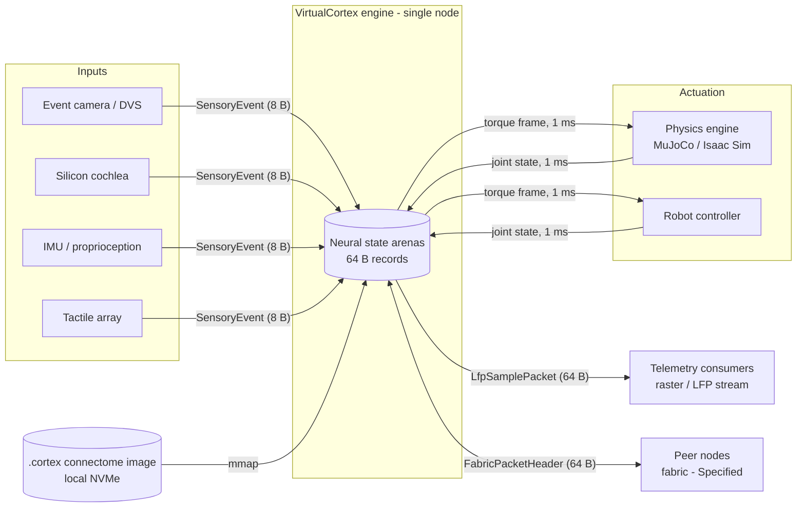
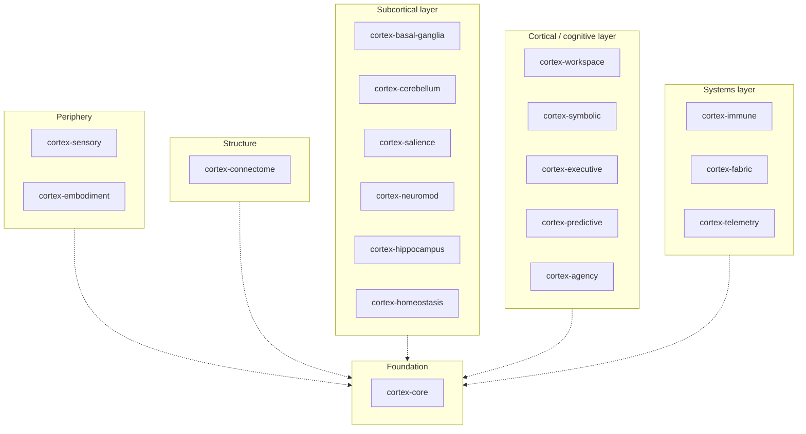

# VirtualCortex Architecture Whitepaper

**A deterministic, single-node neuromorphic virtual-actor engine for spiking neural computation, written in Rust.**

| Document control | |
| :--- | :--- |
| Version | 3.0.0 |
| Status | Active (living document; amended by ADR) |
| Date | 2026-09-10 |
| Supersedes | Specification 2.8.0, "Grand 18-Crate Sovereign Autonomous Organism" |
| Canonical language | English (this file). A [Traditional Chinese reader's guide](zh-TW/README.md) points into it and carries no layouts or figures of its own. |
| Structure | [arc42](https://arc42.org) template v8 with [C4](https://c4model.com) views |
| Decision log | [docs/adr/](adr/README.md) ([MADR](https://adr.github.io/madr/) format) |
| Governance | [ADR-0008](adr/0008-documentation-governance.md) |
| Requirement language | The key words MUST, MUST NOT, SHOULD, SHOULD NOT and MAY are to be interpreted as described in [BCP 14](https://www.rfc-editor.org/info/bcp14) (RFC 2119, RFC 8174) when, and only when, they appear in capitals. |
| Toolchain verified against | `rustc 1.97.1`, `cargo 1.97.1`, Node 24 (see [Appendix B](#appendix-b-verification-and-conformance)) |
| License | Apache-2.0 OR MIT |

## How to read this document

Every claim about the system carries one of four **status labels**, which state its maturity. They are the most important convention in this document, and a claim without one is a defect. (In tables the column is headed *Maturity*, because *status* is the word the decision records use for their lifecycle.)

| Label | Meaning | Evidence required |
| :--- | :--- | :--- |
| **Implemented** | Exists in `crates/` today and is checked by the compiler, a test, or an executable assertion in this document. | Source path, plus a `const` assertion, a unit test, or a `@assert-*` directive. |
| **Specified** | The design is fixed here or in an ADR (interfaces, formats, invariants), but no code exists yet. | A section of this document or an ADR. |
| **Target** | A measurable quality goal with a stated measurement protocol. **Not yet measured.** | An entry in [§10](#10-quality-requirements) with a protocol. |
| **Hypothesis** | A research assumption the architecture rests on. It must be validated before anything that depends on it can become a Target. | An entry in [§11](#11-risks-and-technical-debt). |

**Where this document and the repository disagree, the repository is authoritative**, and the disagreement is recorded as a numbered finding in [§11](#11-risks-and-technical-debt) rather than resolved silently. The claims this document makes about the source tree are executable: `npx spec-guard` runs the `<!-- @assert-* -->` directives embedded below against `crates/` and fails CI when they drift ([Appendix B](#appendix-b-verification-and-conformance)).

**No performance figure in this document has been measured.** Every number in [§10](#10-quality-requirements) is a Target with a protocol, and stays one until a benchmark exists in the repository.

---

## Table of contents

- [Executive summary](#executive-summary)
- [1. Introduction and goals](#1-introduction-and-goals)
- [2. Constraints](#2-constraints)
- [3. Context and scope](#3-context-and-scope)
- [4. Solution strategy](#4-solution-strategy)
- [5. Building block view](#5-building-block-view)
- [6. Runtime view](#6-runtime-view)
- [7. Deployment view](#7-deployment-view)
- [8. Cross-cutting concepts](#8-cross-cutting-concepts)
- [9. Architecture decisions](#9-architecture-decisions)
- [10. Quality requirements](#10-quality-requirements)
- [11. Risks and technical debt](#11-risks-and-technical-debt)
- [12. Glossary](#12-glossary)
- [Appendix A. Capacity model](#appendix-a-capacity-model)
- [Appendix B. Verification and conformance](#appendix-b-verification-and-conformance)
- [Appendix C. Roadmap](#appendix-c-roadmap)
- [Appendix D. References](#appendix-d-references)
- [License](#license)

---

## Executive summary

VirtualCortex is a Rust workspace for building a **spiking neural network (SNN) engine on the virtual-actor model, constrained to a single physical server**. Its design premise is that biological neural tissue is sparse, event-driven, asynchronous and defined by its connectivity, and that a general-purpose CPU can execute such a system efficiently only when every data structure respects the physical realities of the machine: the 64-byte cache line, the memory wall, the branch predictor, and the cost of a heap allocation or a system call on a hot path.

The engine therefore rests on five axioms (§4): neural units exist virtually and are materialised on demand; state and compute are decoupled, so that a fixed pool of worker threads services tens of millions of passive records; each record is owned by at most one worker per tick, enforced by an atomic gate; axonal conduction delay is a constant-time index into a timing wheel, never an operating-system timer; and inactive tissue is evicted to local storage by a metabolic sweep. Around this core, the workspace defines subsystems that mirror the functional anatomy of the mammalian brain: sensory ingestion, embodiment, basal-ganglia action selection, cerebellar forward models, amygdalar salience, a global workspace, a vector-symbolic bridge, prefrontal planning, predictive coding, agency attribution, neuromodulation, hippocampal memory, homeostasis, an immune scrubber, a scale-out fabric and telemetry.

**What exists today (Implemented).** Eighteen crates with no external dependencies and no `unsafe` code. Each crate defines its primary state record as a `#[repr(C)]` plain-old-data structure: sixteen 64-byte cache-line records, one 16-byte neuromodulator record and one 8-byte sensory event. Size and alignment are asserted at compile time for all of them. Four crates are `#![no_std]` and carry unit tests. Five crates carry small, deterministic, integer-only update functions. The workspace compiles cleanly on stable Rust and its layout invariants are verified by `cargo test` and by the executable assertions in this document.

**What is designed but not built (Specified).** The worker executor, mailboxes, the timing-wheel dispatch path, the `.cortex` memory-mapped image loader, the embodiment shared-memory ring, epoch-based reclamation for structural plasticity, the fabric transport, and every subsystem's dynamics beyond the placeholder functions noted in §5.

**What must be proved (Hypothesis).** That multi-compartment "super-neuron" records can condense the behaviour of point-neuron populations at a ratio that makes whole-brain-scale behaviour reachable within a single 64 GB server. The capacity model in Appendix A is parameterised on that ratio and is a plan, not a measurement.

---

## 1. Introduction and goals

### 1.1 Problem statement

Dense-tensor deep learning maps well to GPUs and poorly to the operating principles of nervous tissue, which is roughly 1–2 % active at any instant, communicates by discrete events, and computes through topology and timing. Existing academic SNN simulators model that tissue faithfully but pay for it with pointer-based sparse graphs and IEEE-754 floating point: at scale they thrash the cache hierarchy, saturate the DRAM bus, and produce results that differ across CPU vendors.

A naive whole-brain point-neuron model illustrates the memory wall. With $N \approx 8.6 \times 10^{10}$ neurons and $S \approx 10^{14}$ synapses, even a minimal 8-byte pointer per synapse costs

$$
M_{\text{naive}} \;\ge\; S \cdot 8\ \text{B} \;=\; 8 \times 10^{14}\ \text{B} \;\approx\; 800\ \text{TB},
$$

and every synapse traversal is a dependent load. On a 3.2 GHz core a DRAM miss costs roughly 80 ns, about 256 cycles, so a pointer-chasing inner loop is stalled for more than 99 % of its cycles:

$$
\frac{t_{\text{DRAM}}}{t_{\text{ALU}}} \;=\; \frac{80\ \text{ns}}{0.3125\ \text{ns}} \;\approx\; 256, \qquad
\text{stall fraction} \;\approx\; \frac{256 - 1}{256} \;\approx\; 99.6\ \%.
$$

VirtualCortex attacks the problem from the hardware upward. The target is not to reproduce every point neuron but to build an engine whose unit of state is a cache line, whose arithmetic is bit-exact across platforms, whose hot path never allocates, and whose scale is bounded by memory density rather than by pointer traffic.

### 1.2 Functional requirements

| ID | Requirement | Maturity |
| :--- | :--- | :--- |
| FR-1 | Represent a neural unit as a fixed-size, 64-byte, `#[repr(C)]` record with no heap pointers. | Implemented (§5.2.1) |
| FR-2 | Represent synaptic fan-out as fixed-size 64-byte blocks chained by index, not by pointer. | Implemented (§5.2.1) |
| FR-3 | Schedule delayed spike delivery in $O(1)$ time using a two-tier timing wheel. | Implemented (structure) · Specified (dispatch) (§5.2.1, §6.2) |
| FR-4 | Load a whole connectome image by memory mapping, without a deserialisation pass. | Specified (§8.7) |
| FR-5 | Ingest events from hot-pluggable peripherals through a trait-based hardware abstraction layer. | Implemented (trait) · Specified (runtime) (§5.2.3) |
| FR-6 | Exchange motor commands and proprioceptive feedback with a physics engine or robot under a 1 ms period. | Specified (§5.2.4, §6.4) |
| FR-7 | Provide subcortical, cortical and systemic subsystems as independent crates with 64-byte state records. | Implemented (records) · Specified (dynamics) (§5.2) |
| FR-8 | Verify all layout invariants at compile time and all documentation claims in CI. | Implemented (Appendix B) |

### 1.3 Quality goals

Ordered by priority. Each is refined into measurable scenarios in §10.

| Priority | Quality goal | Motivation |
| :--- | :--- | :--- |
| 1 | **Determinism.** The same seed and inputs MUST produce bit-identical state on x86-64 and AArch64. | Scientific reproducibility; safety of embodied control; testability. |
| 2 | **Memory density.** State per neural unit MUST be exactly one cache line; the engine MUST run a reference configuration within a single commodity server. | The memory wall (§1.1) is the binding constraint, not arithmetic throughput. |
| 3 | **Latency.** Per-event dispatch MUST be free of allocation, system calls and pointer chasing. | Tail latency is dominated by exactly those three things. |
| 4 | **Real-time embodiment.** The sensorimotor loop MUST hold a fixed 1 ms period with bounded jitter. | Physical stability of rigid-body control. |
| 5 | **Verifiability.** Every architectural claim MUST be checkable by a tool that runs in CI. | Documentation that cannot fail a build rots ([ADR-0008](adr/0008-documentation-governance.md)). |

### 1.4 Stakeholders

| Stakeholder | Concern |
| :--- | :--- |
| Systems engineers implementing the runtime | Exact record layouts (§5.2), numeric model (§8.1), concurrency rules (§8.5). |
| Computational neuroscientists | Which biological mechanism each subsystem models and with what simplifications (§8.8). |
| Robotics integrators | The embodiment interface and its timing contract (§5.2.4, §6.4, §10). |
| Reviewers and maintainers | Status of every claim, open findings (§11), and how the document is verified (Appendix B). |
| Coding agents | Ground truth that cannot mislead: every assertion in this file is executable. |

### 1.5 Scope and non-goals

In scope: a single-node engine, its state model, its subsystems, its interfaces to the outside world, and its verification.

Out of scope, by design. These are the boundaries the founding design note drew and they still hold:

- **Dense synchronous matrix workloads.** Transformer-style training is a GPU problem. An asynchronous discrete-event engine on CPUs is the wrong tool for it and this document does not pretend otherwise.
- **Cross-machine fault tolerance inside the engine.** The engine assumes a node does not partially fail. High availability, if needed, wraps the engine with snapshots; it is not built into the tick loop. Multi-node *scale-out* (§5.2.17) is a data-plane concern and is Specified, not Implemented.
- **All-to-all connectivity.** Mailboxes assume the small-world sparsity of biological tissue. A dense graph exhausts memory bandwidth by construction.
- **A general-purpose actor framework.** Actors here are passive 64-byte records, not objects with behaviour; there is no supervision tree, no message serialisation and no location transparency beyond the node.

### 1.6 Implementation status at a glance

Verified against the tree on 2026-09-10. "Layout" means the record's size and alignment are asserted at compile time; "Test" means a `#[cfg(test)]` unit test exists; "Logic" means at least one non-trivial update function exists.

| Crate | Primary public type(s) | Size | `no_std` | Layout | Test | Logic |
| :--- | :--- | ---: | :---: | :---: | :---: | :---: |
| `cortex-core` | `DendriticSuperNeuron`, `SynapseBlock`, `FlatTimingWheel` | 64 B, 64 B, 2 248 B | no | yes | no | wheel insert |
| `cortex-connectome` | `CortexFileHeader` | 64 B | no | yes | no | — |
| `cortex-sensory` | `SensoryEvent`, `trait SensoryPeripheral` | 8 B | no | yes | no | — |
| `cortex-embodiment` | `EmbodimentRingBuffer` | 64 B | no | yes | no | — |
| `cortex-basal-ganglia` | `BasalGangliaChannelState` | 64 B | no | yes | no | `compute_gating` |
| `cortex-cerebellum` | `CerebellarMicrozone` | 64 B | no | yes | no | `step_forward_model` |
| `cortex-salience` | `SalienceNodeState` | 64 B | no | yes | no | `evaluate_threat` |
| `cortex-workspace` | `GlobalWorkspaceSlot` | 64 B | no | yes | no | `step_ignition` |
| `cortex-symbolic` | `SymbolicHypervectorHeader` | 64 B | no | yes | no | `bind` |
| `cortex-executive` | `ExecutivePlanNode` | 64 B | yes | yes | yes | — |
| `cortex-predictive` | `PredictiveErrorState` | 64 B | yes | yes | yes | — |
| `cortex-agency` | `AgentPerspectiveState` | 64 B | yes | yes | yes | — |
| `cortex-immune` | `ImmuneScrubNode` | 64 B | yes | yes | yes | — |
| `cortex-neuromod` | `NeuromodulatorState` | 16 B | no | yes | no | — |
| `cortex-hippocampus` | `HippocampalAttractorState` | 64 B | no | yes | no | — |
| `cortex-homeostasis` | `HomeostaticDrivePool` | 64 B | no | yes | no | `update_circadian_tick` |
| `cortex-fabric` | `FabricPacketHeader` | 64 B | no | yes | no | — |
| `cortex-telemetry` | `LfpSamplePacket` | 64 B | no | yes | no | — |

The workspace manifest lists exactly eighteen members; every crate declares an empty dependency list, inherits its version, authors, license and repository from `[workspace.package]`, and carries a compile-time layout assertion block.

<!-- @assert-count target="Cargo.toml" symbol="crates/cortex-" expected="18" reason="the workspace has eighteen member crates; update §1.6 and §5 if this changes" -->
<!-- @assert-count target="crates" symbol="const _: () = {" min="18" glob="*.rs" reason="every crate carries a compile-time layout assertion block (F-18 closed)" -->
<!-- @assert-count target="crates" symbol="license.workspace = true" expected="18" glob="Cargo.toml" reason="every crate inherits its metadata from [workspace.package] (F-9 closed)" -->
<!-- @assert-absence target="crates" symbol="unsafe" word="true" glob="*.rs" reason="no unsafe code exists yet; introducing it requires an ADR (§8.10)" -->

---

## 2. Constraints

### 2.1 Engineering doctrine: "Latest ≠ Newest"

The project's founding rule is that **the newest technology is rarely the best-understood one**, and that a mission-critical engine is built from foundations whose failure modes are already known. Concretely, a technology is admissible on the hot path only if it satisfies all of:

1. a stable, published specification or ABI;
2. at least two years of production use under load by parties other than its authors;
3. failure modes that are documented, not discovered;
4. a mechanical-sympathy argument: it maps onto what the CPU, the memory controller and the kernel actually do.

This rule is why the foundations below were chosen over their newer alternatives.

| Foundation | Stable since | Why it is admissible |
| :--- | :--- | :--- |
| 64-byte cache-line-aligned POD records | x86 P6 (1995); all current x86-64 and AArch64 server cores | The transfer quantum of every modern memory subsystem. |
| Q16.16 fixed-point arithmetic | Decades of DSP and game-engine practice | Bit-exact, associative in the integer domain, SIMD-friendly. |
| Hashed / hierarchical timing wheels | Varghese & Lauck, 1987 | $O(1)$ insert and expiry; the standard for kernel and network timers. |
| Epoch-based reclamation | Fraser, 2004; `crossbeam-epoch` in production since 2017 | Lock-free reader path for structural mutation. |
| `mmap` of an image whose layout equals the in-memory layout | POSIX | Zero-copy hydration; the page cache does the work. |
| Rust, edition 2024 | Rust 1.85, February 2025 | Memory safety without a runtime; the edition is the current stable one, not a nightly feature. |
| arc42, C4, MADR, BCP 14 | 2005 / 2018 / 2018 / 1997 | Mature documentation standards with tooling and a reader base. |

What the rule excludes: language features gated on nightly, crates below 1.0 without a documented stability policy, kernel interfaces younger than two LTS releases on the hot path, and any performance claim that has not been reproduced on the reference platform.

### 2.2 Technical constraints

| ID | Constraint | Maturity |
| :--- | :--- | :--- |
| TC-1 | The engine is written in Rust and builds on stable `rustc`. Nightly features MUST NOT be required. | Implemented |
| TC-2 | State crates MUST declare no external dependencies. Runtime crates MAY depend on a vetted allow-list ([ADR-0005](adr/0005-crate-per-subsystem.md)). | Implemented (all 18 crates) |
| TC-3 | Every primary state record MUST be `#[repr(C)]`, and its size and alignment MUST be asserted at compile time. | Implemented (§5.2) |
| TC-4 | `f32` and `f64` MUST NOT appear in any crate under `crates/`. Dynamics use Q16.16 (§8.1). | Implemented |
| TC-5 | The simulation hot path MUST NOT allocate, MUST NOT block, and MUST NOT make system calls after initialisation. | Specified (no hot path exists yet; §8.6) |
| TC-6 | State crates SHOULD be `#![no_std]`. | Partial: 4 of 18 (finding F-6) |
| TC-7 | The runtime target is Linux on x86-64-v4 or ARMv9-A; state crates MUST remain portable to any target with 64-bit atomics. | Specified |
| TC-8 | Crates SHOULD declare `edition = "2024"` and a `rust-version` (MSRV). | Proposed ([ADR-0009](adr/0009-rust-edition-and-msrv.md)); currently edition 2021 (finding F-5) |
| TC-9 | `unsafe` MUST NOT be introduced without an ADR that names the invariant it upholds and the test that checks it. | Implemented (zero `unsafe` today) |

<!-- @assert-absence target="crates" symbol="f32" word="true" glob="*.rs" reason="TC-4: no IEEE-754 in any crate" -->
<!-- @assert-absence target="crates" symbol="f64" word="true" glob="*.rs" reason="TC-4: no IEEE-754 in any crate" -->
<!-- @assert-absence target="crates" symbol="std::thread" glob="*.rs" reason="TC-5: state crates do not spawn threads; the executor is a separate runtime concern" -->
<!-- @assert-absence target="crates" symbol="Box<" glob="*.rs" reason="TC-5: no heap-owning types in state crates" -->
<!-- @assert-absence target="crates" symbol="Vec<" glob="*.rs" reason="TC-5: no heap-owning types in state crates" -->

### 2.3 Conventions

- **Field offsets** are written as half-open byte ranges `[a..b)` from the start of the record.
- **Q16.16** values are `i32` (or `u32` for non-negative quantities) with 16 fractional bits; `0x0001_0000` is 1.0 (§8.1). A field whose comment says "Q16.16" but whose width is not 32 bits is a finding (F-3).
- **Ticks** are the engine's discrete time unit. The tick duration is a configuration parameter; current code assumes 10 µs fine ticks and 100 µs coarse ticks in the timing wheel (§8.4).
- **Identifiers**: crates are `cortex-<subsystem>`; primary records are `PascalCase` nouns; Q-format suffixes (`_q16`) are used where the field name would otherwise be ambiguous.
- **Naming of biological analogues** is descriptive, not a claim of equivalence. `cortex-workspace` implements a competitive broadcast slot; it does not implement consciousness, and this document does not use that word for it.

---

## 3. Context and scope

### 3.1 System context (C4 level 1)



### 3.2 External interfaces

| Interface | Direction | Unit of exchange | Crate | Status |
| :--- | :--- | :--- | :--- | :--- |
| Sensory ingestion | in | `SensoryEvent`, 8 B, batched via `SensoryPeripheral::poll_batch` | `cortex-sensory` | Implemented (types) · Specified (drivers) |
| Embodiment | bidirectional | 64-byte `EmbodimentRingBuffer` control block over POSIX shared memory; torque and joint-state payload rings | `cortex-embodiment` | Specified |
| Connectome image | in | `.cortex` file, `CortexFileHeader` + 64-byte-aligned sections | `cortex-connectome` | Implemented (header) · Specified (sections, loader) |
| Telemetry | out | `LfpSamplePacket`, 64 B, single-producer single-consumer ring | `cortex-telemetry` | Implemented (type) · Specified (ring, eBPF taps) |
| Fabric | bidirectional | `FabricPacketHeader`, 64 B, over RDMA verbs or CXL shared memory | `cortex-fabric` | Implemented (header) · Specified (transport) |

---

## 4. Solution strategy

### 4.1 The five axioms

The founding design note fixed five axioms. Every later subsystem is built on them, and the fields of `DendriticSuperNeuron` (§5.2.1) are their direct expression.

| # | Axiom | Consequence in the design | Where it lives |
| :--- | :--- | :--- | :--- |
| A1 | **Virtual existence.** A neural unit always exists logically; it occupies memory only when a spike addresses it. | Units are addressed by a 64-bit packed identifier; cold units are evicted and re-hydrated lazily. | `id` field; eviction (Specified, §8.6) |
| A2 | **State and compute are decoupled.** Records are passive data; workers are stateless, core-pinned threads. | Resource use scales with instantaneous activity, not with total capacity. | Executor (Specified, §6.1) |
| A3 | **Turn-based single-writer invariant.** At most one worker touches a record in any tick, enforced by a compare-and-swap gate. | No mutex, no deadlock, no data race on membrane dynamics. | `gate_state: AtomicU8`; mailbox pointer with ABA tag (§8.5) |
| A4 | **Discrete axonal delay.** Time is ticks; delay is an index into a ring, never a kernel timer. | $O(1)$ scheduling; deterministic ordering. | `FlatTimingWheel` (§5.2.1, §8.4) |
| A5 | **Metabolic tiering.** A background sweep evicts long-quiet tissue to local storage and keeps hot circuits in cache-friendly arenas. | Memory bounded by activity; persistence falls out of the same mechanism. | Clock sweep and `.cortex` image (Specified, §8.6, §8.7) |

### 4.2 How the quality goals are met

| Quality goal | Strategy | Decision record |
| :--- | :--- | :--- |
| Determinism | Integer-only Q16.16 dynamics; fixed tick ordering; seeded structural growth. | [ADR-0002](adr/0002-q16-16-fixed-point.md) |
| Memory density | One 64-byte record per unit; index-chained 64-byte synapse blocks; explicit reserved padding. | [ADR-0001](adr/0001-64-byte-pod-records.md) |
| Latency | Zero allocation and zero syscalls on the hot path; timing wheel instead of a heap; SIMD-friendly layouts. | [ADR-0003](adr/0003-zero-allocation-hot-path.md), [ADR-0004](adr/0004-two-tier-timing-wheel.md) |
| Real-time embodiment | Shared-memory ring with atomic cursors; `clock_nanosleep` on `CLOCK_MONOTONIC`; hardware watchdog as fail-safe. | §5.2.4, §8.9 |
| Verifiability | Compile-time layout assertions; executable documentation; ADRs with lifecycle checked by `spec-graph`. | [ADR-0008](adr/0008-documentation-governance.md), [ADR-0010](adr/0010-measured-or-target.md) |

### 4.3 Decomposition principle

One crate per functional subsystem, each exporting a single primary 64-byte record and, where the dynamics are settled, one deterministic update function ([ADR-0005](adr/0005-crate-per-subsystem.md)). Crates do not depend on one another today. When a runtime crate is introduced it will compose them; state crates MUST NOT gain dependencies on each other to keep the layout contracts independently testable.

---

## 5. Building block view

### 5.1 Level 1: workspace layering



Dotted edges are the *intended* dependency direction for a future runtime; today every crate's dependency list is empty and the diagram is a layering rule, not a `Cargo.lock` fact.

| Layer | Crates | Responsibility |
| :--- | :--- | :--- |
| Foundation | `cortex-core` | Neuron and synapse records; timing wheel. |
| Structure | `cortex-connectome` | Image format and anatomical priors. |
| Periphery | `cortex-sensory`, `cortex-embodiment` | Ingress from sensors; egress to actuators. |
| Subcortical | `cortex-basal-ganglia`, `cortex-cerebellum`, `cortex-salience`, `cortex-neuromod`, `cortex-hippocampus`, `cortex-homeostasis` | Action selection, motor prediction, threat, value, memory, drives. |
| Cortical / cognitive | `cortex-workspace`, `cortex-symbolic`, `cortex-executive`, `cortex-predictive`, `cortex-agency` | Broadcast, symbols, planning, prediction, self/other. |
| Systems | `cortex-immune`, `cortex-fabric`, `cortex-telemetry` | Memory hygiene, scale-out, observability. |

### 5.2 Level 2: crates

Each entry gives the crate's responsibility, its public API as it exists in the tree, the exact record layout, the status of the layout and of the dynamics, and the executable assertion that keeps this section honest. Layout tables are transcribed from `crates/*/src/*.rs`; the reserved padding fields are part of the ABI and MUST NOT be repurposed without bumping the image format version (§8.7).

#### 5.2.1 `cortex-core` — neural state and dispatch

| | |
| :--- | :--- |
| Responsibility | The two arena record types every other subsystem indexes into, and the timing wheel that orders delayed delivery. |
| Source | `crates/cortex-core/src/dynamics/neuron.rs`, `crates/cortex-core/src/dispatch/wheel.rs` |
| Public API | `DendriticSuperNeuron`, `SynapseBlock`, `FlatTimingWheel::{new, schedule_fine}` and `Default` (delegates to `new`) |
| Status | Layout: Implemented · Membrane dynamics: Specified (§8.8) · Dispatch: Specified (§6.2) |

**`DendriticSuperNeuron`** — 64 B, align 64. A two-compartment pyramidal model (basal and apical dendrites plus soma) with short-term-plasticity state and the virtual-actor control fields.

| Offset | Field | Type | Format | Meaning |
| :--- | :--- | :--- | :--- | :--- |
| `[0..8)` | `id` | `u64` | packed id | Global unit identifier (region · column · unit). |
| `[8..16)` | `mailbox_head_ptr` | `AtomicU64` | index | Head of the lock-free MPSC mailbox (A3). |
| `[16..24)` | `mailbox_tag` | `u64` | counter | ABA tag paired with the mailbox head. |
| `[24..28)` | `v_soma` | `i32` | Q16.16 | Somatic membrane potential. |
| `[28..32)` | `v_basal` | `i32` | Q16.16 | Basal (feed-forward) compartment potential. |
| `[32..36)` | `v_apical` | `i32` | Q16.16 | Apical (context / feedback) compartment potential. |
| `[36..40)` | `v_thresh` | `i32` | Q16.16 | Adaptive firing threshold. |
| `[40..42)` | `bac_plateau_ticks` | `u16` | ticks | Remaining duration of a dendritic calcium plateau (BAC burst). |
| `[42..44)` | `refractory_ticks` | `u16` | ticks | Absolute refractory countdown. |
| `[44..48)` | `last_soma_spike_tick` | `u32` | tick | Time of the last somatic spike (STDP, BAC coincidence). |
| `[48..52)` | `synapse_slab_idx` | `u32` | index | First `SynapseBlock` of this unit's fan-out. |
| `[52..54)` | `plastic_delta_head` | `u16` | index | Head of the far-memory plastic-delta list (Specified). |
| `[54..56)` | `spatial_voxel_morton` | `u16` | Morton code | Spatial voxel for structural growth (Specified). |
| `[56..57)` | `gate_state` | `AtomicU8` | enum | Turn gate: idle / scheduled / running (A3). |
| `[57..58)` | `flags` | `u8` | bitfield | Burst mode, inhibitory, and similar. |
| `[58..59)` | `stp_r_ves` | `u8` | Q0.8 | Tsodyks–Markram available resource $R$. |
| `[59..60)` | `stp_u_rel` | `u8` | Q0.8 | Tsodyks–Markram utilisation $u$. |
| `[60..64)` | `_reserved` | `[u8; 4]` | — | Reserved; MUST be zero. |

Because the record contains atomics it is not `Copy` and cannot derive `Pod`; it is a *control record* under the rules of §8.2.

**`SynapseBlock`** — 64 B, align 64. Four outgoing synapses per block; blocks chain by index.

| Offset | Field | Type | Format | Meaning |
| :--- | :--- | :--- | :--- | :--- |
| `[0..16)` | `target_neuron_ids` | `[u32; 4]` | index | Post-synaptic unit indices. |
| `[16..24)` | `weights_q16` | `[i16; 4]` | see F-3 | Static weights. A 16-bit field cannot hold Q16.16; the Q-format is an open finding. |
| `[24..32)` | `delays_ticks` | `[u16; 4]` | ticks | Axonal conduction delay per synapse. |
| `[32..36)` | `next_block_idx` | `u32` | index | Next block in the chain; sentinel for end. |
| `[36..40)` | `last_spike_tick` | `u32` | tick | Pre-synaptic spike time for STDP. |
| `[40..64)` | `_reserved` | `[u8; 24]` | — | Reserved; MUST be zero. |

**`FlatTimingWheel`** — 2 248 B, natural alignment; one per worker. Two rings of 64-bit slots: `fine_ring[200]` at 10 µs per slot (2 ms horizon) and `coarse_ring[80]` at 100 µs per slot (8 ms horizon). `schedule_fine(delay_ticks, event_mask)` ORs `event_mask` into slot `(cursor + delay_ticks) % 200`. Each slot is currently a 64-bit mask, that is, up to 64 event lanes per slot; the design intent that a slot addresses a list of `SynapseBlock` offsets is Specified (§6.2) and is finding F-11. The ring length is not a power of two, so the modulo is a multiply-shift rather than a mask; a power-of-two ring is an open question (§11).

<!-- @assert-count target="crates/cortex-core" symbol="DendriticSuperNeuron" min="1" word="true" -->
<!-- @assert-count target="crates/cortex-core" symbol="SynapseBlock" min="1" word="true" -->
<!-- @assert-count target="crates/cortex-core" symbol="FlatTimingWheel" min="1" word="true" -->

#### 5.2.2 `cortex-connectome` — image format and anatomical priors

| | |
| :--- | :--- |
| Responsibility | The on-disk container whose layout equals the in-memory arenas, and the laminar microcolumn priors that populate it. |
| Source | `crates/cortex-connectome/src/lib.rs` |
| Public API | `CortexFileHeader` |
| Status | Header layout: Implemented · Sections, CRC, loader: Specified (§8.7) · Atlas-derived priors: Specified |

**`CortexFileHeader`** — 64 B, align 64. The first 64 bytes of every `.cortex` file.

| Offset | Field | Type | Meaning |
| :--- | :--- | :--- | :--- |
| `[0..8)` | `magic` | `[u8; 8]` | ASCII `VCORTEX1` (big-endian `0x5643_4F52_5445_5831`). |
| `[8..12)` | `version` | `u32` | Format version; bumped on any layout change of any record. |
| `[12..16)` | `reserved_flags` | `u32` | Feature flags; MUST be zero in version 1. |
| `[16..24)` | `num_columns` | `u64` | Cortical hyper-column count. |
| `[24..32)` | `num_neurons` | `u64` | `DendriticSuperNeuron` record count. |
| `[32..40)` | `num_synapses` | `u64` | Initial synapse count. |
| `[40..48)` | `layers_offset` | `u64` | Byte offset of the laminar section. |
| `[48..56)` | `crc64` | `u64` | Header integrity checksum (bytes `[0..48)`). |
| `[56..64)` | `_padding` | `[u8; 8]` | Reserved; MUST be zero. |

<!-- @assert-count target="crates/cortex-connectome" symbol="CortexFileHeader" min="1" word="true" -->

#### 5.2.3 `cortex-sensory` — peripheral ingestion

| | |
| :--- | :--- |
| Responsibility | The event type every peripheral produces and the trait every peripheral driver implements. |
| Source | `crates/cortex-sensory/src/lib.rs` |
| Public API | `SensoryEvent`, `trait SensoryPeripheral: Send + Sync { poll_batch, peripheral_name, channel_count }` |
| Status | Types: Implemented · Thalamic gate and hot-plug slot swap: Specified (§6.3) |

**`SensoryEvent`** — 8 B, align 8, `Copy + Default`. An address-event representation (AER) sample.

| Offset | Field | Type | Meaning |
| :--- | :--- | :--- | :--- |
| `[0..4)` | `timestamp_us` | `u32` | Microsecond timestamp (wraps every ~71.6 min; consumers MUST handle wrap). |
| `[4..6)` | `address` | `u16` | Channel or pixel address within the peripheral. |
| `[6..7)` | `peripheral_type` | `u8` | Modality discriminator. |
| `[7..8)` | `payload` | `u8` | Polarity, intensity or measurement. |

Drivers fill a caller-provided slice through `poll_batch(&mut self, &mut [SensoryEvent]) -> usize`, so ingestion never allocates. Hot-plugging a peripheral is an atomic swap of the driver slot in the thalamic relay table; the simulation loop is never paused (Target T-6).

<!-- @assert-count target="crates/cortex-sensory" symbol="SensoryEvent" min="1" word="true" -->
<!-- @assert-count target="crates/cortex-sensory" symbol="SensoryPeripheral" min="1" word="true" -->

#### 5.2.4 `cortex-embodiment` — sensorimotor loop

| | |
| :--- | :--- |
| Responsibility | The control block of the shared-memory ring that couples layer-5 motor output to a physics engine or robot at a fixed 1 ms period. |
| Source | `crates/cortex-embodiment/src/lib.rs` |
| Public API | `EmbodimentRingBuffer::new()` (`const fn`) and `Default` (delegates to `new`; all cursors zero) |
| Status | Control block: Implemented · Payload rings, torque decoder, watchdog: Specified (§6.4, §8.9) |

**`EmbodimentRingBuffer`** — 64 B, align 64. Four atomic cursors and a reserved area; the payload rings (torque frames out, joint state in) follow it in the shared mapping.

| Offset | Field | Type | Meaning |
| :--- | :--- | :--- | :--- |
| `[0..8)` | `write_cursor` | `AtomicU64` | Producer position (release-store). |
| `[8..16)` | `read_cursor` | `AtomicU64` | Consumer position (acquire-load). |
| `[16..24)` | `epoch_id` | `AtomicU64` | Simulation epoch of the current frame. |
| `[24..32)` | `heartbeat_ms` | `AtomicU64` | Producer liveness for the watchdog. |
| `[32..64)` | `reserved` | `[u8; 32]` | Reserved; MUST be zero. |

<!-- @assert-count target="crates/cortex-embodiment" symbol="EmbodimentRingBuffer" min="1" word="true" -->

#### 5.2.5 `cortex-basal-ganglia` — action selection

| | |
| :--- | :--- |
| Responsibility | Winner-take-all gating among competing action channels through direct (D1), indirect (D2) and hyperdirect (STN) pathways. |
| Source | `crates/cortex-basal-ganglia/src/lib.rs` |
| Public API | `BasalGangliaChannelState::compute_gating(&mut self) -> bool` |
| Status | Layout: Implemented · Gating rule: Implemented (linear form) · Lateral competition and dopamine modulation: Specified (§8.8) |

**`BasalGangliaChannelState`** — 64 B, align 64.

| Offset | Field | Type | Format | Meaning |
| :--- | :--- | :--- | :--- | :--- |
| `[0..4)` | `channel_id` | `u32` | index | Action channel. |
| `[4..8)` | `striatal_d1_drive` | `i32` | Q16.16 | Direct-pathway "Go" activation. |
| `[8..12)` | `striatal_d2_drive` | `i32` | Q16.16 | Indirect-pathway "No-Go" activation. |
| `[12..16)` | `stn_hyperdirect_drive` | `i32` | Q16.16 | Hyperdirect brake. |
| `[16..20)` | `gpi_snr_inhibition` | `i32` | Q16.16 | Net output to thalamus (computed). |
| `[20..24)` | `dopamine_modulation` | `i32` | Q16.16 | Local striatal dopamine. |
| `[24..28)` | `habit_strength` | `u32` | Q16.16 | Procedural chunking weight. |
| `[28..32)` | `selected_flag` | `u32` | 0 / 1 | Set when the channel is released. |
| `[32..64)` | `_reserved` | `[u8; 32]` | — | Reserved; MUST be zero. |

The implemented rule is $g = d_2 + s - d_1$, stored in `gpi_snr_inhibition`; the channel is selected when $g < 0$ (thalamic disinhibition). It uses plain `i32` arithmetic and therefore panics on overflow in debug builds and wraps in release; saturating arithmetic is required by §8.1 and tracked as finding F-4.

<!-- @assert-count target="crates/cortex-basal-ganglia" symbol="BasalGangliaChannelState" min="1" word="true" -->
<!-- @assert-count target="crates/cortex-basal-ganglia" symbol="compute_gating" min="1" word="true" -->

#### 5.2.6 `cortex-cerebellum` — forward models

| | |
| :--- | :--- |
| Responsibility | Per-microzone internal forward model that predicts the sensory consequence of a motor command ahead of physical feedback (Smith-predictor role). |
| Source | `crates/cortex-cerebellum/src/lib.rs` |
| Public API | `CerebellarMicrozone::step_forward_model(&mut self, current_sensory: i32, motor_command: i32) -> i32` |
| Status | Layout: Implemented · Dynamics: placeholder (finding F-8) · Granule expansion and climbing-fibre LTD: Specified (§8.8) |

**`CerebellarMicrozone`** — 64 B, align 64.

| Offset | Field | Type | Format | Meaning |
| :--- | :--- | :--- | :--- | :--- |
| `[0..4)` | `microzone_id` | `u32` | index | Anatomical microzone. |
| `[4..8)` | `purkinje_output_rate` | `i32` | Q16.16 | Purkinje inhibitory output. |
| `[8..12)` | `mossy_fiber_input` | `i32` | Q16.16 | Sensorimotor input. |
| `[12..16)` | `granule_expansion_code` | `u32` | hash | Sparse high-dimensional code. |
| `[16..20)` | `climbing_fiber_error` | `i32` | Q16.16 | Teaching signal from the inferior olive. |
| `[20..24)` | `ltd_synaptic_weight` | `i32` | Q16.16 | Parallel-fibre to Purkinje weight. |
| `[24..28)` | `forward_model_pred` | `i32` | Q16.16 | Predicted outcome. |
| `[28..32)` | `lead_compensation_q16` | `i32` | Q16.16 | Predictor lead. |
| `[32..64)` | `_reserved` | `[u8; 32]` | — | Reserved; MUST be zero. |

The current function computes the prediction and the error from the *same* sample, so the error is identically $-(u \gg 2)$ and carries no information about the plant; a real forward model compares the prediction made at $t$ with the observation at $t + d$. This is documented as F-8 and the function is retained only as a layout exercise.

<!-- @assert-count target="crates/cortex-cerebellum" symbol="CerebellarMicrozone" min="1" word="true" -->

#### 5.2.7 `cortex-salience` — threat and salience

| | |
| :--- | :--- |
| Responsibility | A fast subcortical route that can pre-empt cortical processing with a defensive reflex and tag the episode for prioritised consolidation. |
| Source | `crates/cortex-salience/src/lib.rs` |
| Public API | `SalienceNodeState::evaluate_threat(&mut self, sensory_shock: i32) -> bool` |
| Status | Layout: Implemented · Threshold rule: Implemented · Kernel integration and conditioning: Specified (§8.8) |

**`SalienceNodeState`** — 64 B, align 64.

| Offset | Field | Type | Format | Meaning |
| :--- | :--- | :--- | :--- | :--- |
| `[0..4)` | `node_id` | `u32` | index | Salience node. |
| `[4..8)` | `threat_valence` | `i32` | Q16.16 | Threat intensity in $[-1, 1]$. |
| `[8..12)` | `low_road_ticks` | `u32` | ticks | Reflex countdown. |
| `[12..16)` | `fear_conditioning_w` | `i32` | Q16.16 | Conditioned-stimulus weight. |
| `[16..20)` | `defense_mode_flags` | `u32` | enum | 0 none · 1 freeze · 2 flight · 3 fight. |
| `[20..24)` | `emotional_tag_priority` | `u32` | priority | Replay priority boost for the hippocampus. |
| `[24..28)` | `unconditioned_stimulus` | `i32` | Q16.16 | Immediate aversive input. |
| `[28..32)` | `override_active` | `u32` | 0 / 1 | Motor override engaged. |
| `[32..64)` | `_reserved` | `[u8; 32]` | — | Reserved; MUST be zero. |

Implemented rule: a shock above 2.0, or a conditioned weight above 1.0, sets valence to 1.0, selects *freeze*, engages the override and sets the replay priority to 255.

<!-- @assert-count target="crates/cortex-salience" symbol="SalienceNodeState" min="1" word="true" -->

#### 5.2.8 `cortex-workspace` — global workspace

| | |
| :--- | :--- |
| Responsibility | A small set of competitive broadcast slots; a slot that crosses an ignition threshold is broadcast to subscribed columns and held for a persistence window. |
| Source | `crates/cortex-workspace/src/lib.rs` |
| Public API | `GlobalWorkspaceSlot::IGNITION_THRESHOLD` (1.5), `step_ignition(&mut self, bottom_up_evidence: i32) -> bool` |
| Status | Layout: Implemented · Threshold rule: Implemented · Lateral competition and decay: Specified (§8.8) |

**`GlobalWorkspaceSlot`** — 64 B, align 64.

| Offset | Field | Type | Format | Meaning |
| :--- | :--- | :--- | :--- | :--- |
| `[0..4)` | `slot_id` | `u32` | index | Slot index; the slot count is a configuration parameter, not a property of the type. |
| `[4..8)` | `binding_hash` | `u32` | hash | Bound content. |
| `[8..12)` | `ignition_potential` | `i32` | Q16.16 | Accumulated evidence. |
| `[12..16)` | `persistence_ticks` | `u32` | ticks | Remaining hold time after ignition. |
| `[16..20)` | `confidence_q16` | `u32` | Q16.16 | Metacognitive confidence in $[0, 1]$. |
| `[20..24)` | `broadcast_channel_mask` | `u32` | bitmask | Recipient columns. |
| `[24..28)` | `p300_wave_phase` | `u32` | phase | Ignition oscillation phase. |
| `[28..32)` | `is_ignited` | `u32` | 0 / 1 | Ignited this tick. |
| `[32..64)` | `_reserved` | `[u8; 32]` | — | Reserved; MUST be zero. |

Implemented rule: evidence accumulates; at or above 1.5 the slot ignites and is held for 300 ticks. The accumulator has no decay and no competition term yet.

<!-- @assert-count target="crates/cortex-workspace" symbol="GlobalWorkspaceSlot" min="1" word="true" -->

#### 5.2.9 `cortex-symbolic` — vector-symbolic bridge

| | |
| :--- | :--- |
| Responsibility | Metadata for 10 000-dimensional bipolar hypervectors that bind spiking activity to discrete symbols (roles, fillers, tokens) with a clean-up codebook. |
| Source | `crates/cortex-symbolic/src/lib.rs` |
| Public API | `SymbolicHypervectorHeader::DIMENSIONS` (10 000), `bind(&mut self, role_id, filler_id)` |
| Status | Header layout: Implemented · Binding, bundling, permutation and codebook: Specified (§8.8) |

**`SymbolicHypervectorHeader`** — 64 B, align 64. The vector body (1 250 bytes at 10 000 bits) lives in a separate arena addressed by `vector_id`.

| Offset | Field | Type | Meaning |
| :--- | :--- | :--- | :--- |
| `[0..4)` | `vector_id` | `u32` | Concept index. |
| `[4..8)` | `dimensionality` | `u32` | Vector width in bits. |
| `[8..12)` | `binding_role_id` | `u32` | Bound role. |
| `[12..16)` | `filler_concept_id` | `u32` | Bound filler. |
| `[16..20)` | `token_vocab_id` | `u32` | Grounded token. |
| `[20..24)` | `hamming_distance_cache` | `u32` | Distance to nearest codebook entry. |
| `[24..26)` | `permutation_shift` | `u16` | Cyclic shift $\Pi^k$ for sequence position. |
| `[26..28)` | `flags` | `u16` | bit 0 bound; further bits reserved. |
| `[28..32)` | `confidence_score` | `u32` | Q16.16 decode confidence. |
| `[32..64)` | `_reserved` | `[u8; 32]` | Reserved; MUST be zero. |

<!-- @assert-count target="crates/cortex-symbolic" symbol="SymbolicHypervectorHeader" min="1" word="true" -->

#### 5.2.10 `cortex-executive` — planning

| | |
| :--- | :--- |
| Responsibility | Nodes of a lookahead search tree evaluated in an internal sandbox that never drives the motor channel. |
| Source | `crates/cortex-executive/src/lib.rs` |
| Public API | `ExecutivePlanNode` (`Copy + Eq`) |
| Status | Layout: Implemented (`no_std`, tested) · Search and regret evaluation: Specified (§8.8) |

**`ExecutivePlanNode`** — 64 B, align 64.

| Offset | Field | Type | Format | Meaning |
| :--- | :--- | :--- | :--- | :--- |
| `[0..8)` | `goal_hash` | `u64` | hash | Goal representation. |
| `[8..12)` | `parent_node_offset` | `u32` | index | Parent node. |
| `[12..16)` | `branch_confidence` | `i32` | Q16.16 | Branch value estimate. |
| `[16..20)` | `counterfactual_regret` | `i32` | Q16.16 | Cumulative regret. |
| `[20..22)` | `tree_depth` | `u16` | depth | Lookahead depth. |
| `[22..23)` | `pruned_flag` | `u8` | 0 / 1 | Pruned. |
| `[23..64)` | `padding` | `[u8; 41]` | — | Reserved; MUST be zero. |

<!-- @assert-count target="crates/cortex-executive" symbol="ExecutivePlanNode" min="1" word="true" -->

#### 5.2.11 `cortex-predictive` — predictive coding

| | |
| :--- | :--- |
| Responsibility | Per-level residual state for a hierarchical predictive-coding stack: top-down prediction, precision-weighted error, convergence. |
| Source | `crates/cortex-predictive/src/lib.rs` |
| Public API | `PredictiveErrorState` (`Copy + Eq`) |
| Status | Layout: Implemented (`no_std`, tested) · Error propagation: Specified (§8.8) |

**`PredictiveErrorState`** — 64 B, align 64.

| Offset | Field | Type | Format | Meaning |
| :--- | :--- | :--- | :--- | :--- |
| `[0..8)` | `prior_prediction_hash` | `u64` | hash | Top-down prediction. |
| `[8..12)` | `prediction_error` | `i32` | Q16.16 | Residual magnitude. |
| `[12..16)` | `precision_weight` | `i32` | Q16.16 | Precision $\Pi_l$. |
| `[16..18)` | `ascending_layer_id` | `u16` | index | Hierarchy level. |
| `[18..19)` | `convergence_flag` | `u8` | 0 / 1 | Error cancelled. |
| `[19..64)` | `padding` | `[u8; 45]` | — | Reserved; MUST be zero. |

<!-- @assert-count target="crates/cortex-predictive" symbol="PredictiveErrorState" min="1" word="true" -->

#### 5.2.12 `cortex-agency` — self / other attribution

| | |
| :--- | :--- |
| Responsibility | Efference-copy cancellation that attributes sensory change to the self or to an external agent, and a per-agent perspective record for theory-of-mind modelling. |
| Source | `crates/cortex-agency/src/lib.rs` |
| Public API | `AgentPerspectiveState` (`Copy + Eq`) |
| Status | Layout: Implemented (`no_std`, tested) · Cancellation and intention decoding: Specified (§8.8) |

**`AgentPerspectiveState`** — 64 B, align 64.

| Offset | Field | Type | Format | Meaning |
| :--- | :--- | :--- | :--- | :--- |
| `[0..8)` | `perspective_frame_hash` | `u64` | hash | Spatial frame transform. |
| `[8..16)` | `intention_vector_ptr` | `u64` | index | Intention hypervector (an index, not a pointer, despite the name; finding F-12). |
| `[16..20)` | `agent_id` | `u32` | id | 0 self; otherwise an external agent. |
| `[20..24)` | `trust_score` | `i32` | Q16.16 | Trust. |
| `[24..25)` | `efference_copy_flag` | `u8` | 0 / 1 | Self-generated. |
| `[25..64)` | `padding` | `[u8; 39]` | — | Reserved; MUST be zero. |

<!-- @assert-count target="crates/cortex-agency" symbol="AgentPerspectiveState" min="1" word="true" -->

#### 5.2.13 `cortex-immune` — memory hygiene

| | |
| :--- | :--- |
| Responsibility | Background scrubbing during sleep phases: reclaim dead synapse blocks, compact arenas, and audit checksums against silent data corruption. |
| Source | `crates/cortex-immune/src/lib.rs` |
| Public API | `ImmuneScrubNode` (`Copy + Eq`) |
| Status | Layout: Implemented (`no_std`, tested) · Scrub daemon and compaction: Specified (§8.6) |

**`ImmuneScrubNode`** — 64 B, align 64.

| Offset | Field | Type | Format | Meaning |
| :--- | :--- | :--- | :--- | :--- |
| `[0..8)` | `ecc_checksum_hash` | `u64` | hash | Segment checksum. |
| `[8..12)` | `arena_segment_id` | `u32` | index | Arena segment. |
| `[12..16)` | `page_health_score` | `i32` | Q16.16 | Health index; compaction below 0.25. |
| `[16..20)` | `degenerate_synapse_count` | `u32` | count | Dead synapses found. |
| `[20..21)` | `reclamation_active` | `u8` | 0 / 1 | Under compaction. |
| `[21..64)` | `padding` | `[u8; 43]` | — | Reserved; MUST be zero. |

<!-- @assert-count target="crates/cortex-immune" symbol="ImmuneScrubNode" min="1" word="true" -->

#### 5.2.14 `cortex-neuromod` — neuromodulation

| | |
| :--- | :--- |
| Responsibility | The global modulator vector that gates three-factor plasticity. One record per macro-column. |
| Source | `crates/cortex-neuromod/src/lib.rs` |
| Public API | `NeuromodulatorState` |
| Status | Layout: Implemented · Three-factor rule: Specified (§8.8) |

**`NeuromodulatorState`** — 16 B, align 16.

| Offset | Field | Type | Format | Meaning |
| :--- | :--- | :--- | :--- | :--- |
| `[0..4)` | `dopamine_rpe` | `i32` | Q16.16 | Reward-prediction error (signed). |
| `[4..8)` | `norepinephrine` | `u32` | Q16.16 | Arousal / unexpected uncertainty. |
| `[8..12)` | `serotonin` | `u32` | Q16.16 | Discounting / harm aversion. |
| `[12..16)` | `acetylcholine` | `u32` | Q16.16 | Sensory precision / learning-rate gate. |

<!-- @assert-count target="crates/cortex-neuromod" symbol="NeuromodulatorState" min="1" word="true" -->

#### 5.2.15 `cortex-hippocampus` — episodic memory and navigation

| | |
| :--- | :--- |
| Responsibility | Dentate-gyrus pattern separation, CA3 attractor recall, CA1 comparison, sharp-wave-ripple replay scheduling, and grid/place-cell spatial state. |
| Source | `crates/cortex-hippocampus/src/lib.rs` |
| Public API | `HippocampalAttractorState` |
| Status | Layout: Implemented · Attractor dynamics and replay: Specified (§8.8) |

**`HippocampalAttractorState`** — 64 B, align 64.

| Offset | Field | Type | Format | Meaning |
| :--- | :--- | :--- | :--- | :--- |
| `[0..4)` | `dg_sparsity_bits` | `u32` | count | Active bits after separation. |
| `[4..8)` | `ca3_recurrent_energy` | `i32` | Q16.16 | Attractor energy. |
| `[8..12)` | `ca1_comparator_error` | `i32` | Q16.16 | Match error. |
| `[12..16)` | `swr_replay_ticks` | `u32` | ticks | Replay countdown. |
| `[16..20)` | `grid_theta_phase` | `u32` | phase | Grid-cell theta phase. |
| `[20..24)` | `place_field_id` | `u32` | index | Current place field. |
| `[24..64)` | `_reserved` | `[u8; 40]` | — | Reserved; MUST be zero. |

<!-- @assert-count target="crates/cortex-hippocampus" symbol="HippocampalAttractorState" min="1" word="true" -->

#### 5.2.16 `cortex-homeostasis` — drives and circadian state

| | |
| :--- | :--- |
| Responsibility | Metabolic drive pools, a circadian phase counter that gates sleep, and the self-organised-criticality branching-ratio controller. |
| Source | `crates/cortex-homeostasis/src/lib.rs` |
| Public API | `HomeostaticDrivePool::update_circadian_tick(&mut self, dt_ticks: u32)` |
| Status | Layout: Implemented · Circadian gate: Implemented · Synaptic scaling: Specified (§8.8) |

**`HomeostaticDrivePool`** — 64 B, align 64.

| Offset | Field | Type | Format | Meaning |
| :--- | :--- | :--- | :--- | :--- |
| `[0..4)` | `energy_level` | `u32` | Q16.16 | Energy reserve. |
| `[4..8)` | `sensory_fatigue` | `u32` | Q16.16 | Accumulated load. |
| `[8..12)` | `curiosity_drive` | `u32` | Q16.16 | Intrinsic novelty drive. |
| `[12..16)` | `thermal_stress` | `u32` | Q16.16 | Thermal / processing strain. |
| `[16..20)` | `circadian_phase` | `u32` | 0..65535 | Phase angle; wraps at 16 bits. |
| `[20..24)` | `sleep_mode_active` | `u32` | 0 / 1 | Sleep gate. |
| `[24..28)` | `branching_ratio_q16` | `u32` | Q16.16 | Branching ratio $\sigma$ (target 1.0). |
| `[28..32)` | `target_threshold_bias` | `i32` | Q16.16 | Global threshold correction. |
| `[32..64)` | `_reserved` | `[u8; 32]` | — | Reserved; MUST be zero. |

Implemented rule: `circadian_phase` advances by `dt_ticks` modulo $2^{16}$; sleep is active when fatigue exceeds `0x8000_0000` or the phase exceeds `0xC000` (the last quarter of the cycle).

<!-- @assert-count target="crates/cortex-homeostasis" symbol="HomeostaticDrivePool" min="1" word="true" -->

#### 5.2.17 `cortex-fabric` — scale-out transport

| | |
| :--- | :--- |
| Responsibility | The 64-byte envelope every inter-node message carries, and the causal epoch barrier that keeps multi-node runs deterministic. |
| Source | `crates/cortex-fabric/src/lib.rs` |
| Public API | `FabricPacketHeader::MAGIC` (`VCFB`) |
| Status | Header layout: Implemented · RDMA / CXL transport and barrier protocol: Specified |

**`FabricPacketHeader`** — 64 B, align 64.

| Offset | Field | Type | Meaning |
| :--- | :--- | :--- | :--- |
| `[0..4)` | `magic` | `[u8; 4]` | ASCII `VCFB`. |
| `[4..6)` | `src_node_id` | `u16` | Source node. |
| `[6..8)` | `dst_node_id` | `u16` | Destination node. |
| `[8..16)` | `epoch_barrier_id` | `u64` | Causal epoch (Chandy–Lamport style cut). |
| `[16..24)` | `sequence_number` | `u64` | Per-flow sequence for loss detection. |
| `[24..28)` | `payload_bytes` | `u32` | Payload length following the header. |
| `[28..30)` | `packet_type` | `u16` | 0 spike batch · 1 neuromodulator broadcast · 2 barrier. |
| `[30..32)` | `checksum_crc16` | `u16` | Header CRC. |
| `[32..64)` | `_reserved` | `[u8; 32]` | Reserved; MUST be zero. |

<!-- @assert-count target="crates/cortex-fabric" symbol="FabricPacketHeader" min="1" word="true" -->

#### 5.2.18 `cortex-telemetry` — observability

| | |
| :--- | :--- |
| Responsibility | Non-invasive introspection: a 64-byte local-field-potential sample written to a single-producer single-consumer ring by the worker and consumed on a separate core. |
| Source | `crates/cortex-telemetry/src/lib.rs` |
| Public API | `LfpSamplePacket` (`Copy`) |
| Status | Layout: Implemented · Ring, band synthesis, eBPF taps and streaming: Specified |

**`LfpSamplePacket`** — 64 B, align 64.

| Offset | Field | Type | Meaning |
| :--- | :--- | :--- | :--- |
| `[0..8)` | `timestamp_us` | `u64` | Microsecond timestamp. |
| `[8..12)` | `column_id` | `u32` | Macro-column. |
| `[12..16)` | `lfp_voltage_uv` | `i32` | Synthesised extracellular potential, µV. |
| `[16..20)` | `band_delta` | `u32` | Band power, 0.5–4 Hz. |
| `[20..24)` | `band_theta` | `u32` | 4–8 Hz. |
| `[24..28)` | `band_alpha` | `u32` | 8–12 Hz. |
| `[28..32)` | `band_beta` | `u32` | 12–30 Hz. |
| `[32..36)` | `band_gamma` | `u32` | 30–80 Hz. |
| `[36..40)` | `spike_count` | `u32` | Spikes in the window. |
| `[40..64)` | `_padding` | `[u8; 24]` | Reserved; MUST be zero. |

<!-- @assert-count target="crates/cortex-telemetry" symbol="LfpSamplePacket" min="1" word="true" -->

---

## 6. Runtime view

Scenarios are written against the records of §5. Steps marked *(Specified)* have no code yet.

### 6.1 Scenario R-1: lifecycle of one spike

```text
[upstream unit fires]
      │
      ▼
[1] delay lookup ── delays_ticks[k] > 0 ──► FlatTimingWheel slot (cursor + d) % 200   (Implemented: insert)
      │                                          │ tick advance drains the slot        (Specified)
      └── delay == 0 ────────────────────────────┤
                                                 ▼
[2] mailbox push: CAS on mailbox_head_ptr with mailbox_tag as ABA guard               (Specified)
                                                 │
[3] gate check on gate_state (AtomicU8)                                               (Specified)
      ├── idle      → set scheduled, push unit index to the worker deque
      └── scheduled → return; the unit is already queued
                                                 ▼
[4] a worker claims the unit and drains the whole mailbox in one pass                 (Specified)
                                                 ▼
[5] integrate: v_basal, v_apical, v_soma; refractory; BAC coincidence (§8.8)          (Specified)
      ├── below v_thresh → reset gate to idle
      └── at/above       → emit, set last_soma_spike_tick, start refractory_ticks
                                                 ▼
[6] fan-out: walk SynapseBlock chain from synapse_slab_idx; for each target → step 1  (Specified)
```

The turn invariant (A3) guarantees that steps 4–6 for one unit never run on two workers at once, so no field of `DendriticSuperNeuron` other than the two atomics is ever written concurrently.

### 6.2 Scenario R-2: timing-wheel tick

On each fine tick the worker advances `cursor`, reads `fine_ring[cursor]`, clears it, and dispatches every set bit. Every tenth fine tick it also drains one coarse slot into the fine ring. Insert and expiry are both $O(1)$; there is no heap, no comparison and no rebalancing. A delay beyond the coarse horizon (8 ms at the current tick sizes) is a configuration error and MUST be rejected at connectome load time (Specified).

### 6.3 Scenario R-3: sensory ingestion and hot-plug

A peripheral thread calls `poll_batch` into a pre-allocated slice, stamps events, and hands the slice to the thalamic relay. The relay maps `(peripheral_type, address)` to a unit index and treats each event as a zero-delay spike (R-1, step 2). Replacing a driver is an atomic pointer swap of the slot in the relay table; in-flight batches complete against the old driver. No lock is held by the simulation loop at any point (Target T-6).

### 6.4 Scenario R-4: embodiment period (Specified)

```text
 VirtualCortex worker (motor egress)              Physics engine / robot controller
 ┌─────────────────────────────────────────┐      ┌─────────────────────────────────────────┐
 │ 1. run one 1 ms neural epoch            │      │ 1. step rigid-body physics for 1 ms     │
 │ 2. decode layer-5 bursts to torque      │      │ 2. read the torque frame                │
 │ 3. write frame; release-store           │─────►│ 3. apply torques, resolve contacts      │
 │    write_cursor; bump heartbeat_ms      │      │ 4. write joint state; release-store     │
 │ 4. acquire-load joint state             │◄─────│    its own cursor                       │
 │ 5. clock_nanosleep(CLOCK_MONOTONIC,     │      │ 5. wait for the next 1 ms boundary      │
 │    TIMER_ABSTIME) to the next boundary  │      │                                         │
 └─────────────────────────────────────────┘      └─────────────────────────────────────────┘
```

If `heartbeat_ms` is not advanced for 5 consecutive periods the external watchdog engages dynamic braking (§8.9). The period and jitter bound are Targets T-4 and T-5.

### 6.5 Scenario R-5: action selection

Each candidate action channel's `BasalGangliaChannelState` is updated with cortical drive; `compute_gating` computes $g = d_2 + s - d_1$ and releases the channel when $g < 0$. Winner-take-all across channels, dopamine modulation of the D1/D2 balance, and the hyperdirect stop are Specified (§8.8). A released channel forwards its motor plan to the embodiment egress (R-4).

### 6.6 Scenario R-6: sleep, consolidation and scrubbing (Specified)

`update_circadian_tick` flips `sleep_mode_active`. While asleep: the hippocampus replays tagged episodes at compressed speed and drives slow neocortical plasticity; the homeostasis controller rescales weights toward $\sigma = 1$; the immune scrubber walks `SynapseBlock` arenas, reclaims blocks flagged dead, compacts pages whose health index is below 0.25, and re-verifies checksums. Readers are never blocked because reclamation is epoch-based ([ADR-0011](adr/0011-epoch-based-reclamation.md)).

### 6.7 Scenario R-7: cold boot from a `.cortex` image (Specified)

Open the file, validate `magic`, `version` and `crc64`, `mmap` it with `MAP_POPULATE`, apply `madvise(MADV_HUGEPAGE)` where the mapping is private and writable, pin the pages to the local NUMA node, and hand section offsets to the arenas. No per-record deserialisation happens; the file *is* the arena. Boot time is bounded by page-cache state and device bandwidth (Target T-7).

---

## 7. Deployment view

### 7.1 Reference platform (Target)

| Component | Reference | Notes |
| :--- | :--- | :--- |
| CPU | 64 cores, x86-64-v4 (AVX-512) or ARMv9-A (SVE2) | Two cores reserved for the OS and telemetry; the rest isolated for workers. |
| Memory | 64 GB DDR5 ECC, single NUMA node preferred | The reference capacity model (Appendix A) fits in roughly 19 GB of local DRAM. |
| Far memory | CXL 3.0 memory pool (optional) | Plastic deltas (Specified) may live here; latency ~180 ns. |
| Storage | NVMe, PCIe 5.0 | `.cortex` images, epoch snapshots, write-ahead log. |
| OS | Linux with `isolcpus`, `nohz_full`, `rcu_nocbs` for worker cores; huge pages enabled | Kernel tuning is required for the latency targets; the crates themselves do not depend on it. |
| Interconnect (multi-node) | RoCEv2 / InfiniBand with kernel-bypass verbs | Specified only. |

### 7.2 Memory hierarchy mapping

```text
Tier 0  L1/L2 SRAM, per core          hot SynapseBlock lines, spike masks, one FlatTimingWheel per worker
Tier 1  local DDR5                    all 64-byte arenas of §5.2 (Appendix A, ~19 GB at reference parameters)
Tier 2  CXL far memory (optional)     plastic synapse deltas ΔW (Specified; no record type exists yet)
Tier 3  NVMe                          .cortex image, epoch snapshots, WAL; evicted cold units (A5)
```

### 7.3 Process and thread model (Specified)

One process per node. Worker threads are pinned one-per-isolated-core and run the executor of §6.1; a telemetry thread and a scrub thread run on non-isolated cores; peripheral drivers run on their own threads and communicate only through `SensoryEvent` batches. After initialisation the worker threads install a seccomp-BPF filter that forbids `execve`, `fork`, `socket`, `connect` and `bind` (§8.10).

---

## 8. Cross-cutting concepts

### 8.1 Numeric model: Q16.16

All dynamics use signed 32-bit fixed point with 16 fractional bits unless a field says otherwise.

- Representation: value $= \text{raw} / 2^{16}$; range $[-32768, 32767.99998]$; resolution $2^{-16} \approx 1.5 \times 10^{-5}$.
- Constants used in code: `0x0001_0000` = 1.0, `0x0001_8000` = 1.5, `0x0002_0000` = 2.0.
- Multiplication of two Q16.16 values MUST widen to `i64` and shift right by 16; division MUST widen and shift left by 16 before dividing.
- Arithmetic on state fields MUST be saturating (`saturating_add`, `saturating_sub`, `saturating_mul`) or explicitly wrapping where wrap is the intended semantics (phase counters). Plain operators, which panic in debug and wrap in release, are not permitted on the hot path. Current code uses plain operators in five functions: finding F-4.
- Right shifts of negative values are arithmetic in Rust (`>>` on `i32`), which is the intended rounding-toward-negative-infinity behaviour.
- Narrower fields: `u8` short-term-plasticity variables are Q0.8 (0..255 maps to 0..0.996); the Q-format of `[i16; 4]` weights is unresolved (F-3).

Why not floating point: IEEE-754 addition is not associative, and the order in which a SIMD reduction sums its lanes differs between AVX-512 and SVE2 code paths and between compiler versions. Integer arithmetic is associative and its wrap and saturation semantics are defined bit-for-bit ([ADR-0002](adr/0002-q16-16-fixed-point.md)).

### 8.2 Record layout and ABI

| Rule | Statement |
| :--- | :--- |
| L-1 | Every primary state record MUST be `#[repr(C)]`. Arena records MUST also be `align(64)` and exactly 64 bytes. |
| L-2 | Size and alignment MUST be asserted in a `const _: () = { assert!(...) }` block in the defining crate, so that a violation is a compile error, not a test failure. |
| L-3 | Records MUST NOT contain references, raw pointers or heap-owning types. Cross-record links are 32-bit or 64-bit indices into an arena. A field whose name says `ptr` but whose type is an index is a naming finding (F-12). |
| L-4 | Trailing padding MUST be an explicit `_reserved` / `padding` byte array so that the ABI is stable and the bytes are defined (zero). |
| L-5 | A record that contains atomics is a *control record*: it is `Sync`, not `Copy`, and is excluded from the plain-old-data (`Pod`) contract. A record without atomics SHOULD derive `Clone, Copy, Debug, PartialEq, Eq` (four do today; the rest are finding F-7). |
| L-6 | Changing any field of any record in §5.2, including reserved bytes, MUST bump `CortexFileHeader::version` and be recorded in the changelog. |

### 8.3 Determinism model

A run is defined by `(image, seed, input trace)`. Two runs with equal inputs MUST produce bit-identical arena contents after any number of ticks on any supported target. This requires: integer-only dynamics (§8.1); a total order on event delivery within a tick, defined as (slot, lane, source index); seeded pseudo-random structural growth; and no dependence on wall-clock time inside the tick loop. Cross-platform differential testing is Target T-1.

### 8.4 Time model

| Concept | Definition |
| :--- | :--- |
| Fine tick | 10 µs; `fine_ring` slot width. |
| Coarse tick | 100 µs; `coarse_ring` slot width; drained into the fine ring. |
| Horizons | 2 ms fine, 8 ms coarse; longer delays are rejected at load (§6.2). |
| Epoch | 1 ms; the embodiment period and the checkpoint granularity. |
| Timestamps | `u32` microseconds in `SensoryEvent` (wraps at ~71.6 min), `u32` ticks in neuron and synapse records, `u64` microseconds in telemetry. |

Tick sizes are configuration; the record types do not encode them. Changing them changes the meaning of every `*_ticks` field, so they belong in `CortexFileHeader` (open question in §11).

### 8.5 Concurrency and ownership

- **A3, the turn invariant.** `gate_state` is the only synchronisation point for a unit. A pusher does `compare_exchange(idle → scheduled)`; on success it enqueues the unit; on failure the unit is already queued. A worker sets `running` on claim and `idle` on release with release ordering, so the next claimant sees all of the worker's plain-field writes.
- **Mailboxes** are lock-free MPSC stacks whose head is `mailbox_head_ptr` and whose ABA guard is `mailbox_tag`. Nodes come from a per-worker pool, never from the allocator (TC-5).
- **Arenas** are single-writer per record and multi-reader across records. Readers never take a lock.
- **Structural plasticity** mutates `SynapseBlock` chains under epoch-based reclamation ([ADR-0011](adr/0011-epoch-based-reclamation.md)): a retired block is freed only after every worker has passed the epoch in which it was retired.
- **Shared-memory rings** (embodiment, telemetry) use acquire/release on their cursors and nothing else.

### 8.6 Memory management

No heap allocation occurs after initialisation (TC-5). Arenas are allocated once, from huge pages, and addressed by index. Free lists are intrusive (`next_block_idx`). The metabolic sweep (A5) walks unit records with a clock hand; a unit that is idle, unscheduled and quiet beyond a threshold has its 64 bytes written to the image or the write-ahead log and its slot returned to the free list; a later spike to its id re-hydrates it. The immune scrubber (§5.2.13) runs the same walk during sleep with compaction and checksum verification.

### 8.7 Persistence and serialisation

The `.cortex` container is a sequence of 64-byte-aligned sections whose bytes are the arenas. Version 1 layout (Specified except the header):

```text
[0..64)         CortexFileHeader
[64..)          section directory: (kind: u32, offset: u64, length: u64, crc64: u64) × n, padded to 64 B
                section MACRO_COLUMN     n_columns × 64 B
                section NEURON           num_neurons × 64 B      (DendriticSuperNeuron)
                section SYNAPSE          n_blocks × 64 B         (SynapseBlock)
                section LAMINAR          at layers_offset
                section ROUTING          offset table
```

Atomics inside `DendriticSuperNeuron` are stored as their plain integer values and MUST be zero (`idle`, empty mailbox) in an image at rest. Reading an image with a foreign `version` MUST fail closed. Serialisation frameworks that need a decode pass (Protobuf, JSON, FlatBuffers with verification) are rejected for the arenas by [ADR-0007](adr/0007-cortex-image-format.md); they MAY be used for configuration and telemetry sidecars.

### 8.8 Biological model mapping

Each mechanism is a design rationale for one crate. The equations state the intended dynamics; a mechanism is Implemented only where §5 says so.

| Mechanism | Crate · fields | Intended dynamics | Status |
| :--- | :--- | :--- | :--- |
| Leaky integrate-and-fire with refractory period | `cortex-core` · `v_soma`, `v_thresh`, `refractory_ticks` | Exponential leak per tick with integer decay; fire at threshold; hard refractory window. | Specified |
| Two-compartment BAC firing (Larkum) | `cortex-core` · `v_basal`, `v_apical`, `bac_plateau_ticks`, `last_soma_spike_tick` | A somatic spike within a coincidence window of apical depolarisation triggers a calcium plateau of `bac_plateau_ticks`, converting single spikes into a burst. | Specified |
| Short-term plasticity (Tsodyks–Markram) | `cortex-core` · `stp_r_ves`, `stp_u_rel` | Integer update of $u$ and $R$ per pre-synaptic spike; efficacy $\propto u R$. | Specified |
| STDP | `cortex-core` · `last_soma_spike_tick`, `SynapseBlock.last_spike_tick` | Pre-before-post potentiates; post-before-pre depresses; windowed by tick difference. | Specified |
| Three-factor plasticity | `cortex-neuromod` | $\Delta W = \eta \cdot e_{ij} \cdot M$, with an eligibility trace $e_{ij}$ and modulator $M$ from the neuromodulator record. | Specified |
| Striatal action selection | `cortex-basal-ganglia` | Linear gate (Implemented); lateral inhibition and dopamine-scaled D1/D2 balance (Specified). | Partial |
| Cerebellar forward model | `cortex-cerebellum` | Granule expansion, Purkinje readout, climbing-fibre LTD; prediction compared with delayed observation. | Specified (F-8) |
| Dual-route threat (LeDoux) | `cortex-salience` | Fast low-road threshold (Implemented) with cortical contextual suppression (Specified). | Partial |
| Global workspace (Dehaene–Changeux) | `cortex-workspace` | Threshold ignition (Implemented); decay and slot competition (Specified). | Partial |
| Vector-symbolic architecture (Plate, Kanerva) | `cortex-symbolic` | Binding by XOR / circular convolution, bundling by majority, permutation by cyclic shift, clean-up by nearest codebook entry. | Specified |
| Counterfactual lookahead | `cortex-executive` | Regret $\mathcal{R}(\pi) = \sum_t \max_{a'} [Q(s_t,a') - Q(s_t,a_t)]$; prune above a threshold; never drive the motor channel. | Specified |
| Hierarchical predictive coding (Rao–Ballard, Friston) | `cortex-predictive` | $\varepsilon_l = y_l - g_l(\mu_{l+1})$, precision-weighted, propagated upward. | Specified |
| Efference copy and agency | `cortex-agency` | $\Delta s = s_{\text{obs}} - \hat{s}_{\text{self}}$; self if $\lVert \Delta s \rVert < \theta$. | Specified |
| Complementary learning systems | `cortex-hippocampus` | Fast one-shot CA3 attractor; replay during slow-wave sleep into slow neocortical weights. | Specified |
| Self-organised criticality | `cortex-homeostasis` | Rescale weights by $1 - \kappa(\sigma - 1)$ during sleep to hold the branching ratio at 1. | Specified |
| Glymphatic clearance | `cortex-immune` | Sleep-phase reclamation, compaction and checksum audit. | Specified |

The reference equations, for implementers:

$$
V_{\text{soma}}(t+\Delta t) = V_{\text{soma}}(t) + \frac{\Delta t}{C_m}\Big[ g_L (E_L - V) + g_{\text{AMPA}} (E_{\text{exc}} - V) + g_{\text{GABA}} (E_{\text{inh}} - V) + I_{\text{bAP}} \Big]
$$

$$
u_{n+1} = u_n + \big[ U \cdot (2^{16} - u_n) \gg \tau_f \big], \qquad
R_{n+1} = R_n - \big[ (u_{n+1} R_n) \gg 16 \big] + \big[ (2^{16} - R_n) \gg \tau_d \big]
$$

$$
\tau \frac{dA_i}{dt} = -A_i + \sigma\Big( W_{\text{cort}} S_i + \lambda_{\text{DA}} D (1 - \text{type}_i) - \beta \sum_{j \ne i} A_j \Big)
$$

$$
\Delta W_{\text{PF-PC}} = -\eta_{\text{LTD}} \, \text{PF}(t) \, \text{CF}(t) + \eta_{\text{LTP}} \, \text{PF}(t) \, [1 - \text{CF}(t)]
$$

$$
\tau_w \frac{dW_i}{dt} = -W_i + \sigma\Big( \alpha W_i + I_i^{\text{bottom-up}} - \gamma \sum_{j \ne i} W_j - \theta_{\text{ignite}} \Big)
$$

$$
W_{ij}(t+1) = W_{ij}(t) \cdot \big[ 1 - \kappa (\sigma - 1) \big], \qquad \sigma = \frac{\langle N_{t+1} \rangle}{\langle N_t \rangle}
$$

All of the above are to be discretised in Q16.16 with the shift-based update forms shown for STP; the continuous forms are given for traceability to the literature (Appendix D).

### 8.9 Error handling and fail-safe

Inside the tick loop there are no recoverable errors: a violated invariant is a bug and MUST abort the process rather than continue with corrupted state. Outside the loop, image validation, driver attachment and fabric setup return `Result`. Embodied safety does not depend on the engine: an external hardware watchdog observes `heartbeat_ms` and engages dynamic braking after 5 missed periods (Specified). The engine MUST NOT be the only thing standing between a robot and an unsafe configuration.

### 8.10 Security

- No `unsafe` code exists in the workspace today; introducing it requires an ADR (TC-9). The first legitimate uses will be SIMD intrinsics and `mmap`; each MUST be wrapped in a safe API with a documented invariant and a test.
- After initialisation, worker threads install a seccomp-BPF allow-list that excludes `execve`, `fork`, `socket`, `connect` and `bind` (Specified). Adversarial spike trains cannot escalate to process creation or network access.
- Images and fabric packets carry checksums and MUST be rejected on mismatch; the engine never trusts a byte it did not verify.
- Vulnerability reporting: [SECURITY.md](../SECURITY.md).

### 8.11 Observability

Workers write `LfpSamplePacket` records into a per-worker SPSC ring with a single release-store; a consumer core synthesises band powers and streams rasters. Kernel-side eBPF tracepoints observe cache-miss and scheduling counters without instrumenting the worker (Specified). The observability path MUST NOT add a branch, a lock or a syscall to the tick loop; its cost budget is one 64-byte store per sample.

---

## 9. Architecture decisions

Decisions are recorded as MADR files under `docs/adr/`; their status is checked by `spec-graph`.

| ID | Title |
| :--- | :--- |
| [ADR-0001](adr/0001-64-byte-pod-records.md) | 64-byte cache-line POD records as the unit of state |
| [ADR-0002](adr/0002-q16-16-fixed-point.md) | Q16.16 fixed-point arithmetic; no IEEE-754 on the hot path |
| [ADR-0003](adr/0003-zero-allocation-hot-path.md) | Zero allocation and zero syscalls on the hot path |
| [ADR-0004](adr/0004-two-tier-timing-wheel.md) | Two-tier timing wheel for axonal delay |
| [ADR-0005](adr/0005-crate-per-subsystem.md) | One crate per subsystem with no inter-crate dependencies among state crates |
| [ADR-0006](adr/0006-virtual-actor-turn-invariant.md) | Virtual-actor turn invariant enforced by an atomic gate |
| [ADR-0007](adr/0007-cortex-image-format.md) | The `.cortex` memory-mappable image format |
| [ADR-0008](adr/0008-documentation-governance.md) | Documentation governance: arc42, MADR, BCP 14, executable assertions |
| [ADR-0009](adr/0009-rust-edition-and-msrv.md) | Rust edition 2024 and a pinned MSRV |
| [ADR-0010](adr/0010-measured-or-target.md) | Every performance figure is Measured or Target, never asserted |
| [ADR-0011](adr/0011-epoch-based-reclamation.md) | Epoch-based reclamation for structural plasticity |

---

## 10. Quality requirements

### 10.1 Quality tree

```text
Quality
├── Determinism ── T-1 cross-platform bit-exactness
├── Memory density ── T-2 reference footprint (Appendix A)
├── Latency ── T-3 per-event dispatch cost
├── Real-time embodiment ── T-4 period · T-5 jitter
├── Availability of ingress ── T-6 hot-plug pause
├── Start-up ── T-7 cold boot
└── Verifiability ── V-1 layout assertions · V-2 executable docs · V-3 decision graph (Appendix B)
```

### 10.2 Scenarios and targets

Every row is a **Target** unless its "Measured" column has a value. A measurement is admissible only when it is produced by a benchmark in this repository on the reference platform of §7.1 and is reproducible from a committed command ([ADR-0010](adr/0010-measured-or-target.md)).

| ID | Stimulus | Response measure | Target | Measured | Protocol |
| :--- | :--- | :--- | :--- | :--- | :--- |
| T-1 | Same image, seed and input trace on x86-64-v4 and ARMv9-A | SHA-256 of all arenas after $10^6$ ticks | identical | — | Differential test in CI on two runners. |
| T-2 | Reference configuration of Appendix A loaded | Resident set size | ≤ 20 GB local DRAM | — | `/proc/self/status` `VmRSS` after load; huge pages enabled. |
| T-3 | One spike enqueued to a hot unit on an isolated core | Enqueue latency (R-1 steps 1–3) | median < 20 ns, p99.99 < 50 ns | — | `criterion` micro-benchmark plus `perf stat`; 10⁸ samples; isolated core, fixed frequency. |
| T-4 | Embodiment loop against a physics stub | Period | 1.000 ms | — | Timestamps in the shared ring over 10⁶ periods. |
| T-5 | Same | Jitter | p99.9 ≤ 20 µs; p100 ≤ 100 µs | — | Same; requires `isolcpus` and `nohz_full`. |
| T-6 | Driver swapped while ingesting at full rate | Simulation-loop stall | 0 ticks lost | — | Tick counter continuity across 10³ swaps. |
| T-7 | Reference image opened from NVMe | Time to first tick | warm page cache: < 100 ms; cold: bounded by device bandwidth (≈ 1 s at 12 GB/s for an 11 GB image) | — | Wall clock around R-7 with `MAP_POPULATE`. |
| T-8 | Sustained random spiking at 2 % activity | Delivered spikes per second per node | > 10⁸ | — | Throughput benchmark; report with T-3 conditions. |

Earlier revisions of this document stated stronger figures (for example "P99.99 < 35 ns" and "< 100 ms cold boot of 86 billion nodes") as achievements. They were never measured and are withdrawn; the targets above are the ones the design is expected to reach, with their preconditions stated.

---

## 11. Risks and technical debt

Findings are numbered and carried forward until closed. Each names its owner (the crate or document) and its disposition.

| ID | Finding | Owner | Disposition |
| :--- | :--- | :--- | :--- |
| F-1 | Specification 2.8.0 reproduced struct definitions for 15 of 19 types that did not match the source (field names, widths, and in one case a 72-byte record described as 64 bytes). | this document | **Resolved** in 3.0.0: layouts transcribed from source; executable assertions added. |
| F-2 | Every LaTeX expression in 2.8.0 (both languages) contained control characters where `\t`, `\f`, `\r`, `\a`, `\b`, `\v` and `\n` escapes had been interpreted, so no equation rendered. | this document | **Resolved** in 3.0.0. |
| F-3 | `SynapseBlock::weights_q16` is `[i16; 4]` but commented as Q16.16, which needs 32 bits. | `cortex-core` | Open. Decide Q8.8 or Q1.15, rename, and bump the image version. |
| F-4 | `compute_gating`, `step_forward_model`, `evaluate_threat`, `step_ignition` and `update_circadian_tick` use plain `+`/`-` on Q16.16 fields. | five crates | Open. Replace with saturating operations per §8.1. |
| F-5 | All crates declare `edition = "2021"` and no `rust-version`; the README badge claims "Rust 2024/2026". There is no 2026 edition. | workspace | Open. [ADR-0009](adr/0009-rust-edition-and-msrv.md) proposes edition 2024 and an MSRV. |
| F-6 | Only 4 of 18 crates are `#![no_std]` (TC-6). | 14 crates | Open. Mechanical change; no `std` items are used. |
| F-7 | Only 4 of 18 crates derive `Clone, Copy, Debug, PartialEq, Eq` on their records (L-5). | 12 crates | Open. Control records (`DendriticSuperNeuron`, `EmbodimentRingBuffer`) are exempt. |
| F-8 | `CerebellarMicrozone::step_forward_model` computes its error from the sample it predicted from, so the error is constant. | `cortex-cerebellum` | Open. Placeholder; real forward model needs a delay line. |
| F-9 | Crate metadata (`authors`, `description`, `license`) was present on 4 crates and absent on 14. | 14 crates | **Resolved**: `version`, `edition`, `authors`, `license` and `repository` are inherited from `[workspace.package]`; each crate keeps only its `name` and `description`. |
| F-10 | `cargo fmt --check` reported diffs in twelve files; `cargo clippy` reported three warnings (`new_without_default` ×2, byte-string literal). | workspace | **Resolved**: formatted; `Default` implemented for `FlatTimingWheel` and `EmbodimentRingBuffer` (both delegate to `new`); `FabricPacketHeader::MAGIC` written as `*b"VCFB"`. Formatting and clippy are blocking in CI (Appendix B). |
| F-11 | `FlatTimingWheel` slots are 64-bit event masks, not `SynapseBlock` offset lists; ring length 200 is not a power of two. | `cortex-core` | Open. Design question in §11.1. |
| F-12 | `AgentPerspectiveState::intention_vector_ptr` is an index but named as a pointer (L-3). | `cortex-agency` | Open. Rename with image version bump. |
| F-13 | No benchmark exists; every performance figure is a Target (§10). | workspace | Open. First benchmark: T-3. |
| F-14 | No unit test exercises any update function; only four layout tests exist. | five crates | Open. |
| F-15 | 2.8.0 cited a `spec-guard` binary at an absolute path on one developer's machine. | README | **Resolved**: pinned as a dev dependency in `package.json`; run via `npx`. |
| F-16 | `GlobalWorkspaceSlot` code comments say slots `0..7`; 2.8.0 said four slots. | `cortex-workspace` | **Resolved**: slot count declared a configuration parameter (§5.2.8). |
| F-17 | `EmbodimentRingBuffer` is a control block; the payload rings and the torque decoder do not exist. | `cortex-embodiment` | Open (Specified in §6.4). |
| F-18 | `cortex-sensory` had no compile-time assertion that `SensoryEvent` is 8 bytes with 8-byte alignment; it was the only crate without one. The executable assertion in §1.6 was first written as "18" and failed on this. | `cortex-sensory` | **Resolved**: `const _` block added; the §1.6 directive requires 18. |

### 11.1 Hypotheses and open questions

- [ ] **H-1 (condensation ratio).** The reference capacity model assumes that 43 M two-compartment records reproduce the functional behaviour of a point-neuron population roughly 2 000× larger. No experiment supports a specific ratio. Until one does, any "whole-brain" statement is a hypothesis, and this document makes none.
- [ ] **H-2 (predictive-coding traffic reduction).** The claim that top-down cancellation removes more than 85 % of ascending spike traffic is plausible from the literature but unmeasured in this engine.
- [ ] Should `FlatTimingWheel` rings be power-of-two length (256 / 64) so that slot selection is a mask? The cost is a 2.56 ms / 6.4 ms horizon instead of 2 ms / 8 ms.
- [ ] Should tick sizes be recorded in `CortexFileHeader` so that an image is self-describing (§8.4)?
- [ ] Which Q-format for `[i16; 4]` synaptic weights (F-3): Q8.8 for range or Q1.15 for resolution?
- [ ] Should `NeuromodulatorState` be widened to 64 bytes so that one record per column shares the arena discipline, or kept at 16 bytes for density?

---

## 12. Glossary

| Term | Definition |
| :--- | :--- |
| Arena | A contiguous, index-addressed array of fixed-size records allocated once at start-up. |
| BAC firing | Back-propagation-activated calcium spike: a dendritic plateau triggered by coincidence of a somatic spike and apical input, producing a burst (Larkum). |
| Control record | A 64-byte record containing atomics; `Sync` but not `Copy` (§8.2, L-5). |
| Efference copy | An internal copy of a motor command used to predict, and cancel, its sensory consequences. |
| Epoch (simulation) | 1 ms; the embodiment period and checkpoint granularity. |
| Epoch (reclamation) | A counter used by epoch-based reclamation to decide when a retired block can be reused. |
| Fine / coarse tick | 10 µs / 100 µs slot widths of the timing wheel. |
| Hypervector | A high-dimensional (here 10 000-bit) bipolar vector used for symbolic binding. |
| Macro-column | A cortical hyper-column; the granularity of the neuromodulator field. |
| Mailbox | A lock-free MPSC list of pending inputs to one unit. |
| MADR | Markdown Architectural Decision Records; the ADR template used in `docs/adr/`. |
| POD | Plain old data: a record with no pointers, destructors or invariants beyond its bytes. |
| Q16.16 | Signed 32-bit fixed point with 16 fractional bits. |
| Record | One of the `#[repr(C)]` structures of §5.2. |
| Timing wheel | A ring of slots indexed by (current + delay) mod length; $O(1)$ timer insert and expiry. |
| Turn invariant | At most one worker touches a record per tick (A3). |
| Unit | A `DendriticSuperNeuron` record; the engine's neural entity. |
| Worker | A core-pinned, stateless thread that executes units (A2). |

---

## Appendix A. Capacity model

This is a **plan**, not a measurement. It multiplies record sizes (all from §5.2) by configuration counts. Counts for subsystems whose dynamics are Specified are placeholders chosen to bound the design; only `N_neuron` and `N_block` are derived from the reference scale.

Parameters: `N_col` = 860 000, `N_neuron` = 43 000 000, `N_block` = 128 000 000 (4 synapses each → 512 M synapse slots), workers = 64.

| # | Region | Count | Unit size | Bytes |
| :--- | :--- | ---: | ---: | ---: |
| 1 | Macro-column directory | 860 000 | 64 B | 55.0 MB |
| 2 | `DendriticSuperNeuron` arena | 43 000 000 | 64 B | 2.75 GB |
| 3 | `SynapseBlock` arena | 128 000 000 | 64 B | 8.19 GB |
| 4 | Column broadcast bitmaps | 860 000 | 512 B | 440 MB |
| 5 | `BasalGangliaChannelState` | 1 000 000 | 64 B | 64 MB |
| 6 | `CerebellarMicrozone` | 8 000 000 | 64 B | 512 MB |
| 7 | `SalienceNodeState` | 500 000 | 64 B | 32 MB |
| 8 | `GlobalWorkspaceSlot` | 250 000 | 64 B | 16 MB |
| 9 | Hypervector bodies | 1 000 000 | 1 250 B | 1.25 GB |
| 10 | `ExecutivePlanNode` | 500 000 | 64 B | 32 MB |
| 11 | `PredictiveErrorState` | 1 000 000 | 64 B | 64 MB |
| 12 | `AgentPerspectiveState` | 250 000 | 64 B | 16 MB |
| 13 | `ImmuneScrubNode` | 1 000 000 | 64 B | 64 MB |
| 14 | `HippocampalAttractorState` | 1 000 000 | 64 B | 64 MB |
| 15 | `NeuromodulatorState` | 860 000 | 16 B | 13.8 MB |
| 16 | `HomeostaticDrivePool` | 500 000 | 64 B | 32 MB |
| 17 | `FabricPacketHeader` queues | 2 000 000 | 64 B | 128 MB |
| 18 | `LfpSamplePacket` rings | 500 000 | 64 B | 32 MB |
| 19 | Timing wheels (design size, 8 MB each) | 64 | 8 MB | 512 MB |
| 20 | Spatial voxels | 1 048 576 | 16 B | 16.8 MB |
| 21 | Sensory / embodiment rings | 2 048 | 64 KB | 131 MB |
| 22 | Page tables, stacks, OS | — | — | ~4.8 GB |
| | **Tier 1 total** | | | **≈ 19.2 GB** |
| 23 | Plastic deltas ΔW (Tier 2, Specified; no record type yet) | 1 000 000 000 | 16 B | 16.0 GB |
| | **Total addressable** | | | **≈ 35.2 GB** |

Row 19 uses the *designed* wheel size of 8 MB per worker (1 024 slots × offset lists); the implemented `FlatTimingWheel` is 2 248 bytes (F-11). Row 23 has no record type in the tree and is included so that the far-memory tier is sized. The 86-billion-neuron equivalence that earlier revisions attached to this table depends on hypothesis H-1 and is not claimed here.

---

## Appendix B. Verification and conformance

Three independent checks, each answering a different question.

| Level | Question | Tool | Gate |
| :--- | :--- | :--- | :--- |
| V-1 Layout | Do the records have the size and alignment the ABI requires? | `const _` assertions compiled by `cargo check`; layout unit tests by `cargo test` | CI, blocking |
| V-2 Vertical | Does the source tree still contain what this document says it contains? | [`@descent-vtt/spec-guard`](https://www.npmjs.com/package/@descent-vtt/spec-guard) executing the `@assert-*` directives in this file and the README | CI, blocking |
| V-3 Horizontal | Are the documents consistent with each other: do links resolve, are ADR statuses coherent, is any open question delegated to a retired decision? | [`@descent-vtt/spec-graph`](https://www.npmjs.com/package/@descent-vtt/spec-graph) over `docs/**/*.md`, `README.md`, `CONTRIBUTING.md`, `SECURITY.md` | CI, blocking |
| Hygiene | Formatting and lints | `cargo fmt --check`, `cargo clippy -D warnings` | CI, blocking |
| V-4 Intake | Does every live brief in `briefs/` carry its mandatory sections, so that a round handed to a fresh session is complete? | `scripts/check-briefs.mjs` (zero dependencies) | CI, blocking |

Both spec tools are pinned to exact versions in `package.json` (0.4.0 and 0.2.1) and have no runtime dependencies; they require Node 22 or newer. To run everything locally:

```bash
cargo check --workspace --all-targets
cargo test --workspace
npm ci
npm run spec
```

Planned, not yet present: T-1 differential testing across architectures, fault injection on the fabric and the sensory path, and the T-3 micro-benchmark.

<!-- @assert-present file="LICENSE-APACHE,LICENSE-MIT,Cargo.toml,package.json,.spec-graph.json,.github/workflows/ci.yml,docs/adr/README.md,CONTRIBUTING.md,SECURITY.md,CHANGELOG.md,CLAUDE.md,briefs/README.md,scripts/check-briefs.mjs" -->

---

## Appendix C. Roadmap

Milestones follow the founding design note; each ends with a test that proves it.

| Milestone | Deliverable | Exit test | Status |
| :--- | :--- | :--- | :--- |
| M1 Memory and gating core | Packed ids; 64-byte records; layout assertions; lock-free mailbox; CAS gate. | Push → gate → callback unit test. | Records and assertions done; mailbox and gate logic open. |
| M2 Executor | Core-pinned worker pool; work-stealing deque; batch draining. | 10⁶ events delivered with no loss and no deadlock under contention. | Not started. |
| M3 Wheel and connectome | Wheel drain path; `SynapseBlock` fan-out; three-neuron delayed oscillator. | Oscillator period is exact to the tick. | Wheel insert done; drain and fan-out open. |
| M4 Eviction and persistence | Clock sweep; `.cortex` loader and writer; lazy re-hydration. | Evict, spike, re-hydrate round trip preserves state bit-for-bit. | Header done; rest open. |
| M5 Subsystem dynamics | Replace placeholder functions with the dynamics of §8.8, one crate at a time, each with tests. | Per-crate property tests. | Not started. |
| M6 Embodiment | Payload rings, torque decoder, watchdog contract, MuJoCo stub. | T-4, T-5. | Not started. |
| M7 Measurement | Benchmarks for T-3, T-8; differential test for T-1. | Targets become Measured or are revised. | Not started. |

Longer-horizon directions (multi-node fabric, brain–computer-interface ingestion, custom silicon) are intentionally not scheduled; they depend on M1–M7 and on hypothesis H-1.

Work is handed out as **briefs**: numbered, self-contained prompts in [`briefs/`](../briefs/README.md), each closing named findings or advancing a milestone, frozen into `briefs/archive/` when executed. A brief is an input; its outcome is recorded in the ADR it writes, in §11's dispositions and in the changelog, never in the brief itself.

---

## Appendix D. References

1. Varghese, G., Lauck, A. *Hashed and hierarchical timing wheels.* SOSP 1987.
2. Fraser, K. *Practical lock-freedom.* PhD thesis, University of Cambridge, 2004.
3. Larkum, M. E., Zhu, J. J., Sakmann, B. *A new cellular mechanism for coupling inputs arriving at different cortical layers.* Nature 398, 1999.
4. Tsodyks, M., Markram, H. *The neural code between neocortical pyramidal neurons depends on neurotransmitter release probability.* PNAS 94, 1997.
5. Frémaux, N., Gerstner, W. *Neuromodulated spike-timing-dependent plasticity, and theory of three-factor learning rules.* Front. Neural Circuits 9, 2016.
6. Gurney, K., Prescott, T. J., Redgrave, P. *A computational model of action selection in the basal ganglia.* Biol. Cybern. 84, 2001.
7. Wolpert, D. M., Miall, R. C., Kawato, M. *Internal models in the cerebellum.* Trends Cogn. Sci. 2, 1998.
8. LeDoux, J. E. *The Emotional Brain.* Simon & Schuster, 1996.
9. Dehaene, S., Changeux, J.-P. *Experimental and theoretical approaches to conscious processing.* Neuron 70, 2011.
10. Plate, T. A. *Holographic reduced representations.* IEEE Trans. Neural Networks 6, 1995.
11. Kanerva, P. *Hyperdimensional computing.* Cognitive Computation 1, 2009.
12. Rao, R. P. N., Ballard, D. H. *Predictive coding in the visual cortex.* Nature Neuroscience 2, 1999.
13. Friston, K. *The free-energy principle: a unified brain theory?* Nature Reviews Neuroscience 11, 2010.
14. McClelland, J. L., McNaughton, B. L., O'Reilly, R. C. *Why there are complementary learning systems in the hippocampus and neocortex.* Psychological Review 102, 1995.
15. Beggs, J. M., Plenz, D. *Neuronal avalanches in neocortical circuits.* J. Neurosci. 23, 2003.
16. Chandy, K. M., Lamport, L. *Distributed snapshots: determining global states of distributed systems.* ACM TOCS 3, 1985.
17. Morton, G. M. *A computer oriented geodetic data base and a new technique in file sequencing.* IBM, 1966.
18. Xie, L. et al. *Sleep drives metabolite clearance from the adult brain.* Science 342, 2013.
19. Starke, G., Hruschka, P. *arc42 template*, version 8. https://arc42.org
20. Brown, S. *The C4 model for visualising software architecture.* https://c4model.com
21. Kopp, O. et al. *MADR: Markdown Architectural Decision Records*, version 4. https://adr.github.io/madr/
22. Bradner, S. *Key words for use in RFCs to Indicate Requirement Levels.* RFC 2119 / BCP 14, 1997; Leiba, B. RFC 8174, 2017.

---

## License

VirtualCortex is licensed under either of

- Apache License, Version 2.0 ([LICENSE-APACHE](../LICENSE-APACHE) or <http://www.apache.org/licenses/LICENSE-2.0>)
- MIT License ([LICENSE-MIT](../LICENSE-MIT) or <http://opensource.org/licenses/MIT>)

at your option.
