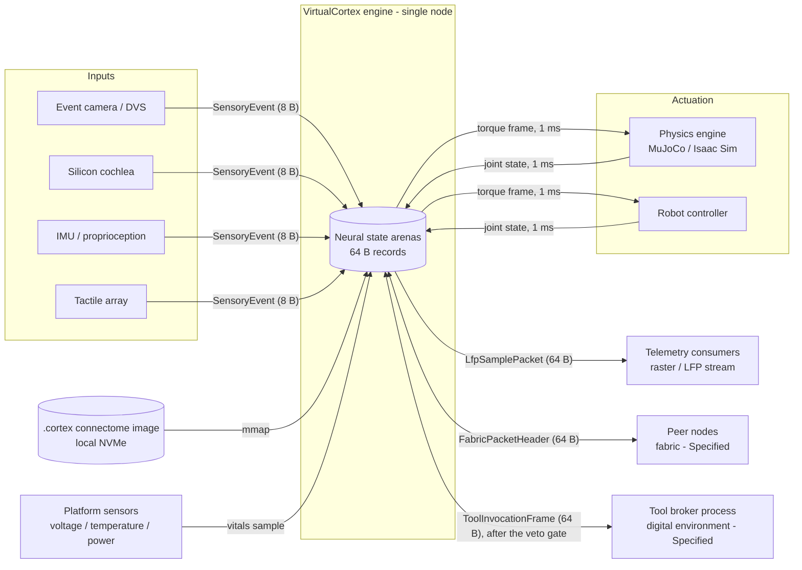
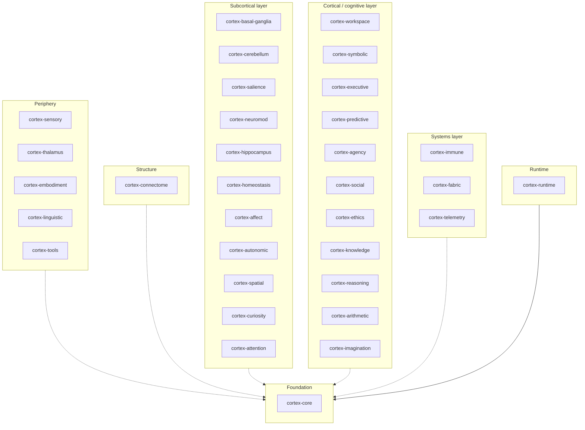

# VirtualCortex Architecture Whitepaper

**A deterministic, single-node neuromorphic virtual-actor engine for spiking neural computation, written in Rust.**

| Document control | |
| :--- | :--- |
| Version | 4.14.0 |
| Status | Active (living document; amended by ADR) |
| Date | 2026-09-14 |
| Supersedes | Whitepaper 3.0.0 (2026-09-10; eighteen crates), which superseded Specification 2.8.0 |
| Canonical language | English (this file). A [Traditional Chinese reader's guide](zh-TW/README.md) points into it and carries no layouts or figures of its own. |
| Structure | [arc42](https://arc42.org) template v8 with [C4](https://c4model.com) views |
| Decision log | [docs/adr/](adr/README.md) ([MADR](https://adr.github.io/madr/) format) |
| Governance | [ADR-0008](adr/0008-documentation-governance.md) |
| Requirement language | The key words MUST, MUST NOT, SHOULD, SHOULD NOT and MAY are to be interpreted as described in [BCP 14](https://www.rfc-editor.org/info/bcp14) (RFC 2119, RFC 8174) when, and only when, they appear in capitals. |
| Toolchain verified against | `rustc 1.97.1`, `cargo 1.97.1` (pinned in `rust-toolchain.toml`), Node 22; minimum supported Rust 1.85, edition 2024 ([ADR-0009](adr/0009-rust-edition-and-msrv.md)); see [Appendix B](#appendix-b-verification-and-conformance) |
| License | Apache-2.0 OR MIT |

## How to read this document

Every claim about the system carries one of four **status labels**, which state its maturity. They are the most important convention in this document, and a claim without one is a defect. (In tables the column is headed *Maturity*, because *status* is the word the decision records use for their lifecycle.)

| Label | Meaning | Evidence required |
| :--- | :--- | :--- |
| **Implemented** | Exists in `crates/` or `runtime/` today and is checked by the compiler, a test, or an executable assertion in this document. | Source path, plus a `const` assertion, a unit test, or a `@assert-*` directive. |
| **Specified** | The design is fixed here or in an ADR (interfaces, formats, invariants), but no code exists yet. | A section of this document or an ADR. |
| **Target** | A measurable quality goal with a stated measurement protocol. **Not yet measured.** | An entry in [§10](#10-quality-requirements) with a protocol. |
| **Hypothesis** | A research assumption the architecture rests on. It must be validated before anything that depends on it can become a Target. | An entry in [§11](#11-risks-and-technical-debt). |

**Where this document and the repository disagree, the repository is authoritative**, and the disagreement is recorded as a numbered finding in [§11](#11-risks-and-technical-debt) rather than resolved silently. The claims this document makes about the source tree are executable: `npx spec-guard` runs the `<!-- @assert-* -->` directives embedded below against the tree (`crates/`, `runtime/`, `benches/`, the manifests) and fails CI when they drift ([Appendix B](#appendix-b-verification-and-conformance)).

**No performance figure in this document has been measured.** Every number in [§10](#10-quality-requirements) is a Target with a protocol, and stays one until a benchmark exists in the repository.

---

## Table of contents

- [Executive summary](#executive-summary)
- [1. Introduction and goals](#1-introduction-and-goals)
- [2. Constraints](#2-constraints)
- [3. Context and scope](#3-context-and-scope)
- [4. Solution strategy](#4-solution-strategy)
- [5. Building block view](#5-building-block-view)
- [6. Runtime view](#6-runtime-view)
- [7. Deployment view](#7-deployment-view)
- [8. Cross-cutting concepts](#8-cross-cutting-concepts)
- [9. Architecture decisions](#9-architecture-decisions)
- [10. Quality requirements](#10-quality-requirements)
- [11. Risks and technical debt](#11-risks-and-technical-debt)
- [12. Glossary](#12-glossary)
- [Appendix A. Capacity model](#appendix-a-capacity-model)
- [Appendix B. Verification and conformance](#appendix-b-verification-and-conformance)
- [Appendix C. Roadmap](#appendix-c-roadmap)
- [Appendix D. References](#appendix-d-references)
- [License](#license)

---

## Executive summary

VirtualCortex is a Rust workspace for building a **spiking neural network (SNN) engine on the virtual-actor model, constrained to a single physical server**. Its design premise is that biological neural tissue is sparse, event-driven, asynchronous and defined by its connectivity, and that a general-purpose CPU can execute such a system efficiently only when every data structure respects the physical realities of the machine: the 64-byte cache line, the memory wall, the branch predictor, and the cost of a heap allocation or a system call on a hot path.

The engine therefore rests on five axioms (§4): neural units exist virtually and are materialised on demand; state and compute are decoupled, so that a fixed pool of worker threads services tens of millions of passive records; each record is owned by at most one worker per tick, enforced by an atomic gate; axonal conduction delay is a constant-time index into a timing wheel, never an operating-system timer; and inactive tissue is evicted to local storage by a metabolic sweep. Around this core, the workspace defines subsystems that mirror the functional anatomy of the mammalian brain: sensory ingestion, embodiment, basal-ganglia action selection, cerebellar forward models, amygdalar salience, a global workspace, a vector-symbolic bridge, prefrontal planning, predictive coding, agency attribution, neuromodulation, hippocampal memory, homeostasis, an immune scrubber, a scale-out fabric and telemetry; and, admitted by [ADR-0016](adr/0016-thirty-two-crate-architecture.md) on 2026-09-10, a thalamic relay, native construction-grammar frames, brokered tool invocation, foveal attention, interoception, autonomic vitals, a metric cognitive map, epistemic curiosity, social perspective, an ethical veto gate, a semantic ontology, symbolic rules, an exact arithmetic scratchpad and a counterfactual canvas.

**What exists today (Implemented).** Thirty-two `#![no_std]` state crates with no external dependencies and no `unsafe` code; the workspace's one `unsafe` is the runtime's arena access under [ADR-0023](adr/0023-executor.md). Each crate defines its primary state record as a `#[repr(C)]` plain-old-data structure: thirty-nine 64-byte cache-line records, one 1 280-byte record of twenty lines (the hypervector body), two 16-byte records (the neuromodulator vector and the plastic delta) and one 8-byte sensory event. Size and alignment are asserted at compile time for all of them; every record without atomics is `Copy` and `Eq`. Twenty-six crates carry small, deterministic, integer-only update rules with boundary tests (the Logic column of §1.6), and every crate carries a test module. A runtime crate outside `crates/`, `runtime/cortex-runtime`, composes them: a fixed pool of worker threads, a work-stealing deque and a timing wheel per worker, three barrier-separated phases per fine tick (turns, fan-out, deliveries), mailbox delivery and synaptic fan-out, allocating nothing after start-up ([ADR-0023](adr/0023-executor.md)); milestone M2's exit test (10⁶ events from four producers delivered exactly once on one, two and four workers) and the first differential test (bit-identical arenas on one and four workers) pass. The `.cortex` image is written and read (a section directory sealed by CRC-64/XZ, a read-into-arenas loader that fails closed), the clock sweep evicts quiet units into a write-ahead log and re-hydrates them on the next message bit for bit (milestone M4's exit test), and the Tier-2 delta record exists ([ADR-0024](adr/0024-cortex-image-and-clock-sweep.md)). The engine amends one thing about itself: a parameter of its own policy, from a registry with bounds, proposed, admitted through the veto gate by id, trialled in two forks of its image that must behave identically, committed between ticks only when the cost fell, persisted in the image and replayed by the loader ([ADR-0031](adr/0031-policy-amendment.md)); it never amends its own code, and a proposed rule leaves through the broker to the repository's gates. Plasticity is three-factor: the STDP pairing enters an eligibility trace per synapse, and the modulator, from the dopamine signal of `cortex-neuromod`, names the fraction of it the weight takes at the presynaptic spike, so a reward that arrives after the pairing still consolidates it ([ADR-0032](adr/0032-three-factor-plasticity.md)); the image header says what a tick is and at which tick the image was written, and the loader resumes that clock ([ADR-0033](adr/0033-tick-duration-in-the-header.md)). The population's spikes are tallied every tick; once per window the branching ratio is estimated from the tally by lag-one regression and a bounded global synaptic gain, applied by every turn, moves by a bounded step toward the ratio's critical value, with the dynamics unchanged at the default step of zero ([ADR-0036](adr/0036-criticality-control.md)); a rule slower than the tick runs on a cadence, a mask on the tick ([ADR-0035](adr/0035-cadence-and-the-population-tally.md)); the four-synapse block's layout stands against the density proposals it was measured against ([ADR-0034](adr/0034-synaptic-density.md)). Sleep is a state machine stepped once per window: a sleep pressure that rises awake and falls asleep against thresholds a circadian phase sets, whose sixteen bits are a day at one step per window, three stages under an ultradian budget, a wake as an input, off by default ([ADR-0037](adr/0037-sleep-regulation.md)); an episode, a tagged pattern of units, is appended to a ledger the image carries and never overwritten, replayed into the network on a ripple cadence during slow-wave sleep so that the three-factor rule consolidates the synapses among it, and depotentiated during REM ([ADR-0038](adr/0038-episodic-ledger-and-replay.md)). The hypervector has a body: 160 words of 64 bits, with binding, permutation, bundling, the Hamming distance, the nearest codebook entry and a decode confidence as integer rules over the words, no intrinsic and no `unsafe` ([ADR-0039](adr/0039-hypervector-body.md)); syntax is type reduction on the term arena, categories as terms and the four combinatory rules as unifications under a greedy shift-reduce reducer ([ADR-0040](adr/0040-categorial-reduction.md)); and the runtime composes the two with the frame, between ticks: a category sequence is read into a frame, the frame is sealed as a hypervector and read back through a codebook role by role, on ids alone, with every distance pinned on both CI targets. Eight crates carry the rules of [ADR-0026](adr/0026-social-acumen-and-re-representation.md) and [ADR-0027](adr/0027-vocal-synthesis-and-computational-humor.md): a sincerity gap and a second-level expectation of the self, tact and an intended act, an anomaly that marks a concept's framework stale and a re-representation, a basis rotation, a vocal frame with an integer source–filter renderer, the benign-violation appraisal, reward and a playful marker. The round of ADR-0041 to ADR-0043 added definite clauses on the term arena with the least general generalisation and the inverse-resolution operators (a predicate invented from a reserved band, every output resolving back to its inputs), the convergents of a polynomial continued fraction through the scratchpad slot with a bounded coefficient search, and the runtime's discovery path (a clause store's description length as the free energy the valence rule reads, an invention's drop as the modulator's reward, a prover frame's certificate into a theorem). The round of ADR-0044 and ADR-0045 added a seeded anatomical prior in `cortex-connectome` (a ring lattice with a local window, a rewired fraction, every fifth unit inhibitory, a local and a far delay band) that the runtime writes into a network of any size, a drive that is a function of the tick, and a causal branching-ratio oracle by perturbation of two forks of one image with the extra spikes attributed through the kicked unit's synapses, on which the estimator of ADR-0036, its controller and a night's replay were measured at 256 and 1 024 units (the slope of one window is not a reading of $\sigma$, the controller turns at the saturation ceiling, a local pattern completes after a night and a random one does not); and a candidate-pair walk, a bounded proof search and the executive search over a clause store that commits an invention whose reward is positive, with every proof kept and the invented predicates read back on its path; the lexicon on ids, a caller's table of a host's token ids to concept ids with a lexical shape, a token sequence read into a frame and a complete frame realised into token ids in the template's order with its markers, its particle and its nested clause, the words the host's (ADR-0046); the estimator measured again on a second prior, the sparse random network, with the record's estimate cross-checked against the spike train by an independent rule and the slopes at a fine bin read beside the causal ratio, which showed that no line of the record would read the branching ratio at this scale (ADR-0047); and episodes tagged from the spike train, the densest coincidence and the pattern that fired most, one bound to a rewarded invention and read out after a night (ADR-0046, ADR-0047, ADR-0048). The round of ADR-0049 to ADR-0051 made Dale's principle a property of the plasticity rule (a block's polarity is its presynaptic unit's flag, taken by the rules as an argument; the trace is the change of the weight's magnitude and consolidation keeps the weight within its polarity's half of the width; an inhibitory block takes the symmetric window of Vogels et al. 2011 with a depression per presynaptic spike from a stated target rate), gave the executor its own spike train (every worker's spikes of a tick merged in unit order into a bounded ring after the tick, the same on every worker count, on which the capture rules run and a rewarded search tags its coincidence in one call), and measured the estimator at 4 096 units on both priors, where the decision rule written before the run added no line to the record. The engine now owns a term arena and a clause store that the image carries, takes terms and clauses as inputs, and runs the discovery loop inside the tick on a cadence while awake, binding the pattern active before an invention's reward to the invented predicate in the ledger ([ADR-0052](adr/0052-the-term-arena-in-the-image.md)); the inhibitory rule's target period is a parameter of the image, not of the registry, whose behaviour gate admits no parameter that changes what the engine does ([ADR-0053](adr/0053-the-waking-day-and-the-target-period.md)); and a unit keeps the tick a synapse's message last reached it, so that the executor counts the spikes within the oracle's latency of one beside the population's, a reading measured against the oracle at three sizes and found to read the input's density, not the branching ratio, so the controller is untouched ([ADR-0054](adr/0054-the-causal-count-inside-the-loop.md)); an excitatory pairing's depression scales with the weight's magnitude, so that under stationary pairing a weight settles where its depression equals its potentiation instead of draining to nothing, read over a day at 256 and 1 024 units ([ADR-0055](adr/0055-a-weight-that-settles.md)); the term arena is compacted onto the clause store's clauses at every entry into slow-wave sleep, one descending pass to mark and one ascending pass to move ([ADR-0056](adr/0056-a-compaction-of-the-term-arena.md)); and the inhibitory rule is read from below the rail, with the fraction of units at the target per window as the reading a chosen target needs and no lane opened for a parameter that changes behaviour ([ADR-0057](adr/0057-the-inhibitory-rule-from-below-the-rail.md)). The workspace compiles cleanly on stable Rust and its layout invariants are verified by `cargo test` and by the executable assertions in this document.

**What is designed but not built (Specified).** Core pinning and the seccomp filter of the worker threads, the `mmap` path of the `.cortex` loader and a hot checkpoint with tokens in flight, the shared-memory mappings of the embodiment and tool rings and the broker process behind the tool ring, epoch-based reclamation for structural plasticity, the fabric transport, the broker's amendment register and the registry entries of every rule the runtime does not yet compose, and every subsystem's dynamics beyond the rules noted in §5.

**What must be proved (Hypothesis).** That multi-compartment "super-neuron" records can condense the behaviour of point-neuron populations at a ratio that makes whole-brain-scale behaviour reachable within a single 64 GB server. The capacity model in Appendix A is parameterised on that ratio and is a plan, not a measurement.

---

## 1. Introduction and goals

### 1.1 Problem statement

Dense-tensor deep learning maps well to GPUs and poorly to the operating principles of nervous tissue, which is roughly 1–2 % active at any instant, communicates by discrete events, and computes through topology and timing. Existing academic SNN simulators model that tissue faithfully but pay for it with pointer-based sparse graphs and IEEE-754 floating point: at scale they thrash the cache hierarchy, saturate the DRAM bus, and produce results that differ across CPU vendors.

A naive whole-brain point-neuron model illustrates the memory wall. With $N \approx 8.6 \times 10^{10}$ neurons and $S \approx 10^{14}$ synapses, even a minimal 8-byte pointer per synapse costs

$$
M_{\text{naive}} \;\ge\; S \cdot 8\ \text{B} \;=\; 8 \times 10^{14}\ \text{B} \;\approx\; 800\ \text{TB},
$$

and every synapse traversal is a dependent load. On a 3.2 GHz core a DRAM miss costs roughly 80 ns, about 256 cycles, so a pointer-chasing inner loop is stalled for more than 99 % of its cycles:

$$
\frac{t_{\text{DRAM}}}{t_{\text{ALU}}} \;=\; \frac{80\ \text{ns}}{0.3125\ \text{ns}} \;\approx\; 256, \qquad
\text{stall fraction} \;\approx\; \frac{256 - 1}{256} \;\approx\; 99.6\ \%.
$$

VirtualCortex attacks the problem from the hardware upward. The target is not to reproduce every point neuron but to build an engine whose unit of state is a cache line, whose arithmetic is bit-exact across platforms, whose hot path never allocates, and whose scale is bounded by memory density rather than by pointer traffic.

### 1.2 Functional requirements

| ID | Requirement | Maturity |
| :--- | :--- | :--- |
| FR-1 | Represent a neural unit as a fixed-size, 64-byte, `#[repr(C)]` record with no heap pointers. | Implemented (§5.2.1) |
| FR-2 | Represent synaptic fan-out as fixed-size 64-byte blocks chained by index, not by pointer. | Implemented (§5.2.1) |
| FR-3 | Schedule delayed spike delivery in $O(1)$ time using a two-tier timing wheel. | Implemented (the wheel, [ADR-0013](adr/0013-timing-wheel-geometry.md); the delivery phase that drains it, [ADR-0023](adr/0023-executor.md)) (§5.2.1, §6.2) |
| FR-4 | Load a whole connectome image by memory mapping, without a deserialisation pass. | Specified (§8.7) |
| FR-5 | Ingest events from hot-pluggable peripherals through a trait-based hardware abstraction layer. | Implemented (trait) · Specified (runtime) (§5.2.3) |
| FR-6 | Exchange motor commands and proprioceptive feedback with a physics engine or robot under a 1 ms period. | Implemented (frames, ring protocol) · Specified (mapping, loop, torque decoder) (§5.2.4, §6.4) |
| FR-7 | Provide subcortical, cortical and systemic subsystems as independent crates with 64-byte state records. | Implemented (records; one or more tested rules in 25 crates) · Specified (the full dynamics of §8.8) (§5.2) |
| FR-8 | Verify all layout invariants at compile time, and every documentation claim that carries a directive, in CI. | Implemented (Appendix B); a claim without a directive is held by review, as the reconciliations F-25 and F-27 show |
| FR-9 | Act on a digital environment through a broker outside the engine process, as 64-byte shared-memory frames that pass an in-engine veto gate first; and realise language natively, from hypervector unbinding into construction-grammar frames, with no external language model. | Implemented (frames, gate rule, frame assembly) · Specified (broker, ring mapping, unbinding, lexicon) (§5.2.20, §5.2.21, §5.2.28, §6.8, §6.9) |
| FR-10 | Amend a parameter of the engine's own policy in a verifiable closed loop: propose within a registry's bounds, pass the veto gate by id, trial in two forks of the image that must behave identically, commit only when the cost fell, persist in the image and replay on load; never amend the engine's code, which leaves as a proposal for the repository's gates. | Implemented for the clock sweep's two parameters ([ADR-0031](adr/0031-policy-amendment.md); §5.2.10, §6.16, §8.18) · Specified (the other rules' parameters as the runtime composes them; the broker's register) |

### 1.3 Quality goals

Ordered by priority. Each is refined into measurable scenarios in §10.

| Priority | Quality goal | Motivation |
| :--- | :--- | :--- |
| 1 | **Determinism.** The same seed and inputs MUST produce bit-identical state on x86-64 and AArch64. | Scientific reproducibility; safety of embodied control; testability. |
| 2 | **Memory density.** State per neural unit MUST be exactly one cache line; the engine MUST run a reference configuration within a single commodity server. | The memory wall (§1.1) is the binding constraint, not arithmetic throughput. |
| 3 | **Latency.** Per-event dispatch MUST be free of allocation, system calls and pointer chasing. | Tail latency is dominated by exactly those three things. |
| 4 | **Real-time embodiment.** The sensorimotor loop MUST hold a fixed 1 ms period with bounded jitter. | Physical stability of rigid-body control. |
| 5 | **Verifiability.** Every architectural claim MUST be checkable by a tool that runs in CI. | Documentation that cannot fail a build rots ([ADR-0008](adr/0008-documentation-governance.md)). |

### 1.4 Stakeholders

| Stakeholder | Concern |
| :--- | :--- |
| Systems engineers implementing the runtime | Exact record layouts (§5.2), numeric model (§8.1), concurrency rules (§8.5). |
| Computational neuroscientists | Which biological mechanism each subsystem models and with what simplifications (§8.8). |
| Robotics integrators | The embodiment interface and its timing contract (§5.2.4, §6.4, §10). |
| Reviewers and maintainers | Status of every claim, open findings (§11), and how the document is verified (Appendix B). |
| Coding agents | Ground truth that cannot mislead: every assertion in this file is executable. |

### 1.5 Scope and non-goals

In scope: a single-node engine, its state model, its subsystems, its interfaces to the outside world (sensors, a body, platform vitals and a brokered digital environment), its native language realisation, and its verification.

Out of scope, by design. These are the boundaries the founding design note drew and they still hold:

- **Dense synchronous matrix workloads.** Transformer-style training is a GPU problem. An asynchronous discrete-event engine on CPUs is the wrong tool for it and this document does not pretend otherwise.
- **Cross-machine fault tolerance inside the engine.** The engine assumes a node does not partially fail. High availability, if needed, wraps the engine with snapshots; it is not built into the tick loop. Multi-node *scale-out* (§5.2.17) is a data-plane concern and is Specified, not Implemented.
- **All-to-all connectivity.** Mailboxes assume the small-world sparsity of biological tissue. A dense graph exhausts memory bandwidth by construction.
- **A general-purpose actor framework.** Actors here are passive 64-byte records, not objects with behaviour; there is no supervision tree, no message serialisation and no location transparency beyond the node.

One boundary moved on 2026-09-10 ([ADR-0016](adr/0016-thirty-two-crate-architecture.md)): the engine may act on a digital environment, through a broker process outside its own seccomp filter (§8.10). That does not make the engine a general-purpose framework: a tool call is a 64-byte frame in a shared-memory ring, exactly as a motor command is. Language stays inside the engine: frames are assembled natively from hypervector unbinding (§5.2.20) and no external language model is part of the system.

A second boundary moved the same day ([ADR-0031](adr/0031-policy-amendment.md)): the engine may amend a parameter of its own policy, from a registry with bounds, through four gates and a trial in two forks of its image that must behave identically (§8.18). It may not amend its own code: there is no compiler, interpreter or code loader in the process, and a proposed rule leaves through the broker to the repository's gates, where a maintainer merges it or does not.

### 1.6 Implementation status at a glance

Verified against the tree on 2026-09-14. "Layout" means the record's size and alignment are asserted at compile time; "Test" means a `#[cfg(test)]` unit test exists; "Logic" means at least one non-trivial update function exists.

| Crate | Primary public type(s) | Size | `no_std` | Layout | Test | Logic |
| :--- | :--- | ---: | :---: | :---: | :---: | :---: |
| `cortex-core` | `DendriticSuperNeuron`, `SynapseBlock`, `MailboxNode`, `FlatTimingWheel` (`WorkerWheel`), `synaptic_efficacy_q16` | 64 B, 64 B, 8 B, 4.2 MB | yes | yes | yes | membrane integration, short-term plasticity, turn gate and mailbox, wheel schedule and drain, efficacy, fan-out, STDP into an eligibility trace and its consolidation by the modulator within the polarity's half of the width (the polarity a block's presynaptic unit's flag; the symmetric inhibitory rule, its depression per spike an argument from the target period), the cadence of a rule slower than the tick, the message bit that says a message is a synapse's and the descendant rule over the unit's stamp, the excitatory depression scaled by the weight's magnitude (`depression_at`) |
| `cortex-connectome` | `CortexFileHeader`, `SectionEntry` | 64 B, 64 B | yes | yes | yes | `crc64`, `Crc64`, `validate`, `new`, `encode`, `decode`; the anatomical prior's walk and census (`Prior::{synapses, census}`, `ring_distance`) |
| `cortex-sensory` | `SensoryEvent`, `trait SensoryPeripheral` | 8 B | yes | yes | yes | — |
| `cortex-embodiment` | `EmbodimentRingBuffer`, `TorqueFrame`, `JointStateFrame`, `VocalFrame` | 64 B each | yes | yes | yes | SPSC ring protocol, `from_burst_counts`, `VocalSynth` (source–filter renderer), `shape` |
| `cortex-basal-ganglia` | `BasalGangliaChannelState` | 64 B | yes | yes | yes | `compute_gating` |
| `cortex-cerebellum` | `CerebellarMicrozone` | 64 B | yes | yes | yes | `step_forward_model` |
| `cortex-salience` | `SalienceNodeState` | 64 B | yes | yes | yes | `evaluate_threat` |
| `cortex-workspace` | `GlobalWorkspaceSlot` | 64 B | yes | yes | yes | `step_ignition`, `step_ignition_at` (criticality-gated), `update_attention_schema` |
| `cortex-symbolic` | `SymbolicHypervectorHeader`, `HypervectorBody` | 64 B, 1 280 B | yes | yes | yes | `bind`, `blend`, `rebase`, `record_readout`; the body's `from_seed`, `bind`, `permute`, `bundle`, `hamming`, `nearest`, `confidence_q16` |
| `cortex-executive` | `ExecutivePlanNode`, `PolicyAmendment` | 64 B, 64 B | yes | yes | yes | `propose`, `admit`, `record_trial`, `commit`, `is_well_formed` (the amendment's four gates and the loader's check) |
| `cortex-predictive` | `PredictiveErrorState` | 64 B | yes | yes | yes | — |
| `cortex-agency` | `AgentPerspectiveState` | 64 B | yes | yes | yes | — |
| `cortex-immune` | `ImmuneScrubNode` | 64 B | yes | yes | yes | — |
| `cortex-neuromod` | `NeuromodulatorState` | 16 B | yes | yes | yes | `reward`, `decay_dopamine`, `modulation`, `encode`, `decode` |
| `cortex-hippocampus` | `HippocampalAttractorState`, `Episode` | 64 B, 64 B | yes | yes | yes | `Episode::{tag, pattern, replay, depotentiate, is_spent, bind, symbol, is_well_formed, encode, decode}`; the ledger's `append`, `next_hand`, `is_well_formed`, `encode`, `decode`; the capture from a spike train (`burst`, `capture`) |
| `cortex-homeostasis` | `HomeostaticDrivePool` | 64 B | yes | yes | yes | `update_branching_ratio`, the population tally into bins (`count_activity`, `close_bin`), the branching ratio by lag-one regression (`estimate_branching_ratio`), the synaptic gain's regulation (`regulate`), the sleep step and the wake (`step_sleep`, `wake`), `is_well_formed`, `encode`, `decode`; the lag-$k$ slope over a caller's series and a train's bins (`slope_at_lag`, `count_bins`) |
| `cortex-fabric` | `FabricPacketHeader` | 64 B | yes | yes | yes | — |
| `cortex-telemetry` | `LfpSamplePacket` | 64 B | yes | yes | yes | — |
| `cortex-thalamus` | `ThalamicRelayNode` | 64 B | yes | yes | yes | `relay` gate (tonic / burst / closed) |
| `cortex-linguistic` | `LinguisticFrameSlot` | 64 B | yes | yes | yes | `bind_role`, `bind_child` (nesting), `attach_metaphor`, `realisation_order`, `advance_prosody` (recurrent cell), `apply_face`, `mark_play`, `mark_indirect` |
| `cortex-tools` | `ToolInvocationFrame` | 64 B | yes | yes | yes | frame state machine, `is_known_action`, `new_call` |
| `cortex-attention` | `FovealAttentionFocus` | 64 B | yes | yes | yes | saccade state machine, `document_target` |
| `cortex-affect` | `InteroceptiveState` | 64 B | yes | yes | yes | `integrate`, `update_valence`, `metaphor_source_domain`, `appraise_incongruity`, `is_well_formed`, `encode`, `decode` |
| `cortex-autonomic` | `AutonomicVitalsState` | 64 B | yes | yes | yes | `sample` limit check |
| `cortex-spatial` | `SpatialGridCoordinate` | 64 B | yes | yes | yes | `integrate`, `fix` |
| `cortex-curiosity` | `CuriosityExplorationVector` | 64 B | yes | yes | yes | `visit` |
| `cortex-social` | `SocialPerspectiveNode` | 64 B | yes | yes | yes | `resonate`, `update_trust`, turn-taking and grounding, `register`, `assess_sincerity`, `expect_of_self` |
| `cortex-ethics` | `EthicalEvaluationGate` | 64 B | yes | yes | yes | `evaluate` (veto) |
| `cortex-knowledge` | `SemanticOntologyNode` | 64 B | yes | yes | yes | `consolidate`, `affords`, `certify`, `note_anomaly`, `re_represent` |
| `cortex-reasoning` | `SymbolicRuleNode`, `TermNode`, `InductionState` | 64 B, 64 B, 64 B | yes | yes | yes | `evaluate`, `resolve`, `apply_resolution`, `unify`, `resolve_first_order`, `reduce` (categorial reduction), `head`, `lgg`, `absorb`, `identify`, `intra_construct`, `resolve_definite` (induction), `next_pair`, `resolve_literal`, `prove` (clause search), `instantiate`, `unbind`, the two records' bytes and the induction record's cursor (the arena in the image), `compact` (the arena's garbage reclaimed onto a store's roots in two passes) |
| `cortex-arithmetic` | `ArithmeticScratchpadSlot` | 64 B | yes | yes | yes | `execute` (eight opcodes, 128-bit), `convergent`, `within`, `search` (continued fractions) |
| `cortex-imagination` | `MentalCanvasFrame` | 64 B | yes | yes | yes | `step`, `has_diverged`, `reflect` (self-model fixed point), `wander`, `wander_at` |

The workspace manifest lists exactly thirty-two state crates under `crates/` (eighteen from the founding decomposition and fourteen admitted by [ADR-0016](adr/0016-thirty-two-crate-architecture.md)), plus two crates that are not state crates and are never published: the runtime `runtime/cortex-runtime` ([ADR-0023](adr/0023-executor.md)) and the benchmark crate `benches/cortex-bench` ([ADR-0014](adr/0014-benchmark-harness.md)). Every state crate declares an empty dependency list, inherits its version, edition (2024), minimum supported Rust version (1.85), authors, license and repository from `[workspace.package]`, carries a compile-time layout assertion block, and carries a unit-test module; every public function and associated constant has at least one test (brief 007).

<!-- @assert-count target="Cargo.toml" symbol="crates/cortex-" expected="32" reason="the workspace has thirty-two member crates (ADR-0016); update §1.6 and §5 if this changes" -->
<!-- @assert-count target="crates" symbol="const _: () = {" min="32" glob="*.rs" reason="every crate carries a compile-time layout assertion block (F-18 closed)" -->
<!-- @assert-count target="crates" symbol="license.workspace = true" expected="32" glob="Cargo.toml" reason="every crate inherits its metadata from [workspace.package] (F-9 closed)" -->
<!-- @assert-count target="crates/cortex-core" symbol="#[cfg(test)]" min="1" glob="*.rs" reason="F-14: every state crate carries a unit-test module" -->
<!-- @assert-count target="crates/cortex-connectome" symbol="#[cfg(test)]" min="1" glob="*.rs" reason="F-14: every state crate carries a unit-test module" -->
<!-- @assert-count target="crates/cortex-sensory" symbol="#[cfg(test)]" min="1" glob="*.rs" reason="F-14: every state crate carries a unit-test module" -->
<!-- @assert-count target="crates/cortex-embodiment" symbol="#[cfg(test)]" min="1" glob="*.rs" reason="F-14: every state crate carries a unit-test module" -->
<!-- @assert-count target="crates/cortex-basal-ganglia" symbol="#[cfg(test)]" min="1" glob="*.rs" reason="F-14: every state crate carries a unit-test module" -->
<!-- @assert-count target="crates/cortex-cerebellum" symbol="#[cfg(test)]" min="1" glob="*.rs" reason="F-14: every state crate carries a unit-test module" -->
<!-- @assert-count target="crates/cortex-salience" symbol="#[cfg(test)]" min="1" glob="*.rs" reason="F-14: every state crate carries a unit-test module" -->
<!-- @assert-count target="crates/cortex-workspace" symbol="#[cfg(test)]" min="1" glob="*.rs" reason="F-14: every state crate carries a unit-test module" -->
<!-- @assert-count target="crates/cortex-symbolic" symbol="#[cfg(test)]" min="1" glob="*.rs" reason="F-14: every state crate carries a unit-test module" -->
<!-- @assert-count target="crates/cortex-executive" symbol="#[cfg(test)]" min="1" glob="*.rs" reason="F-14: every state crate carries a unit-test module" -->
<!-- @assert-count target="crates/cortex-predictive" symbol="#[cfg(test)]" min="1" glob="*.rs" reason="F-14: every state crate carries a unit-test module" -->
<!-- @assert-count target="crates/cortex-agency" symbol="#[cfg(test)]" min="1" glob="*.rs" reason="F-14: every state crate carries a unit-test module" -->
<!-- @assert-count target="crates/cortex-immune" symbol="#[cfg(test)]" min="1" glob="*.rs" reason="F-14: every state crate carries a unit-test module" -->
<!-- @assert-count target="crates/cortex-neuromod" symbol="#[cfg(test)]" min="1" glob="*.rs" reason="F-14: every state crate carries a unit-test module" -->
<!-- @assert-count target="crates/cortex-hippocampus" symbol="#[cfg(test)]" min="1" glob="*.rs" reason="F-14: every state crate carries a unit-test module" -->
<!-- @assert-count target="crates/cortex-homeostasis" symbol="#[cfg(test)]" min="1" glob="*.rs" reason="F-14: every state crate carries a unit-test module" -->
<!-- @assert-count target="crates/cortex-fabric" symbol="#[cfg(test)]" min="1" glob="*.rs" reason="F-14: every state crate carries a unit-test module" -->
<!-- @assert-count target="crates/cortex-telemetry" symbol="#[cfg(test)]" min="1" glob="*.rs" reason="F-14: every state crate carries a unit-test module" -->
<!-- @assert-count target="crates/cortex-thalamus" symbol="#[cfg(test)]" min="1" glob="*.rs" reason="F-14: every state crate carries a unit-test module" -->
<!-- @assert-count target="crates/cortex-linguistic" symbol="#[cfg(test)]" min="1" glob="*.rs" reason="F-14: every state crate carries a unit-test module" -->
<!-- @assert-count target="crates/cortex-tools" symbol="#[cfg(test)]" min="1" glob="*.rs" reason="F-14: every state crate carries a unit-test module" -->
<!-- @assert-count target="crates/cortex-attention" symbol="#[cfg(test)]" min="1" glob="*.rs" reason="F-14: every state crate carries a unit-test module" -->
<!-- @assert-count target="crates/cortex-affect" symbol="#[cfg(test)]" min="1" glob="*.rs" reason="F-14: every state crate carries a unit-test module" -->
<!-- @assert-count target="crates/cortex-autonomic" symbol="#[cfg(test)]" min="1" glob="*.rs" reason="F-14: every state crate carries a unit-test module" -->
<!-- @assert-count target="crates/cortex-spatial" symbol="#[cfg(test)]" min="1" glob="*.rs" reason="F-14: every state crate carries a unit-test module" -->
<!-- @assert-count target="crates/cortex-curiosity" symbol="#[cfg(test)]" min="1" glob="*.rs" reason="F-14: every state crate carries a unit-test module" -->
<!-- @assert-count target="crates/cortex-social" symbol="#[cfg(test)]" min="1" glob="*.rs" reason="F-14: every state crate carries a unit-test module" -->
<!-- @assert-count target="crates/cortex-ethics" symbol="#[cfg(test)]" min="1" glob="*.rs" reason="F-14: every state crate carries a unit-test module" -->
<!-- @assert-count target="crates/cortex-knowledge" symbol="#[cfg(test)]" min="1" glob="*.rs" reason="F-14: every state crate carries a unit-test module" -->
<!-- @assert-count target="crates/cortex-reasoning" symbol="#[cfg(test)]" min="1" glob="*.rs" reason="F-14: every state crate carries a unit-test module" -->
<!-- @assert-count target="crates/cortex-arithmetic" symbol="#[cfg(test)]" min="1" glob="*.rs" reason="F-14: every state crate carries a unit-test module" -->
<!-- @assert-count target="crates/cortex-imagination" symbol="#[cfg(test)]" min="1" glob="*.rs" reason="F-14: every state crate carries a unit-test module" -->
<!-- @assert-absence target="crates" symbol="unsafe" word="true" glob="*.rs" reason="TC-9: no unsafe under crates/; the runtime's arena access is the one unsafe, under ADR-0023 (§8.10)" -->

---

## 2. Constraints

### 2.1 Engineering doctrine: "Latest ≠ Newest"

The project's founding rule is that **the newest technology is rarely the best-understood one**, and that a mission-critical engine is built from foundations whose failure modes are already known. Concretely, a technology is admissible on the hot path only if it satisfies all of:

1. a stable, published specification or ABI;
2. at least two years of production use under load by parties other than its authors;
3. failure modes that are documented, not discovered;
4. a mechanical-sympathy argument: it maps onto what the CPU, the memory controller and the kernel actually do.

This rule is why the foundations below were chosen over their newer alternatives.

| Foundation | Stable since | Why it is admissible |
| :--- | :--- | :--- |
| 64-byte cache-line-aligned POD records | x86 P6 (1995); all current x86-64 and AArch64 server cores | The transfer quantum of every modern memory subsystem. |
| Q16.16 fixed-point arithmetic | Decades of DSP and game-engine practice | Bit-exact, associative in the integer domain, SIMD-friendly. |
| Hashed / hierarchical timing wheels | Varghese & Lauck, 1987 | $O(1)$ insert and expiry; the standard for kernel and network timers. |
| Epoch-based reclamation | Fraser, 2004; `crossbeam-epoch` in production since 2017 | Lock-free reader path for structural mutation. |
| `mmap` of an image whose layout equals the in-memory layout | POSIX | Zero-copy hydration; the page cache does the work. |
| Rust, edition 2024 | Rust 1.85, February 2025 | Memory safety without a runtime; the edition is the current stable one, not a nightly feature. |
| arc42, C4, MADR, BCP 14 | 2005 / 2018 / 2018 / 1997 | Mature documentation standards with tooling and a reader base. |

What the rule excludes: language features gated on nightly, crates below 1.0 without a documented stability policy, kernel interfaces younger than two LTS releases on the hot path, and any performance claim that has not been reproduced on the reference platform.

### 2.2 Technical constraints

| ID | Constraint | Maturity |
| :--- | :--- | :--- |
| TC-1 | The engine is written in Rust and builds on stable `rustc`. Nightly features MUST NOT be required. | Implemented |
| TC-2 | State crates MUST declare no external dependencies. Runtime crates MAY depend on a vetted allow-list ([ADR-0005](adr/0005-crate-per-subsystem.md)). | Implemented (all 32 state crates; the only third-party dependency in the workspace is the benchmark harness, a dev-dependency of `benches/cortex-bench`, [ADR-0014](adr/0014-benchmark-harness.md)); held in CI by `scripts/check-deps.mjs` ([ADR-0029](adr/0029-structural-enforcement.md)) |
| TC-3 | Every primary state record MUST be `#[repr(C)]`, and its size and alignment MUST be asserted at compile time. | Implemented (§5.2) |
| TC-4 | `f32` and `f64` MUST NOT appear in any crate of the workspace. Dynamics use Q16.16 (§8.1). | Implemented: `clippy::disallowed_types` over both, denied by `[workspace.lints]` and inherited by every crate ([ADR-0029](adr/0029-structural-enforcement.md)); the directives below hold the document's side for `crates/` |
| TC-5 | The simulation hot path MUST NOT allocate, MUST NOT block, and MUST NOT make system calls after initialisation. | Implemented for the executor's loop ([ADR-0023](adr/0023-executor.md)): no allocation after `Executor::new` (a counting allocator over 20 000 ticks), no blocking but a spin barrier, no system call but the barrier's yield, which pinning (§7.3, Specified) removes |
| TC-6 | State crates MUST be `#![no_std]`. | Implemented (32 of 32; brief 002, ADR-0016) |
| TC-7 | The runtime target is Linux on x86-64-v4 or ARMv9-A; state crates MUST remain portable to any target with 64-bit atomics. | Specified |
| TC-8 | Crates MUST declare `edition = "2024"` and `rust-version = "1.85"` by inheritance from `[workspace.package]`; the toolchain CI builds with MUST be pinned in `rust-toolchain.toml` and moved only deliberately. | Implemented ([ADR-0009](adr/0009-rust-edition-and-msrv.md); finding F-5 closed; a CI job builds and tests on the MSRV) |
| TC-9 | `unsafe` MUST NOT be introduced without an ADR that names the invariant it upholds and the test that checks it. | Implemented: zero `unsafe` under `crates/`; the runtime's arena access is the one `unsafe`, under [ADR-0023](adr/0023-executor.md) (the phase discipline; the differential and contention tests); `unsafe_code` is forbidden by `[workspace.lints]` in every state crate and the benchmark crate ([ADR-0029](adr/0029-structural-enforcement.md)) |

<!-- @assert-absence target="crates" symbol="f32" word="true" glob="*.rs" reason="TC-4: no IEEE-754 in any crate" -->
<!-- @assert-absence target="crates" symbol="f64" word="true" glob="*.rs" reason="TC-4: no IEEE-754 in any crate" -->
<!-- @assert-absence target="crates" symbol="std::thread" glob="*.rs" exclude="tests" reason="TC-5: state crates do not spawn threads; the executor is a separate runtime concern; integration tests under crates/*/tests/ are excluded" -->
<!-- @assert-count target="crates" symbol="#![no_std]" glob="*.rs" expected="32" reason="TC-6: every crate is no_std (F-6 closed by brief 002; ADR-0016)" -->
<!-- @assert-absence target="crates" symbol="Box<" glob="*.rs" exclude="tests" reason="TC-5: no heap-owning types in state crates; integration tests under crates/*/tests/ are excluded" -->
<!-- @assert-absence target="crates" symbol="Vec<" glob="*.rs" exclude="tests" reason="TC-5: no heap-owning types in state crates; integration tests under crates/*/tests/ are excluded" -->
<!-- @assert-absence target="crates" symbol="String" word="true" glob="*.rs" exclude="tests" reason="TC-5: no heap-owning types in state crates (ADR-0016 restated the rule); integration tests under crates/*/tests/ are excluded" -->
<!-- @assert-absence target="crates" symbol="extern crate alloc" glob="*.rs" reason="TC-5 and rule L-3: no state crate pulls the allocator in, so no string type exists inside the engine and a word cannot; the lexicon is the runtime's boundary (section 1.5, brief 020)" -->
<!-- @assert-count target="Cargo.toml" symbol='edition = "2024"' expected="1" reason="TC-8: the workspace edition is 2024 (ADR-0009)" -->
<!-- @assert-count target="Cargo.toml" symbol='rust-version = "1.85"' expected="1" reason="TC-8: the minimum supported Rust version is 1.85 (ADR-0009)" -->
<!-- @assert-count target="crates" symbol="rust-version.workspace = true" expected="32" glob="Cargo.toml" reason="TC-8: every state crate inherits the MSRV (ADR-0009)" -->
<!-- @assert-count target="Cargo.toml" symbol='unsafe_code = "forbid"' expected="1" reason="ADR-0029: the workspace forbids unsafe_code in every crate that inherits its lints" -->
<!-- @assert-count target="crates" symbol="[lints]" glob="Cargo.toml" expected="32" reason="ADR-0029: every state crate inherits the workspace lints (TC-4, TC-9)" -->
<!-- @assert-count target="clippy.toml" symbol='path = "f32"' expected="1" reason="ADR-0029: TC-4 is a Clippy error" -->
<!-- @assert-count target="crates" symbol="deny(clippy::arithmetic_side_effects)" glob="*.rs" min="35" reason="ADR-0029, brief 016: the arithmetic lint is denied in every state crate and in the three integration-test crate roots under crates/; the count only grows" -->
<!-- @assert-count target="runtime/cortex-runtime" symbol="deny(clippy::arithmetic_side_effects)" glob="*.rs" min="7" reason="brief 016: the runtime and its six integration-test crate roots deny the arithmetic lint too (F-4 resolved)" -->

### 2.3 Conventions

- **Field offsets** are written as half-open byte ranges `[a..b)` from the start of the record.
- **Q16.16** values are `i32` (or `u32` for non-negative quantities) with 16 fractional bits; `0x0001_0000` is 1.0 (§8.1). Sixteen-bit synaptic weights are **Q1.15**, eight-bit plasticity factors are **Q0.8**, and a sixteen-bit fraction of one (the control step of [ADR-0036](adr/0036-criticality-control.md)) is **Q0.16**; a field whose comment names a format its width cannot hold is a finding (F-3 was one).
- **Ticks** are the engine's discrete time unit. The tick duration is a configuration parameter; current code assumes 10 µs fine ticks and 100 µs coarse ticks in the timing wheel (§8.4).
- **Identifiers**: crates are `cortex-<subsystem>`; primary records are `PascalCase` nouns; Q-format suffixes (`_q16`) are used where the field name would otherwise be ambiguous.
- **Naming of biological analogues** is descriptive, not a claim of equivalence. `cortex-workspace` implements a competitive broadcast slot; it does not implement consciousness, and this document does not use that word for it.

---

## 3. Context and scope

### 3.1 System context (C4 level 1)



### 3.2 External interfaces

| Interface | Direction | Unit of exchange | Crate | Status |
| :--- | :--- | :--- | :--- | :--- |
| Sensory ingestion | in | `SensoryEvent`, 8 B, batched via `SensoryPeripheral::poll_batch` | `cortex-sensory` | Implemented (types) · Specified (drivers) |
| Embodiment | bidirectional | 64-byte `TorqueFrame` out and `JointStateFrame` in, one per 1 ms period, through rings of 16 governed by a 64-byte `EmbodimentRingBuffer` control block ([ADR-0015](adr/0015-embodiment-frame-abi.md)); the shared-memory mapping is the runtime's | `cortex-embodiment` | Implemented (records, protocol) · Specified (mapping, loop, torque decoder) |
| Connectome image | in | `.cortex` file, `CortexFileHeader` + 64-byte-aligned sections | `cortex-connectome` | Implemented (header, section directory, loader and writer, [ADR-0024](adr/0024-cortex-image-and-clock-sweep.md)) · Specified (`mmap`; the laminar and routing sections) |
| Telemetry | out | `LfpSamplePacket`, 64 B, single-producer single-consumer ring | `cortex-telemetry` | Implemented (type) · Specified (ring, eBPF taps) |
| Fabric | bidirectional | `FabricPacketHeader`, 64 B, over RDMA verbs or CXL shared memory | `cortex-fabric` | Implemented (header) · Specified (transport) |
| Tool broker | bidirectional | `ToolInvocationFrame`, 64 B, through a ring read by a separate broker process that holds the credentials and the allow-list (§8.10); every frame passes the veto gate of `cortex-ethics` first | `cortex-tools` | Implemented (frame state machine, gate rule) · Specified (broker, ring mapping) |
| Platform vitals | in | Voltage, temperature and power samples from the platform's sensors into `AutonomicVitalsState::sample` | `cortex-autonomic` | Implemented (limit check) · Specified (sensor driver, shedding policy) |
| Formal prover or solver co-processor | bidirectional | A `ToolInvocationFrame` with `TOOL_CATEGORY_FORMAL_PROVER` (0x0004) and `ACTION_VERIFY_PROOF` (0x0001, check a proof term against axioms), `ACTION_SOLVE_CONSTRAINTS` (0x0002, decide a formula by constraint or SMT solving) or `ACTION_SYMBOLIC_EVAL` (0x0003, simplify and rewrite a term); the conjecture is named by `param_hash`, the certificate hash returns in the payload (§6.10). The opcodes name mathematical actions, never a product | `cortex-tools` | Implemented (constants, frame) · Specified (the broker; which prover or solver it runs is its configuration, judged under §2.1 when chosen) |
| Document engine | bidirectional | A `ToolInvocationFrame` with `TOOL_CATEGORY_DOC_ENGINE` (0x0005) and `ACTION_PARSE_STRUCTURE`, `ACTION_EXTRACT_ENTITIES` or `ACTION_SEARCH_CROSS_REF`; foveal queries from `cortex-attention`, triples into `cortex-knowledge` (§6.11) | `cortex-tools` | Implemented (constants, frame) · Specified (the broker, its parsers and its index) |
| Amendment register | out | A `ToolInvocationFrame` with `TOOL_CATEGORY_AMENDMENT_REGISTER` (0x0006) and `ACTION_FILE_PROPOSAL` (0x0001: an amendment the engine may not commit itself, a change to a rule, for the repository's gates and its maintainers) or `ACTION_RECORD_COMMIT` (0x0002: a committed parameter amendment into the operator's register, an audit trail the engine cannot rewrite); `param_hash` names the `PolicyAmendment` record (§8.18) | `cortex-tools` | Implemented (constants, frame) · Specified (the broker and its register; what the register is, a file, an issue or a pull request, is its configuration) |

---

## 4. Solution strategy

### 4.1 The five axioms

The founding design note fixed five axioms. Every later subsystem is built on them, and the fields of `DendriticSuperNeuron` (§5.2.1) are their direct expression.

| # | Axiom | Consequence in the design | Where it lives |
| :--- | :--- | :--- | :--- |
| A1 | **Virtual existence.** A neural unit always exists logically; it occupies memory only when a spike addresses it. | Units are addressed by a 64-bit packed identifier; cold units are evicted and re-hydrated lazily. | `id` field; eviction and re-hydration (Implemented, [ADR-0024](adr/0024-cortex-image-and-clock-sweep.md), §8.6; slot reclamation Specified) |
| A2 | **State and compute are decoupled.** Records are passive data; workers are stateless, core-pinned threads. | Resource use scales with instantaneous activity, not with total capacity. | Executor (Implemented, [ADR-0023](adr/0023-executor.md); §6.1) |
| A3 | **Turn-based single-writer invariant.** At most one worker touches a record in any tick, enforced by a compare-and-swap gate. | No mutex, no deadlock, no data race on membrane dynamics. | `gate_state: AtomicU8`; mailbox head as index + 1, no tag (§8.5, [ADR-0017](adr/0017-mailbox-and-gate-protocol.md)) |
| A4 | **Discrete axonal delay.** Time is ticks; delay is an index into a ring, never a kernel timer. | $O(1)$ scheduling; deterministic ordering. | `FlatTimingWheel` (§5.2.1, §8.4) |
| A5 | **Metabolic tiering.** A background sweep evicts long-quiet tissue to local storage and keeps hot circuits in cache-friendly arenas. | Memory bounded by activity; persistence falls out of the same mechanism. | Clock sweep and `.cortex` image (Implemented, [ADR-0024](adr/0024-cortex-image-and-clock-sweep.md), §8.6, §8.7; `mmap` Specified) |

### 4.2 How the quality goals are met

| Quality goal | Strategy | Decision record |
| :--- | :--- | :--- |
| Determinism | Integer-only Q16.16 dynamics; fixed tick ordering; seeded structural growth. | [ADR-0002](adr/0002-q16-16-fixed-point.md) |
| Memory density | One 64-byte record per unit; index-chained 64-byte synapse blocks; explicit reserved padding. | [ADR-0001](adr/0001-64-byte-pod-records.md) |
| Latency | Zero allocation and zero syscalls on the hot path; timing wheel instead of a heap; SIMD-friendly layouts. | [ADR-0003](adr/0003-zero-allocation-hot-path.md), [ADR-0004](adr/0004-two-tier-timing-wheel.md) |
| Real-time embodiment | Shared-memory ring with atomic cursors; `clock_nanosleep` on `CLOCK_MONOTONIC`; hardware watchdog as fail-safe. | §5.2.4, §8.9 |
| Verifiability | Compile-time layout assertions; executable documentation; ADRs with lifecycle checked by `spec-graph`. | [ADR-0008](adr/0008-documentation-governance.md), [ADR-0010](adr/0010-measured-or-target.md) |

### 4.3 Decomposition principle

One crate per functional subsystem, each exporting a single primary 64-byte record and, where the dynamics are settled, one deterministic update function ([ADR-0005](adr/0005-crate-per-subsystem.md)). State crates do not depend on one another. The runtime crate `runtime/cortex-runtime` composes them ([ADR-0023](adr/0023-executor.md)); state crates MUST NOT gain dependencies on each other, to keep the layout contracts independently testable.

The number of crates is not a design parameter. A new state crate is admitted only by a record that names the gap it fills, with no Responsibility row in §5.2 already covering the quantity and its mechanism written in §8.8 in the same change as its layout ([ADR-0016](adr/0016-thirty-two-crate-architecture.md)); a quantity that belongs to an existing subsystem is a field in that record's reserved bytes, not a crate. Fourteen crates were admitted under that test on 2026-09-10 (§5.2.19 to §5.2.32): the boundaries of §1.5, §8.9 and §8.10 were moved to make room for three of them (the tool broker, the veto gate and the vitals flags), and the responsibilities of six existing crates were narrowed so that every quantity keeps one owner; the record lists each crate with the responsibility it took and what its neighbour kept.

---

## 5. Building block view

### 5.1 Level 1: workspace layering



The solid edge is a `Cargo.lock` fact: `runtime/cortex-runtime`, the executor, depends on `cortex-core`, `cortex-connectome`, `cortex-executive`, `cortex-ethics`, `cortex-neuromod`, `cortex-homeostasis`, `cortex-hippocampus`, `cortex-symbolic`, `cortex-reasoning`, `cortex-linguistic`, `cortex-affect`, `cortex-tools` and `cortex-knowledge` today ([ADR-0023](adr/0023-executor.md), [ADR-0031](adr/0031-policy-amendment.md), [ADR-0032](adr/0032-three-factor-plasticity.md), [ADR-0036](adr/0036-criticality-control.md), [ADR-0038](adr/0038-episodic-ledger-and-replay.md), [ADR-0039](adr/0039-hypervector-body.md), [ADR-0040](adr/0040-categorial-reduction.md), [ADR-0043](adr/0043-discovery-path.md)) and will depend on the other state crates as it composes them. Dotted edges are the intended dependency direction among the state crates, every one of whose dependency lists is empty; among them the diagram is a layering rule.

| Layer | Crates | Responsibility |
| :--- | :--- | :--- |
| Foundation | `cortex-core` | Neuron and synapse records; timing wheel. |
| Structure | `cortex-connectome` | Image format and anatomical priors. |
| Periphery | `cortex-sensory`, `cortex-thalamus`, `cortex-embodiment`, `cortex-linguistic`, `cortex-tools` | Ingress from sensors and its relay gate; egress to actuators, to a lexicon (native language frames) and, through a broker, to a digital environment. |
| Subcortical | `cortex-basal-ganglia`, `cortex-cerebellum`, `cortex-salience`, `cortex-neuromod`, `cortex-hippocampus`, `cortex-homeostasis`, `cortex-affect`, `cortex-autonomic`, `cortex-spatial`, `cortex-curiosity`, `cortex-attention` | Action selection, motor prediction, threat, value, memory, drives, interoception, hardware vitals, the metric map, epistemic drive, gaze. |
| Cortical / cognitive | `cortex-workspace`, `cortex-symbolic`, `cortex-executive`, `cortex-predictive`, `cortex-agency`, `cortex-social`, `cortex-ethics`, `cortex-knowledge`, `cortex-reasoning`, `cortex-arithmetic`, `cortex-imagination` | Broadcast, symbols, planning, prediction, self/other, other minds, the veto gate, world knowledge, rules, exact arithmetic, counterfactual rehearsal. |
| Systems | `cortex-immune`, `cortex-fabric`, `cortex-telemetry` | Memory hygiene, scale-out, observability. |
| Runtime | `cortex-runtime` (not a state crate; `runtime/`) | The executor: workers, deques, wheels, phases, delivery, fan-out ([ADR-0023](adr/0023-executor.md)). |

### 5.2 Level 2: crates

Each entry gives the crate's responsibility, its public API as it exists in the tree, the exact record layout, the status of the layout and of the dynamics, and the executable assertion that keeps this section honest. Layout tables are transcribed from `crates/*/src/*.rs`; the reserved padding fields are part of the ABI and MUST NOT be repurposed without bumping the image format version (§8.7). Every record without atomics derives `Clone, Copy, Debug, PartialEq, Eq`; the two control records (`DendriticSuperNeuron`, `EmbodimentRingBuffer`) and the per-worker `FlatTimingWheel` derive `Debug` only (rule L-5, §8.2).

#### 5.2.1 `cortex-core` — neural state and dispatch

| | |
| :--- | :--- |
| Responsibility | The two arena record types every other subsystem indexes into, and the timing wheel that orders delayed delivery. |
| Source | `crates/cortex-core/src/dynamics/{neuron, membrane, plasticity, synapse, delta}.rs`, `crates/cortex-core/src/serial.rs`, `crates/cortex-core/src/dispatch/wheel.rs` |
| Public API | `DendriticSuperNeuron::{new, integrate, ticks_since_spike, step_stp, gate, try_schedule, begin_turn, end_turn, mailbox_is_empty, mailbox_push, mailbox_drain, first_block, set_first_block, fan_out, chain, delta_head, set_delta_head, push_delta, deltas, encode, decode, restore_plain_fields, same_bytes, is_image_ready, is_at_rest_image}` and `Default`; `PlasticDelta::{new, block, next_delta, link, chain, encode, decode}`, `DeltaChain`, `DELTA_END` ([ADR-0024](adr/0024-cortex-image-and-clock-sweep.md)); `SynapseBlock::{encode, decode}`; membrane constants `SOMA_LEAK_SHIFT` (11), `BASAL_LEAK_SHIFT` (9), `APICAL_LEAK_SHIFT` (10), `COUPLING_SHIFT` (4), `PLATEAU_COUPLING_SHIFT` (2), `V_RESET` (−0.25), `REFRACTORY_TICKS` (200), `BURST_REFRACTORY_TICKS` (50), `BAC_APICAL_THRESHOLD` (0.5), `BAC_PLATEAU_TICKS` (200), `THRESHOLD_BASE` (1.0), `THRESHOLD_STEP` (0.02), `THRESHOLD_DECAY_SHIFT` (12), `FLAG_BURST_MODE` (bit 0), `FLAG_INHIBITORY` (bit 1) ([ADR-0018](adr/0018-membrane-integration.md)); plasticity constants `STP_U` (51/256), `STP_TAU_F_SHIFT` (14), `STP_TAU_D_SHIFT` (15), `STP_MAX` (255) and `stp_decay_factor_q16(elapsed, tau_shift)` ([ADR-0019](adr/0019-short-term-plasticity.md)); `GateState`, `MailboxNode::new` and `Default`, `MailboxDrain`, `MAILBOX_EMPTY`, `MAILBOX_NIL` ([ADR-0017](adr/0017-mailbox-and-gate-protocol.md)); `SynapseBlock::{new, is_end, next, link, unlink, target, is_apical, set_synapse, clear_synapse, fan_out, chain, release, release_all, step_stdp, step_stdp_all, stamp_presynaptic, decay_eligibility, consolidate, consolidate_all, next_encoded}` and `Default`, `FanOut`, `Chain`, `Synapse`, `SYNAPSES_PER_BLOCK` (4), `CHAIN_END` (0), `SLOT_EMPTY` (0), `NO_SPIKE_ON_RECORD` (0), `STDP_TAU_SHIFT` (11), `STDP_A_PLUS_Q1_15` (328), `STDP_A_MINUS_Q1_15` (344), `STDP_DEPRESSION_REFERENCE_Q1_15` (0x2000) and `STDP_DEPRESSION_REFERENCE_SHIFT` (13) ([ADR-0055](adr/0055-a-weight-that-settles.md)), `ELIGIBILITY_TAU_SHIFT` (16), `MODULATION_ONE_Q16` (1.0), `CHAIN_MASK`, `MAX_CHAIN_INDEX` ([ADR-0032](adr/0032-three-factor-plasticity.md)); `Polarity::{Excitatory, Inhibitory}` and `Polarity::of_flags`, the argument of `step_stdp`, `step_stdp_all`, `consolidate` and `consolidate_all`, `ISTDP_TARGET_PERIOD_TICKS` (20 000), `ISTDP_ALPHA_Q1_15` (67) ([ADR-0049](adr/0049-dale-principle-in-plasticity.md)); `istdp_alpha_q1_15(target_period_ticks)`, the depression per spike the two pair rules take as their last argument, `ISTDP_PERIOD_MIN_TICKS` (100), `ISTDP_PERIOD_MAX_TICKS` (1 000 000) ([ADR-0053](adr/0053-the-waking-day-and-the-target-period.md)); `DendriticSuperNeuron::{note_synaptic_input, is_descendant}`, `CAUSAL_LATENCY_TICKS` (128), `MESSAGE_SYNAPTIC` (bit 19), `synaptic_message`, `message_is_synaptic` ([ADR-0054](adr/0054-the-causal-count-inside-the-loop.md)); `MAX_TOKEN_BLOCK`, `synapse_token`, `token_block`, `token_slot`, `spike_message`, `message_efficacy_q16`, `message_is_apical`, `MESSAGE_APICAL` ([ADR-0022](adr/0022-synapse-fan-out-and-stdp.md)); `FlatTimingWheel<CAP>::{new, schedule, advance, tick, horizon_ticks}` and `Default`, `WorkerWheel` (= `FlatTimingWheel<2048>`), `ScheduleError`, `MAX_TOKEN`, `TICK_NS` (10 000, [ADR-0033](adr/0033-tick-duration-in-the-header.md)); `Cadence::{new, is_due, period, phase}` ([ADR-0035](adr/0035-cadence-and-the-population-tally.md)); `synaptic_efficacy_q16(w_q1_15, u_q0_8, r_q0_8) -> i32` (`const fn`, [ADR-0012](adr/0012-synaptic-weight-q1-15.md)) |
| Status | Layout: Implemented · Turn gate and mailbox: Implemented ([ADR-0017](adr/0017-mailbox-and-gate-protocol.md)) · Wheel schedule and drain: Implemented ([ADR-0013](adr/0013-timing-wheel-geometry.md)) · Membrane integration (leaks, coupling, threshold, refractory window, BAC plateau, threshold adaptation): Implemented ([ADR-0018](adr/0018-membrane-integration.md)) · Short-term plasticity update: Implemented ([ADR-0019](adr/0019-short-term-plasticity.md)) · Fan-out, the delivery encodings and STDP: Implemented ([ADR-0022](adr/0022-synapse-fan-out-and-stdp.md)) · Three-factor plasticity, the eligibility trace and its consolidation by the modulator: Implemented ([ADR-0032](adr/0032-three-factor-plasticity.md)) · The cadence of a rule slower than the tick: Implemented ([ADR-0035](adr/0035-cadence-and-the-population-tally.md)) · The descendant rule over the tick a synapse's message last reached the unit, and the message bit that says whose a message is: Implemented ([ADR-0054](adr/0054-the-causal-count-inside-the-loop.md)) · The depression per spike of the inhibitory rule as the rules' argument from the engine's target period: Implemented ([ADR-0053](adr/0053-the-waking-day-and-the-target-period.md)) · The executor that runs the sequence across workers, scales every turn's sums by the synaptic gain, tallies the population and its descendants, steps the sleep stage, replays the ledger during slow-wave sleep and runs the discovery loop over its own store on a cadence while awake: Implemented in `runtime/cortex-runtime` ([ADR-0023](adr/0023-executor.md), [ADR-0036](adr/0036-criticality-control.md), [ADR-0037](adr/0037-sleep-regulation.md), [ADR-0038](adr/0038-episodic-ledger-and-replay.md), [ADR-0052](adr/0052-the-term-arena-in-the-image.md)) |

**`DendriticSuperNeuron`** — 64 B, align 64. A two-compartment pyramidal model (basal and apical dendrites plus soma) with short-term-plasticity state and the virtual-actor control fields.

| Offset | Field | Type | Format | Meaning |
| :--- | :--- | :--- | :--- | :--- |
| `[0..8)` | `id` | `u64` | packed id | Global unit identifier (region · column · unit). |
| `[8..16)` | `mailbox_head_ptr` | `AtomicU64` | index + 1 | Head of the lock-free MPSC mailbox: node index + 1, `MAILBOX_EMPTY` (0) when empty, so an image at rest is empty (A3, [ADR-0017](adr/0017-mailbox-and-gate-protocol.md)). An index despite the suffix; rule L-3 reserves `_ptr` for it. |
| `[16..20)` | `last_synaptic_tick` | `u32` | tick | The tick a synapse's message last reached the unit, stamped by the turn holder from the batch it drained; 0 is none ([ADR-0054](adr/0054-the-causal-count-inside-the-loop.md); image format 14). A spike within `CAUSAL_LATENCY_TICKS` of it is a descendant. |
| `[20..24)` | `_reserved_20` | `u32` | — | Reserved; MUST be zero. The ABA tag of ADR-0006 lived at `[16..24)` until [ADR-0017](adr/0017-mailbox-and-gate-protocol.md) showed that a stack pushed and drained whole needs none (finding F-19); image format version 4. |
| `[24..28)` | `v_soma` | `i32` | Q16.16 | Somatic membrane potential, relative to rest (0); reset to −0.25 at a spike. |
| `[28..32)` | `v_basal` | `i32` | Q16.16 | Basal (feed-forward) compartment potential, relative to rest. |
| `[32..36)` | `v_apical` | `i32` | Q16.16 | Apical (context / feedback) compartment potential, relative to rest. |
| `[36..40)` | `v_thresh` | `i32` | Q16.16 | Adaptive firing threshold: steps up 0.02 per spike and decays to the base 1.0; at or below zero the unit is unconfigured and never fires. |
| `[40..42)` | `bac_plateau_ticks` | `u16` | ticks | Remaining duration of a dendritic calcium plateau (BAC burst). |
| `[42..44)` | `refractory_ticks` | `u16` | ticks | Absolute refractory countdown. |
| `[44..48)` | `last_soma_spike_tick` | `u32` | tick | Time of the last somatic spike; 0 is no spike on record (STDP, [ADR-0022](adr/0022-synapse-fan-out-and-stdp.md); BAC coincidence). |
| `[48..52)` | `synapse_slab_idx` | `u32` | index + 1 | First `SynapseBlock` of this unit's fan-out, as index + 1; 0 for a unit without one ([ADR-0022](adr/0022-synapse-fan-out-and-stdp.md)). |
| `[52..54)` | `_reserved` | `u16` | — | Reserved; MUST be zero (the 16-bit delta head lived here until [ADR-0024](adr/0024-cortex-image-and-clock-sweep.md)). |
| `[54..56)` | `spatial_voxel_morton` | `u16` | Morton code | Spatial voxel for structural growth (Specified). |
| `[56..57)` | `gate_state` | `AtomicU8` | enum | Turn gate, a `GateState` byte: idle 0 · scheduled 1 · running 2 (A3, [ADR-0017](adr/0017-mailbox-and-gate-protocol.md)). |
| `[57..58)` | `flags` | `u8` | bitfield | Bit 0 burst mode (a BAC plateau is in progress) · bit 1 inhibitory (read by the runtime). |
| `[58..59)` | `stp_r_ves` | `u8` | Q0.8 | Tsodyks–Markram available resource $R$; 255 at rest, depleted by $uR$ at each spike, recovering with $\tau_d = 2^{15}$ ticks. |
| `[59..60)` | `stp_u_rel` | `u8` | Q0.8 | Tsodyks–Markram utilisation $u$; $U = 51/256$ at rest, facilitated by $U(1-u)$ at each spike, relaxing with $\tau_f = 2^{14}$ ticks. |
| `[60..64)` | `plastic_delta_head` | `u32` | index + 1 | First `PlasticDelta` of the unit's list, as index + 1; 0 for none ([ADR-0024](adr/0024-cortex-image-and-clock-sweep.md); finding F-20 resolved). |

Because the record contains atomics it is not `Copy` and cannot derive `Pod`; it is a *control record* under the rules of §8.2 and derives `Debug` only. `new(id)` and `Default` give a unit at rest: idle gate, empty mailbox, every other field zero.

**Turn gate and mailbox** ([ADR-0017](adr/0017-mailbox-and-gate-protocol.md), Implemented). A pusher writes its message into a node of a per-worker arena and pushes the node with `mailbox_push` (one compare-exchange on the head; the payload and link are stored before it and ordered by it), then calls `try_schedule` (idle → scheduled) and, when that succeeds, enqueues the unit on a worker deque (the deque is the executor's, Implemented, [ADR-0023](adr/0023-executor.md)). The worker that claims the unit calls `begin_turn` (scheduled → running, acquire), takes the whole mailbox with `mailbox_drain` (one swap; the walk yields the most recently pushed node first), integrates, and calls `end_turn`, which stores idle and then re-reads the head: a message that arrived while the unit was running is caught there and the worker re-schedules the unit itself. The head compare-exchange, the schedule compare-exchange, the idle store and the head load are sequentially consistent; everything else is acquire/release or relaxed (§8.5). No tag is needed: no participant dereferences a node it will later compare against a recycled one. A push refuses a node outside the arena, and a corrupt head before it stores the payload ([ADR-0028](adr/0028-edge-behaviour-audit.md)); a drain terminates on a corrupt or cyclic list. Seven unit tests and one integration test (four producer threads, one consumer, 100 000 messages delivered exactly once with none left behind) hold this; two benchmarks measure it.

**Membrane integration** ([ADR-0018](adr/0018-membrane-integration.md), Implemented). `integrate(basal, apical, now_tick)` is one fine tick: each compartment leaks by a power-of-two fraction of itself (soma $2^{-11}$, basal $2^{-9}$, apical $2^{-10}$ per tick, each taking at least one LSB so that rest is reached exactly) and takes its input; the soma leaks and gains $2^{-4}$ of its difference to each compartment; the threshold decays toward 1.0 by $2^{-12}$ of its excess. In the refractory window inputs are dropped and nothing fires. A soma at or above a positive threshold fires: the tick is stamped, the soma resets to −0.25, the window is 200 ticks, the threshold steps up 0.02, and an apical compartment at or above 0.5 starts a 200-tick plateau during which the apical coupling is $2^{-2}$ and the window 50 ticks, a burst. A threshold at or below zero never fires, so the resting record fails closed. Fixed points: $v_b^* = 2^9 I_b$ under a constant per-tick input, and the soma settles near half of it; a constant 0.002 per tick settles below threshold and 0.008 per tick fires in 300 to 600 ticks. Fourteen tests, including determinism over 10⁵ ticks, the tick wrap of `ticks_since_spike`, rest as a fixed point, and the property walks of ADR-0030; one benchmark.

**Short-term plasticity** ([ADR-0019](adr/0019-short-term-plasticity.md), Implemented). `step_stp(elapsed_ticks)` is one presynaptic spike of the unit, `elapsed_ticks` after the previous one: $u$ relaxes toward $U$ and $R$ toward its rest by the fraction of each gap that the interval has removed, $(1 - 2^{-k})^{\Delta t}$ in Q16.16 by binary exponentiation (at most 32 multiplications, no table, no division), rounded to nearest and by at least one LSB, so a rest is reached exactly; then $u$ facilitates by $U(1-u)$, the method returns the pair $(u, R)$ the release uses, the input of `synaptic_efficacy_q16`, and $R$ is depleted by $uR$. The fields stay Q0.8. From rest the first spike gives (92, 255) and leaves $R = 163$; a 50 Hz train reaches its fixed point within sixty spikes with depression dominant. `stp_decay_factor_q16` reads a time constant above $2^{16}$ ticks as $2^{16}$, the longest a Q16.16 base resolves, so no shift reaches the width ([ADR-0028](adr/0028-edge-behaviour-audit.md)). Twelve tests (one of them the exhaustive one, `#[ignore]`d), including the rounding of the relaxation and the property walks of ADR-0030; one benchmark.

**`MailboxNode`** — 8 B, align 4; in an arena the caller owns. Both fields are atomics so that a producer can write them through a shared reference; it is not a §5.2 arena record and is not part of the `.cortex` image.

| Offset | Field | Type | Format | Meaning |
| :--- | :--- | :--- | :--- | :--- |
| `[0..4)` | `next` | `AtomicU32` | index + 1 | The next node of the list; `MAILBOX_NIL` (0) at the end. |
| `[4..8)` | `payload` | `AtomicU32` | message | The message: for a spike delivery, `spike_message` (efficacy and compartment, [ADR-0022](adr/0022-synapse-fan-out-and-stdp.md)); opaque to the mailbox. |

**`SynapseBlock`** — 64 B, align 64. Four outgoing synapses of one unit per block; blocks chain by index. Every index stored is `index + 1`, so zero is an empty slot, the end of a chain or a unit without fan-out, and a zeroed arena is a valid arena of empty blocks ([ADR-0022](adr/0022-synapse-fan-out-and-stdp.md)).

| Offset | Field | Type | Format | Meaning |
| :--- | :--- | :--- | :--- | :--- |
| `[0..16)` | `target_neuron_ids` | `[u32; 4]` | index + 1 | Post-synaptic unit index + 1 per slot; `SLOT_EMPTY` (0) for an empty slot. |
| `[16..24)` | `weights_q1_15` | `[i16; 4]` | Q1.15 | Base weight as a signed fraction of the firing threshold, in $[-1, 1)$ ([ADR-0012](adr/0012-synaptic-weight-q1-15.md)); moved by STDP. Combined with the Q0.8 STP factors by `synaptic_efficacy_q16`. |
| `[24..32)` | `delays_ticks` | `[u16; 4]` | ticks | Conduction delay per slot: 0 delivers into the target's mailbox now, otherwise through the wheel. |
| `[32..36)` | `chain` | `u32` | packed | Bits 0–27: the next block in the chain + 1, `CHAIN_END` (0) for the last (`CHAIN_MASK`; a block index is bounded to 26 bits by the token, finding F-23); bits 28–31: bit 28 + $k$ set when slot $k$ lands in the target's apical compartment ([ADR-0032](adr/0032-three-factor-plasticity.md)). |
| `[36..40)` | `last_spike_tick` | `u32` | tick | The last presynaptic spike this block carried; 0 is no spike on record. |
| `[40..56)` | `last_release_q16` | `[i32; 4]` | Q16.16 | The efficacy each slot released at the last presynaptic spike, read back at a delayed delivery. |
| `[56..64)` | `eligibility_q1_15` | `[i16; 4]` | Q1.15 | The eligibility trace per slot: the STDP pairing amounts not yet consolidated into the weight, decaying by $(1 - 2^{-16})^{\Delta t}$ between presynaptic spikes ([ADR-0032](adr/0032-three-factor-plasticity.md)). The apical mask lived at `[56]` until image format 11. |

**Fan-out and STDP** ([ADR-0022](adr/0022-synapse-fan-out-and-stdp.md), Implemented). `fan_out` walks a chain and yields every non-empty slot as a `Synapse` (block, slot, compartment, target, weight, delay), in block and slot order; `chain` yields the block indices for a caller that mutates. Both stop at the chain's end, at an index outside the arena and after `arena.len()` blocks, so a corrupt or cyclic chain terminates; a delay beyond the wheel's horizon is yielded unchanged, since the loader rejects it (§6.2). At a presynaptic spike, `release(slot, u, r)` stores `synaptic_efficacy_q16(weight, u, r)` in `last_release_q16` and a delayed delivery reads it back, so what arrives is what was released and the delivering worker needs only the block. A delayed delivery is scheduled as `synapse_token(block, slot)` (`block << 2 | slot`, 28 bits, so a token names a block up to $2^{26} - 1$: finding F-23) and arrives, as does a zero-delay one at once, as `synaptic_message(efficacy, apical)`: the efficacy in 18-bit two's complement, the compartment in bit 18 and bit 19 set, since the message is a synapse's ([ADR-0054](adr/0054-the-causal-count-inside-the-loop.md); the injector's and the replay's messages are `spike_message`, with bit 19 clear), a total order the executor sorts a batch by (§8.3). A unit whose batch holds a synapse's message is stamped with the tick (`note_synaptic_input`), and a spike within `CAUSAL_LATENCY_TICKS` (128, the oracle's latency of [ADR-0044](adr/0044-reference-network.md)) of the stamp is a descendant (`is_descendant`), which the executor counts beside the spikes. STDP is the nearest-neighbour pair rule at the presynaptic spike, `step_stdp(slot, t, q, polarity, α)` with $p$ the block's previous stamp, $q$ the target's last somatic spike and the polarity the block's presynaptic unit's ([ADR-0049](adr/0049-dale-principle-in-plasticity.md): `Polarity::of_flags` from `FLAG_INHIBITORY`, read by the executor at the spike; the trace is the change of the weight's magnitude). For an excitatory block: if $p < q \le t$ the slot's eligibility trace gains $A_+ (1 - 2^{-11})^{q - p}$; then, if $q < t$, it loses $A_- (1 - 2^{-11})^{t - q} \cdot M / 2^{13}$, $M$ the slot's magnitude before the pairing ([ADR-0055](adr/0055-a-weight-that-settles.md): the window's amount at the reference magnitude `STDP_DEPRESSION_REFERENCE_Q1_15`, a quarter of the width, four times it at the rail and nothing at zero, so that under stationary pairing a magnitude settles where its depression equals its potentiation, $M^* = 2^{13} (A_+ / A_-)(f_+ / f_-)$, instead of draining to nothing; the potentiation additive, so a replay still reaches the rail); $A_+ = 328/32768$, $A_- = 344/32768$ at the reference. For an inhibitory block, the symmetric rule of Vogels et al. 2011 at the same stamps: the trace loses $\alpha$, the rule's last argument, at every presynaptic spike ($2 \rho_0 \tau A_+$ at a target rate $\rho_0$ of one spike per the engine's period, `istdp_alpha_q1_15(period)`: 67/32768 = `ISTDP_ALPHA_Q1_15` at the default `ISTDP_TARGET_PERIOD_TICKS` of 20 000 ticks, 5 Hz, 268 at 5 000 ticks, and the period bounded to [100, 1 000 000] ticks where it is 13 434 and 1; [ADR-0053](adr/0053-the-waking-day-and-the-target-period.md)) and gains $A_+ (1 - 2^{-11})^{|\Delta t|}$ for each of the two pairings whichever way round, so a target that fires at the rate is potentiated as much as it is depressed on average. The window by `stp_decay_factor_q16`, rounded to nearest, saturating in $[-1, 1)$; every comparison is a wrapping difference read as signed (§8.4) and a stamp of zero pairs with nothing. `step_stdp_all` decays the traces by the ticks since the stamp, updates the four slots and then stamps; the weight moves only in `consolidate`, below. Twenty tests, and the M3 exit test: three units in a ring of thirteen synapses per hop oscillate with periods of 1 527, 3 793 and 2 433 ticks for the delay triples (300, 500, 700), (2 559, 1, 1 200) and (0, 1 500, 900), each the delays plus nine or eleven ticks of integration per hop, exact over a hundred steady cycles and identical on a second run (`tests/oscillator.rs`). Two benchmarks.

**Three-factor plasticity** ([ADR-0032](adr/0032-three-factor-plasticity.md), Implemented). The pairing amount is not the weight's yet: it enters the slot's eligibility trace; `decay_eligibility(elapsed)` decays every trace by $(1 - 2^{-16})^{\text{elapsed}}$ (`ELIGIBILITY_TAU_SHIFT`, about 655 ms), rounded to nearest and by at least one LSB toward zero so that a trace reaches zero exactly; and `consolidate(slot, m, polarity)` moves $\operatorname{round}(e \cdot m)$ of the trace into the weight's magnitude, clamped to $[0, 1)$ of the magnitude under the polarity's sign ([ADR-0049](adr/0049-dale-principle-in-plasticity.md): an excitatory weight never falls below zero, an inhibitory one never rises above it, Dale's principle by the rule; a weight on the wrong side of zero for its polarity is brought to zero by the first consolidation), with $m$ clamped to $[0, 1]$ (`MODULATION_ONE_Q16`), taking what the magnitude absorbed out of the trace, so that the magnitude and the trace conserve their sum and a weight at a rail keeps its pending change. At $m = 1$ the whole trace moves at the spike that paired it, which is ADR-0022's rule for a weight that has never come within one pairing of a rail; at a rail the two terms now sum before the weight saturates, and what the rail could not absorb stays pending (up to 1.0, the trace's own saturation) where ADR-0022 discarded it, so the two histories differ from that pairing on. The determinism pin of T-1 moved once, for the block's bytes: the pinned network's weights stay within $[8\,180, 31\,986]$ and never pair at a rail, and its mask moved from byte 56 into the chain word. The modulator $m$ is `cortex-neuromod`'s (§5.2.14); the executor consolidates every block it pairs, under the tick's modulation, in the fan-out phase (§6.1). Brief 017's exit test, `runtime/cortex-runtime/tests/modulation.rs`, holds the distal-reward property: with the baseline at 0 the pairings wait in the trace and the weight does not move; a reward between ticks consolidates them at the next presynaptic spike with the sum conserved; a reward before any pairing consolidates nothing; a late reward consolidates less.

<!-- @assert-count target="crates/cortex-core" symbol="fn consolidate" min="1" reason="ADR-0032: the third factor is implemented" -->
<!-- @assert-count target="crates/cortex-core" symbol="Polarity" min="1" word="true" reason="ADR-0049: a block's polarity is an argument of the plasticity rules, and a weight stays within its half of the width" -->

<!-- @assert-count target="crates/cortex-core" symbol="eligibility_q1_15" min="1" reason="ADR-0032: the eligibility trace is a field of the block" -->

**`PlasticDelta`** — 16 B, align 16 ([ADR-0024](adr/0024-cortex-image-and-clock-sweep.md)). One weight change waiting to be applied to a synapse in far memory (Tier 2, §8.6); a unit's deltas chain by index from `plastic_delta_head`, most recently pushed first, with the index + 1 encoding of [ADR-0022](adr/0022-synapse-fan-out-and-stdp.md).

| Offset | Field | Type | Format | Meaning |
| :--- | :--- | :--- | :--- | :--- |
| `[0..4)` | `block_idx` | `u32` | index + 1 | The `SynapseBlock` the delta applies to; 0 for an empty record. |
| `[4..5)` | `slot` | `u8` | 0–3 | Slot within the block. |
| `[5..6)` | `_pad` | `u8` | — | Reserved; MUST be zero. |
| `[6..8)` | `delta_q1_15` | `i16` | Q1.15 | The change, added saturating when applied (Specified, M5). |
| `[8..12)` | `epoch` | `u32` | epoch | The 1 ms epoch the change was recorded in. |
| `[12..16)` | `next` | `u32` | index + 1 | The next delta of the unit's list; `DELTA_END` (0) at the end. |

`push_delta` links a delta at the head of a unit's list, `deltas` walks it bounded by the arena, and the image carries the arena as its own section. Storing, linking, walking and serialising are Implemented; producing and applying deltas is Specified.

**`FlatTimingWheel<CAP>`** — one per worker; `WorkerWheel = FlatTimingWheel<2048>` is 4 195 336 B ([ADR-0013](adr/0013-timing-wheel-geometry.md)). Two rings of fixed-capacity token lists: 256 fine slots of 10 µs (2.56 ms) and 256 coarse slots of 100 µs (25.6 ms), both powers of two so that slot selection is a mask. A token is an opaque 28-bit value; a spike delivery's is `synapse_token(block, slot)` ([ADR-0022](adr/0022-synapse-fan-out-and-stdp.md)); in the coarse ring its top four bits carry the fine residual. `schedule(delay_ticks, token)` places the token in the fine ring for delays below 256 ticks and in the coarse ring otherwise, and returns `ZeroDelay`, `BeyondHorizon` (2 560 ticks), `TokenTooLarge` or `SlotFull` without mutating the wheel. `advance()` clears the slot consumed at the previous tick, steps the tick, cascades the coarse window that begins at that tick into the fine ring, and returns the due slot in a deterministic order (tokens already in the fine slot, then the cascaded tokens, each group in scheduling order). Two wheels fed the same sequence produce identical slots; nine unit tests (one of them the property walk of ADR-0030: every token due exactly once at exactly its tick) cover both rings, both wrap boundaries, the order and the rejections.

**`Cadence`** ([ADR-0035](adr/0035-cadence-and-the-population-tally.md), Implemented). The ticks at which a rule slower than the tick runs: a period of $2^k$ ticks and a phase below it, `new(period_shift, phase)` (refused for a shift of 64 or more, the clock's width, and for a phase at or beyond the period), `is_due(tick)` as `tick & (period − 1) == phase`. A power of two for the wheel's two reasons: the test is a mask, and $2^{64}$ is a multiple of every period, so the wrap of the `u64` clock is exact. A cadence is a function of the tick alone: a rule stepped on one runs at the same ticks on every worker count and after a reload (the loader resumes the clock, [ADR-0033](adr/0033-tick-duration-in-the-header.md)), and adds no barrier. The executor closes the population bin every $2^{12}$ ticks and regulates the synaptic gain every $2^{17}$ on two of them ([ADR-0036](adr/0036-criticality-control.md)), steps the sleep stage on the second ([ADR-0037](adr/0037-sleep-regulation.md)) and decides a replay every $2^{11}$ on a third ([ADR-0038](adr/0038-episodic-ledger-and-replay.md)). Three tests and a property walk (every tick is due on exactly one phase of a period).

<!-- @assert-count target="crates/cortex-core" symbol="Cadence" min="1" word="true" reason="ADR-0035: the cadence of a rule slower than the tick exists" -->

<!-- @assert-count target="crates/cortex-core" symbol="DendriticSuperNeuron" min="1" word="true" -->
<!-- @assert-count target="crates/cortex-core" symbol="SynapseBlock" min="1" word="true" -->
<!-- @assert-count target="crates/cortex-core" symbol="FlatTimingWheel" min="1" word="true" -->
<!-- @assert-count target="crates/cortex-core" symbol="WorkerWheel" min="1" word="true" reason="ADR-0013: the production wheel geometry is a named alias" -->
<!-- @assert-count target="crates/cortex-core" symbol="ScheduleError" min="1" word="true" reason="ADR-0013: scheduling failures are explicit" -->
<!-- @assert-count target="crates/cortex-core" symbol="weights_q1_15" min="1" word="true" reason="ADR-0012: the weight field names its format" -->
<!-- @assert-count target="crates/cortex-core" symbol="synaptic_efficacy_q16" min="1" word="true" reason="ADR-0012: the widening arithmetic is implemented and tested" -->
<!-- @assert-count target="crates/cortex-core" symbol="try_schedule" min="1" word="true" reason="ADR-0017: the turn gate is implemented" -->
<!-- @assert-count target="crates/cortex-core" symbol="fn fan_out" min="1" reason="ADR-0022: the chain walk is implemented" -->
<!-- @assert-count target="crates/cortex-core" symbol="fn step_stdp" min="1" reason="ADR-0022: the pair rule is implemented" -->
<!-- @assert-count target="crates/cortex-core" symbol="spike_message" min="1" word="true" reason="ADR-0022: a delivery is an encoded message" -->
<!-- @assert-count target="crates/cortex-core" symbol="MESSAGE_SYNAPTIC" min="1" word="true" reason="ADR-0054: a message says whether it is a synapse's" -->
<!-- @assert-count target="crates/cortex-core" symbol="fn is_descendant" min="1" reason="ADR-0054: a spike within the latency of a synapse's message is a descendant" -->
<!-- @assert-count target="crates/cortex-core" symbol="STDP_DEPRESSION_REFERENCE_Q1_15" min="1" word="true" reason="ADR-0055: the excitatory depression scales with the magnitude; the reference magnitude exists" -->
<!-- @assert-count target="crates/cortex-core" symbol="fn istdp_alpha_q1_15" min="1" reason="ADR-0053: the depression per spike follows the engine's target period" -->
<!-- @assert-count target="crates/cortex-core" symbol="PlasticDelta" min="1" word="true" reason="ADR-0024: the Tier-2 delta record exists (finding F-20)" -->
<!-- @assert-count target="Cargo.toml" symbol="runtime/cortex-runtime" min="1" reason="ADR-0023: the executor is a workspace member outside crates/" -->
<!-- @assert-count target="runtime/cortex-runtime/src/arena.rs" symbol="unsafe fn" min="4" reason="ADR-0023: the arena accessors are the unsafe functions of the workspace" -->
<!-- @assert-absence target="runtime/cortex-runtime/src" symbol="unsafe fn" exclude="arena.rs" reason="ADR-0023: no unsafe function outside the arena; call sites are unsafe blocks with a SAFETY comment" -->
<!-- @assert-count target="runtime/cortex-runtime/src" symbol="SAFETY" min="12" comments="include" reason="ADR-0023: every unsafe block names its phase" -->
<!-- @assert-count target="crates/cortex-core" symbol="MailboxNode" min="1" word="true" reason="ADR-0017: the mailbox is implemented" -->
<!-- @assert-absence target="crates/cortex-core" symbol="mailbox_tag" word="true" reason="ADR-0017: the ABA tag is gone (finding F-19)" -->
<!-- @assert-count target="crates/cortex-core" symbol="fn integrate" min="1" reason="ADR-0018: membrane integration is implemented" -->
<!-- @assert-count target="crates/cortex-core" symbol="step_stp" min="1" word="true" reason="ADR-0019: the short-term plasticity update is implemented" -->

#### 5.2.2 `cortex-connectome` — image format and anatomical priors

| | |
| :--- | :--- |
| Responsibility | The on-disk container whose layout equals the in-memory arenas, and the laminar microcolumn priors that populate it. |
| Source | `crates/cortex-connectome/src/lib.rs` |
| Public API | `CortexFileHeader::{new, encode, decode, checksum, validate}`, `MAGIC` (`VCORTEX1`), `FORMAT_VERSION` (14), `HeaderError`; `SectionEntry::{new, record_count, is_well_formed, encode, decode}`; `SECTION_MACRO_COLUMN` (1), `SECTION_NEURON` (2), `SECTION_SYNAPSE` (3), `SECTION_PLASTIC_DELTA` (37), `SECTION_LAMINAR` (38), `SECTION_ROUTING` (39), `SECTION_TERM` (40), `SECTION_AMENDMENT` (41, [ADR-0031](adr/0031-policy-amendment.md)), `SECTION_MODULATOR` (42, [ADR-0032](adr/0032-three-factor-plasticity.md)), `SECTION_HOMEOSTASIS` (43, [ADR-0036](adr/0036-criticality-control.md)), `SECTION_HIPPOCAMPUS` (44) and `SECTION_EPISODE` (45, [ADR-0038](adr/0038-episodic-ledger-and-replay.md)), `SECTION_AFFECT` (47), `SECTION_INDUCTION` (48) and `SECTION_CLAUSE` (49, [ADR-0052](adr/0052-the-term-arena-in-the-image.md)); `crc64`, `Crc64::{new, update, finish}`, `CRC64_POLY_REFLECTED` ([ADR-0024](adr/0024-cortex-image-and-clock-sweep.md)); the anatomical prior ([ADR-0044](adr/0044-reference-network.md)): `Prior::{is_well_formed, is_inhibitory, synapses, census}`, `Synapse`, `Synapses::position`, `Census::count`, `Lcg::{new, next_u64, next_u32, below, between}`, `ring_distance` |
| Status | Header, directory record and CRC: Implemented ([ADR-0024](adr/0024-cortex-image-and-clock-sweep.md)) · Writer and loader: Implemented in `runtime/cortex-runtime` (`Image::{write, open}`, read-into-arenas; `mmap` Specified) · The anatomical prior of a synthesized network (a seeded ring lattice with a local window, a rewired fraction, every $k$-th unit inhibitory, a local and a far delay band), yielded synapse by synapse: Implemented ([ADR-0044](adr/0044-reference-network.md); written into the arenas by the runtime's `synthesize`) · Atlas-derived laminar priors and the laminar and routing sections: Specified |

**`CortexFileHeader`** — 64 B, align 64. The first 64 bytes of every `.cortex` file.

| Offset | Field | Type | Meaning |
| :--- | :--- | :--- | :--- |
| `[0..8)` | `magic` | `[u8; 8]` | ASCII `VCORTEX1` (big-endian `0x5643_4F52_5445_5831`). |
| `[8..12)` | `version` | `u32` | Format version, `CortexFileHeader::FORMAT_VERSION`; bumped on any change to any record, including field semantics. Currently 14. Version 1 is the whitepaper 3.0.0 layout; 2 made synaptic weights Q1.15 ([ADR-0012](adr/0012-synaptic-weight-q1-15.md)); 3 turned `CerebellarMicrozone`'s reserved bytes into its delay line (§5.2.6); 4 replaced `DendriticSuperNeuron`'s ABA tag with reserved bytes and re-encoded the mailbox head as index + 1 ([ADR-0017](adr/0017-mailbox-and-gate-protocol.md)); 5 carved fields from the reserved bytes of six records for the rules of [ADR-0020](adr/0020-computational-phenomenology-and-synthetic-qualia.md) and [ADR-0021](adr/0021-native-cognitive-language-and-conceptual-blending.md) (§5.2.8, §5.2.9, §5.2.20, §5.2.23, §5.2.27, §5.2.32); a version-4 image has them zero, which every rule reads as "not yet"; 6 re-encoded every `SynapseBlock` index and `synapse_slab_idx` as index + 1 and carved `last_release_q16` and `apical_mask` from the block's reserved bytes ([ADR-0022](adr/0022-synapse-fan-out-and-stdp.md)); a version-5 image's indices moved by one, so it MUST NOT be read as version 6; 7 gave the header `section_count` and a checksum over all 64 bytes, widened the unit's delta head to 32 bits at `[60..64)`, added `PlasticDelta`, and made `num_synapses` count blocks ([ADR-0024](adr/0024-cortex-image-and-clock-sweep.md)); 8 carved fields from the reserved bytes of five records for the rules of [ADR-0026](adr/0026-social-acumen-and-re-representation.md) and [ADR-0027](adr/0027-vocal-synthesis-and-computational-humor.md) (§5.2.9, §5.2.20, §5.2.23, §5.2.27, §5.2.29); a version-7 image has them zero, which every rule reads as "not yet"; 9 re-encoded `EthicalEvaluationGate::veto_decision_flag` as `DECISION_*` (0 not yet evaluated, 1 vetoed, 2 permitted; [ADR-0028](adr/0028-edge-behaviour-audit.md)); a version-8 image's zero reads as not yet evaluated, which fails closed; 10 added the amendment section (kind 41) of `PolicyAmendment` records, from which the loader derives the sweep policy by replaying the committed ones ([ADR-0031](adr/0031-policy-amendment.md)); no record moved, but a version-9 loader would refuse the section; 11 turned `SynapseBlock`'s `[56..64)` into the eligibility trace and moved the apical mask into the chain word ([ADR-0032](adr/0032-three-factor-plasticity.md)), gave the header `tick_ns` at `[60..64)` and `written_tick` at `[40..48)` ([ADR-0033](adr/0033-tick-duration-in-the-header.md)) and added the modulator section (kind 42); a version-10 image's mask at byte 56 would read as a trace, so it MUST NOT be read as version 11; 12 changed `HomeostaticDrivePool`'s shape for criticality control (`thermal_stress` became the open bin's count, `target_threshold_bias` the synaptic gain, the circadian phase and the sleep flag narrowed, the reserved bytes became the estimator's window; [ADR-0036](adr/0036-criticality-control.md)) and added the homeostasis section (kind 43), always written; a version-11 image has no such section, and its loader would refuse one; 13 turned `HomeostaticDrivePool`'s fatigue, flag and reserved bytes into the sleep pressure, the sleep stage, the sleep shift and the stage's windows ([ADR-0037](adr/0037-sleep-regulation.md)), turned `HippocampalAttractorState`'s replay countdown into the ledger's length and carved its hand from the reserved bytes, added the `Episode` record and the hippocampal (kind 44) and episode (kind 45) sections ([ADR-0038](adr/0038-episodic-ledger-and-replay.md)); a version-12 image has no hippocampal section, and its loader would refuse one; 14 put the term arena in the image (the term section, kind 40, holds the engine's `TermNode`s, the clause section, kind 49, the store's indices as 4-byte records, the induction section, kind 48, the engine's `InductionState` and the affect section, kind 47, the engine's `InteroceptiveState`, the last two always), gave `Episode` the symbol its pattern stands for at `[56..60)` ([ADR-0052](adr/0052-the-term-arena-in-the-image.md)), turned the unit's `[16..20)` into the tick a synapse's message last reached it ([ADR-0054](adr/0054-the-causal-count-inside-the-loop.md)) and the modulator section's `[20..24)` into the inhibitory rule's target period ([ADR-0053](adr/0053-the-waking-day-and-the-target-period.md)); a version-13 image has no affect or induction section, and its loader would refuse one. |
| `[12..16)` | `reserved_flags` | `u32` | Feature flags; MUST be zero. |
| `[16..24)` | `num_columns` | `u64` | Cortical hyper-column count. |
| `[24..32)` | `num_neurons` | `u64` | `DendriticSuperNeuron` record count. |
| `[32..40)` | `num_synapses` | `u64` | `SynapseBlock` record count (blocks, not slots; [ADR-0024](adr/0024-cortex-image-and-clock-sweep.md)). |
| `[40..48)` | `written_tick` | `u64` | The executor's tick at which the image was written; the loader resumes its clock there, so every stamp keeps its meaning ([ADR-0033](adr/0033-tick-duration-in-the-header.md)). `layers_offset` lived here until format 11, unused since the directory. |
| `[48..56)` | `crc64` | `u64` | CRC-64/XZ of the 64 header bytes with this field read as zero. |
| `[56..60)` | `section_count` | `u32` | Directory entries that follow the header ([ADR-0024](adr/0024-cortex-image-and-clock-sweep.md)). |
| `[60..64)` | `tick_ns` | `u32` | The fine tick every `*_ticks` field counts, in nanoseconds: `cortex_core::TICK_NS` (10 000) for this build; `validate` refuses zero and the loader refuses another ([ADR-0033](adr/0033-tick-duration-in-the-header.md)). |

`validate` checks magic, version, checksum, padding and the tick (zero is refused) in that order and reports the first failure; an image that fails MUST NOT be read further (§8.7).

**`SectionEntry`** — 64 B, align 64 ([ADR-0024](adr/0024-cortex-image-and-clock-sweep.md)). One per section, `section_count` of them from byte 64.

| Offset | Field | Type | Meaning |
| :--- | :--- | :--- | :--- |
| `[0..4)` | `kind` | `u32` | The arena the section holds, as the row number of Appendix A: 2 neurons, 3 synapse blocks, 37 plastic deltas, 41 amendments, 42 the modulation state, 43 the homeostasis state, 44 the hippocampal state, 45 the episode ledger; 1, 38, 39 and 40 (term nodes) named and Specified. |
| `[4..8)` | `record_size` | `u32` | Bytes per record: 64 for the arenas, 16 for deltas. |
| `[8..16)` | `offset` | `u64` | Byte offset of the section; a multiple of 64. |
| `[16..24)` | `length` | `u64` | Bytes of records; the section is padded to a multiple of 64 after it. |
| `[24..32)` | `crc64` | `u64` | CRC-64/XZ of the `length` bytes at `offset`. |
| `[32..64)` | `_reserved` | `[u8; 32]` | Reserved; MUST be zero. |

**CRC-64/XZ.** The ECMA-182 polynomial `0x42F0E1EBA9EA3693` in reflected form, initial and final value all ones, computed bitwise with no table (one shift and conditional xor per bit); `Crc64` streams over chunks. Check value: `crc64(b"123456789")` = `0x995DC9BBDF1939FA`; the empty string gives 0. Eight operations per byte is a T-7 subject; a sliced table in the runtime is Specified.

<!-- @assert-count target="crates/cortex-connectome" symbol="CortexFileHeader" min="1" word="true" -->
<!-- @assert-count target="crates/cortex-connectome" symbol="FORMAT_VERSION: u32 = 14" min="1" reason="§5.2.2 states the current image format version; update both together" -->
<!-- @assert-count target="crates/cortex-connectome" symbol="SECTION_CLAUSE" min="1" word="true" reason="ADR-0052: the clause store has a section of the image" -->

<!-- @assert-count target="crates/cortex-connectome" symbol="tick_ns" min="1" reason="ADR-0033: the header carries the tick duration" -->

<!-- @assert-count target="crates/cortex-core" symbol="TICK_NS" min="1" reason="ADR-0033: the tick is a constant of cortex-core" -->
<!-- @assert-count target="crates/cortex-connectome" symbol="SectionEntry" min="1" word="true" reason="ADR-0024: the section directory record exists" -->
<!-- @assert-count target="crates/cortex-connectome" symbol="fn crc64" min="1" reason="ADR-0024: the checksum is computed by the state crate" -->
<!-- @assert-count target="runtime/cortex-runtime/src" symbol="fn sweep" min="1" reason="ADR-0024: the clock sweep is implemented" -->

**The anatomical prior** ([ADR-0044](adr/0044-reference-network.md), Implemented; `prior.rs`; no record). `Prior` is the parameters of a synthesized network: the units, every $k$-th of them inhibitory, the synapses per unit, the local window on the ring, the rewired fraction in 256ths, a local and a far delay band, an excitatory weight band, the inhibitory gain in sixteenths, the apical fraction and the seed; `is_well_formed` is the bounds the rule needs. `synapses()` yields every synapse from one walk of Knuth's generator (`Lcg`), unit by unit in slot order: a rewired synapse takes a target uniform over the ring and a delay from the far band, any other a target within the window and a delay from the local band, never the source itself; the weight is uniform in the band, and from an inhibitory source that times the gain, saturating at the width, negated, since the delivery encoding carries the sign and the membrane reads it; `census()` counts what the walk yields. The runtime's `synthesize` writes a prior into an executor's arenas (the units armed, `FLAG_INHIBITORY` set where the prior says, the blocks chained), its `Drive` is an input that is a function of the tick, and its `fork` and `cascade` are the causal oracle of §8.8; what the prior's networks show at 256 and 1 024 units is in §11.1. Seven tests here.

<!-- @assert-count target="crates/cortex-connectome/src" symbol="pub struct Prior" min="1" reason="ADR-0044: the anatomical prior is implemented" -->
<!-- @assert-count target="runtime/cortex-runtime/src" symbol="fn synthesize" min="1" reason="ADR-0044: the synthesis from a prior is implemented" -->
<!-- @assert-count target="runtime/cortex-runtime/src/branching.rs" symbol="fn cascade" min="1" reason="ADR-0044: the causal oracle attributes a kick's descendants through the connectome" -->

#### 5.2.3 `cortex-sensory` — peripheral ingestion

| | |
| :--- | :--- |
| Responsibility | The event type every peripheral produces and the trait every peripheral driver implements. |
| Source | `crates/cortex-sensory/src/lib.rs` |
| Public API | `SensoryEvent`, `trait SensoryPeripheral: Send + Sync { poll_batch, peripheral_name, channel_count }` |
| Status | Types: Implemented · Hot-plug slot swap: Specified (§6.3) · The relay gate is `cortex-thalamus` (§5.2.19) |

**`SensoryEvent`** — 8 B, align 8, `Clone + Copy + Debug + Default + PartialEq + Eq`. An address-event representation (AER) sample.

| Offset | Field | Type | Meaning |
| :--- | :--- | :--- | :--- |
| `[0..4)` | `timestamp_us` | `u32` | Microsecond timestamp (wraps every ~71.6 min; consumers MUST handle wrap). |
| `[4..6)` | `address` | `u16` | Channel or pixel address within the peripheral. |
| `[6..7)` | `peripheral_type` | `u8` | Modality discriminator. |
| `[7..8)` | `payload` | `u8` | Polarity, intensity or measurement. |

Drivers fill a caller-provided slice through `poll_batch(&mut self, &mut [SensoryEvent]) -> usize`, so ingestion never allocates. Hot-plugging a peripheral is an atomic swap of the driver slot in the thalamic relay table; the simulation loop is never paused (Target T-6).

<!-- @assert-count target="crates/cortex-sensory" symbol="SensoryEvent" min="1" word="true" -->
<!-- @assert-count target="crates/cortex-sensory" symbol="SensoryPeripheral" min="1" word="true" -->

#### 5.2.4 `cortex-embodiment` — sensorimotor loop

| | |
| :--- | :--- |
| Responsibility | The control block of the shared-memory ring that couples layer-5 motor output to a physics engine or robot at a fixed 1 ms period. |
| Source | `crates/cortex-embodiment/src/lib.rs` |
| Public API | `TorqueFrame` (`Copy + Default + Eq`) and `TorqueFrame::from_burst_counts(epoch, agonist, antagonist, gain_q16)`, `JointStateFrame` (`Copy + Default + Eq`); `VocalFrame::{new, shape}` (`Copy + Default + Eq`), `Resonator::{new, coefficients, step, reset}`, `VocalSynth::{from_frame, next_source, next_sample, render, period}`, `TONE_NEUTRAL` (0) to `TONE_PLAYFUL` (5), `VOCAL_SAMPLE_RATE_HZ` (16 000), `FORMANTS` (3), `PI_Q16`, `F0_MIN_HZ` (50), `F0_MAX_HZ` (500), `FRAME_ABI_VERSION` (2) ([ADR-0027](adr/0027-vocal-synthesis-and-computational-humor.md)); `EmbodimentRingBuffer::{new, is_compatible, len, is_empty, is_full, producer_claim, producer_publish, consumer_peek, consumer_release}` and `Default`; constants `DOF` (12), `CAPACITY` (16) |
| Status | Frame records and SPSC protocol: Implemented ([ADR-0015](adr/0015-embodiment-frame-abi.md)) · Torque decoder (push–pull rate code): Implemented · Vocal frame, its shaping and the integer source–filter renderer: Implemented ([ADR-0027](adr/0027-vocal-synthesis-and-computational-humor.md)) · Shared-memory mapping, 1 ms loop, watchdog integration, population-vector decoding: Specified (§6.4, §8.9) |

**`TorqueFrame`** (engine → plant) and **`JointStateFrame`** (plant → engine) — 64 B, align 64 each; one of each per 1 ms period.

| Offset | Field | Type | Format | Meaning |
| :--- | :--- | :--- | :--- | :--- |
| `[0..8)` | `epoch` | `u64` | epoch | Simulation epoch (torque) or plant epoch (joint state). |
| `[8..56)` | `torques_q16` / `positions_q16` | `[i32; 12]` | Q16.16 | Twelve joints in joint order; unused entries zero. Velocities are the consumer's finite difference of consecutive positions at the fixed period. |
| `[56..64)` | `_reserved` | `[u8; 8]` | — | Reserved; MUST be zero. |

**`VocalFrame`** — 64 B, align 64 ([ADR-0027](adr/0027-vocal-synthesis-and-computational-humor.md)). One epoch's vocal command, engine → audio actuator: the parameters of a source–filter voice, the way `TorqueFrame` carries joint torques; the actuator is behind the ring like a joint (Specified).

| Offset | Field | Type | Format | Meaning |
| :--- | :--- | :--- | :--- | :--- |
| `[0..8)` | `epoch` | `u64` | epoch | The epoch this command belongs to. |
| `[8..12)` | `f0_hz_q16` | `u32` | Q16.16 Hz | Fundamental frequency. |
| `[12..18)` | `formant_hz` | `[u16; 3]` | Hz | F1, F2, F3. |
| `[18..24)` | `bandwidth_hz` | `[u16; 3]` | Hz | Their bandwidths; never zero when rendered. |
| `[24..26)` | `amplitude_q1_15` | `i16` | Q1.15 | Glottal pulse amplitude in $[0, 1)$. |
| `[26..27)` | `jitter_q0_8` | `u8` | Q0.8 | Period perturbation as a fraction of the period. |
| `[27..28)` | `shimmer_q0_8` | `u8` | Q0.8 | Pulse amplitude perturbation. |
| `[28..29)` | `aspiration_q0_8` | `u8` | Q0.8 | Noise mixed in, as a fraction of the amplitude. |
| `[29..30)` | `voicing` | `u8` | 0 / 1 | Unvoiced (noise only) or voiced (pulses). |
| `[30..32)` | `sample_rate_hz` | `u16` | Hz | Samples per second the frame is rendered at. |
| `[32..36)` | `seed` | `u32` | seed | Seed of the perturbation generator. |
| `[36..64)` | `_reserved` | `[u8; 28]` | — | Reserved; MUST be zero. |

**Vocal synthesis** ([ADR-0027](adr/0027-vocal-synthesis-and-computational-humor.md), Implemented). `new(epoch)` is the neutral voice (120 Hz; formants 500 / 1 500 / 2 500 Hz with bandwidths 60 / 90 / 120 Hz; amplitude 0.5; voiced; 16 kHz; seeded from the epoch). `shape(tone, formal, valence)` moves it in fixed fractions: the fundamental by a quarter of the valence and by the tone's step (soften −1/16, suggest +1/16, reflect −1/8, topic shift +1/8, play +1/8), clamped to [50, 500] Hz; a negative valence adds breath and takes amplitude; play adds jitter and shimmer; a formal register halves both; an unknown tone is refused. `Resonator` is $y_n = x_n + B y_{n-1} + C y_{n-2}$ with $B = 2 e^{-\pi\,\text{bw}/f_s}\cos(2\pi f/f_s)$ and $C = -e^{-2\pi\,\text{bw}/f_s}$, $e^{-x}$ by a cubic and $\cos\theta$ by the series to $\theta^8$ in Q16.16 (within $3 \times 10^{-5}$ of the real functions for a formant below a quarter of the rate and a bandwidth below a thirty-second of it; refused above either, for a zero bandwidth or a zero rate); at 500 Hz and 50 Hz bandwidth $B$ = 127 298 and $C$ = −64 262. `VocalSynth::from_frame` refuses a negative amplitude and a voiced frame without a fundamental or with a period beyond 65 535 samples; `next_source` is a pulse per period, the next period perturbed by jitter and the pulse by shimmer from the seeded generator, plus aspiration noise; `next_sample` runs it through the three resonators; `render` fills a caller's slice, sixteen samples per epoch at 16 kHz. Ten tests, including the coefficients against the real formulas, the shaping fractions and the exponential series pinned, the rendered voice pinned in one number, an impulse ringing about a hundred times in 0.1 s at 500 Hz and decaying, pulses every 160 samples at 100 Hz, jitter and shimmer within their bounds, silence when unvoiced without aspiration, determinism per seed, saturation without wrap, and the shaping's clamps; one benchmark. Consonants, the phoneme sequence and the actuator's driver are Specified.

**`EmbodimentRingBuffer`** — 64 B, align 64. The control block of one ring of 16 frames; the frame storage follows it in the shared mapping and is the runtime's.

| Offset | Field | Type | Meaning |
| :--- | :--- | :--- | :--- |
| `[0..8)` | `write_cursor` | `AtomicU64` | Frames published; release-stored by the producer, acquire-loaded by the consumer. |
| `[8..16)` | `read_cursor` | `AtomicU64` | Frames released; release-stored by the consumer, acquire-loaded by the producer. |
| `[16..24)` | `epoch_id` | `AtomicU64` | Epoch of the last published frame. |
| `[24..32)` | `heartbeat_ms` | `AtomicU64` | Producer's monotonic clock in ms at the last publish (§8.9). |
| `[32..36)` | `abi_version` | `u32` | `FRAME_ABI_VERSION`, written once by `new()`; consumers MUST check `is_compatible()`. |
| `[36..40)` | `capacity` | `u32` | `CAPACITY`, written once by `new()`. |
| `[40..64)` | `reserved` | `[u8; 24]` | Reserved; MUST be zero. |

The decoder: `from_burst_counts(epoch, agonist, antagonist, gain)` gives each joint `(agonist − antagonist) × gain` in Q16.16, widened and clamped, so an agonist and its antagonist cancel, an empty period is the zero frame, and a runaway count saturates instead of wrapping; the burst counts per joint are the runtime's tally of layer-5 bursts (`FLAG_BURST_MODE`, §5.2.1) over the period (Specified). Four tests. Cursors are monotonic; the slot of a cursor value is `cursor & 15`; the ring is empty when the cursors are equal and full when they differ by 16. The release/acquire pair on each cursor orders the plain frame writes before the plain frame reads, so the payload needs no synchronisation of its own; the protocol is index-only and contains no `unsafe`, and its two-thread integration test (`tests/spsc.rs`) drives 10⁵ frames through it over atomic slots ordered only by the cursors.

<!-- @assert-count target="crates/cortex-embodiment" symbol="EmbodimentRingBuffer" min="1" word="true" -->
<!-- @assert-count target="crates/cortex-embodiment" symbol="TorqueFrame" min="1" word="true" reason="ADR-0015: the frame ABI exists" -->
<!-- @assert-count target="crates/cortex-embodiment" symbol="JointStateFrame" min="1" word="true" reason="ADR-0015: the frame ABI exists" -->
<!-- @assert-count target="crates/cortex-embodiment" symbol="VocalFrame" min="1" word="true" reason="ADR-0027: the vocal frame exists" -->
<!-- @assert-count target="crates/cortex-embodiment" symbol="fn next_sample" min="1" reason="ADR-0027: the source-filter renderer is implemented" -->
<!-- @assert-count target="crates/cortex-embodiment" symbol="producer_claim" min="1" word="true" reason="ADR-0015: the SPSC protocol exists" -->
<!-- @assert-count target="crates/cortex-embodiment" symbol="from_burst_counts" min="1" word="true" reason="§6.4 step 2: the torque decoder exists (F-17 narrowed)" -->

#### 5.2.5 `cortex-basal-ganglia` — action selection

| | |
| :--- | :--- |
| Responsibility | Winner-take-all gating among competing action channels through direct (D1), indirect (D2) and hyperdirect (STN) pathways. |
| Source | `crates/cortex-basal-ganglia/src/lib.rs` |
| Public API | `BasalGangliaChannelState::compute_gating(&mut self) -> bool` |
| Status | Layout: Implemented · Gating rule: Implemented (linear form) · Lateral competition and dopamine modulation: Specified (§8.8) |

**`BasalGangliaChannelState`** — 64 B, align 64.

| Offset | Field | Type | Format | Meaning |
| :--- | :--- | :--- | :--- | :--- |
| `[0..4)` | `channel_id` | `u32` | index | Action channel. |
| `[4..8)` | `striatal_d1_drive` | `i32` | Q16.16 | Direct-pathway "Go" activation. |
| `[8..12)` | `striatal_d2_drive` | `i32` | Q16.16 | Indirect-pathway "No-Go" activation. |
| `[12..16)` | `stn_hyperdirect_drive` | `i32` | Q16.16 | Hyperdirect brake. |
| `[16..20)` | `gpi_snr_inhibition` | `i32` | Q16.16 | Net output to thalamus (computed). |
| `[20..24)` | `dopamine_modulation` | `i32` | Q16.16 | Local striatal dopamine. |
| `[24..28)` | `habit_strength` | `u32` | Q16.16 | Procedural chunking weight. |
| `[28..32)` | `selected_flag` | `u32` | 0 / 1 | Set when the channel is released. |
| `[32..64)` | `_reserved` | `[u8; 32]` | — | Reserved; MUST be zero. |

The implemented rule is $g = d_2 + s - d_1$, stored in `gpi_snr_inhibition`; the channel is selected when $g < 0$ (thalamic disinhibition). The arithmetic is saturating, so an extreme drive clamps rather than wraps and the sign of $g$, hence the selection, is preserved; a unit test pins this at both extremes.

<!-- @assert-count target="crates/cortex-basal-ganglia" symbol="BasalGangliaChannelState" min="1" word="true" -->
<!-- @assert-count target="crates/cortex-basal-ganglia" symbol="compute_gating" min="1" word="true" -->

#### 5.2.6 `cortex-cerebellum` — forward models

| | |
| :--- | :--- |
| Responsibility | Per-microzone internal forward model that predicts the sensory consequence of a motor command ahead of physical feedback (Smith-predictor role). |
| Source | `crates/cortex-cerebellum/src/lib.rs` |
| Public API | `CerebellarMicrozone::step_forward_model(&mut self, current_sensory: i32, motor_command: i32) -> i32`, `set_plant_delay(&mut self, d: u8)`, `plant_delay()`, `filled()`, `MAX_PLANT_DELAY` (7) |
| Status | Layout: Implemented · Forward model with delay line and climbing-fibre adaptation of a scalar gain: Implemented (brief 004) · Granule expansion and Smith-predictor lead: Specified (§8.8) |

**`CerebellarMicrozone`** — 64 B, align 64.

| Offset | Field | Type | Format | Meaning |
| :--- | :--- | :--- | :--- | :--- |
| `[0..4)` | `microzone_id` | `u32` | index | Anatomical microzone. |
| `[4..8)` | `purkinje_output_rate` | `i32` | Q16.16 | Predicted sensory change for the current command (the compensation signal); the function's return value. |
| `[8..12)` | `mossy_fiber_input` | `i32` | Q16.16 | Sensorimotor input (the command). |
| `[12..16)` | `granule_expansion_code` | `u32` | hash | Sparse high-dimensional code (Specified). |
| `[16..20)` | `climbing_fiber_error` | `i32` | Q16.16 | Observation now minus the prediction made $d$ steps ago; 0 until the delay line holds $d$ entries. |
| `[20..24)` | `ltd_synaptic_weight` | `i32` | Q16.16 | Learned forward gain $w$. |
| `[24..28)` | `forward_model_pred` | `i32` | Q16.16 | Predicted observation $d$ steps ahead. |
| `[28..32)` | `lead_compensation_q16` | `i32` | Q16.16 | Smith-predictor lead (Specified; unused by the current rule). |
| `[32..60)` | `pred_ring` | `[i32; 7]` | Q16.16 | Delay line: the predictions made at the last seven steps. |
| `[60..64)` | `delay_ctl` | `u32` | packed | Bits 0–7 ring head; 8–15 plant delay $d$ (0 disables learning, clamped to 7); 16–23 entries filled; 24–30 sign of the command per slot; bit 31 reserved zero. Each field is read within its bound (head modulo seven, delay and fill clamped to seven), so a word from the field or an image cannot index outside the ring ([ADR-0028](adr/0028-edge-behaviour-audit.md)). |

The rule, per step, with gain $w$, observation $y$ and command $u$: $\delta = w u$ (Q16.16 product, widened and clamped), $\hat{y} = y + \delta$ is pushed into the delay line and returned as $\delta$; if the line holds a prediction from $d$ steps ago, $e = y - \hat{y}_{t-d}$ and $w \leftarrow w + \operatorname{sgn}(u_{t-d})\, \operatorname{round}(e / 16)$. On the plant $y_{t+d} = y_t + k u_t$ this converges to $w = k$ within half a learning step; the unit tests show $|e| \le 8$ LSB and $|w - k| \le 8$ LSB after 400 steps for $(k, d) \in \{(0.5, 2), (0.25, 7), (0.75, 1)\}$ and for an alternating-sign command. The step is the caller's period, intended to be the 1 ms embodiment epoch (R-4), so the in-record line covers plant delays up to 7 ms; longer delays are an open question in §11.1.

<!-- @assert-count target="crates/cortex-cerebellum" symbol="CerebellarMicrozone" min="1" word="true" -->

#### 5.2.7 `cortex-salience` — threat and salience

| | |
| :--- | :--- |
| Responsibility | A fast subcortical route that can pre-empt cortical processing with a defensive reflex and tag the episode for prioritised consolidation. |
| Source | `crates/cortex-salience/src/lib.rs` |
| Public API | `SalienceNodeState::evaluate_threat(&mut self, sensory_shock: i32) -> bool` |
| Status | Layout: Implemented · Threshold rule: Implemented · Kernel integration and conditioning: Specified (§8.8) |

**`SalienceNodeState`** — 64 B, align 64.

| Offset | Field | Type | Format | Meaning |
| :--- | :--- | :--- | :--- | :--- |
| `[0..4)` | `node_id` | `u32` | index | Salience node. |
| `[4..8)` | `threat_valence` | `i32` | Q16.16 | Threat intensity in $[-1, 1]$. |
| `[8..12)` | `low_road_ticks` | `u32` | ticks | Reflex countdown. |
| `[12..16)` | `fear_conditioning_w` | `i32` | Q16.16 | Conditioned-stimulus weight. |
| `[16..20)` | `defense_mode_flags` | `u32` | enum | 0 none · 1 freeze · 2 flight · 3 fight. |
| `[20..24)` | `emotional_tag_priority` | `u32` | priority | Replay priority boost for the hippocampus. |
| `[24..28)` | `unconditioned_stimulus` | `i32` | Q16.16 | Immediate aversive input. |
| `[28..32)` | `override_active` | `u32` | 0 / 1 | Motor override engaged. |
| `[32..64)` | `_reserved` | `[u8; 32]` | — | Reserved; MUST be zero. |

Implemented rule: a shock above 2.0, or a conditioned weight above 1.0, sets valence to 1.0, selects *freeze*, engages the override and sets the replay priority to 255; when neither holds, the four are released together and the conditioned weight, which is what was learned, persists ([ADR-0028](adr/0028-edge-behaviour-audit.md)).

<!-- @assert-count target="crates/cortex-salience" symbol="SalienceNodeState" min="1" word="true" -->

#### 5.2.8 `cortex-workspace` — global workspace

| | |
| :--- | :--- |
| Responsibility | A small set of competitive broadcast slots; a slot that crosses an ignition threshold is broadcast to subscribed columns and held for a persistence window. |
| Source | `crates/cortex-workspace/src/lib.rs` |
| Public API | `GlobalWorkspaceSlot::IGNITION_THRESHOLD` (1.5), `PERSISTENCE_TICKS` (300), `step_ignition(&mut self, bottom_up_evidence: i32) -> bool`, `step_ignition_at(&mut self, evidence, sigma_q16) -> bool`, `update_attention_schema(&mut self) -> u32`; `Q16_ONE` |
| Status | Layout: Implemented · Threshold rule, criticality-gated threshold and the attention schema: Implemented ([ADR-0020](adr/0020-computational-phenomenology-and-synthetic-qualia.md)) · Lateral competition and decay: Specified (§8.8) |

**`GlobalWorkspaceSlot`** — 64 B, align 64.

| Offset | Field | Type | Format | Meaning |
| :--- | :--- | :--- | :--- | :--- |
| `[0..4)` | `slot_id` | `u32` | index | Slot index; the slot count is a configuration parameter, not a property of the type. |
| `[4..8)` | `binding_hash` | `u32` | hash | Bound content. |
| `[8..12)` | `ignition_potential` | `i32` | Q16.16 | Accumulated evidence. |
| `[12..16)` | `persistence_ticks` | `u32` | ticks | Remaining hold time after ignition. |
| `[16..20)` | `confidence_q16` | `u32` | Q16.16 | Metacognitive confidence in $[0, 1]$. |
| `[20..24)` | `broadcast_channel_mask` | `u32` | bitmask | Recipient columns. |
| `[24..28)` | `p300_wave_phase` | `u32` | phase | Ignition oscillation phase. |
| `[28..32)` | `is_ignited` | `u32` | 0 / 1 | Ignited this tick. |
| `[32..36)` | `attention_schema_meta_hash` | `u32` | hash | The slot's model of its own broadcast: a hash of slot, binding, ignition, persistence and mask, recomputed after every step ([ADR-0020](adr/0020-computational-phenomenology-and-synthetic-qualia.md)). |
| `[36..40)` | `criticality_distance_q16` | `u32` | Q16.16 | $\min(\lvert\sigma - 1\rvert, 1)$ the last gated step used; 0 after a plain step ([ADR-0020](adr/0020-computational-phenomenology-and-synthetic-qualia.md)). |
| `[40..64)` | `_reserved` | `[u8; 24]` | — | Reserved; MUST be zero. |

Implemented rules: evidence accumulates; at or above 1.5 the slot ignites and is held for 300 ticks, a sub-threshold step during the hold counting it down and keeping the slot ignited; the accumulator has no decay and no competition term yet. `step_ignition_at(evidence, σ)` scales the threshold by $1 + \min(\lvert\sigma - 1\rvert, 1)$ with $\sigma$ the branching ratio of `cortex-homeostasis`, so ignition is cheapest at criticality and needs up to twice the evidence away from it. After every step the attention schema is recomputed: a hash a second-order consumer can compare to detect a change of broadcast without reading the fields. Eight tests.

<!-- @assert-count target="crates/cortex-workspace" symbol="GlobalWorkspaceSlot" min="1" word="true" -->
<!-- @assert-count target="crates/cortex-workspace" symbol="step_ignition_at" min="1" word="true" reason="ADR-0020: criticality-gated ignition" -->

#### 5.2.9 `cortex-symbolic` — vector-symbolic bridge

| | |
| :--- | :--- |
| Responsibility | The hypervector: its body, 160 words of 64 bits, with the vector-symbolic algebra over it (binding by XOR, permutation by rotation, bundling by majority, the Hamming distance, clean-up as the nearest codebook entry, a decode confidence, a seeded generator); and its header, the metadata that binds spiking activity to discrete symbols (roles, fillers, tokens), a blend's record and a basis rotation. The composition of a body with a frame is the runtime's (§5.2.20, §6.9). |
| Source | `crates/cortex-symbolic/src/lib.rs`, `crates/cortex-symbolic/src/body.rs` |
| Public API | `HypervectorBody::{ZERO, from_seed, bind, permute, bundle, hamming, nearest}` and `Default`, `BODY_WORDS` (160), `BODY_BITS` (10 240), `BUNDLE_MAX` (15), `TIE_SEED`, `confidence_q16(distance)`, `Q16_ONE` ([ADR-0039](adr/0039-hypervector-body.md)); `SymbolicHypervectorHeader::DIMENSIONS` (`BODY_BITS`), `bind(&mut self, role_id, filler_id)`, `record_readout(&mut self, role_id, filler_id, distance)`, `blend(&mut self, target_id, source_id, domain_mask, cross_domain_shift) -> bool`, `is_blend`, `rebase(&mut self, shift) -> Option<u16>`, `is_rebased`; flags `FLAG_BOUND` (bit 0), `FLAG_BLENDED` (bit 2), `FLAG_REBASED` (bit 3) |
| Status | Both layouts: Implemented · The body's algebra (binding, permutation, bundling, the distance, the codebook clean-up, the confidence) and the header's readout: Implemented ([ADR-0039](adr/0039-hypervector-body.md)) · Binding and the blend header: Implemented ([ADR-0021](adr/0021-native-cognitive-language-and-conceptual-blending.md)) · Basis rotation: Implemented ([ADR-0026](adr/0026-social-acumen-and-re-representation.md)) · The blend over two bodies ($\text{target} \otimes M \oplus \text{source}$, a rotation, a binding and a bundle the runtime composes), the body arena's image section (kind 46) and Gärdenfors quality dimensions as level bodies: Specified (§8.8, §8.13) |

**`HypervectorBody`** — 1 280 B, align 64: twenty cache lines, the first record in the workspace larger than one, asserted at compile time as `64 × 20` ([ADR-0039](adr/0039-hypervector-body.md)). The width is 10 240 bits, `BODY_WORDS × 64`: Kanerva's nominal 10 000 is not a whole number of words, and every bit of the twenty lines is used rather than masked (finding F-30). No section of the image carries bodies yet; the arena takes kind 46 when a runtime store composes it (Appendix A row 9).

| Offset | Field | Type | Meaning |
| :--- | :--- | :--- | :--- |
| `[0..1280)` | `words` | `[u64; 160]` | The bits; word $w$ holds bits $64w$ to $64w + 63$, least significant first. The zero body is `Default` and the identity of binding. |

Implemented rules, every one a loop over the words with named operations and no intrinsic (every `core::arch` intrinsic is `unsafe`, which the crate forbids; `core::simd` is nightly; the compiler vectorises the loops for the target it builds for and the result is the same integer everywhere, which is what T-1 holds). `from_seed(seed)`: the 160 outputs of splitmix64 started at the seed, a dense pseudo-random body; two seeds give bodies about half the width apart. `bind(&other)`: the XOR, its own inverse, so unbinding a role from a sealed vector is binding it again, $\text{Concept} \approx S \otimes \text{Role}^{-1} = S \otimes \text{Role}$. `permute(shift)`: the bits rotated by `shift` modulo the width, the $\Pi^k$ the header's `permutation_shift` names; 0 and the width are the identity, $k$ then $\text{BITS} - k$ is the identity, and a rotation preserves distance. `bundle(items)`: the per-bit majority of one to fifteen bodies, counted in four bit-planes as carry-save adders and compared bit-sliced against the majority threshold; an even count adds the tie-breaker body (`from_seed(TIE_SEED)`) as one more operand so that every bit has a majority; `None` for no item or sixteen; for independent items each is expected to agree with the bundle on more than half the bits, a property of the items and not of the rule (a body bundled with two copies of its complement is its complement). `hamming(&other)`: the population count of the XOR, 0 to `BODY_BITS`, a metric. `nearest(book)`: the index and distance of the nearest codebook entry, the lowest index on a tie, `None` for an empty book. `confidence_q16(d)`: $1 - 2d / \text{BODY\_BITS}$ floored at zero, 1.0 at a match, 0.5 at a quarter of the width, 0 at half and beyond. The capacity case the crate pins (an independent oracle computed every number before the test was written): a bundle of three role-bound fillers on a codebook of sixty-four seeded bodies, each role unbound, recovers its filler at 2 545, 2 556 and 2 501 bits with the nearest wrong entry above 4 900; a fourth role reads as noise at 4 979, a confidence of 0.028. Eight tests and two property walks (bind round-trips; rotations compose modulo the width and preserve distance; the distance is a metric and seeded bodies sit near half the width; a bundle of any count equals a per-bit oracle).

**`SymbolicHypervectorHeader`** — 64 B, align 64. The body lives in a separate arena addressed by `vector_id`.

| Offset | Field | Type | Meaning |
| :--- | :--- | :--- | :--- |
| `[0..4)` | `vector_id` | `u32` | Concept index. |
| `[4..8)` | `dimensionality` | `u32` | Vector width in bits; `BODY_BITS` (10 240) for a body of this crate. |
| `[8..12)` | `binding_role_id` | `u32` | Bound role. |
| `[12..16)` | `filler_concept_id` | `u32` | Bound filler. |
| `[16..20)` | `token_vocab_id` | `u32` | Grounded token. |
| `[20..24)` | `hamming_distance_cache` | `u32` | Distance to the nearest codebook entry at the last readout ([ADR-0039](adr/0039-hypervector-body.md)). |
| `[24..26)` | `permutation_shift` | `u16` | Cyclic shift $\Pi^k$ for sequence position. |
| `[26..28)` | `flags` | `u16` | bit 0 bound · bit 2 blended · bit 3 rebased; further bits reserved. |
| `[28..32)` | `confidence_score` | `u32` | Q16.16 decode confidence, `confidence_q16` of the distance at the last readout ([ADR-0039](adr/0039-hypervector-body.md)). |
| `[32..36)` | `blend_source_id` | `u32` | The source concept a blend draws its structure from ([ADR-0021](adr/0021-native-cognitive-language-and-conceptual-blending.md)). |
| `[36..38)` | `blending_domain_mask` | `u16` | Source domains blended in, one bit each; `cortex-affect`'s `DOMAIN_*` bits when the source is the body. |
| `[38..39)` | `blend_depth` | `u8` | Blends applied to this vector; saturating. |
| `[39..40)` | `rebase_count` | `u8` | Basis rotations applied, saturating ([ADR-0026](adr/0026-social-acumen-and-re-representation.md)). |
| `[40..64)` | `_reserved` | `[u8; 24]` | Reserved; MUST be zero. |

**The readout** ([ADR-0039](adr/0039-hypervector-body.md)): `record_readout(role, filler, distance)` binds the pair and writes the distance and its confidence, the two fields nothing wrote before. **Basis rotation** ([ADR-0026](adr/0026-social-acumen-and-re-representation.md), Implemented). `rebase(shift)` advances the cyclic permutation the vector is read through by `shift` modulo the dimensionality, composing with earlier rotations (a permutation of a binary hypervector is a change of basis, so two rotations are one), counts it and sets `FLAG_REBASED`; refused for a zero shift, a zero dimensionality, or one the sixteen-bit shift cannot index. Whether a rotation yields a synthesis a reader would call novel is hypothesis H-5. **Not adopted** ([ADR-0039](adr/0039-hypervector-body.md)): SIMD intrinsics (§8.10's door stays open for a round that measures one beating the compiler); Gärdenfors coordinates as a second metric beside the Hamming distance on the same concept (a quality dimension is a level body bound to its dimension's role and read by the same distance, Specified).

<!-- @assert-count target="crates/cortex-symbolic" symbol="SymbolicHypervectorHeader" min="1" word="true" -->
<!-- @assert-count target="crates/cortex-symbolic" symbol="HypervectorBody" min="1" word="true" reason="ADR-0039: the hypervector body record exists" -->
<!-- @assert-count target="crates/cortex-symbolic" symbol="fn bundle" min="1" reason="ADR-0039: bundling by majority is implemented" -->
<!-- @assert-count target="crates/cortex-symbolic" symbol="fn nearest" min="1" reason="ADR-0039: the codebook clean-up is implemented" -->
<!-- @assert-count target="crates/cortex-symbolic" symbol="fn blend" min="1" reason="ADR-0021: the blend header is implemented" -->
<!-- @assert-count target="crates/cortex-symbolic" symbol="fn rebase" min="1" reason="ADR-0026: the basis rotation is implemented" -->

#### 5.2.10 `cortex-executive` — planning and the policy amendment

| | |
| :--- | :--- |
| Responsibility | Nodes of a lookahead search tree evaluated in an internal sandbox that never drives the motor channel; and, since [ADR-0031](adr/0031-policy-amendment.md), the policy amendment: a proposed change to one parameter of the engine's own policy, with its trial in two forks of the image and its verdict, the record keeping the four gates it passed. The registry of what may be amended and its bounds is this crate's; the trial and the commit are the runtime's (§6.16, §8.18). |
| Source | `crates/cortex-executive/src/lib.rs` |
| Public API | `ExecutivePlanNode` (`Copy + Eq`); `PolicyAmendment::{propose, admit, record_trial, commit, may_commit, is_committed, is_terminal, is_well_formed, encode, decode}` (`Copy + Default + Eq`); `REGISTRY`, `ParameterSpec::holds`, `spec_of`, `bounds_reason`, `is_known_objective`; statuses `AMENDMENT_EMPTY` (0) to `AMENDMENT_REJECTED` (5); reasons `REJECT_NONE` (0) to `REJECT_NO_ID` (9); gates `GATE_BOUNDS` (1), `GATE_VETO` (2), `GATE_BEHAVIOUR` (4), `GATE_GAIN` (8), `GATES_THROUGH_VETO` (3), `GATES_THROUGH_BEHAVIOUR` (7), `GATES_ALL` (15); objectives `OBJECTIVE_RESIDENT_UNITS` (1), `OBJECTIVE_REHYDRATIONS` (2); parameters `PARAM_SWEEP_QUIET_TICKS` (1), `PARAM_SWEEP_BUDGET` (2); owners `OWNER_RUNTIME_SWEEP` (1), `OWNER_VETO_GATE` (0xFF, carried by no entry) |
| Status | Layout: Implemented (`no_std`, tested) · The amendment's gates, its well-formedness and its encoding: Implemented ([ADR-0031](adr/0031-policy-amendment.md)); the trial and the commit in `runtime/cortex-runtime` for the sweep's two parameters, the verdict entering the arena only through a trial the runtime ran: Implemented · Search and regret evaluation, who proposes an amendment, and the other rules' parameters in the registry: Specified (§8.8, §8.18) |

**`ExecutivePlanNode`** — 64 B, align 64.

| Offset | Field | Type | Format | Meaning |
| :--- | :--- | :--- | :--- | :--- |
| `[0..8)` | `goal_hash` | `u64` | hash | Goal representation. |
| `[8..12)` | `parent_node_offset` | `u32` | index | Parent node. |
| `[12..16)` | `branch_confidence` | `i32` | Q16.16 | Branch value estimate. |
| `[16..20)` | `counterfactual_regret` | `i32` | Q16.16 | Cumulative regret. |
| `[20..22)` | `tree_depth` | `u16` | depth | Lookahead depth. |
| `[22..23)` | `pruned_flag` | `u8` | 0 / 1 | Pruned. |
| `[23..64)` | `padding` | `[u8; 41]` | — | Reserved; MUST be zero. |

<!-- @assert-count target="crates/cortex-executive" symbol="ExecutivePlanNode" min="1" word="true" -->

**`PolicyAmendment`** — 64 B, align 64 ([ADR-0031](adr/0031-policy-amendment.md)). One per proposal; a zero record is an empty arena slot.

| Offset | Field | Type | Format | Meaning |
| :--- | :--- | :--- | :--- | :--- |
| `[0..8)` | `baseline_hash` | `u64` | hash | The baseline fork's behaviour hash after the trial (CRC-64/XZ; §6.16). |
| `[8..16)` | `candidate_hash` | `u64` | hash | The candidate fork's. |
| `[16..20)` | `amendment_id` | `u32` | index + 1 | Arena index + 1; zero is an empty slot; the veto gate's `proposal_action_id`. |
| `[20..24)` | `proposed_tick` | `u32` | tick | When it was proposed. |
| `[24..28)` | `committed_tick` | `u32` | tick | When it was committed; 0 until then. |
| `[28..32)` | `current_value` | `i32` | value | The live value when proposed. |
| `[32..36)` | `proposed_value` | `i32` | value | The value on trial. |
| `[36..40)` | `baseline_cost` | `u32` | count | The objective's cost in the baseline fork. |
| `[40..44)` | `candidate_cost` | `u32` | count | In the candidate fork. |
| `[44..48)` | `trial_ticks` | `u32` | ticks | Ticks each fork ran. |
| `[48..50)` | `parameter` | `u16` | enum | `PARAM_*`, an entry of `REGISTRY`. |
| `[50..52)` | `min_gain` | `u16` | count | The least cost reduction that counts; one either way. |
| `[52..53)` | `status` | `u8` | enum | `AMENDMENT_*`: empty, proposed, admitted, trialled, committed, rejected. |
| `[53..54)` | `reason` | `u8` | enum | `REJECT_*`: the gate a rejection failed. |
| `[54..55)` | `objective` | `u8` | enum | `OBJECTIVE_*`: which cost the trial measured. |
| `[55..56)` | `gates` | `u8` | bitmask | `GATE_*` bits passed so far; a commit needs `GATES_ALL`. |
| `[56..64)` | `_reserved` | `[u8; 8]` | — | Reserved; MUST be zero. |

Implemented rules ([ADR-0031](adr/0031-policy-amendment.md)). `propose(id, tick, parameter, current, proposed, objective, min_gain)` rejects a zero id first (an empty slot's), then runs the bounds gate (`bounds_reason`: the parameter is registered, both values are within its bounds, they differ, the objective is known, the first failure naming the reason) and leaves a record either way, proposed with `GATE_BOUNDS` or rejected. `admit(permitted)` is the veto gate's verdict on a proposed record: admitted with `GATE_VETO`, or rejected as vetoed; refused from any other state. `record_trial(ticks, baseline_hash, candidate_hash, baseline_cost, candidate_cost)` on an admitted record stores the five values and judges them: zero ticks is an empty trial; unequal hashes reject the amendment for having changed behaviour; then the cost must have fallen by `min_gain` and by at least one, or it is rejected for no gain; both checks passed is trialled with `GATES_ALL`. `commit(tick)` is refused unless `may_commit` (trialled, every gate). `is_well_formed` holds that the bytes are ones the state machine could have produced (a non-zero id on every live record, the gates exactly those the status and reason imply, the values within bounds where a gate says they were, the hashes equal and the gain sufficient where a verdict says so, the reserved bytes zero); the loader refuses anything else. `REGISTRY` names the sweep's quiet bound and budget with bounds `[0, i32::MAX]`, owned by the runtime's sweep; no entry carries `OWNER_VETO_GATE`. Eighteen tests: the layout's, fifteen on the gates, the offsets, the zero id and every way a forged record is malformed, and two property tests, the bounds gate over every pair of the `i32` lattice against every parameter and objective with the id alternating, and a seeded walk of twenty thousand histories through the state machine, each record well-formed and byte-round-tripped.

<!-- @assert-count target="crates/cortex-executive" symbol="PolicyAmendment" min="1" word="true" reason="ADR-0031: the second record of cortex-executive" -->
<!-- @assert-count target="crates/cortex-executive" symbol="GATES_ALL" min="1" reason="ADR-0031: a commit needs every gate" -->
<!-- @assert-count target="crates/cortex-executive" symbol="OWNER_VETO_GATE" min="2" reason="ADR-0031: the veto gate is named as an owner, defined and tested to be carried by no registry entry" -->
<!-- @assert-count target="crates/cortex-executive" symbol="REJECT_BEHAVIOUR_CHANGED" min="1" reason="ADR-0031: a fork that behaved differently is rejected" -->

#### 5.2.11 `cortex-predictive` — predictive coding

| | |
| :--- | :--- |
| Responsibility | Per-level residual state for a hierarchical predictive-coding stack: top-down prediction, precision-weighted error, convergence. |
| Source | `crates/cortex-predictive/src/lib.rs` |
| Public API | `PredictiveErrorState` (`Copy + Eq`) |
| Status | Layout: Implemented (`no_std`, tested) · Error propagation: Specified (§8.8) |

**`PredictiveErrorState`** — 64 B, align 64.

| Offset | Field | Type | Format | Meaning |
| :--- | :--- | :--- | :--- | :--- |
| `[0..8)` | `prior_prediction_hash` | `u64` | hash | Top-down prediction. |
| `[8..12)` | `prediction_error` | `i32` | Q16.16 | Residual magnitude. |
| `[12..16)` | `precision_weight` | `i32` | Q16.16 | Precision $\Pi_l$. |
| `[16..18)` | `ascending_layer_id` | `u16` | index | Hierarchy level. |
| `[18..19)` | `convergence_flag` | `u8` | 0 / 1 | Error cancelled. |
| `[19..64)` | `padding` | `[u8; 45]` | — | Reserved; MUST be zero. |

<!-- @assert-count target="crates/cortex-predictive" symbol="PredictiveErrorState" min="1" word="true" -->

#### 5.2.12 `cortex-agency` — self / other attribution

| | |
| :--- | :--- |
| Responsibility | Efference-copy cancellation that attributes sensory change to the self or to an external agent, and a per-agent perspective record for theory-of-mind modelling. |
| Source | `crates/cortex-agency/src/lib.rs` |
| Public API | `AgentPerspectiveState` (`Copy + Eq`) |
| Status | Layout: Implemented (`no_std`, tested) · Cancellation and intention decoding: Specified (§8.8) |

**`AgentPerspectiveState`** — 64 B, align 64.

| Offset | Field | Type | Format | Meaning |
| :--- | :--- | :--- | :--- | :--- |
| `[0..8)` | `perspective_frame_hash` | `u64` | hash | Spatial frame transform. |
| `[8..16)` | `intention_vector_idx` | `u64` | index | Arena index of the intention hypervector. |
| `[16..20)` | `agent_id` | `u32` | id | 0 self; otherwise an external agent. |
| `[20..24)` | `trust_score` | `i32` | Q16.16 | Trust. |
| `[24..25)` | `efference_copy_flag` | `u8` | 0 / 1 | Self-generated. |
| `[25..64)` | `padding` | `[u8; 39]` | — | Reserved; MUST be zero. |

<!-- @assert-count target="crates/cortex-agency" symbol="AgentPerspectiveState" min="1" word="true" -->

#### 5.2.13 `cortex-immune` — memory hygiene

| | |
| :--- | :--- |
| Responsibility | Background scrubbing during sleep phases: reclaim dead synapse blocks, compact arenas, and audit checksums against silent data corruption. |
| Source | `crates/cortex-immune/src/lib.rs` |
| Public API | `ImmuneScrubNode` (`Copy + Eq`) |
| Status | Layout: Implemented (`no_std`, tested) · Scrub daemon and the checksum audit: Specified (§8.6) · The term arena's compaction is the runtime's over `cortex-reasoning`'s rule at every slow-wave onset ([ADR-0056](adr/0056-a-compaction-of-the-term-arena.md)); this record is composed by nothing |

**`ImmuneScrubNode`** — 64 B, align 64.

| Offset | Field | Type | Format | Meaning |
| :--- | :--- | :--- | :--- | :--- |
| `[0..8)` | `ecc_checksum_hash` | `u64` | hash | Segment checksum. |
| `[8..12)` | `arena_segment_id` | `u32` | index | Arena segment. |
| `[12..16)` | `page_health_score` | `i32` | Q16.16 | Health index; compaction below 0.25. |
| `[16..20)` | `degenerate_synapse_count` | `u32` | count | Dead synapses found. |
| `[20..21)` | `reclamation_active` | `u8` | 0 / 1 | Under compaction. |
| `[21..64)` | `padding` | `[u8; 43]` | — | Reserved; MUST be zero. |

<!-- @assert-count target="crates/cortex-immune" symbol="ImmuneScrubNode" min="1" word="true" -->

#### 5.2.14 `cortex-neuromod` — neuromodulation

| | |
| :--- | :--- |
| Responsibility | The global modulator vector that gates three-factor plasticity. One record per macro-column. |
| Source | `crates/cortex-neuromod/src/lib.rs` |
| Public API | `NeuromodulatorState::{new, is_at_rest, reward, decay_dopamine, modulation, encode, decode}` and `Default`, `DOPAMINE_TAU_SHIFT` (14) ([ADR-0027](adr/0027-vocal-synthesis-and-computational-humor.md), [ADR-0032](adr/0032-three-factor-plasticity.md)) |
| Status | Layout: Implemented · Reward and decay of the dopamine signal: Implemented ([ADR-0027](adr/0027-vocal-synthesis-and-computational-humor.md)) · The modulation of three-factor plasticity, the record's bytes and the per-tick decay the executor applies: Implemented ([ADR-0032](adr/0032-three-factor-plasticity.md); the rule itself is `cortex-core`'s, §5.2.1) · One modulator per macro-column: Specified (the executor holds one for the engine) |

**`NeuromodulatorState`** — 16 B, align 16.

| Offset | Field | Type | Format | Meaning |
| :--- | :--- | :--- | :--- | :--- |
| `[0..4)` | `dopamine_rpe` | `i32` | Q16.16 | Reward-prediction error (signed). |
| `[4..8)` | `norepinephrine` | `u32` | Q16.16 | Arousal / unexpected uncertainty. |
| `[8..12)` | `serotonin` | `u32` | Q16.16 | Discounting / harm aversion. |
| `[12..16)` | `acetylcholine` | `u32` | Q16.16 | Sensory precision / learning-rate gate. |

**Reward** ([ADR-0027](adr/0027-vocal-synthesis-and-computational-humor.md), Implemented). `reward(rpe)` adds a reward-prediction error to the dopamine signal, saturating: a quarter of `cortex-affect`'s mirth arrives here (R-15), a confirmed prediction as its value, a disappointment as a negative one; `decay_dopamine(shift)` moves the signal toward zero by $2^{-\text{shift}}$ of itself and at least one LSB, so it reaches rest exactly from either side. One test.

<!-- @assert-count target="crates/cortex-neuromod" symbol="fn reward" min="1" reason="ADR-0027: the reward rule is implemented" -->

**Modulation** ([ADR-0032](adr/0032-three-factor-plasticity.md), Implemented). `modulation(baseline)` is `baseline + dopamine_rpe`, saturating, clamped to $[0, 1]$ in Q16.16: the fraction of each synapse's eligibility trace that `cortex-core`'s `consolidate` moves into the weight at the presynaptic spike (§5.2.1). At 1.0 the whole trace moves at once (ADR-0022's rule); at 0 nothing moves and the trace decays; a positive reward-prediction error raises the modulation, a negative one lowers it, and a dip below zero is clamped (no anti-Hebbian reversal). The executor holds one record for the engine, publishes the modulation to the workers before every tick, then decays the signal by `DOPAMINE_TAU_SHIFT` ($2^{14}$ ticks, about 164 ms); `reward` is its input between ticks, replayed like an injection; the record, the baseline and, since [ADR-0053](adr/0053-the-waking-day-and-the-target-period.md), the inhibitory rule's target period at `[20..24)` are the image's modulation state (section kind 42, §8.7), always written, required by the loader, and outranking the configuration's baseline and period on load, so that the image defines the run (§8.3). The one-LSB floor of the decay makes its tail linear: a reward of 1.0 is at half after 137 ms and at rest after about 460 ms. Two tests here; the composition's are the runtime's (§5.2.1).

<!-- @assert-count target="crates/cortex-neuromod" symbol="fn modulation" min="1" reason="ADR-0032: the modulation rule is implemented" -->

<!-- @assert-count target="crates/cortex-neuromod" symbol="NeuromodulatorState" min="1" word="true" -->

#### 5.2.15 `cortex-hippocampus` — episodic memory and navigation

| | |
| :--- | :--- |
| Responsibility | The episodic ledger: a tagged pattern of units appended and never overwritten, replayed into the network during slow-wave sleep and depotentiated during REM; and the attractor and place-field quantities whose dynamics are Specified. `cortex-homeostasis` keeps the sleep stage; `cortex-spatial` keeps the metric map; `cortex-knowledge` keeps what survives consolidation. |
| Source | `crates/cortex-hippocampus/src/lib.rs` |
| Public API | `Episode::{tag, pattern, is_spent, replay, depotentiate, bind, symbol, is_well_formed, encode, decode}` and `Default`; `HippocampalAttractorState::{new, append, next_hand, is_well_formed, encode, decode}` and `Default`; `PATTERN_MAX` (12), `RIPPLE_SHIFT` (11) ([ADR-0038](adr/0038-episodic-ledger-and-replay.md)); `burst(train, window)`, `capture(train, from, window, out)`, `Burst` ([ADR-0048](adr/0048-episodes-tagged-from-the-train.md)) |
| Status | Layouts: Implemented · The ledger's rules, the hand, the bytes: Implemented ([ADR-0038](adr/0038-episodic-ledger-and-replay.md); composed by the executor, replayed on the ripple cadence in slow-wave sleep, persisted as section kinds 44 and 45) · Dentate separation, CA3 recall, CA1 comparison and the grid phase: Specified (§8.8) · The rules that read a pattern from a spike train: Implemented ([ADR-0048](adr/0048-episodes-tagged-from-the-train.md); composed by the runtime with the ledger and with a rewarded invention, on the executor's own train since [ADR-0050](adr/0050-the-train-inside-the-executor.md); the episode bound to the invented predicate's id, its `symbol`, since [ADR-0052](adr/0052-the-term-arena-in-the-image.md)) · The canvas hydration of an episode: Specified (§5.2.32) |

**`Episode`** — 64 B, align 64. One record of the ledger; the all-zero record is the empty slot beyond the ledger's length and is not well formed.

| Offset | Field | Type | Format | Meaning |
| :--- | :--- | :--- | :--- | :--- |
| `[0..4)` | `tagged_tick` | `u32` | tick | The tick the episode was tagged at; never written again. |
| `[4..5)` | `tag` | `u8` | count | The REM ripples the episode survives; 0 is spent. |
| `[5..6)` | `replays` | `u8` | count | Slow-wave replays so far, saturating. |
| `[6..7)` | `len` | `u8` | count | Units in the pattern, 1 to `PATTERN_MAX`. |
| `[7..8)` | `_pad` | `u8` | — | Reserved; MUST be zero. |
| `[8..56)` | `pattern` | `[u32; 12]` | index | Unit indices, the first `len` of them; the rest MUST be zero. |
| `[56..60)` | `symbol` | `u32` | id | The id of what the pattern stands for, an invented predicate's when the discovery loop tagged it; 0 for none; written once ([ADR-0052](adr/0052-the-term-arena-in-the-image.md)). |
| `[60..64)` | `_reserved` | `[u8; 4]` | — | Reserved; MUST be zero. |

**`HippocampalAttractorState`** — 64 B, align 64. The engine's one record: the ledger's length and its hand; the other fields are Specified.

| Offset | Field | Type | Format | Meaning |
| :--- | :--- | :--- | :--- | :--- |
| `[0..4)` | `dg_sparsity_bits` | `u32` | count | Active bits after separation (Specified). |
| `[4..8)` | `ca3_recurrent_energy` | `i32` | Q16.16 | Attractor energy (Specified). |
| `[8..12)` | `ca1_comparator_error` | `i32` | Q16.16 | Match error (Specified). |
| `[12..16)` | `episodes` | `u32` | count | The ledger's length ([ADR-0038](adr/0038-episodic-ledger-and-replay.md); the replay countdown lived here until format 13, finding F-29). |
| `[16..20)` | `grid_theta_phase` | `u32` | phase | Grid-cell theta phase (Specified). |
| `[20..24)` | `place_field_id` | `u32` | index | Current place field (Specified). |
| `[24..28)` | `replay_hand` | `u32` | index | The episode the next ripple considers, below the length. |
| `[28..64)` | `_reserved` | `[u8; 36]` | — | Reserved; MUST be zero. |

Implemented rules ([ADR-0038](adr/0038-episodic-ledger-and-replay.md)). `Episode::tag(tick, units, priority)` writes the pattern in the order given and is refused for no unit, more than twelve, a unit named twice or a priority of zero; the pattern and the tick are never written again, the tag and the count are the ledger's annotations. `replay()` counts a slow-wave replay, saturating, and yields the pattern, or nothing for a spent episode; `depotentiate()` lowers the tag by one, saturating at zero, where the episode is spent and never replayed again. `bind(symbol)` writes the id of what the pattern stands for, once, refused for zero and for an episode bound already, and `symbol()` reads it ([ADR-0052](adr/0052-the-term-arena-in-the-image.md): the loader refuses a symbol outside the invented band). `is_well_formed` is one to twelve units, the unused slots zero, no unit twice, the pad and the reserved bytes zero. `HippocampalAttractorState::append` takes the next index, refused at the width; `next_hand` yields the hand and moves it to the next episode modulo the length, round robin, nothing for an empty ledger; `is_well_formed` is the hand below the length or both zero. The executor (§5.2.1) tags an episode as an input between ticks, decides a replay every $2^{11}$ ticks (`RIPPLE_SHIFT`: 20.48 ms, four basal time constants of the unit, so that successive drives do not sum in the dendrite and one replay is one spike of each unit; the rate of replay events in sleep is a Target), in slow-wave sleep walks the hand to the first episode that is not spent within sixteen and has worker 0 deliver its units two messages of 1.25 in phase 3 (scaled by the synaptic gain like every input, so the once-per-ripple property holds for a gain near 1.0; a pool below one ripple's twenty-four nodes is refused at construction), so that they fire together about twelve ticks on and phase 2 pairs every synapse among them as potentiation under the modulator, in REM lowers that episode's tag instead, and writes the record as section kind 44 and the ledger as kind 45. Seven tests and two property walks; the composition's tests are the runtime's (`tests/sleep.rs`). What replay does at the reference scale is hypothesis H-9.

**Tagging from the train** ([ADR-0048](adr/0048-episodes-tagged-from-the-train.md), Implemented; `capture.rs`; no record changes). A train is a caller's slice of `(tick, unit)` sorted by tick, as the runtime's forks report it. `burst(train, window)` is the densest span of `window` ticks, the earliest at equal counts, every span starting at a spike's tick (`Burst { from, spikes }`; nothing for an empty train or a window of zero). `capture(train, from, window, out)` ranks the distinct units that fired in `[from, from + window)` by their spikes in the span, then by their first spike, then by index, writes the first twelve to `out` and returns how many: every unit written fired in the span and none twice, so `Episode::tag` accepts the result whenever it is not empty. Both are walks over the slice; a property walk holds the capture against a brute-force ranking and the burst against every start tick. The runtime composes them (§6.6, §6.10): `tag_from_trace` and `tag_burst` tag a span's or the densest span's pattern into the ledger between ticks; `tag_discovery` tags, for a rewarded invention, the densest basal time constant of the ripple before the reward and returns the invented predicate's id beside the ledger index, the caller's association. On the reference network at 256 units (`tests/reference.rs`) the rule finds an experience's twelve in the ripple that held it (eleven of them, with one unit the drive fired twice in the same span) and the network's own densest coincidence (a cascade of 64 spikes in a basal time constant around the ring's wrap); after a night a cue of six of the invention's pattern fires five of the other six, and the network's own pattern, with 45 synapses among its twelve, does not complete. Since [ADR-0050](adr/0050-the-train-inside-the-executor.md) the train is also the executor's own: after every tick the coordinator merges the units every worker fired, in unit order, into a ring of `Config::train_capacity` spikes (`Executor::train`, the same on every worker count, the oldest let go and counted when the ring is full), the forks return it, and the runtime tags from it between ticks (`tag_recent`, `tag_burst_in`, `tag_discovery_recent`) or runs the whole loop in one call (`discover`: the search of ADR-0045, the committed rewards into the modulator, the coincidence before the reward tagged once, one association per commit); the exit test's capture night no longer forks the image for its train. What stays Specified is the clause store, the affect state and the association in the image (three sections, format 14), after which a cadence inside the tick can run the search without a caller.

<!-- @assert-count target="crates/cortex-hippocampus" symbol="fn capture" min="1" reason="ADR-0048: a pattern is read from a spike train by a rule" -->
<!-- @assert-count target="runtime/cortex-runtime/src/episode.rs" symbol="fn tag_discovery" min="1" reason="ADR-0048: a rewarded invention's pattern is tagged from the ripple before its reward" -->
<!-- @assert-count target="runtime/cortex-runtime/src/executor.rs" symbol="fn discover" min="1" reason="ADR-0052: the search, the reward and the tag run over the engine's own store, between ticks and on a cadence inside the tick" -->
<!-- @assert-count target="runtime/cortex-runtime/src/executor.rs" symbol="fn merge_spikes" min="1" reason="ADR-0050: the workers' spikes of a tick are merged in unit order into the executor's train" -->

<!-- @assert-count target="crates/cortex-hippocampus" symbol="Episode" min="1" word="true" reason="ADR-0038: the episodic ledger's record exists" -->

<!-- @assert-count target="crates/cortex-hippocampus" symbol="fn tag" min="1" reason="ADR-0038: an episode is tagged, never overwritten" -->
<!-- @assert-count target="crates/cortex-hippocampus" symbol="fn bind" min="1" reason="ADR-0052: an episode is bound once to the symbol its pattern stands for" -->

<!-- @assert-absence target="crates/cortex-hippocampus" symbol="swr_replay_ticks" reason="F-29: the replay countdown the cadence expresses is gone" -->

<!-- @assert-count target="crates/cortex-hippocampus" symbol="HippocampalAttractorState" min="1" word="true" -->

#### 5.2.16 `cortex-homeostasis` — drives and circadian state

| | |
| :--- | :--- |
| Responsibility | Metabolic drive pools; sleep as a state machine (a two-process sleep pressure against thresholds a circadian phase sets, three stages under an ultradian budget, a wake as an input); and the self-organised-criticality controller: the population's spike tally in bins, the branching ratio estimated from it, and the global synaptic gain that holds the ratio at 1. |
| Source | `crates/cortex-homeostasis/src/lib.rs` |
| Public API | `HomeostaticDrivePool::{new, update_branching_ratio, count_activity, close_bin, estimate_branching_ratio, is_saturated, regulate, step_sleep, wake, is_asleep, is_night, sleep_onset_q16, wake_threshold_q16, is_well_formed, encode, decode}` and `Default`; `STAGE_AWAKE` (0), `STAGE_SWS` (1), `STAGE_REM` (2), `SLEEP_SHIFT_MAX` (15), `PRESSURE_MAX_Q16` (1.0), `NIGHT_PHASE` (`0xC000`), `SLEEP_ONSET_DAY_Q16` (0.875), `SLEEP_ONSET_NIGHT_Q16` (0.5), `WAKE_DAY_Q16` (0.375), `WAKE_NIGHT_Q16` (0.125), `SWS_WINDOWS` (4), `REM_WINDOWS` (2) ([ADR-0037](adr/0037-sleep-regulation.md)); `ACTIVITY_BIN_SHIFT` (12), `ACTIVITY_WINDOW_SHIFT` (5), `ACTIVITY_WINDOW_BINS` (32), `ACTIVITY_COUNT_MAX` ($2^{24} - 1$), `GAIN_ONE_Q16`, `GAIN_MIN_Q16` (0.25), `GAIN_MAX_Q16` (4.0), `CONTROL_STEP_MAX_Q0_16` (0.5), `SIGMA_MAX_Q16` (16.0) ([ADR-0036](adr/0036-criticality-control.md)); `count_bins(train, from, width, out)`, `slope_at_lag(series, lag)` ([ADR-0047](adr/0047-second-prior-and-the-estimator.md)) |
| Status | Layout: Implemented · The causal branching ratio: Implemented ([ADR-0020](adr/0020-computational-phenomenology-and-synthetic-qualia.md)) · The sleep pressure, the circadian phase, the three stages and the wake: Implemented ([ADR-0037](adr/0037-sleep-regulation.md); stepped by the executor once per window and persisted in section kind 43) · The population tally, the lag-one estimator, the synaptic gain and its regulation, the record's bytes: Implemented ([ADR-0036](adr/0036-criticality-control.md); composed by the executor and persisted as section kind 43) · The causal count behind `update_branching_ratio`: Implemented in the runtime's oracle by perturbation, which attributes a kick's descendants through the kicked unit's synapses and feeds the rule the sums ([ADR-0044](adr/0044-reference-network.md)) · The lag-$k$ slope over a caller's series and a train binned at any width, the record's estimate cross-checked against the train: Implemented ([ADR-0047](adr/0047-second-prior-and-the-estimator.md); the estimator measured on a second prior, no second line of the record) · One record per macro-column and per-unit synaptic scaling: Specified (§8.8) |

**`HomeostaticDrivePool`** — 64 B, align 64.

| Offset | Field | Type | Format | Meaning |
| :--- | :--- | :--- | :--- | :--- |
| `[0..4)` | `energy_level` | `u32` | Q16.16 | Energy reserve. |
| `[4..8)` | `sleep_pressure_q16` | `u32` | Q16.16 | The sleep pressure $S$ in $[0, 1]$: process S of the two-process model, rising awake and falling asleep ([ADR-0037](adr/0037-sleep-regulation.md); `sensory_fatigue` until format 13). |
| `[8..12)` | `curiosity_drive` | `u32` | Q16.16 | Intrinsic novelty drive: the organism's one scalar ([ADR-0016](adr/0016-thirty-two-crate-architecture.md)). |
| `[12..16)` | `bin_activity` | `u32` | count | Spikes counted in the open bin, at most `ACTIVITY_COUNT_MAX` ([ADR-0036](adr/0036-criticality-control.md); `thermal_stress` lived here until format 12, finding F-28). |
| `[16..18)` | `circadian_phase` | `u16` | 0..65535 | Phase angle; wraps at 16 bits (32 bits wide until format 12; the rule always masked it). |
| `[18..19)` | `sleep_stage` | `u8` | enum | `STAGE_AWAKE` 0 · `STAGE_SWS` 1 · `STAGE_REM` 2 ([ADR-0037](adr/0037-sleep-regulation.md); a 0 / 1 flag until format 13). |
| `[19..20)` | `window_bins` | `u8` | count | Bins closed in the open window, below `ACTIVITY_WINDOW_BINS`. |
| `[20..22)` | `control_step_q0_16` | `u16` | Q0.16 | The control step $\kappa$, at most 0.5; 0 leaves the gain. |
| `[22..23)` | `sleep_shift` | `u8` | shift | The pressure's time constant, $2^k$ windows awake and $2^{k-2}$ asleep, at most 15; 0 leaves the stage and the pressure where the image put them ([ADR-0037](adr/0037-sleep-regulation.md)). |
| `[23..24)` | `stage_windows` | `u8` | count | Windows in the current stage, saturating; below the budget in a sleep stage. |
| `[24..28)` | `branching_ratio_q16` | `u32` | Q16.16 | Branching ratio $\sigma$ (target 1.0): the last estimate, or the causal ratio a caller set. |
| `[28..32)` | `synaptic_gain_q16` | `u32` | Q16.16 | The global synaptic gain in $[0.25, 4]$, applied by every turn to the unit's input sums (`target_threshold_bias` lived here until format 12). |
| `[32..40)` | `sum_prev` | `u64` | count | Over the window's pairs, the sum of the previous bin. |
| `[40..48)` | `sum_prev_sq` | `u64` | count | The sum of its square. |
| `[48..56)` | `sum_pair` | `u64` | count | The sum of previous bin times bin. |
| `[56..60)` | `last_activity` | `u32` | count | The last closed bin. |
| `[60..64)` | `first_activity` | `u32` | count | The window's first bin. |

**Sleep** ([ADR-0037](adr/0037-sleep-regulation.md), Implemented). `step_sleep()`, once per window on the window's cadence: the circadian phase advances by one, wrapping, so that its sixteen bits are $2^{33}$ ticks, 23.86 h at the fine tick; with the shift $k > 0$ the pressure rises while awake by $(1 - S) \gg k$ and falls while asleep by $S \gg \max(k - 2, 0)$ (four times as fast, Borbély's ratio), each by at least one LSB so that 1.0 and 0 are reached exactly; then the stage moves: awake to slow-wave sleep when $S$ reaches the onset threshold (0.875 by day, 0.5 in the night quarter, the phase at or above `0xC000`), either sleep stage to awake when $S$ falls to the wake threshold (0.375 by day, 0.125 at night), slow-wave to REM after four windows in the stage and REM back to slow-wave after two, the wake test first; a stage the constants do not name wakes; at $k = 0$ the pressure and the stage stay where the image put them, the default. `wake()` is an input between ticks: whatever the stage, awake, the stage's windows at zero, the pressure kept. `is_well_formed` holds the stage one of three, the pressure at most 1.0, the shift at most 15 and a sleep stage's windows below its budget. The executor (§5.2.1) steps the record on the window cadence after the gain's regulation, exposes `sleep_stage` and `wake`, and replays the episodic ledger during slow-wave sleep (§5.2.15). The thresholds, the budgets (5.2 s and 2.6 s) and the shift's ratio are Targets: values that make a cycle observable in a test. Six tests and a property walk on this rule, beside the crate's three shared tests (the record at rest, each well-formedness clause alone, the bytes). `update_branching_ratio(descendants, ancestors)` sets $\sigma = \text{descendants} / \text{ancestors}$ in Q16.16, saturating, and leaves $\sigma$ unchanged when nothing was measured, for a caller with a causal count; `cortex-workspace` gates ignition on $\sigma$ (§5.2.8).

**Criticality control** ([ADR-0036](adr/0036-criticality-control.md), Implemented). `count_activity(spikes)` adds a tick's population count to the open bin, saturating at $2^{24} - 1$ so that the window's sums fit `u64` and the estimator's products `i64`; `close_bin()` closes the bin into the window (the first bin remembered, every later one paired with the bin before it into the three sums), refused when the window is full. `estimate_branching_ratio()` is the lag-one least-squares slope with an intercept over the window's pairs, $\hat\sigma = (n \sum ab - \sum a \sum b) / (n \sum a^2 - (\sum a)^2)$, Q16.16 rounded to nearest and clamped to $[0, 16]$: the branching ratio of a stationary branching process observed at about its generation time (Wilting and Priesemann 2018); a window without a spike is 0, one whose activity never varied is no estimate. `is_saturated(ceiling)` is true at or above `ceiling` spikes per bin on average, where the slope no longer reads a branching process; `regulate(ceiling)` takes such a window as 16, stores the estimate, moves the gain by $g \leftarrow g\,(1 - \kappa\,\operatorname{clamp}(\hat\sigma - 1, -1, 1))$ rounded to nearest and clamped to $[0.25, 4]$, and clears the window; at $\kappa = 0$ the gain never moves. The executor (§5.2.1) feeds the tally after every tick, closes the bin every $2^{12}$ ticks (at or above the wheel's horizon, so that every direct descendant of a bin's spikes lands in that bin or the next), regulates every $2^{17}$ with a ceiling of one spike per unit per bin, scales every turn's basal and apical sums by the gain (the replay drive of [ADR-0038](adr/0038-episodic-ledger-and-replay.md) among them), and writes the record as section kind 43, always. Five tests and a property walk on this rule, with the three shared ones; the composition's tests are the runtime's (`tests/criticality.rs`). What the loop does on the reference population is hypothesis H-8.

**The estimator's regime on two priors** ([ADR-0047](adr/0047-second-prior-and-the-estimator.md), Implemented for the rule; `regression.rs`; no record changes). `count_bins` counts a `(tick, unit)` train's spikes per bin of any width from a start, saturating at the cap; `slope_at_lag(series, lag)` is the lag-$k$ least-squares slope with an intercept, Q16.16 in $[0, 16]$, whose lag-one case over a window's bins is exactly the record's `estimate_branching_ratio`, held by a property walk of two thousand random windows. On the reference network (`tests/reference.rs`) the record's estimate per window is recomputed from the run's train on every window and equal wherever the window is below the ceiling; and a second prior, the sparse random network of Brunel (the same generator at its widest window, nothing rewired, every delay in the local band), is measured beside the lattice: the coarse estimate is near zero and swings between windows on both (0.232 then 0.040 on the random network at a gain of 2.0), since a bin of $2^{12}$ ticks is ten to forty generations and the slope at that lag is the autocorrelation $m^{\Delta/\tau}$; the slopes at bins of $2^8$ ticks decay with the lag as a branching process would (0.68, 0.52, 0.19, 0, 0 at lags 1, 2, 4, 8, 16) but at 256 units do not follow the causal ratio across gains (0.68 where the oracle reads 0.10, 0.59 where it reads 0.46) and at 1 024 units rise with the gain as the gross ratio does, within 0.15 of it on the random network (0.12, 0.55, 0.86 against 0.21, 0.58, 0.71) and above the net ratio at every row but the lattice's at 1.75, because a driven population's autocorrelation has two sources, the propagation of spikes and the re-firing of units the drive holds near threshold, which no regression over the count separates and the oracle does. So no line is added to the record: neither a smoothed coarse estimate nor the sums at a finer bin reads $\sigma$ at a size the gate runs, and the ceiling stays the actuator's bound; a causal count inside the loop (an ancestor stamp carried per delivery) is Specified. The sweep at 4 096 units ran ([ADR-0051](adr/0051-the-estimator-at-4096-units.md); the weekly job's third size, thirty-two kicks per gain, on the executor's own train) under a decision rule written before it (the fine lag-one slope within 0.15 of the gross ratio at every gain on both priors, and the coarse windows disagreeing by more than 0.15): the coarse estimate reads zero in seven windows of twelve and never the gross ratio (0.000 and 0.000 where the oracle attributes 0.515); the fine slope is within 0.15 of the gross ratio in five rows of six (0.368, 0.851 against 0.515, 0.887 on the lattice at 1.75 and 2.0; 0.118, 0.788, 0.906 against 0.177, 0.675, 0.856 on the random network) and 0.28 above it on the lattice at 2.25, where the window holds 112 272 spikes against a ceiling of 131 072 and the slope reads the autocorrelation of a population near saturation; the rule fails and no line is added. The loop from a gain of 1.0 crosses the ceiling once on the lattice and twice on the random network within twelve windows.

<!-- @assert-count target="crates/cortex-homeostasis" symbol="fn slope_at_lag" min="1" reason="ADR-0047: the estimator's rule over a caller's series exists and cross-checks the record" -->

<!-- @assert-count target="crates/cortex-homeostasis" symbol="fn regulate" min="1" reason="ADR-0036: the criticality controller is implemented" -->

<!-- @assert-count target="crates/cortex-homeostasis" symbol="fn step_sleep" min="1" reason="ADR-0037: the sleep state machine is implemented" -->

<!-- @assert-absence target="crates/cortex-homeostasis" symbol="update_circadian_tick" reason="F-29: the gate nothing composed is replaced by the sleep step" -->

<!-- @assert-count target="crates/cortex-homeostasis" symbol="synaptic_gain_q16" min="1" reason="ADR-0036: the synaptic gain is a field of the record" -->

<!-- @assert-absence target="crates/cortex-homeostasis" symbol="thermal_stress" reason="F-28: the hardware vital cortex-autonomic owns is no longer duplicated here" -->

<!-- @assert-count target="crates/cortex-homeostasis" symbol="HomeostaticDrivePool" min="1" word="true" -->
<!-- @assert-count target="crates/cortex-homeostasis" symbol="update_branching_ratio" min="1" word="true" reason="ADR-0020: the branching ratio is measured here, once" -->

#### 5.2.17 `cortex-fabric` — scale-out transport

| | |
| :--- | :--- |
| Responsibility | The 64-byte envelope every inter-node message carries, and the causal epoch barrier that keeps multi-node runs deterministic. |
| Source | `crates/cortex-fabric/src/lib.rs` |
| Public API | `FabricPacketHeader::MAGIC` (`VCFB`) |
| Status | Header layout: Implemented · RDMA / CXL transport and barrier protocol: Specified |

**`FabricPacketHeader`** — 64 B, align 64.

| Offset | Field | Type | Meaning |
| :--- | :--- | :--- | :--- |
| `[0..4)` | `magic` | `[u8; 4]` | ASCII `VCFB`. |
| `[4..6)` | `src_node_id` | `u16` | Source node. |
| `[6..8)` | `dst_node_id` | `u16` | Destination node. |
| `[8..16)` | `epoch_barrier_id` | `u64` | Causal epoch (Chandy–Lamport style cut). |
| `[16..24)` | `sequence_number` | `u64` | Per-flow sequence for loss detection. |
| `[24..28)` | `payload_bytes` | `u32` | Payload length following the header. |
| `[28..30)` | `packet_type` | `u16` | 0 spike batch · 1 neuromodulator broadcast · 2 barrier. |
| `[30..32)` | `checksum_crc16` | `u16` | Header CRC. |
| `[32..64)` | `_reserved` | `[u8; 32]` | Reserved; MUST be zero. |

<!-- @assert-count target="crates/cortex-fabric" symbol="FabricPacketHeader" min="1" word="true" -->

#### 5.2.18 `cortex-telemetry` — observability

| | |
| :--- | :--- |
| Responsibility | Non-invasive introspection: a 64-byte local-field-potential sample written to a single-producer single-consumer ring by the worker and consumed on a separate core. |
| Source | `crates/cortex-telemetry/src/lib.rs` |
| Public API | `LfpSamplePacket` (`Copy + Eq`) |
| Status | Layout: Implemented · Ring, band synthesis, eBPF taps and streaming: Specified |

**`LfpSamplePacket`** — 64 B, align 64.

| Offset | Field | Type | Meaning |
| :--- | :--- | :--- | :--- |
| `[0..8)` | `timestamp_us` | `u64` | Microsecond timestamp. |
| `[8..12)` | `column_id` | `u32` | Macro-column. |
| `[12..16)` | `lfp_voltage_uv` | `i32` | Synthesised extracellular potential, µV. |
| `[16..20)` | `band_delta` | `u32` | Band power, 0.5–4 Hz. |
| `[20..24)` | `band_theta` | `u32` | 4–8 Hz. |
| `[24..28)` | `band_alpha` | `u32` | 8–12 Hz. |
| `[28..32)` | `band_beta` | `u32` | 12–30 Hz. |
| `[32..36)` | `band_gamma` | `u32` | 30–80 Hz. |
| `[36..40)` | `spike_count` | `u32` | Spikes in the window. |
| `[40..64)` | `_padding` | `[u8; 24]` | Reserved; MUST be zero. |

<!-- @assert-count target="crates/cortex-telemetry" symbol="LfpSamplePacket" min="1" word="true" -->

#### 5.2.19 `cortex-thalamus` — sensory relay and gating

| | |
| :--- | :--- |
| Responsibility | The gate between a relayed `SensoryEvent` and the cortical column it reaches: tonic, burst (decimating) or closed, with a gain. `cortex-sensory` keeps the event type and the driver trait; this crate keeps the routing decision. |
| Source | `crates/cortex-thalamus/src/lib.rs` |
| Public API | `ThalamicRelayNode::{set_gating_mode, relay}`; constants `GATING_TONIC` (0), `GATING_BURST` (1), `GATING_CLOSED` (2), `BURST_LENGTH` (4) |
| Status | Layout: Implemented · Gate rule: Implemented · Burst waveform and corticothalamic synchrony: Specified (§8.8) |

**`ThalamicRelayNode`** — 64 B, align 64. One per relay channel.

| Offset | Field | Type | Format | Meaning |
| :--- | :--- | :--- | :--- | :--- |
| `[0..4)` | `relay_channel_id` | `u32` | index | Relay channel. |
| `[4..8)` | `target_cortical_column` | `u32` | index | Column the relayed input reaches. |
| `[8..12)` | `sensory_gain_q16` | `u32` | Q16.16 | Multiplier applied to a relayed input. |
| `[12..16)` | `oscillation_phase_q16` | `u32` | phase | Corticothalamic phase; wraps at 16 bits (Specified). |
| `[16..18)` | `source_address` | `u16` | address | `SensoryEvent::address` this node relays. |
| `[18..19)` | `source_peripheral_type` | `u8` | enum | `SensoryEvent::peripheral_type` this node relays. |
| `[19..20)` | `gating_mode` | `u8` | enum | 0 tonic · 1 burst · 2 closed. |
| `[20..21)` | `burst_spikes_pending` | `u8` | count | Inputs withheld toward the next burst. |
| `[21..64)` | `_reserved` | `[u8; 43]` | — | Reserved; MUST be zero. |

Implemented rule: `relay(input)` returns `input × gain` (widened, clamped) in tonic mode; in burst mode returns it for every fourth input and `None` otherwise; in closed mode returns `None` and changes nothing; an unknown mode written through the public field or an image relays nothing, like a closed gate ([ADR-0028](adr/0028-edge-behaviour-audit.md)). `set_gating_mode` refuses an unknown mode and resets the burst counter. Seven tests, including the clamp at both `i32` extremes.

<!-- @assert-count target="crates/cortex-thalamus" symbol="ThalamicRelayNode" min="1" word="true" reason="ADR-0016" -->

#### 5.2.20 `cortex-linguistic` — native language: grounding, framing, prosody

| | |
| :--- | :--- |
| Responsibility | The record of the engine's three-layer language pipeline, entirely inside the engine: **Layer 1**, semantic grounding, unbinds a hypervector by role, $\text{Concept} \approx S \otimes \text{Role}^{-1}$ (`cortex-symbolic`, Implemented by [ADR-0039](adr/0039-hypervector-body.md), composed with the frame in the runtime); **Layer 2**, syntactic framing, fills construction-grammar templates with strict role slots and fixes the order a lexicon emits them in (this crate, Implemented); **Layer 3**, temporal flow and prosody, runs a linear recurrent cell in saturating Q16.16, $s_{t+1} = \alpha\, s_t + k_t v_t$, whose energy band selects the particle class that fills the frame's particle slot (this crate, Implemented for the scalar cell; the fixed-dimension state vector is an arena, Specified). No external language model, transformer runtime or heap is part of the system. |
| Source | `crates/cortex-linguistic/src/lib.rs` |
| Public API | `LinguisticFrameSlot::{new, bind_role, bind_child, set_parent, parent, attach_metaphor, has_metaphor, filled_roles, is_complete, seal, is_sealed, realisation_order, advance_prosody, mark_indirect, intended_act, is_indirect, apply_face, mark_play}`, `PROSODY_PLAYFUL` (5), `POLITENESS_FORMAL` (2), `PLAY_THRESHOLD_Q16` (0.25) ([ADR-0026](adr/0026-social-acumen-and-re-representation.md), [ADR-0027](adr/0027-vocal-synthesis-and-computational-humor.md)), `required_roles(template)`, `requires_child(template)`, `role_order(template)`; `ROLE_CHILD` (a realisation position, not a role bit); templates `TEMPLATE_RELATIVE` (5), `TEMPLATE_CAUSAL` (6) and gate bits `GATE_CHILD_BOUND`, `GATE_METAPHOR` ([ADR-0021](adr/0021-native-cognitive-language-and-conceptual-blending.md)); roles `ROLE_SUBJECT`, `ROLE_ACTION`, `ROLE_OBJECT`, `ROLE_AFFECT` (bits 0–3); templates `TEMPLATE_STATE` (0), `TEMPLATE_REQUEST` (1), `TEMPLATE_NEED` (2), `TEMPLATE_CAUSATIVE` (3), `TEMPLATE_EPISTEMIC` (4); speech acts `SPEECH_ACT_ASSERTIVE` (0), `SPEECH_ACT_DIRECTIVE` (1), `SPEECH_ACT_COMMISSIVE` (2), `SPEECH_ACT_EXPRESSIVE` (3); markers `PROSODY_NONE` (0), `PROSODY_SOFTEN` (1), `PROSODY_SUGGEST` (2), `PROSODY_REFLECT` (3), `PROSODY_TOPIC_SHIFT` (4); gate bits `GATE_PARTICLE_OPEN`, `GATE_SEALED`, `GATE_ROLES_SHIFT` (4); `Q16_ONE` |
| Status | Layout: Implemented · Layer 2 (binding, completeness, sealing, realisation order): Implemented · Layer 3 scalar cell, marker bands and trajectory hash: Implemented · Indirectness, tact and play: Implemented ([ADR-0026](adr/0026-social-acumen-and-re-representation.md), [ADR-0027](adr/0027-vocal-synthesis-and-computational-humor.md)) · Layer 1 unbinding in `cortex-symbolic` and its composition with the frame in the runtime (a frame sealed as a bundle of role-bound concept bodies and read back role by role; a category sequence read into a frame by the reducer of [ADR-0040](adr/0040-categorial-reduction.md)): Implemented ([ADR-0039](adr/0039-hypervector-body.md), `runtime/cortex-runtime/src/language.rs`) · The lexicon on ids (a host's token ids to concept ids with a lexical shape; a token sequence read into a frame with its markers; a complete frame realised into token ids with its nested clause, its markers and its particle; `surface_token_id` written): Implemented ([ADR-0046](adr/0046-lexicon.md), `runtime/cortex-runtime/src/lexicon.rs`; the words the host's) · The state-vector arena and the placement of the marker bands: Specified (§6.9, §8.8) |

**`LinguisticFrameSlot`** — 64 B, align 64. One frame per utterance under assembly. The layout is the proposal's, byte for byte.

| Offset | Field | Type | Format | Meaning |
| :--- | :--- | :--- | :--- | :--- |
| `[0..2)` | `frame_template_id` | `u16` | enum | `TEMPLATE_*`. |
| `[2..3)` | `speech_act_type` | `u8` | enum | `SPEECH_ACT_*` (assertive, directive, commissive, expressive). |
| `[3..4)` | `politeness_level` | `u8` | level | Register; 0 plain, higher more polite; the lexicon reads it. |
| `[4..8)` | `subject_concept_id` | `u32` | index | Concept unbound into the subject role. |
| `[8..12)` | `action_predicate_id` | `u32` | index | Concept unbound into the action role. |
| `[12..16)` | `object_concept_id` | `u32` | index | Concept unbound into the object role. |
| `[16..18)` | `affect_modifier_id` | `u16` | index | Concept unbound into the affect role. |
| `[18..19)` | `prosody_tone_marker` | `u8` | enum | `PROSODY_*`, selected by the cell's energy band. |
| `[19..20)` | `syntax_gate_flags` | `u8` | bitfield | Bit 0 particle slot open · bit 1 sealed · bit 2 child bound · bit 3 metaphor attached · bits 4–7 the `ROLE_*` bits bound so far. |
| `[20..24)` | `confidence_q16` | `u32` | Q16.16 | Frame confidence: the weakest binding, clamped to 1.0. |
| `[24..28)` | `recurrent_state_hash` | `u32` | hash | Running hash of the cell's trajectory, mixed on every step. |
| `[28..32)` | `surface_token_id` | `u32` | index | Surface token the lexicon last realised. |
| `[32..36)` | `linear_attention_energy_q16` | `i32` | Q16.16 | The cell's scalar energy $s_t$. |
| `[36..38)` | `parent_frame_idx` | `u16` | index + 1 | The frame this one is nested in, as index + 1 so that frame 0 can be a parent; 0 for a root ([ADR-0021](adr/0021-native-cognitive-language-and-conceptual-blending.md)). |
| `[38..40)` | `child_frame_idx` | `u16` | index | The frame realised in this one's child slot. |
| `[40..44)` | `blended_metaphor_id` | `u32` | index | `SymbolicHypervectorHeader::vector_id` of an attached blend. |
| `[44..45)` | `intended_speech_act` | `u8` | act + 1 | The act the frame means when it differs from the surface act; 0 = direct ([ADR-0026](adr/0026-social-acumen-and-re-representation.md)). |
| `[45..64)` | `_reserved` | `[u8; 19]` | — | Reserved; MUST be zero. |

Implemented rules. Layer 2: `bind_role(role, concept, confidence)` binds exactly one role (refused for a mask, an affect concept wider than sixteen bits, or a sealed frame) and lowers the frame's confidence to the weakest binding; `is_complete` holds when the roles the template requires are bound, never for an unknown template; `seal` closes a complete frame; `realisation_order` is the template's order restricted to the bound roles: subject–action–object with the affect as a trailing tag, except the epistemic template, where the affect is the hedge that opens the utterance. Layer 3: `advance_prosody(α, k, v)` computes $s \leftarrow \alpha s + k v$ with every product widened to `i64` and clamped, mixes $s$ into the trajectory hash, and selects the marker from the energy's band ($|s| < \tfrac14$ none; $s \ge 1$ suggest, $s \ge \tfrac14$ soften; $s \le -1$ topic shift, $s \le -\tfrac14$ reflect), opening the particle slot when a marker is selected. Nested constructions ([ADR-0021](adr/0021-native-cognitive-language-and-conceptual-blending.md)): `bind_child(child, self)` binds a frame of the caller's arena into the child slot (refused for self-nesting, for nesting its own parent, or for a sealed frame), `TEMPLATE_RELATIVE` realises the child in the object position and `TEMPLATE_CAUSAL` after the core, the affect tag last in both, `is_complete` requires the child for those templates, and `ROLE_CHILD` in the realisation order is where the runtime descends, bounded by the arena; `attach_metaphor(blend)` names a `cortex-symbolic` blend the lexicon realises the affect slot through. Indirectness, tact and play ([ADR-0026](adr/0026-social-acumen-and-re-representation.md), [ADR-0027](adr/0027-vocal-synthesis-and-computational-humor.md)): `mark_indirect(act)` keeps the surface act and records the act the frame means (the lexicon realises the surface; `cortex-social` reads the intent); `apply_face(register, valence)` forces the soften marker, opens the particle slot and raises the politeness level when a negative valence goes to a courteous or formal listener, and leaves a familiar exchange frank; `mark_play(mirth)` sets `PROSODY_PLAYFUL` and opens the particle slot at or above the mirth threshold, refused in a formal register (humor is gated by the relationship, not the context) and overridden by tact, which is applied last. Sixteen tests, including the truth of every template, the hedge-first epistemic order, the boundaries at equality and the hash's fold, the two nesting templates, the decay by $\alpha$, the clamp at both `i32` extremes and the determinism of the hash.

**The composition** ([ADR-0040](adr/0040-categorial-reduction.md), Implemented in `runtime/cortex-runtime/src/language.rs`; no executor field; nothing allocates). Role constants for a grammar live in a band above any codebook index a frame holds and below the slash functors (`role_concept`, `role_of_concept`, `role_slot`, `ROLES`). `comprehend(categories, scratch, sentence, template, speech_act, politeness)` reduces the sequence on the term arena, refuses a root that is not the sentence category the caller named (`LanguageError::NotASentence`: a noun phrase is not an utterance), and binds into a new frame each role a reduction names with the head of its argument, and the root's head as the action, last, every binding at 1.0 (a role the frame refuses is `LanguageError::RoleRefused`; the frame is returned unsealed). `concept_in(frame, role)` reads a bound role. `encode_frame(frame, roles, book)` is the bundle, in slot order, of each bound role's body bound to its concept's body in the codebook. `read_role(sealed, role, book)` is Layer 1: the unbound body's nearest entry, its distance and its confidence. `decode_frame` binds every role whose readout reaches `DECODE_FLOOR_Q16` (0.125), so the frame's confidence is the weakest readout. The exit test (`runtime/cortex-runtime/tests/language.rs`, three tests; a lexicon table of seven words exists in the test alone): "the dog chased the cat" reduces in four steps into a causative frame (dog, chase, cat) at 1.0, complete and sealed, realised as subject–action–object; encoded on a codebook of sixteen seeded bodies, each role reads back at 2 574, 2 562 and 2 482 bits with the affect role at 4 997 and left unbound; the decoded frame is the same three concepts with the subject's readout, 0.497, as its confidence; the swapped sentence reads back swapped (2 532, 2 635, 2 524; the affect at 5 037); "the bird slept" binds a subject and an action and leaves the causative template incomplete; "dog cat" is no derivation with nothing bound and "the dog" is not a sentence; the whole path is bit-identical on a second run, and the AArch64 job holds every pinned number.

**The lexicon** ([ADR-0046](adr/0046-lexicon.md), Implemented in `runtime/cortex-runtime/src/lexicon.rs`; no record changes; nothing allocates). `Entry { token, concept, shape, formal }` in a caller's slice sorted by token, with the three atom functors and the markers in `Lexicon` (`act_open`, `act_close`, `particles`; `is_well_formed` refuses an unsorted table, a token zero, an unknown shape, atoms alike or in the role band, a marker that is a word or twice). Eight shapes, each the category the reducer takes, instantiated with fresh variables from the reading's counter: a noun `N(c)`, a nominal `NP(c)` (a name, a pronoun, a noun of a language without articles), a determiner `NP(X)/N(X)`, an adjective `N(X)/N(X)`, an intransitive `S(c)\NP(A):subject`, a transitive `(S(c)\NP(A):subject)/NP(P):object`, a hedge `S(V)/S(V)` and a tag `S(V)\S(V)` whose role term `AFFECT(c)` names its own concept as the filler: `comprehend` now reads a role term that is a compound over a role constant as a role whose filler is that constant, so a modifier reaches the affect slot, which no argument's head could fill. `comprehend_tokens(tokens, lexicon, scratch, reading, template, speech_act, politeness)` sets the act from a marker token and the prosody marker from a particle token, instantiates every other token's category and calls `comprehend`. `realise(frames, root, lexicon, out)` emits the act's opener, the root's `realisation_order` with each concept as its token (the formal variant at or above `POLITENESS_FORMAL`, at the frame's own politeness), the child frame in place at `ROLE_CHILD` by an explicit stack of at most `MAX_NESTING` (8) frames, a frame on the stack never entered again (a cycle is refused), the closer, and the particle when the slot is open, and writes the last token into `surface_token_id`. The exit test (`tests/language.rs`, five tests; a table of thirteen tokens and their words exists in the test alone): "the dog chased the cat" reduces and realises as the three content tokens in subject–action–object order and still reads back at ADR-0040's pinned distances; "maybe the dog chased the cat" is an epistemic frame whose hedge is realised first and whose four roles read back at 3 195, 3 157, 3 157 and 3 227 bits; "the dog slept sadly" carries its tag last; "please spot chased felix ba", two names as nominals, realises as exactly the five tokens it came from and reads back to the same act, marker and roles; a causal frame with a state frame in its child slot realises the child in place, the pronoun by its formal variant; a tag before its sentence, a noun without its determiner and an unknown token are refused.

<!-- @assert-count target="runtime/cortex-runtime/src/lexicon.rs" symbol="fn comprehend_tokens" min="1" reason="ADR-0046: a token sequence is read into a frame through the lexicon" -->
<!-- @assert-count target="runtime/cortex-runtime/src/lexicon.rs" symbol="fn realise" min="1" reason="ADR-0046: a frame is realised into token ids, and surface_token_id is written" -->

<!-- @assert-count target="crates/cortex-linguistic" symbol="LinguisticFrameSlot" min="1" word="true" reason="ADR-0016" -->
<!-- @assert-count target="runtime/cortex-runtime/src/language.rs" symbol="fn comprehend" min="1" reason="ADR-0040: the runtime reads a category sequence into a frame" -->
<!-- @assert-count target="runtime/cortex-runtime/src/language.rs" symbol="fn decode_frame" min="1" reason="ADR-0039: Layer 1 is composed with the frame" -->
<!-- @assert-count target="crates/cortex-linguistic" symbol="advance_prosody" min="1" word="true" reason="ADR-0016: the recurrent cell of the tri-hybrid pipeline is implemented" -->
<!-- @assert-count target="crates/cortex-linguistic" symbol="bind_child" min="1" word="true" reason="ADR-0021: constructions nest" -->
<!-- @assert-count target="crates/cortex-linguistic" symbol="mark_indirect" min="1" word="true" reason="ADR-0026: an indirect act is recorded beside the surface act" -->
<!-- @assert-count target="crates/cortex-linguistic" symbol="mark_play" min="1" word="true" reason="ADR-0027: the playful marker is a rule over mirth and the register" -->

#### 5.2.21 `cortex-tools` — brokered digital actuation

| | |
| :--- | :--- |
| Responsibility | The frame through which the engine acts on a digital environment, and its state machine. The engine writes a pending frame after the veto gate (§5.2.28); a broker process outside the engine's seccomp filter (§8.10) claims it, performs the action under its own allow-list and the frame's `authorization_level`, and writes the result back in place. |
| Source | `crates/cortex-tools/src/lib.rs` |
| Public API | `ToolInvocationFrame::{new_call, start, complete, fail, deny, is_terminal, payload}`, `is_known_action(category, opcode)`; statuses `STATUS_PENDING` (0), `STATUS_RUNNING` (1), `STATUS_COMPLETED` (2), `STATUS_FAILED` (3), `STATUS_DENIED` (4); `PAYLOAD_BYTES` (32); categories `TOOL_CATEGORY_FORMAL_PROVER` (0x0004: `ACTION_VERIFY_PROOF` 0x0001, `ACTION_SOLVE_CONSTRAINTS` 0x0002, `ACTION_SYMBOLIC_EVAL` 0x0003; mathematical actions, never a product) and `TOOL_CATEGORY_DOC_ENGINE` (0x0005: `ACTION_PARSE_STRUCTURE` 0x0001, `ACTION_EXTRACT_ENTITIES` 0x0002, `ACTION_SEARCH_CROSS_REF` 0x0003) and `TOOL_CATEGORY_AMENDMENT_REGISTER` (0x0006: `ACTION_FILE_PROPOSAL` 0x0001, `ACTION_RECORD_COMMIT` 0x0002; [ADR-0031](adr/0031-policy-amendment.md)); categories 0x0001 to 0x0003 are reserved |
| Status | Layout: Implemented · State machine, the three named categories and the engine-side allow-list mirror: Implemented · Broker, ring mapping, the prover, document-engine and register services: Specified (§6.8, §6.10, §6.11, §8.10, §8.18) |

**`ToolInvocationFrame`** — 64 B, align 64.

| Offset | Field | Type | Format | Meaning |
| :--- | :--- | :--- | :--- | :--- |
| `[0..8)` | `call_id` | `u64` | id | Unique call. |
| `[8..40)` | `return_payload` | `[u8; 32]` | bytes | Result, valid up to `payload_len`. |
| `[40..44)` | `param_hash` | `u32` | hash | Parameters, held elsewhere. |
| `[44..48)` | `execution_status` | `u32` | enum | `STATUS_*`. |
| `[48..50)` | `tool_category` | `u16` | enum | Broker-defined category. |
| `[50..52)` | `action_opcode` | `u16` | enum | Broker-defined action. |
| `[52..53)` | `authorization_level` | `u8` | level | Written by the ethics gate; checked by the broker. |
| `[53..54)` | `payload_len` | `u8` | count | Valid bytes of the payload. |
| `[54..64)` | `_reserved` | `[u8; 10]` | — | Reserved; MUST be zero. |

Implemented rule: pending → running (`start`) → completed (`complete`, at most 32 bytes, refused otherwise with the frame unchanged) or failed (`fail`); pending → denied (`deny`). A terminal frame refuses every transition; `deny` and `fail` clear the payload length. Seven tests.

**A prover's payload** ([ADR-0043](adr/0043-discovery-path.md), Implemented in the runtime's `certify_from_frame`). For `TOOL_CATEGORY_FORMAL_PROVER` with `ACTION_VERIFY_PROOF` or `ACTION_SOLVE_CONSTRAINTS`, `[0..4)` of the payload is the statement hash the frame's `param_hash` named and `[4..8)` the certificate hash, both little-endian, zero meaning none; the node the runtime certifies holds the statement's hash (§5.2.29) and the completed frame holds the certificate's. A frame of any other status, category or action, a parameter hash that is not the statement's, a payload shorter than eight bytes or a zero certificate certifies nothing.

<!-- @assert-count target="crates/cortex-tools" symbol="ToolInvocationFrame" min="1" word="true" reason="ADR-0016" -->
<!-- @assert-count target="crates/cortex-tools" symbol="TOOL_CATEGORY_FORMAL_PROVER" min="1" word="true" reason="§6.10: the brokered prover is named" -->
<!-- @assert-count target="crates/cortex-tools" symbol="TOOL_CATEGORY_DOC_ENGINE" min="1" word="true" reason="§6.11: the document engine is named" -->
<!-- @assert-count target="crates/cortex-tools" symbol="TOOL_CATEGORY_AMENDMENT_REGISTER" min="1" word="true" reason="§8.18: the amendment register is named (ADR-0031)" -->
<!-- @assert-count target="crates/cortex-tools" symbol="ACTION_VERIFY_PROOF" min="1" word="true" reason="§6.10: the prover opcodes are mathematical actions" -->
<!-- @assert-absence target="crates" symbol="LEAN4" glob="*.rs" reason="§6.10: no product name is an opcode; which prover the broker runs is its configuration" -->
<!-- @assert-absence target="crates" symbol="SMT_Z3" glob="*.rs" reason="§6.10: no product name is an opcode; which solver the broker runs is its configuration" -->

#### 5.2.22 `cortex-attention` — foveal focus and saccades

| | |
| :--- | :--- |
| Responsibility | Where the sensory field is sampled at full resolution, and the saccades that move it: a flight of a fixed number of ticks during which the field is not sampled, then fixation. `cortex-salience` supplies the peak that selects a target; `cortex-thalamus` gains are what foveal gating modulates. |
| Source | `crates/cortex-attention/src/lib.rs` |
| Public API | `FovealAttentionFocus::{begin_saccade, tick, is_in_flight, document_target}`; constants `MODE_SMOOTH_PURSUIT` (bit 0), `MODE_DOCUMENT_FOVEATION` (bit 1) |
| Status | Layout: Implemented · Saccade state machine: Implemented · Salience-map selection and smooth pursuit: Specified (§8.8) |

**`FovealAttentionFocus`** — 64 B, align 64. One per attention field.

| Offset | Field | Type | Format | Meaning |
| :--- | :--- | :--- | :--- | :--- |
| `[0..4)` | `gaze_target_x_q16` | `i32` | Q16.16 | Target in the field. |
| `[4..8)` | `gaze_target_y_q16` | `i32` | Q16.16 | Target in the field. |
| `[8..12)` | `fixation_duration_ticks` | `u32` | ticks | Ticks since the last landing. |
| `[12..16)` | `saccade_remaining_ticks` | `u32` | ticks | Flight ticks left; 0 while fixating. |
| `[16..20)` | `salience_peak_magnitude_q16` | `u32` | Q16.16 | Salience that selected the target. |
| `[20..22)` | `attention_mode_flags` | `u16` | bitfield | Bit 0 smooth pursuit (Specified) · bit 1 document foveation: the field is a text, the target is (section index, span offset) in the integer parts of the coordinates, and a landing is a foveal query to the document engine (§6.11). |
| `[22..23)` | `saccade_in_flight` | `u8` | 0 / 1 | In flight. |
| `[23..64)` | `_reserved` | `[u8; 41]` | — | Reserved; MUST be zero. |

Implemented rule: `begin_saccade` is refused while in flight or for a zero-length flight; `tick` counts a flight down and returns `true` on the tick it lands, resetting fixation, and otherwise counts fixation up (saturating). Six tests.

<!-- @assert-count target="crates/cortex-attention" symbol="FovealAttentionFocus" min="1" word="true" reason="ADR-0016" -->

#### 5.2.23 `cortex-affect` — interoception

| | |
| :--- | :--- |
| Responsibility | The condition of the body: pain, strain and recovery integrated into an allostatic load, a comfort signal in $[-1, 1]$ and a slow mood baseline. `cortex-homeostasis` keeps the metabolic drives and the circadian gate; `cortex-salience` keeps the aversive input itself. |
| Source | `crates/cortex-affect/src/lib.rs` |
| Public API | `InteroceptiveState::integrate(&mut self, pain_burst_q16, thermal_strain_q16, recovery_q16) -> i32`, `update_valence(&mut self, free_energy_q16) -> i32`, `metaphor_source_domain(&self) -> u16`, `appraise_incongruity(&mut self, surprise_q16, threat_q16) -> u32`, `is_amused`, `is_well_formed`, `encode`, `decode` ([ADR-0052](adr/0052-the-term-arena-in-the-image.md)); `MIRTH_SHIFT` (2), `BENIGN_THREAT_MAX_Q16` (0.25), `MIRTH_THRESHOLD_Q16` (0.25) ([ADR-0027](adr/0027-vocal-synthesis-and-computational-humor.md)); constants `Q16_ONE`, `MOOD_SHIFT` (6), `STAKE_SHIFT` (4), domains `DOMAIN_HEAT`, `DOMAIN_WEIGHT`, `DOMAIN_DUSK`, `DOMAIN_CALM` |
| Status | Layout: Implemented · Integration, valence, existential stake, the metaphor domain and the benign-violation appraisal: Implemented ([ADR-0027](adr/0027-vocal-synthesis-and-computational-humor.md), [ADR-0020](adr/0020-computational-phenomenology-and-synthetic-qualia.md), [ADR-0021](adr/0021-native-cognitive-language-and-conceptual-blending.md)) · The free energy itself: a clause store's description length in nodes, read by the runtime's discovery path, Implemented ([ADR-0043](adr/0043-discovery-path.md)); the engine's record in the image (section kind 47, always written, primed to the store's length): Implemented ([ADR-0052](adr/0052-the-term-arena-in-the-image.md)); the precision-weighted error of `cortex-predictive`, the mood bias on `cortex-neuromod` and the preemption of executive bandwidth by the stake: Specified (§8.8, §8.12) |

**`InteroceptiveState`** — 64 B, align 64. One per interoceptive region.

| Offset | Field | Type | Format | Meaning |
| :--- | :--- | :--- | :--- | :--- |
| `[0..4)` | `somatic_comfort_q16` | `i32` | Q16.16 | $1 - 2\min(\text{load}, 1)$. |
| `[4..8)` | `allostatic_load_q16` | `u32` | Q16.16 | Strain not yet recovered. |
| `[8..12)` | `thermal_strain_q16` | `u32` | Q16.16 | Last strain input. |
| `[12..16)` | `energy_resilience_q16` | `u32` | Q16.16 | Reserve to absorb load (Specified). |
| `[16..20)` | `mood_baseline_q16` | `i32` | Q16.16 | Slow average of comfort. |
| `[20..24)` | `pain_signal_burst` | `u32` | Q16.16 | Last pain input. |
| `[24..28)` | `free_energy_prev_q16` | `u32` | Q16.16 | Free energy at the previous valence update ([ADR-0020](adr/0020-computational-phenomenology-and-synthetic-qualia.md)). |
| `[28..32)` | `valence_df_dt_q16` | `i32` | Q16.16 | Valence: $F_{\text{prev}} - F_{\text{now}}$, the negative change of free energy per update. |
| `[32..36)` | `existential_stake_q16` | `u32` | Q16.16 | Slow average of $\lvert dF/dt \rvert$: how much the body's predictions fail. |
| `[36..40)` | `benign_incongruity_q16` | `u32` | Q16.16 | The last surprise that carried no threat ([ADR-0027](adr/0027-vocal-synthesis-and-computational-humor.md)). |
| `[40..44)` | `mirth_q16` | `u32` | Q16.16 | Slow average of benign incongruity: the appraisal that reads as amusement. |
| `[44..64)` | `_reserved` | `[u8; 20]` | — | Reserved; MUST be zero. |

Implemented rules: load $\leftarrow$ saturating $(\text{load} + \text{pain} + \text{strain}) - \text{recovery}$, never below zero; comfort as above; mood moves toward comfort by $2^{-6}$ of the gap and by at least one LSB, so a held comfort is reached exactly. `update_valence(F)` sets the valence to $F_{\text{prev}} - F_{\text{now}}$, clamped, and moves the existential stake toward $\lvert F_{\text{now}} - F_{\text{prev}} \rvert$ by $2^{-4}$ of the gap and at least one LSB, so a steady body's stake reaches zero. `metaphor_source_domain` is calm when comfort is at least 0.5 and none of thermal strain, allostatic load and the energy deficit exceeds 0.25, otherwise the largest of the three, ties in that order. `appraise_incongruity(surprise, threat)` is the benign-violation appraisal ([ADR-0027](adr/0027-vocal-synthesis-and-computational-humor.md)): the incongruity is benign when the threat is at most 0.25 and is then the surprise, else zero; mirth moves toward it by $2^{-2}$ of the gap and at least one LSB, so it reaches zero exactly after a quiet while; `is_amused` at 0.25. Twelve tests, including convergence of the mood, of the stake and of the mirth, the stake's descent and the calm boundary.

<!-- @assert-count target="crates/cortex-affect" symbol="InteroceptiveState" min="1" word="true" reason="ADR-0016" -->
<!-- @assert-count target="crates/cortex-affect" symbol="update_valence" min="1" word="true" reason="ADR-0020: valence is minus the change of free energy" -->
<!-- @assert-count target="crates/cortex-affect" symbol="appraise_incongruity" min="1" word="true" reason="ADR-0027: the benign-violation appraisal is implemented" -->

#### 5.2.24 `cortex-autonomic` — hardware vitals

| | |
| :--- | :--- |
| Responsibility | The substrate's voltage, temperature and power in their own units, the limits they are held against, and the emergency flags that cross them. One record per worker core; the runtime samples the platform sensors outside the tick loop. `cortex-homeostasis` keeps the normalised drives derived from these. |
| Source | `crates/cortex-autonomic/src/lib.rs` |
| Public API | `AutonomicVitalsState::{with_limits, sample, is_within_limits}`; constants `CUT_OVER_TEMPERATURE` (bit 0), `CUT_OVER_POWER` (bit 1), `CUT_UNDER_VOLTAGE` (bit 2) |
| Status | Layout: Implemented · Limit check: Implemented · Sensor driver, shedding and throttling policy, arousal coupling: Specified (§8.9) |

**`AutonomicVitalsState`** — 64 B, align 64.

| Offset | Field | Type | Format | Meaning |
| :--- | :--- | :--- | :--- | :--- |
| `[0..8)` | `watchdog_heartbeat_counter` | `u64` | counter | Samples taken; wraps. |
| `[8..12)` | `bus_voltage_mv` | `u32` | mV | Last sample. |
| `[12..16)` | `core_temperature_milli_c` | `i32` | m°C | Last sample. |
| `[16..20)` | `power_draw_mw` | `u32` | mW | Last sample. |
| `[20..24)` | `arousal_tone_q16` | `u32` | Q16.16 | Autonomic arousal (Specified). |
| `[24..28)` | `thermal_limit_milli_c` | `i32` | m°C | Cut above. |
| `[28..32)` | `power_limit_mw` | `u32` | mW | Cut above. |
| `[32..36)` | `voltage_floor_mv` | `u32` | mV | Cut below. |
| `[36..38)` | `emergency_cut_flags` | `u16` | bitfield | `CUT_*` from the last sample. |
| `[38..64)` | `_reserved` | `[u8; 26]` | — | Reserved; MUST be zero. |

Implemented rule: `sample` stores the three readings, advances the heartbeat (wrapping), and recomputes the flags from this sample alone, strictly beyond each limit; a flag does not latch, so the policy that acts on it is the runtime's. Six tests, including every limit at equality.

<!-- @assert-count target="crates/cortex-autonomic" symbol="AutonomicVitalsState" min="1" word="true" reason="ADR-0016" -->

#### 5.2.25 `cortex-spatial` — metric cognitive map

| | |
| :--- | :--- |
| Responsibility | Where the body is on a metric grid and which way it faces, maintained by dead-reckoning path integration between landmark fixes. `cortex-hippocampus` keeps the episodic attractor and the place field the body is in. |
| Source | `crates/cortex-spatial/src/lib.rs` |
| Public API | `SpatialGridCoordinate::{integrate, fix}`; constants `Q16_ONE`, `TURN_MASK` (`0xFFFF`), `CONFIDENCE_DECAY_SHIFT` (8) |
| Status | Layout: Implemented · Path integration and fix: Implemented · Grid-cell attractor correcting drift: Specified (§8.8) |

**`SpatialGridCoordinate`** — 64 B, align 64. One per navigating body.

| Offset | Field | Type | Format | Meaning |
| :--- | :--- | :--- | :--- | :--- |
| `[0..4)` | `grid_x_q16` | `i32` | Q16.16 | Position. |
| `[4..8)` | `grid_y_q16` | `i32` | Q16.16 | Position. |
| `[8..12)` | `grid_z_q16` | `i32` | Q16.16 | Position. |
| `[12..16)` | `heading_yaw_turns` | `u32` | 0..65535 | Yaw as a fraction of a turn; wraps (the phase-counter convention of §8.1). |
| `[16..20)` | `heading_pitch_q16` | `i32` | Q16.16 | Pitch. |
| `[20..24)` | `path_integration_confidence_q16` | `u32` | Q16.16 | 1.0 at a fix, decaying by $2^{-8}$ of itself per step. |
| `[24..28)` | `steps_since_fix` | `u32` | count | Steps since the last fix. |
| `[28..64)` | `_reserved` | `[u8; 36]` | — | Reserved; MUST be zero. |

Implemented rule: `integrate` adds the deltas (saturating), adds the yaw delta within the turn (wrapping), decays confidence and counts the step; `fix` sets position and yaw, restores confidence to 1.0 and zeroes the counter. Six tests, including monotone decay over 5 000 steps without wrap and the decay's exact step.

<!-- @assert-count target="crates/cortex-spatial" symbol="SpatialGridCoordinate" min="1" word="true" reason="ADR-0016" -->

#### 5.2.26 `cortex-curiosity` — epistemic drive

| | |
| :--- | :--- |
| Responsibility | One record per candidate target: its novelty, the uncertainty of the prediction about it, and the intrinsic urgency they produce, so that the organism's single `curiosity_drive` (`cortex-homeostasis`) can be pointed at something. |
| Source | `crates/cortex-curiosity/src/lib.rs` |
| Public API | `CuriosityExplorationVector::{new, visit}`; constants `Q16_ONE`, `NOVELTY_DECAY_SHIFT` (2) |
| Status | Layout: Implemented · Visit rule: Implemented · Competition of urgencies in `cortex-basal-ganglia`: Specified (§8.8) |

**`CuriosityExplorationVector`** — 64 B, align 64.

| Offset | Field | Type | Format | Meaning |
| :--- | :--- | :--- | :--- | :--- |
| `[0..4)` | `target_state_hash` | `u32` | hash | The target. |
| `[4..8)` | `novelty_magnitude_q16` | `u32` | Q16.16 | 1.0 before the first visit; loses a quarter of itself per visit. |
| `[8..12)` | `epistemic_entropy_q16` | `u32` | Q16.16 | Uncertainty of the prediction about the target. |
| `[12..16)` | `exploration_urgency_q16` | `u32` | Q16.16 | $\text{novelty}/2 + \text{error}/4 + \text{entropy}/4$. |
| `[16..20)` | `visited_count` | `u32` | count | Visits; saturating. |
| `[20..24)` | `prediction_error_q16` | `u32` | Q16.16 | Error of the last prediction. |
| `[24..64)` | `_reserved` | `[u8; 40]` | — | Reserved; MUST be zero. |

Implemented rule: `new(hash)` starts at full novelty; `visit(error, entropy)` decays novelty, counts the visit, stores the inputs and returns the urgency, which cannot overflow. Five tests, including exhaustion of a target after a hundred visits.

<!-- @assert-count target="crates/cortex-curiosity" symbol="CuriosityExplorationVector" min="1" word="true" reason="ADR-0016" -->

#### 5.2.27 `cortex-social` — other minds

| | |
| :--- | :--- |
| Responsibility | One record per *other* agent: the intention and belief attributed to it, the trust placed in it, and the affective resonance it evokes through an empathy gain. `cortex-agency` keeps the self/other attribution of a sensory change. |
| Source | `crates/cortex-social/src/lib.rs` |
| Public API | `SocialPerspectiveNode::{resonate, update_trust, take_turn, listen, yield_turn, request_repair, ground, close_exchange, register, assess_sincerity, is_suspect, expect_of_self, would_surprise, tom_depth}`; `INSINCERITY_SHIFT` (3), `SINCERITY_GAP_THRESHOLD_Q16` (0.5), `SUSPICION_THRESHOLD_Q16` (0.25) ([ADR-0026](adr/0026-social-acumen-and-re-representation.md)); constants `Q16_ONE`, `TRUST_GAIN_SHIFT` (4), `TRUST_LOSS_SHIFT` (3); turn states `TURN_IDLE`, `TURN_SELF`, `TURN_OTHER`, `TURN_REPAIR`; registers `REGISTER_FAMILIAR`, `REGISTER_COURTEOUS`, `REGISTER_FORMAL` |
| Status | Layout: Implemented · Resonance, trust, the turn-taking machine, common ground, the register, the sincerity gap and the second-level expectation: Implemented ([ADR-0026](adr/0026-social-acumen-and-re-representation.md), [ADR-0021](adr/0021-native-cognitive-language-and-conceptual-blending.md)) · Intention inference, false-belief tracking and the conversational policy: Specified (§8.8, §8.13) |

**`SocialPerspectiveNode`** — 64 B, align 64.

| Offset | Field | Type | Format | Meaning |
| :--- | :--- | :--- | :--- | :--- |
| `[0..4)` | `target_agent_id` | `u32` | id | The other agent; the self is agent 0 of `cortex-agency`. |
| `[4..8)` | `inferred_intention_id` | `u32` | index | Attributed intention (Specified). |
| `[8..12)` | `attention_focus_hash` | `u32` | hash | What the agent attends to (Specified). |
| `[12..16)` | `belief_state_hash` | `u32` | hash | What the agent is believed to believe (Specified). |
| `[16..20)` | `emotional_valence_q16` | `i32` | Q16.16 | The agent's last observed valence. |
| `[20..24)` | `trust_score_q16` | `u32` | Q16.16 | Trust in $[0, 1]$. |
| `[24..28)` | `empathy_gain_q16` | `u32` | Q16.16 | Fraction of the agent's valence mirrored. |
| `[28..32)` | `resonance_q16` | `i32` | Q16.16 | Mirrored valence from the last `resonate`. |
| `[32..33)` | `false_belief_flag` | `u8` | 0 / 1 | The agent's belief is known to be false (Specified). |
| `[33..34)` | `turn_repair_count` | `u8` | count | Repairs requested in this exchange; saturating ([ADR-0021](adr/0021-native-cognitive-language-and-conceptual-blending.md)). |
| `[34..36)` | `dialogue_turn_state` | `u16` | enum | 0 idle · 1 self · 2 other · 3 repair pending. |
| `[36..40)` | `shared_intentionality_hash` | `u32` | hash | Common ground: every grounded referent mixed in, in order. |
| `[40..44)` | `expected_of_self_hash` | `u32` | hash | What the agent expects the self to do next: the self's model of the agent's model of the self; 0 none ([ADR-0026](adr/0026-social-acumen-and-re-representation.md)). |
| `[44..48)` | `insincerity_q16` | `u32` | Q16.16 | Slow average of the gap between what the agent stated and what followed. |
| `[48..64)` | `_reserved` | `[u8; 16]` | — | Reserved; MUST be zero. |

Implemented rules: `resonate(v)` stores $v$ and returns $v \times \text{gain}$ (widened, clamped); `update_trust(confirmed)` closes $1/16$ of the distance to 1.0 on a confirmation and removes $1/8$ of the trust on a disconfirmation, so trust breaks faster than it builds and stays in $[0, 1]$. The floor passes by `take_turn` (from idle or the other's turn), `listen` (the other opens the exchange, from idle), `yield_turn`, `request_repair` (from the other's turn, counted) and is closed by `close_exchange`; `ground(referent)` mixes a shared referent into the common ground, in order, only inside an exchange, and resolves a pending repair; `register` maps trust to the politeness level `cortex-linguistic` realises: familiar at or above 0.75, courteous at or above 0.25, formal below. The sincerity check ([ADR-0026](adr/0026-social-acumen-and-re-representation.md)): `assess_sincerity(stated, outcome)` takes the gap between the valence the agent stated for what it would do and what followed, clamped to 1.0, moves `insincerity_q16` toward it by $2^{-3}$ and at least one LSB, and counts a gap at or above 0.5 as a disconfirmed prediction (`update_trust(false)`), a smaller one as confirmed; `is_suspect` at an average of 0.25, which the register follows through the trust it cost. The second level (`expect_of_self`, `would_surprise`, `tom_depth`): what the agent expects the self to do, read from a directive it addressed to the self or a prediction it stated, and whether a planned action departs from it; the depth is derived from what is stored, never stored itself, and `close_exchange` clears the expectation with the exchange. Thirteen tests, including the gap's average and the common ground pinned.

<!-- @assert-count target="crates/cortex-social" symbol="SocialPerspectiveNode" min="1" word="true" reason="ADR-0016" -->
<!-- @assert-count target="crates/cortex-social" symbol="take_turn" min="1" word="true" reason="ADR-0021: dialogue grounding is a state machine" -->
<!-- @assert-count target="crates/cortex-social" symbol="assess_sincerity" min="1" word="true" reason="ADR-0026: the sincerity gap is implemented" -->

#### 5.2.28 `cortex-ethics` — veto gate

| | |
| :--- | :--- |
| Responsibility | The check every proposed motor or tool action passes before dispatch: a forbidden imperative vetoes first, then harm at or above the threshold, then insufficient authorization; benefit is recorded and never overrides a veto. A gate inside the engine, in front of the external watchdog of §8.9, not in place of it. |
| Source | `crates/cortex-ethics/src/lib.rs` |
| Public API | `EthicalEvaluationGate::{evaluate, is_permitted}`; constants `Q16_ONE`, `VETO_NONE` (0), `VETO_IMPERATIVE` (1), `VETO_HARM` (2), `VETO_AUTHORIZATION` (3) |
| Status | Layout: Implemented · Gate rule: Implemented · A policy amendment's admission consults the gate by id (`Executor::admit`, [ADR-0031](adr/0031-policy-amendment.md)): Implemented · Harm and benefit estimation from `cortex-executive` rollouts, and the dispatch path that consults the gate for motor and tool actions: Specified (§6.8, §8.9) |

**`EthicalEvaluationGate`** — 64 B, align 64. One per proposal.

| Offset | Field | Type | Format | Meaning |
| :--- | :--- | :--- | :--- | :--- |
| `[0..4)` | `proposal_action_id` | `u32` | index | The proposed action. |
| `[4..8)` | `predicted_harm_risk_q16` | `u32` | Q16.16 | Predicted harm in $[0, 1]$. |
| `[8..12)` | `harm_threshold_q16` | `u32` | Q16.16 | Harm at or above which the proposal is vetoed; a zero threshold permits nothing. |
| `[12..16)` | `moral_imperative_mask` | `u32` | bitmask | Imperatives the proposal touches. |
| `[16..20)` | `utilitarian_benefit_q16` | `i32` | Q16.16 | Predicted benefit; never overrides a veto. |
| `[20..24)` | `deontology_score_q16` | `u32` | Q16.16 | $1 - \text{harm}$ when permitted, 0 when vetoed. The proposal's 16-bit field was a width defect; Q16.16 is 32 bits (§2.3). |
| `[24..25)` | `authorization_level` | `u8` | level | Level the proposal carries. |
| `[25..26)` | `veto_decision_flag` | `u8` | enum | `DECISION_*`: 0 not yet evaluated (the gate is closed), 1 vetoed, 2 permitted ([ADR-0028](adr/0028-edge-behaviour-audit.md)). |
| `[26..27)` | `veto_reason` | `u8` | enum | `VETO_*`. |
| `[27..64)` | `_reserved` | `[u8; 37]` | — | Reserved; MUST be zero. |

Implemented rule: `evaluate(forbidden_mask, required_authorization)` applies the three checks in that order and returns `true` when the proposal is vetoed; a default gate (zero threshold) fails closed, and so does a gate that has not been evaluated: `is_permitted` is true only after a permitting verdict, and the flag's zero means no verdict yet, so a record of zeros, default or read from an older image, holds no permission ([ADR-0028](adr/0028-edge-behaviour-audit.md)). Seven tests, including that a maximal benefit does not override a forbidden imperative and that an unevaluated gate is closed whatever its reason byte says.

<!-- @assert-count target="crates/cortex-ethics" symbol="DECISION_UNEVALUATED" min="1" reason="ADR-0028: a gate not yet evaluated is closed" -->

<!-- @assert-count target="crates/cortex-ethics" symbol="EthicalEvaluationGate" min="1" word="true" reason="ADR-0016" -->

#### 5.2.29 `cortex-knowledge` — semantic ontology

| | |
| :--- | :--- |
| Responsibility | What survives consolidation: one concept per record with its category, affordances, typical mass and hazard, in a tree by `parent_category_id`. `cortex-symbolic` keeps transient bindings and `cortex-hippocampus` the episodes they came from. |
| Source | `crates/cortex-knowledge/src/lib.rs` |
| Public API | `SemanticOntologyNode::{affords, is_root, consolidate, certify, is_certified_theorem, note_anomaly, is_stale, re_represent}`; constants `AFFORDANCE_CERTIFIED_THEOREM` (bit 31), `ANOMALY_SHIFT` (3), `ANOMALY_THRESHOLD_Q16` (0.5), `REPRESENTATION_STALE` (bit 0), `REPRESENTATION_REBASED` (bit 1) ([ADR-0026](adr/0026-social-acumen-and-re-representation.md)) |
| Status | Layout: Implemented · Consolidation and affordance rules: Implemented · The premise check and re-representation: Implemented ([ADR-0026](adr/0026-social-acumen-and-re-representation.md)) · The replay that drives consolidation (§6.6) and the choice of a new category: Specified |

**`SemanticOntologyNode`** — 64 B, align 64.

| Offset | Field | Type | Format | Meaning |
| :--- | :--- | :--- | :--- | :--- |
| `[0..4)` | `concept_node_id` | `u32` | index | This concept. |
| `[4..8)` | `parent_category_id` | `u32` | index | Its category; the root names itself. |
| `[8..12)` | `property_vector_hash` | `u32` | hash | Consolidated property hypervector (Specified); for a certified theorem, the hash of its statement. |
| `[12..16)` | `affordance_action_mask` | `u32` | bitmask | Actions afforded; bit 31 marks a certified theorem (§6.10). |
| `[16..20)` | `typical_mass_grams_q16` | `u32` | Q16.16 | Typical mass in grams. |
| `[20..24)` | `consolidation_count` | `u32` | count | Replays that reinforced the node; saturating. |
| `[24..25)` | `safety_hazard_level` | `u8` | level | 0 none; higher is more hazardous. |
| `[25..28)` | `_pad` | `[u8; 3]` | — | Reserved; MUST be zero. |
| `[28..32)` | `anomaly_q16` | `u32` | Q16.16 | Slow average of the prediction error the concept leaves unexplained ([ADR-0026](adr/0026-social-acumen-and-re-representation.md)). |
| `[32..36)` | `paradigm_epoch` | `u32` | epoch | Epoch of the last re-representation; 0 never. |
| `[36..38)` | `representation_flags` | `u16` | bitfield | Bit 0 stale (a re-representation is due) · bit 1 rebased (the last one rotated the basis). |
| `[38..39)` | `re_representations` | `u8` | count | Re-representations so far; saturating. |
| `[39..64)` | `_reserved` | `[u8; 25]` | — | Reserved; MUST be zero. |

Implemented rule: `affords(bits)` requires every requested bit; `consolidate(bits, hazard)` accumulates affordances, keeps the maximum hazard and counts the replay; `certify(statement_hash)` stores the statement and consolidates with the theorem bit, leaving the hazard alone. The hash is the statement's, the theorem's identity; the certificate hash a prover returned stays in the completed frame's payload ([ADR-0043](adr/0043-discovery-path.md); §6.10). Six tests.

**Premise check and re-representation** ([ADR-0026](adr/0026-social-acumen-and-re-representation.md), Implemented). `note_anomaly(error)` moves the anomaly toward the prediction error the concept left unexplained by $2^{-3}$ of the gap and at least one LSB, so it reaches zero exactly when the concept explains everything; when it reaches 0.5 while the representation is not marked stale, the mark is set and the call returns `true`, once: the framework has stopped explaining. `re_represent(epoch, new_parent, rebase_shift)` is allowed only then: the concept moves under a new category, its affordances, mass and hazard stay, the epoch is stamped, the mark is cleared, the anomaly halves (the new framework is on trial), the count grows, and a non-zero rotation (applied to the concept's hypervector by `SymbolicHypervectorHeader::rebase`) is recorded as rebased; a call that would change nothing (the same category, no rotation) is refused. Which error is the concept's, and which category is new, are R-14's. Two tests (eight in the crate, one of them the anomaly's exact step).

<!-- @assert-count target="crates/cortex-knowledge" symbol="note_anomaly" min="1" word="true" reason="ADR-0026: the premise check is implemented" -->
<!-- @assert-count target="crates/cortex-knowledge" symbol="SemanticOntologyNode" min="1" word="true" reason="ADR-0016" -->
<!-- @assert-count target="crates/cortex-knowledge" symbol="certify" min="1" word="true" reason="§6.10: certified theorems are consolidated" -->

#### 5.2.30 `cortex-reasoning` — rules and resolution

| | |
| :--- | :--- |
| Responsibility | One rule per record: a condition literal, a consequence literal, and the operator that combines the condition with the parent rule's satisfaction; and Robinson's resolution on clauses of up to two literals, whose chains are refutation proofs. `cortex-symbolic` grounds the literals and the functors; `cortex-executive` searches goals; the term arena and first-order unification are the crate's second record ([ADR-0025](adr/0025-term-arena-and-unification.md)); and syntax is type reduction over the same arena: a category is a term and the combinatory rules are unifications ([ADR-0040](adr/0040-categorial-reduction.md)). |
| Source | `crates/cortex-reasoning/src/lib.rs`, `crates/cortex-reasoning/src/term.rs`, `crates/cortex-reasoning/src/category.rs`, `crates/cortex-reasoning/src/induce.rs`, `crates/cortex-reasoning/src/state.rs`, `crates/cortex-reasoning/src/compact.rs` |
| Public API | `SymbolicRuleNode::{evaluate, clause, apply_resolution, record_resolvent, is_refutation}`; `TermNode::{constant, variable, compound, child, is_well_formed, encode, decode}`, `TERM_EMPTY` (0), `TERM_CONSTANT` (1), `TERM_VARIABLE` (2), `TERM_COMPOUND` (3), `MAX_ARITY` (8), `TERM_NONE` (0); `Binding`, `UnifyResult::{Unified, Clash, OccursCheck, BoundExceeded, Malformed}`, `unify(a, b, arena, bindings, trail, stack)`, `deref`, `undo`, `literal_of_term`, `term_of_literal`, `is_negated`, `resolve_first_order` ([ADR-0025](adr/0025-term-arena-and-unification.md)); `atom`, `negate`, `complementary`, `is_tautology`, `resolve(a, b) -> Option<Clause>`; `Clause = (u32, u32)`, `EMPTY_CLAUSE`, `LITERAL_NONE` (0), `LITERAL_NEGATED` (bit 31); operators `OP_AND` (0), `OP_OR` (1), `OP_NOT` (2), `OP_IMPLIES` (3), `OP_EQUIV` (4), `OP_RESOLVE` (5); states `STATE_UNKNOWN` (0), `STATE_SATISFIED` (1), `STATE_VIOLATED` (2); categorial reduction: `CATEGORY_FORWARD`, `CATEGORY_BACKWARD`, `CATEGORY_RESERVED`, `SLASH_ARITY` (3), `RULE_FORWARD_APPLICATION` (1), `RULE_BACKWARD_APPLICATION` (2), `RULE_FORWARD_COMPOSITION` (3), `RULE_BACKWARD_COMPOSITION` (4), `forward`, `backward`, `slash`, `is_functor`, `result`, `argument`, `role`, `head`, `Reduction`, `ParseScratch`, `ParseError::{Empty, NoDerivation, StackFull, ArenaFull, StepsFull, BoundExceeded, Malformed}`, `reduce(categories, scratch)` ([ADR-0040](adr/0040-categorial-reduction.md)); induction: `CLAUSE` (`0xFFFF_FF03`), `MAX_BODY` (7), `INVENTED_BASE` (`0xFFFE_0000`), `INVENTED_LIMIT` (`0xFFFF_0000`), `clause`, `is_clause`, `clause_head`, `clause_body_len`, `clause_literal`, `size`, `term_hash`, `free_variables`, `lgg`, `absorb`, `identify`, `intra_construct`, `resolve_definite`, `InduceScratch`, `Invention`, `InduceError::{Malformed, NoMatch, NothingToInvent, ArenaFull, BoundExceeded, PairsFull, TooManyArguments, BodyFull, InventionsExhausted, Budget}` ([ADR-0041](adr/0041-induction-on-the-term-arena.md)); clause search: `next_pair`, `resolve_literal`, `prove`, `Frame`, `Proof` ([ADR-0045](adr/0045-clause-search.md)); the arena in the image: `instantiate`, `INSTANTIATE_DEPTH` (32), `InduceScratch::unbind`, `InductionState::{new, resume, set_resume, is_well_formed, encode, decode}`, `SEARCH_SHIFT_MAX` (63) ([ADR-0052](adr/0052-the-term-arena-in-the-image.md)); the compaction: `compact(arena, free, roots, forward) -> Result<Compaction, CompactError>`, `Compaction { live, reclaimed }`, `CompactError::{Root, NotBottomUp, Scratch}` ([ADR-0056](adr/0056-a-compaction-of-the-term-arena.md)) |
| Status | Layouts: Implemented · Truth tables and the propositional resolution step: Implemented · Term arena, first-order unification and the first-order resolution step: Implemented ([ADR-0025](adr/0025-term-arena-and-unification.md)) · Categorial reduction (categories as terms, the four combinatory rules as unifications, the greedy shift-reduce reducer with its log): Implemented ([ADR-0040](adr/0040-categorial-reduction.md)) · Induction (definite clauses as terms, the least general generalisation, absorption, identification, intra-construction with predicate invention, the definite-clause resolution step): Implemented ([ADR-0041](adr/0041-induction-on-the-term-arena.md)) · Clause search (the candidate pairs intra-construction can take and a bounded proof search): Implemented ([ADR-0045](adr/0045-clause-search.md)) · The induction record and the instantiation of a term through the bindings, so that a committed invention's outputs stand without the table and the arena is in the image: Implemented ([ADR-0052](adr/0052-the-term-arena-in-the-image.md)) · The compaction of the arena's garbage onto a store's roots, one descending pass to mark and one ascending pass to move, the roots remapped in place, the arena bottom-up before and after: Implemented ([ADR-0056](adr/0056-a-compaction-of-the-term-arena.md)) · Standardising apart, a proof store, constraint propagation, type raising and a chart: Specified (§6.9, §6.10, §8.8) |

**`SymbolicRuleNode`** — 64 B, align 64. A literal is a `u32` atom with bit 31 as its sign; atom 0 is "no literal", so a unit clause is `(lit, 0)` and the empty clause `(0, 0)`.

| Offset | Field | Type | Format | Meaning |
| :--- | :--- | :--- | :--- | :--- |
| `[0..4)` | `rule_id` | `u32` | index | This rule. |
| `[4..8)` | `condition_predicate_id` | `u32` | literal | The condition, or a clause's first literal. |
| `[8..12)` | `consequence_action_id` | `u32` | literal | The consequence, or a clause's second literal. |
| `[12..16)` | `parent_rule_idx` | `u32` | index | The rule this one chains from; a resolvent's first parent. |
| `[16..20)` | `resolved_with_idx` | `u32` | index | A resolvent's second parent. |
| `[20..24)` | `support_count` | `u32` | count | Evaluations that satisfied the rule; saturating. |
| `[24..28)` | `confidence_q16` | `u32` | Q16.16 | Confidence in the rule (Specified). |
| `[28..29)` | `logical_operator` | `u8` | enum | `OP_*`. |
| `[29..30)` | `proof_depth` | `u8` | depth | Distance from the axiom; saturating. |
| `[30..31)` | `satisfaction_state` | `u8` | enum | `STATE_*`. |
| `[31..64)` | `_reserved` | `[u8; 33]` | — | Reserved; MUST be zero. |

Implemented rules. `evaluate(condition, parent)`: AND, OR, NOT (parent ignored), IMPLIES (`!parent || condition`), EQUIV (`condition == parent`); a RESOLVE node reads as the disjunction of its literals; a satisfied evaluation counts support; an unknown operator leaves the state unknown. `resolve(a, b)` cancels the first complementary pair across two clauses, in a fixed order, and returns the two remaining literals: two unit clauses resolve to the empty clause, and a resolvent may be a tautology, which `is_tautology` reports. `apply_resolution(parent, parent_idx, other, other_idx, depth)` makes the node the resolvent, one step deeper, satisfied, with both parents recorded; an invalid step marks it violated and leaves its literals. `is_refutation` holds for a resolvent that is the empty clause: the premises, which include the negated conjecture, are contradictory. Nine tests, including the full truth table and a two-step refutation of modus ponens.

<!-- @assert-count target="crates/cortex-reasoning" symbol="SymbolicRuleNode" min="1" word="true" reason="ADR-0016" -->
<!-- @assert-count target="crates/cortex-reasoning" symbol="OP_RESOLVE" min="1" word="true" reason="§6.10: resolution is a rule-node operator" -->
**`TermNode`** — 64 B, align 64 ([ADR-0025](adr/0025-term-arena-and-unification.md)). A constant, a variable or a compound; every reference is an arena index + 1, so a zeroed arena is empty. Functors and constants are `cortex-symbolic` concept ids (rule L-3: indices, never strings); a variable is a number that indexes the caller's binding table. Since [ADR-0052](adr/0052-the-term-arena-in-the-image.md) the record has its bytes (`encode`, `decode`) and `is_well_formed` (a kind the constants name, an arity of zero except for a compound's at most eight, every slot below the arity holding a child and every slot at or beyond it empty, the pad and the reserved bytes zero), and the loader refuses a child at or beyond the node's own index, so a loaded arena is acyclic.

| Offset | Field | Type | Format | Meaning |
| :--- | :--- | :--- | :--- | :--- |
| `[0..1)` | `kind` | `u8` | enum | `TERM_*`: empty 0, constant 1, variable 2, compound 3. |
| `[1..2)` | `arity` | `u8` | 0–8 | Arguments of a compound. |
| `[2..4)` | `_pad` | `u16` | — | Reserved; MUST be zero. |
| `[4..8)` | `functor` | `u32` | id | Concept id of a constant or compound; the variable's number. |
| `[8..40)` | `children` | `[u32; 8]` | index + 1 | Argument term per slot; `TERM_NONE` (0) past the arity. |
| `[40..64)` | `_reserved` | `[u8; 24]` | — | Reserved; MUST be zero. |

**`InductionState`** — 64 B, align 64 ([ADR-0052](adr/0052-the-term-arena-in-the-image.md)). What an engine that owns a term arena and a clause store carries across a restart beside the nodes and the store's indices: the arena's cursor and the two counters the operators number what they create with, the store's length, the search's cursor (the pair after which the next search resumes, so that a bounded budget makes progress instead of repeating its first pairs), the search's budget and cadence and the tag an invention's episode is given. The record at rest has the invented band's first id as its next invention; an all-zero record is not well formed. The bindings, the trail, the stack and the pair table are the scratch they are: empty between searches, since a commit instantiates its outputs and unbinds.

| Offset | Field | Type | Format | Meaning |
| :--- | :--- | :--- | :--- | :--- |
| `[0..4)` | `free` | `u32` | count | Nodes of the arena in use: the cursor the next node takes. |
| `[4..8)` | `next_variable` | `u32` | number | The number the next variable the operators create takes; above every variable in the arena. |
| `[8..12)` | `next_invented` | `u32` | id | The id the next invention takes, within `INVENTED_BASE`..=`INVENTED_LIMIT`. |
| `[12..16)` | `clauses` | `u32` | count | The clause store's length. |
| `[16..20)` | `resume_i` | `u32` | index + 1 | The pair the next search resumes after, first index + 1; 0 is the start. |
| `[20..24)` | `resume_j` | `u32` | index + 1 | Its second index + 1; 0 with `resume_i` 0; well formed only as $i < j$ below the store's length. |
| `[24..28)` | `search_budget` | `u32` | count | Attempts one search may spend. |
| `[28..29)` | `search_shift` | `u8` | shift | The search's cadence inside the tick, $2^{\text{shift}}$ ticks; 0 never searches inside the tick; at most `SEARCH_SHIFT_MAX`. |
| `[29..30)` | `tag` | `u8` | count | The REM ripples an invention's episode survives. |
| `[30..32)` | `_pad` | `u16` | — | Reserved; MUST be zero. |
| `[32..64)` | `_reserved` | `[u8; 32]` | — | Reserved; MUST be zero. |

<!-- @assert-count target="crates/cortex-reasoning" symbol="InductionState" min="1" word="true" reason="ADR-0052: the induction record exists" -->
<!-- @assert-count target="crates/cortex-reasoning" symbol="fn compact" min="1" reason="ADR-0056: the arena is compacted onto a store's roots" -->
<!-- @assert-count target="crates/cortex-reasoning/src/induce.rs" symbol="fn instantiate" min="1" reason="ADR-0052: a term is copied through the bindings" -->

Implemented rules. `unify(a, b, arena, bindings, trail, stack)` is Robinson's algorithm without recursion: a work stack of term pairs in the caller's slice (its length is the recursion bound), a binding table `Binding` (index + 1, indexed by variable number) that the caller owns, and a trail of the variables bound by the call. A variable binds after the occurs check (a depth-first walk in the free part of the stack, at most `WALK_LIMIT` nodes); constants unify when equal; compounds when functor and arity agree; anything else is `Clash`. `Unified` returns the count of bindings, which head the trail; `Clash`, `OccursCheck`, `BoundExceeded` (stack or trail) and `Malformed` (an index outside an arena or table, an empty node) undo the trail first, so a failure leaves the table as it was; bindings already in the table are respected, so a proof accumulates one substitution, which `deref` reads through (bounded by the arena, so a cyclic table terminates) and `undo` reverts. A first-order literal is `literal_of_term(term, negated)`: the term index + 1 with the sign in bit 31, or `None` for an index at or above $2^{31} - 1$, whose `+ 1` would reach the sign bit ([ADR-0028](adr/0028-edge-behaviour-audit.md)); `LITERAL_NONE` still absent. `resolve_first_order` tries the four literal pairs in the propositional order, skipping equal signs, and returns the two remaining literals for the first pair that unifies, or the failure; `record_resolvent` stores the result in a rule node. Thirteen tests, including the occurs check through a chain, the trail undone on a clash, every bound as a result (a stack of exactly two, three argument pairs in six slots), the last literal the encoding holds, the first failure that is not a clash, Socrates mortal in two steps, and determinism.

**Categorial reduction** ([ADR-0040](adr/0040-categorial-reduction.md), Implemented; `category.rs`; no record changes). An atomic category is a term (a constant, or a compound whose children carry its features and its head: `S(chase)`, `NP(dog)`, `N(X)`); a functor category `X/Y` or `X\Y` is a compound over `CATEGORY_FORWARD` (`0xFFFF_FF01`) or `CATEGORY_BACKWARD` (`0xFFFF_FF02`) with three children, the result, the argument and the role the argument fills in the result (a constant of the caller's role vocabulary, or a variable for whatever the complement says); a caller's concept ids stay below `CATEGORY_RESERVED`. `head` is a category's head concept under the bindings (a functor's result's head, else a compound's first child dereferenced to a constant). The four rules, tried in this order on the categories the two top stack items dereference to, the first that unifies: forward application ($X/Y \; Y' \Rightarrow X$), backward application ($Y' \; X\backslash Y \Rightarrow X$), forward composition ($X/Y \; Y'/Z \Rightarrow X/Z$, one new node, the new slash carrying $Z$'s role), backward composition ($Y'\backslash Z \; X\backslash Y \Rightarrow X\backslash Z$); a clash or an occurs failure is "the rule does not apply". `reduce(categories, scratch)` is a shift-reduce reducer over the caller's slices (`ParseScratch`: the arena and its free cursor, the binding table, the trail and its length, the unification stack, the parse stack, the log): shift each lexical category, reduce the top two while a rule applies, log each `Reduction` (the rule, both items, the result, the consumed argument's role and the category that filled it), and return the one category left or `NoDerivation { remaining }`; `Empty`, `StackFull`, `ArenaFull`, `StepsFull`, `BoundExceeded` and `Malformed` (checked for every shifted category and every reduction's result, not only when a rule touches it) are results, and a reduction that could not be completed is undone, node and bindings. The parse accumulates one substitution in the caller's table, its variables on the trail; the caller instantiates each lexical entry with fresh variables. Greedy: the reducer commits to the first applicable rule and never backtracks, so with the subject present a verb phrase takes it before a following adverb arrives, and an object relative leaves three items; type raising and a chart are Specified, and the reducer's coverage of the templates' constructions is hypothesis H-10. Thirteen tests (each rule with its role and head; the transitive sentence with determiners in four steps, one node for the composition; the modal passing its subject through; the adverb with a subjectless phrase and the subject applied in a second reduction; a non-sentence, an empty sequence, a lone category and the object relative; a malformed category reported when shifted or produced; eight bounds and malformations each a result with nothing new bound; the head's cases; a full trail still reducing a pair that binds nothing; an application that cannot be logged undone without touching the arena; determinism and the trail's undo) and a property walk of three thousand random sequences from eight lexical shapes.

**Induction** ([ADR-0041](adr/0041-induction-on-the-term-arena.md), Implemented; `induce.rs`; no record changes). A definite clause is a compound over `CLAUSE` (`0xFFFF_FF03`): its head and up to seven positive literals, all terms. `lgg(a, b)` is Plotkin's least general generalisation: equal constants and the same node stay, compounds of one functor and arity generalise child by child, any other pair is one variable per distinct pair of dereferenced nodes (a variable is identified by its node). The inverse-resolution operators match literals first fit, in order, by unification, without backtracking, and produce instances of their inputs: `absorb(c2, c)` folds $q \leftarrow A$ into $p \leftarrow A', B$ as $p \leftarrow q\theta, B$; `identify(c1, c)` recovers $q \leftarrow A$ from $p \leftarrow q, B$ and $p \leftarrow A, B$; `intra_construct(ca, cb)` factors $p \leftarrow A, B_1$ and $p \leftarrow A, B_2$ into $p \leftarrow A, q(V)$, $q(V) \leftarrow B_1$ and $q(V) \leftarrow B_2$, with $q$ the next id of the band `INVENTED_BASE`..`INVENTED_LIMIT` and $V$ the variables of $p \leftarrow A$ the differing literals use. `resolve_definite(goal, rule)` is the one definite-clause resolution step, and resolving each operator's outputs gives its inputs back: the identity the tests hold on named examples and on 3 000 random pairs. `size`, `term_hash` (FNV-1a over the pre-order walk) and `free_variables` read a term through the bindings; every walk visits at most `WALK_LIMIT` ($2^{20}$) nodes, so a cyclic arena is a bound exceeded (F-32). Every bound is a result and every failure leaves the arena, the bindings and the counters as they were (`InduceScratch::mark` and `restore`, public for a caller that composes several rules). `instantiate(term, s)` copies a term through the bindings, every bound variable replaced by the instance of what it is bound to, children before their parent, the same index returned when nothing beneath is bound, the depth bounded by `INSTANTIATE_DEPTH` and every walk by `WALK_LIMIT`; the instance's `size` and `term_hash` with an empty table equal the original's through the bindings; `InduceScratch::unbind` undoes the bindings since a mark and keeps the nodes ([ADR-0052](adr/0052-the-term-arena-in-the-image.md): what the runtime's search does at a commit, so that a store reads without the table). Seventeen tests and a property walk.

**Clause search** ([ADR-0045](adr/0045-clause-search.md), Implemented; `induce.rs`; no record changes). `next_pair(store, after)` walks the pairs of a clause store in index order that intra-construction can take: both clauses of two literals or more, their heads of one shape through the bindings (two constants of one id, two compounds of one functor and arity, or either a variable). `resolve_literal(goal, rule, index)` is the definite-clause resolution step on a chosen literal, `NoMatch` unless the rule's head unifies with it; `resolve_definite` is the same step on the first literal that unifies. `prove(goal, store, frames, budget)` is a depth-first proof search from a goal (a clause whose body is what is to be proved) over the store in index order, the leftmost literal selected and the clause the only choice point, backtracking by mark and restore; the frame slice is its depth bound and `budget` its bound on resolutions attempted (`InduceError::Budget`); it answers whether, and in how many steps, and leaves the scratch as it was either way. It does not rename a clause between uses, so a proof that needs one clause twice under two bindings is not found: standardising apart stays Specified, with that as its symptom. The runtime's `search` (§6.10) is the caller of the walk. Three tests.

<!-- @assert-count target="crates/cortex-reasoning/src/induce.rs" symbol="fn next_pair" min="1" reason="ADR-0045: the candidate-pair walk is implemented" -->
<!-- @assert-count target="crates/cortex-reasoning/src/induce.rs" symbol="fn prove" min="1" reason="ADR-0045: the bounded proof search is implemented" -->

<!-- @assert-count target="crates/cortex-reasoning" symbol="CLAUSE" min="1" word="true" reason="ADR-0041: a definite clause is a compound over a reserved functor" -->
<!-- @assert-count target="crates/cortex-reasoning" symbol="fn intra_construct" min="1" reason="ADR-0041: predicate invention is implemented" -->
<!-- @assert-count target="crates/cortex-reasoning" symbol="fn lgg" min="1" reason="ADR-0041: the least general generalisation is implemented" -->
<!-- @assert-count target="crates/cortex-reasoning" symbol="CATEGORY_FORWARD" min="1" word="true" reason="ADR-0040: a functor category is a compound over a reserved slash functor" -->
<!-- @assert-count target="crates/cortex-reasoning" symbol="fn reduce" min="1" reason="ADR-0040: the shift-reduce reducer is implemented" -->
<!-- @assert-count target="crates/cortex-reasoning" symbol="fn resolve" min="1" reason="§6.10: the propositional resolution step is implemented" -->
<!-- @assert-count target="crates/cortex-reasoning" symbol="TermNode" min="1" word="true" reason="ADR-0025: the term arena record exists" -->
<!-- @assert-count target="crates/cortex-reasoning" symbol="fn unify" min="1" reason="ADR-0025: first-order unification is implemented" -->

#### 5.2.31 `cortex-arithmetic` — exact scratchpad

| | |
| :--- | :--- |
| Responsibility | Exact 128-bit integer and Q16.16 arithmetic with explicit error flags, for the calculations the spiking substrate cannot do exactly. Overflow and division by zero are reported, not saturated: a scratchpad is not a state field, and a wrong answer must be visible. |
| Source | `crates/cortex-arithmetic/src/lib.rs`, `crates/cortex-arithmetic/src/fraction.rs` |
| Public API | `ArithmeticScratchpadSlot::{operand_a, operand_b, result, set_operands, execute}`; opcodes `OP_NOP` (0), `OP_ADD` (1), `OP_SUB` (2), `OP_MUL` (3), `OP_DIV` (4), `OP_REM` (5), `OP_MUL_Q16` (6), `OP_DIV_Q16` (7); flags `ERR_OVERFLOW` (bit 0), `ERR_DIVIDE_BY_ZERO` (bit 1), `ERR_UNKNOWN_OP` (bit 2); continued fractions: `Poly`, `MAX_DEPTH` (64), `MAX_DEGREE` (2), `Convergent`, `Candidate::statement_hash`, `poly_at`, `convergent`, `deepest`, `within`, `search`, `FractionError::{DepthExceeded, Arithmetic}`, `SearchError::{Bound, OutFull}` ([ADR-0042](adr/0042-continued-fractions.md)) |
| Status | Layout: Implemented · Eight opcodes: Implemented · Sequencing of slots into an expression: Implemented for the convergent recurrence of a polynomial continued fraction and its tolerance test ([ADR-0042](adr/0042-continued-fractions.md)); a general expression tree: Specified (§8.8) |

**`ArithmeticScratchpadSlot`** — 64 B, align 64. Operands are 128-bit two's complement split into a `u64` low word and an `i64` high word, so that the record stays `#[repr(C)]`; the proposal's tuple fields had no defined layout (§8.2).

| Offset | Field | Type | Format | Meaning |
| :--- | :--- | :--- | :--- | :--- |
| `[0..8)` | `operand_a_lo` | `u64` | bits 0–63 | Operand A. |
| `[8..16)` | `operand_a_hi` | `i64` | bits 64–127 | Operand A (sign). |
| `[16..24)` | `operand_b_lo` | `u64` | bits 0–63 | Operand B. |
| `[24..32)` | `operand_b_hi` | `i64` | bits 64–127 | Operand B (sign). |
| `[32..40)` | `result_lo` | `u64` | bits 0–63 | Result. |
| `[40..48)` | `result_hi` | `i64` | bits 64–127 | Result (sign). |
| `[48..50)` | `error_flags` | `u16` | bitfield | `ERR_*` from the last `execute`. |
| `[50..51)` | `opcode` | `u8` | enum | `OP_*`. |
| `[51..52)` | `operand_type` | `u8` | enum | 0 integer · 1 Q16.16 (informational). |
| `[52..64)` | `_reserved` | `[u8; 12]` | — | Reserved; MUST be zero. |

Implemented rule: `execute` performs the opcode with `i128` checked arithmetic; `OP_MUL_Q16` is $(a \times b) \gg 16$ and `OP_DIV_Q16` is $(a \ll 16) / b$; on success the result is stored and the flags cleared, on any error the result is zero and one flag names it; `OP_REM` takes the checked remainder after the zero check, with 0 for the one case that has none, `i128::MIN` by $-1$, whose remainder is exactly 0 ([ADR-0028](adr/0028-edge-behaviour-audit.md); brief 016 replaced the wrapping form with the checked one, the same result). Eight tests, including `i128::MIN / -1`, that remainder, the pre-shift overflow of `OP_DIV_Q16`, and every opcode against a checked reference over the lattice.

**Continued fractions** ([ADR-0042](adr/0042-continued-fractions.md), Implemented; `fraction.rs`; no record changes). The convergents $p_n / q_n$ of $a_0 + b_1/(a_1 + b_2/(a_2 + \dots))$, with $a_n$ and $b_n$ polynomials in $n$ of degree at most two, follow $p_n = a_n p_{n-1} + b_n p_{n-2}$ and $q_n = a_n q_{n-1} + b_n q_{n-2}$ from $(1, a_0, 0, 1)$, every product and sum an `execute` of the slot, so that an overflow is the slot's flag with the slot left showing the operation (`convergent`; `deepest` stops before the first flag; `MAX_DEPTH` 64). `within` decides $\lvert p/q - t_n/t_d \rvert \le \lvert o_n/o_d \rvert$ exactly, $p/q$ reduced by their greatest common divisor, by cross-multiplication through the slot. `search` enumerates every coefficient tuple within a bound up to a degree, walks each to the depth or the first flag, and reports those whose deepest decidable convergent is within, in enumeration order; a target is two integers the caller supplies and a match is a conjecture. Pinned by an oracle outside the tree: for $2718281828459045/10^{15}$ within $10^{-12}$ at degree 1, bound 3 and depth 20, one tuple, $a_n = n + 3$ and $b_n = -n$ ($e = 3 - 1/(4 - 2/(5 - \dots))$), whose walk overflows at depth 32; for $2414213562373095/10^{15}$ at degree 0 and bound 2, one, $a_n = 2$ and $b_n = 1$ ($1 + \sqrt 2$). Six tests and a property walk against a checked `i128` reference.

<!-- @assert-count target="crates/cortex-arithmetic" symbol="fn convergent" min="1" reason="ADR-0042: the convergent recurrence is the first expression over the slot" -->
<!-- @assert-count target="crates/cortex-arithmetic" symbol="fn search" min="1" reason="ADR-0042: the bounded coefficient search is implemented" -->

<!-- @assert-count target="crates/cortex-arithmetic" symbol="ArithmeticScratchpadSlot" min="1" word="true" reason="ADR-0016" -->

#### 5.2.32 `cortex-imagination` — counterfactual canvas

| | |
| :--- | :--- |
| Responsibility | One frame of an offline rollout with no goal, only a hypothetical action and where it leads; sandboxed by construction, since a frame whose `motor_release_flag` is set is invalid and refuses to step. `cortex-executive` keeps goal-directed plan trees. |
| Source | `crates/cortex-imagination/src/lib.rs` |
| Public API | `MentalCanvasFrame::{is_sandboxed, step, has_diverged, reflect, wander, wander_at}` |
| Status | Layout: Implemented · Step, divergence, the self-model's fixed point and default-mode wandering: Implemented ([ADR-0020](adr/0020-computational-phenomenology-and-synthetic-qualia.md), [ADR-0021](adr/0021-native-cognitive-language-and-conceptual-blending.md)) · The generative model that supplies the deltas and when the organism wanders: Specified (§8.8, §8.12, §8.13) · The hydration of a frame from an episode of the ledger: Specified ([ADR-0038](adr/0038-episodic-ledger-and-replay.md)) |

**`MentalCanvasFrame`** — 64 B, align 64.

| Offset | Field | Type | Format | Meaning |
| :--- | :--- | :--- | :--- | :--- |
| `[0..8)` | `simulation_id` | `u64` | id | The rollout. |
| `[8..12)` | `hypothetical_action_hash` | `u32` | hash | The imagined action. |
| `[12..16)` | `predicted_outcome_valence_q16` | `i32` | Q16.16 | Accumulated predicted valence. |
| `[16..20)` | `divergence_uncertainty_q16` | `u32` | Q16.16 | Accumulated uncertainty. |
| `[20..24)` | `canvas_epoch_ticks` | `u32` | ticks | Imagined time elapsed. |
| `[24..26)` | `rollout_depth` | `u16` | count | Steps taken. |
| `[26..27)` | `motor_release_flag` | `u8` | 0 | MUST be zero: the frame never reaches the egress. |
| `[27..28)` | `reflection_converged` | `u8` | 0 / 1 | The last `reflect` found the self-model's fixed point ([ADR-0020](adr/0020-computational-phenomenology-and-synthetic-qualia.md)). |
| `[28..32)` | `strange_loop_fixed_point_hash` | `u32` | hash | The self the rollout last observed itself to be. |
| `[32..36)` | `dmn_wander_temperature_q16` | `u32` | Q16.16 | Amplitude of the default mode's wandering ([ADR-0021](adr/0021-native-cognitive-language-and-conceptual-blending.md)). |
| `[36..40)` | `wander_state` | `u32` | seed | State of the deterministic generator behind `wander`; seeded from the rollout on first use; never returns to zero. |
| `[40..41)` | `reflection_count` | `u8` | count | Reflections so far, saturating; a fresh frame has no previous self to agree with ([ADR-0020](adr/0020-computational-phenomenology-and-synthetic-qualia.md)). |
| `[41..64)` | `_reserved` | `[u8; 23]` | — | Reserved; MUST be zero. |

Implemented rules: `step` accumulates valence, uncertainty, time and depth, all saturating, and is refused for a frame that is not sandboxed; `has_diverged(limit)` is true once the uncertainty reaches the limit. `reflect(observed_self)` is the strange loop: the rollout observes the self doing the imagining and is at its fixed point when the self observed now equals the one observed before; a fresh frame, having observed nothing, is not at it. `wander()` advances a generator seeded from the rollout, drifts the hypothetical action, and takes a one-tick step whose valence perturbation is bounded by the wandering temperature and whose uncertainty growth is the temperature; a zero temperature moves the action but not the valence, and two frames with the same seed wander identically; the one generator state that maps to zero steps to 1 instead of reseeding; `wander_at(temperature)` sets the temperature and wanders once, the divergent rollout of a re-representation at the concept's anomaly and the comedic one at the mirth ([ADR-0026](adr/0026-social-acumen-and-re-representation.md), [ADR-0027](adr/0027-vocal-synthesis-and-computational-humor.md)). Nine tests, the walk pinned step by step among them. Specified ([ADR-0038](adr/0038-episodic-ledger-and-replay.md)): the hydration of a frame from an episode of the ledger (§5.2.15), `simulation_id` the episode's index in the low word and its tagged tick in the high word, `hypothetical_action_hash` the FNV-1a hash of the pattern, every other field at rest, then `wander_at(temperature)`: the counterfactual variation of an episode, which reads the ledger and never writes it; not built while nothing reads a frame's outcome.

<!-- @assert-count target="crates/cortex-imagination" symbol="MentalCanvasFrame" min="1" word="true" reason="ADR-0016" -->
<!-- @assert-count target="crates/cortex-imagination" symbol="fn reflect" min="1" reason="ADR-0020: the self-model has a fixed point" -->
<!-- @assert-count target="crates/cortex-imagination" symbol="fn wander" min="1" reason="ADR-0021: the default mode wanders deterministically" -->

---

## 6. Runtime view

Scenarios are written against the records of §5. Steps marked *(Specified)* have no code yet.

### 6.1 Scenario R-1: lifecycle of one spike

```text
[upstream unit fires]
      │
      ▼
[1] delay lookup ── delays_ticks[k] > 0 ──► FlatTimingWheel::schedule(d, token): fine or coarse ring   (Implemented)
      │                                          │ advance() drains the due slot, cascading coarse → fine (Implemented)
      └── delay == 0 ────────────────────────────┤
                                                 ▼
[2] mailbox push: mailbox_push, one CAS on mailbox_head_ptr, no tag (ADR-0017)         (Implemented)
                                                 │
[3] gate check: try_schedule on gate_state (AtomicU8), sequentially consistent      (Implemented)
      ├── idle      → set scheduled, push unit index to the worker deque (the deque: Implemented, ADR-0023)
      └── scheduled → return; the unit is already queued
                                                 ▼
[4] a worker claims the unit (begin_turn) and drains the whole mailbox (mailbox_drain) (Implemented)
                                                 ▼
[5] integrate: v_basal, v_apical, v_soma; refractory; BAC coincidence (§8.8, ADR-0018)   (Implemented)
      ├── below v_thresh → end_turn: idle, or re-scheduled if a message arrived meanwhile (Implemented)
      └── at/above       → emit, set last_soma_spike_tick, start refractory_ticks
                                                 ▼
[6] fan-out: step_stp; per block of the chain, under the unit's polarity, step_stdp_all,
    consolidate_all, release_all                                        (Implemented, ADR-0022, ADR-0032, ADR-0049)
      ├── delay > 0 → step 1 with synapse_token(block, slot)
      └── delay == 0 → step 2 now with spike_message(release, apical)
```

At a token's delivery (R-2) the worker reads the block the token names, builds `spike_message(last_release_q16[slot], is_apical(slot))` and pushes it (step 2). Every step is a record method; the loop that runs them for every spike on every worker is `cortex-runtime`'s ([ADR-0023](adr/0023-executor.md), Implemented): a tick is three barrier-separated phases, turns (drain, sort the batch by message value, scale the sums by the synaptic gain of [ADR-0036](adr/0036-criticality-control.md), integrate, `step_stp`), fan-out (STDP, consolidation, release, schedule or push) and deliveries (advance the wheel, push the due releases, drain the injector), so that a message pushed at tick $t$ is integrated at $t + 1$, a synapse of delay $d$ at $t + d$, and the result is the same on one worker and on four. Between ticks the coordinator sums the workers' spike counts into the homeostasis record's bin and, on cadences that are masks on the tick, closes the bin, regulates the gain and steps the sleep stage ([ADR-0035](adr/0035-cadence-and-the-population-tally.md), [ADR-0036](adr/0036-criticality-control.md), [ADR-0037](adr/0037-sleep-regulation.md)); before a tick, on the ripple's cadence in slow-wave sleep, it chooses the episode worker 0 replays in phase 3 ([ADR-0038](adr/0038-episodic-ledger-and-replay.md)). A unit integrates every tick from the one it is woken until it is at rest, then leaves the deques until a message wakes it. The single-threaded loop of `crates/cortex-core/tests/oscillator.rs` runs the same steps in one thread.

The turn invariant (A3) guarantees that steps 4–6 for one unit never run on two workers at once, so no field of `DendriticSuperNeuron` other than the two atomics is ever written concurrently.

### 6.2 Scenario R-2: timing-wheel tick

On each fine tick the worker calls `advance()`: the slot consumed at the previous tick is cleared, the tick steps, and when the tick is a multiple of ten the coarse window that begins at it is cascaded into the fine ring (each token to the slot of its exact due tick, using the residual packed in its top four bits); the due slot is then returned as a slice in a deterministic order (fine-scheduled tokens, then cascaded tokens, each in scheduling order) and the worker dispatches each token: a synapse token names the block and slot whose stored release becomes a spike message pushed at R-1 step 2 ([ADR-0022](adr/0022-synapse-fan-out-and-stdp.md)). Schedule and advance are $O(1)$ apart from the length of one cascaded window every ten ticks; there is no heap, no comparison and no rebalancing ([ADR-0013](adr/0013-timing-wheel-geometry.md)). A delay at or beyond the horizon (2 560 fine ticks, 25.6 ms) is `ScheduleError::BeyondHorizon`; the connectome loader MUST reject such a delay at load time so that the error never occurs in the tick loop (Implemented: `Image::open` refuses `DelayBeyondHorizon`, [ADR-0024](adr/0024-cortex-image-and-clock-sweep.md), §6.7).

### 6.3 Scenario R-3: sensory ingestion and hot-plug

A peripheral thread calls `poll_batch` into a pre-allocated slice, stamps events, and hands the slice to the thalamic relay. The relay maps `(peripheral_type, address)` to a `ThalamicRelayNode` (§5.2.19), whose gate decides whether the event reaches its `target_cortical_column` and with what gain (Implemented rule); a relayed event is a zero-delay spike (R-1, step 2). Replacing a driver is an atomic pointer swap of the slot in the relay table; in-flight batches complete against the old driver. No lock is held by the simulation loop at any point (Target T-6).

### 6.4 Scenario R-4: embodiment period (Specified)

```text
 VirtualCortex worker (motor egress)              Physics engine / robot controller
 ┌─────────────────────────────────────────┐      ┌─────────────────────────────────────────┐
 │ 1. run one 1 ms neural epoch            │      │ 1. step rigid-body physics for 1 ms     │
 │ 2. decode layer-5 bursts to torque      │      │ 2. read the torque frame                │
 │ 3. write frame; release-store           │─────►│ 3. apply torques, resolve contacts      │
 │    write_cursor; bump heartbeat_ms      │      │ 4. write joint state; release-store     │
 │ 4. acquire-load joint state             │◄─────│    its own cursor                       │
 │ 5. clock_nanosleep(CLOCK_MONOTONIC,     │      │ 5. wait for the next 1 ms boundary      │
 │    TIMER_ABSTIME) to the next boundary  │      │                                         │
 └─────────────────────────────────────────┘      └─────────────────────────────────────────┘
```

Step 2 is `TorqueFrame::from_burst_counts` (Implemented; the per-joint burst tally that feeds it is the runtime's, Specified); steps 3 and 4 are the SPSC protocol of §5.2.4 and are Implemented (`producer_claim`, write the `TorqueFrame`, `producer_publish`; `consumer_peek`, read the `JointStateFrame`, `consumer_release`); steps 1 and 5, the mapping and the plant side are Specified. If `heartbeat_ms` falls 5 periods behind the watchdog's clock the watchdog engages dynamic braking (§8.9). The period and jitter bound are Targets T-4 and T-5.

### 6.5 Scenario R-5: action selection

Each candidate action channel's `BasalGangliaChannelState` is updated with cortical drive; `compute_gating` computes $g = d_2 + s - d_1$ and releases the channel when $g < 0$. Winner-take-all across channels, dopamine modulation of the D1/D2 balance, and the hyperdirect stop are Specified (§8.8). A released channel forwards its motor plan to the embodiment egress (R-4).

### 6.6 Scenario R-6: sleep, consolidation and scrubbing (Implemented for the stages and the replay)

1. Once per window (1.31 s) the executor steps `HomeostaticDrivePool::step_sleep` ([ADR-0037](adr/0037-sleep-regulation.md), Implemented): the circadian phase advances by one (sixteen bits are a day), the sleep pressure rises while awake and falls while asleep, and the stage moves at the thresholds and the budgets: awake to slow-wave sleep at 0.875 by day or 0.5 at night, four windows of slow-wave sleep, two of REM, and so on until the pressure falls to 0.375 by day or 0.125 at night. `Executor::wake` between ticks is the alarm: awake at the next tick, the pressure kept.
2. During slow-wave sleep, every $2^{11}$ ticks the hand of `HippocampalAttractorState` walks the episodic ledger to the next episode that is not spent, and worker 0 delivers every unit of its pattern the replay drive in phase 3 ([ADR-0038](adr/0038-episodic-ledger-and-replay.md), Implemented): the pattern fires together about twelve ticks on, at compressed speed, and phase 2 of that tick pairs every synapse among its units as potentiation (an inhibitory unit's as inhibition, within its polarity's half of the width: [ADR-0049](adr/0049-dale-principle-in-plasticity.md)) and consolidates it under the modulator ([ADR-0032](adr/0032-three-factor-plasticity.md)): the transfer into slow weights, on the plasticity rule the engine already has.
3. During REM the same walk lowers the episode's tag, the number of REM ripples it survives, and delivers nothing; an episode whose tag reached zero is spent ([ADR-0038](adr/0038-episodic-ledger-and-replay.md), Implemented). The counterfactual variation of an episode in `cortex-imagination`'s canvas is Specified (§5.2.32).
4. Throughout, the criticality loop of [ADR-0036](adr/0036-criticality-control.md) runs as it does awake; a weight-downscaling sweep is not adopted ([ADR-0037](adr/0037-sleep-regulation.md)).
5. The clock sweep evicts quiet units when its caller calls it, between ticks; `Executor::sleep_stage` is what a caller that sweeps only in slow-wave sleep gates on ([ADR-0024](adr/0024-cortex-image-and-clock-sweep.md)). At every entry into slow-wave sleep the executor compacts the term arena onto the clause store's clauses ([ADR-0056](adr/0056-a-compaction-of-the-term-arena.md), Implemented: one descending pass marks from the store's indices, since the arena is bottom-up by construction, one ascending pass moves, the store's indices and the induction record's cursor move with it, and the store reads the same node for node; the night of `tests/store.rs` and the capture nights of `tests/reference.rs` reclaim the two commits' thirty nodes at the onset). The immune scrubber walks `SynapseBlock` arenas, reclaims blocks flagged dead, compacts pages whose health index is below 0.25, and re-verifies checksums (Specified; §5.2.13). Readers are never blocked because reclamation is epoch-based ([ADR-0011](adr/0011-epoch-based-reclamation.md)).

What is Implemented is the machine, its inputs, the ledger, the replay and the depotentiation, held by `runtime/cortex-runtime/tests/sleep.rs` (a whole cycle against an oracle record; a tagged ring fired together at every ripple with its synapses moved by the pair rule's amount; REM's tags; the wake; one and four workers; the round trip through the image). What is Specified is the scrubber, the canvas hydration and the values at the reference scale (Targets). On the reference network of [ADR-0044](adr/0044-reference-network.md) at 256 and 1 024 units (`tests/reference.rs`), a night from a pressure of 1.0 (three windows of slow-wave sleep, two of REM, two more, 376 replays of two episodes in turn) drives every synapse among a tagged pattern to the rail, and a cue of six units on a fork of the image after the night fires the other six of a local cluster of twelve neighbours (147 and 143 synapses among it) and none of them before; a random pattern of twelve, with five and two synapses among it, never completes. Completion needs the cued units' messages to land within a basal time constant of one another (local delays of 1 to 3 ms complete six of six; 3 to 6 ms two; 14 to 26 ms none). Since [ADR-0048](adr/0048-episodes-tagged-from-the-train.md) a pattern is also read from the spike train itself: the densest basal time constant of a span, its units ranked by their spikes (`burst`, `capture`), tagged by the runtime between ticks; at 256 units the rule finds an experience's cued neighbours in the ripple that held it and, after the same night, a cue of six fires five of the other six, while the network's own densest coincidence under the stationary drive (a cascade of 64 spikes around the ring's wrap, 45 synapses among its twelve) does not complete, and two episodes that share a unit depress that unit's synapses into the other pattern in each other's replays. What replay transfers at Appendix A's scale, and what the network's own activity is under an input that is not a stationary drive, is hypothesis H-9.

### 6.7 Scenario R-7: cold boot from a `.cortex` image

Implemented ([ADR-0024](adr/0024-cortex-image-and-clock-sweep.md)): `Image::open` reads the file, validates `magic`, `version`, `crc64` and the padding, validates every directory entry (shape, kind, bounds, checksum), sizes the arenas from the neuron and synapse sections, decodes every record into them (refusing a directory longer than the file before it sizes anything, a unit not at rest, a reserved or padding byte that is not zero, a delta slot its block does not have, a dangling index, a delay beyond the wheel's horizon, or more blocks than a token can name; [ADR-0028](adr/0028-edge-behaviour-audit.md); since [ADR-0052](adr/0052-the-term-arena-in-the-image.md) a term node that is not well formed or names a child at or beyond its own index, a store index that is not a clause below the cursor or is named twice, an induction record that does not describe what was loaded, an affect record not primed to the store's length, an episode bound outside the invented band; since [ADR-0053](adr/0053-the-waking-day-and-the-target-period.md) a target period outside its bounds), and wakes every unit that is not at rest.

<!-- @assert-count target="runtime/cortex-runtime/src/image.rs" symbol="ReservedNotZero" min="3" reason="ADR-0028: the loader refuses a reserved byte that is not zero" --> Specified: `mmap` with `MAP_POPULATE`, `madvise(MADV_HUGEPAGE)` where the mapping is private and writable, pages pinned to the local NUMA node, section offsets handed to the arenas so that no per-record copy happens and the file *is* the arena; boot time then bounded by page-cache state and device bandwidth (Target T-7). Until then the copy and the bitwise checksum bound it.

### 6.8 Scenario R-8: tool invocation (Specified)

```text
 VirtualCortex worker                                  Tool broker process (§8.10)
 ┌────────────────────────────────────────────────┐    ┌──────────────────────────────────────┐
 │ 1. a released action channel names a tool      │    │                                      │
 │ 2. EthicalEvaluationGate::evaluate (§5.2.28)   │    │                                      │
 │    vetoed → ToolInvocationFrame::deny, stop    │    │                                      │
 │ 3. write a pending frame with the gate's       │───►│ 4. start; check authorization_level  │
 │    authorization_level; release-store cursor   │    │    against the broker allow-list     │
 │                                                │    │ 5. perform the action with the       │
 │ 7. acquire-load; read complete / failed /      │◄───│    broker's own credentials          │
 │    denied; payload ≤ 32 B in place             │    │ 6. complete or fail; release-store   │
 └────────────────────────────────────────────────┘    └──────────────────────────────────────┘
```

The frame's transitions (steps 3 to 6) are Implemented (§5.2.21) and the gate rule (step 2) is Implemented (§5.2.28); the ring mapping, the broker and the channel that names a tool are Specified. The worker makes no system call: the broker is the only process that can, under its own filter (§8.10).

### 6.9 Scenario R-9: language realisation (Implemented on ids: comprehension, sealing, Layer 1 and the lexicon in both directions; the words the host's)

**Comprehension** ([ADR-0040](adr/0040-categorial-reduction.md), Implemented in `runtime/cortex-runtime/src/language.rs`). A sequence of lexical categories, each a term the caller instantiated with fresh variables from its lexicon (ids in, never words), is reduced on the term arena by the four combinatory rules; every reduction names the role its consumed argument fills and the category that filled it, and `comprehend`, once the root is the sentence category the caller named, binds each into a `LinguisticFrameSlot` with the head concept of that category, and the root's head as the action, at a confidence of 1.0; the caller seals a complete frame. **Sealing** ([ADR-0039](adr/0039-hypervector-body.md), Implemented): `encode_frame` is the bundle, over the bound roles, of each role's body bound to its concept's body, the hypervector an ignited workspace slot (§5.2.8) names. **Layer 1** ([ADR-0039](adr/0039-hypervector-body.md), Implemented): `read_role` unbinds a role, $\text{Concept} \approx S \otimes \text{Role}^{-1}$, and reads the nearest codebook entry with its distance and confidence; `decode_frame` does it for the four roles and binds those above the floor into a frame for the template the speech act calls for (`bind_role`, Implemented, §5.2.20), which is sealed when complete, and `realisation_order` yields the roles in the template's order. **Layer 3:** for each emitted role the recurrent cell advances, $s \leftarrow \alpha s + k v$, with $k$ and $v$ drawn from the concept and the affect (Specified), and its energy band selects the particle class for the frame's particle slot (`advance_prosody`, Implemented). **The lexicon** ([ADR-0046](adr/0046-lexicon.md), Implemented in `runtime/cortex-runtime/src/lexicon.rs`): a caller's table of a host's token ids to concept ids with a lexical shape; on the way in, `comprehend_tokens` takes the act from a marker token and the prosody marker from a particle token and instantiates every other token's category for the reducer; on the way out, `realise` emits the act's opener, the frame's roles in the template's order as tokens (the formal register's variant at or above `POLITENESS_FORMAL`), a nested clause in place, the closer and the particle, and writes the last token into `surface_token_id`. Which token a host binds to which concept, and how a language renders a determiner the frame does not hold, is the host's: no word is in the engine. No external language model is part of the system: every step is a deterministic integer operation on records in this workspace, in constant memory, and the exit test of §5.2.20 holds the round trip on ids with every distance pinned on both CI targets. An utterance has no period, since language is not a control loop, and no token leaves the engine except through the telemetry stream (§8.11) or a tool frame (R-8) that passed the veto gate. What the greedy reducer cannot derive (an object relative, a coordination, anything that needs type raising) is `NoDerivation` until a chart exists (H-10).

### 6.10 Scenario R-10: mathematics on two tracks (Partial: the native track's steps, two conjecture generators, the discovery path and the certificate's record side Implemented; the search and the broker Specified)

Mathematics runs on two tracks. **Track 1 is native and always available**: propositional resolution, refutation proofs and exact 128-bit and Q16.16 arithmetic are code in `cortex-reasoning` and `cortex-arithmetic`, `#![no_std]`, dependency-free, offline. **Track 2 is optional acceleration through the broker**: for a search too large for the native track, a frame names a mathematical action, `ACTION_VERIFY_PROOF`, `ACTION_SOLVE_CONSTRAINTS` or `ACTION_SYMBOLIC_EVAL`, and the broker runs whichever formal verification system or solver its operator configured. No product is named anywhere in the engine; the admissibility of the operator's choice under §2.1 is the operator's question, and the engine's only dependency on it is a certificate hash.

1. `cortex-curiosity` finds an axiomatic gap: a target whose prediction error stays high after its novelty is exhausted (`visit`, Implemented) names a conjecture.
2. `cortex-imagination` searches for a proof sketch in a sandboxed rollout (`step`, `has_diverged`, Implemented; the search Specified).
3. **Track 1.** `cortex-reasoning` checks each propositional step by resolution (`apply_resolution`, Implemented): the negated conjecture and the premises are clauses, and a chain that reaches the empty clause (`is_refutation`) proves it; `cortex-arithmetic` recomputes every figure exactly (`execute`, Implemented). A theorem proved here is consolidated at once (`certify`, Implemented). A first-order step unifies the complementary pair over the term arena (`unify`, `resolve_first_order`, Implemented, [ADR-0025](adr/0025-term-arena-and-unification.md)); the search that chooses the pair, and standardising the clause sets apart, are Specified.
4. **Track 2.** A conjecture the native track cannot close is dispatched as a `ToolInvocationFrame` (`new_call` with `TOOL_CATEGORY_FORMAL_PROVER` and one of the three actions, Implemented) after the veto gate (R-8); the broker runs its prover or solver under its own policy and returns the statement hash and the certificate hash in the payload (`[0..4)` and `[4..8)`, little-endian; §5.2.21), or `STATUS_FAILED`.
5. `cortex-knowledge` consolidates a theorem certified on either track (`certify`, Implemented). A failed check consolidates nothing.

**The discovery path** ([ADR-0041](adr/0041-induction-on-the-term-arena.md), [ADR-0042](adr/0042-continued-fractions.md), [ADR-0043](adr/0043-discovery-path.md), Implemented in `runtime/cortex-runtime/src/discovery.rs`). Two generators feed the native track with conjectures: an intra-construction over a clause store invents a predicate that names what two clauses differ in, and a bounded search reports the polynomial continued fractions whose convergents lie within a tolerance of a rational the caller supplies. The store's description length in nodes is the free energy `update_valence` reads (minimum description length and Helmholtz free energy are one quantity), so an invention that shortens the store is a positive valence; a quarter of the valence, clamped to $[-1, 1]$, is the reward-prediction error the caller passes to `Executor::reward`, and the next presynaptic spike consolidates whatever eligibility trace is pending, which the exit test pins; whether that biases a later behaviour is H-11. A conjecture leaves as a `conjecture_frame` whose `param_hash` is the statement's hash (a clause's `term_hash`, a candidate's `statement_hash`) and comes back certified only through `certify_from_frame`: a completed prover frame whose payload is the statement hash and a non-zero certificate hash, everything else leaving the node untouched. The executive search over a store ([ADR-0045](adr/0045-clause-search.md), `search` and `search_from`) walks the pairs `next_pair` yields from a cursor, commits an invention whose reward is positive (its three outputs instantiated through the bindings the matching made and the table unbound, so that the store's clauses stand without it, the two inputs replaced by two of them, the third appended, the walk restarted; [ADR-0052](adr/0052-the-term-arena-in-the-image.md)) and undoes every other with the affect state put back, and reports the pair after which the next search resumes; its exit test holds two commits over a store of twenty-four clauses (106 nodes become 100, two rewards of three quarters), every goal provable before provable after and no other, and the proofs one step longer per invented predicate on their path (six steps become eight, eight and seven): the symbolic half of H-11, its synaptic half open.

**The invention's episode and the loop inside the tick** ([ADR-0048](adr/0048-episodes-tagged-from-the-train.md), [ADR-0050](adr/0050-the-train-inside-the-executor.md), [ADR-0052](adr/0052-the-term-arena-in-the-image.md), Implemented in `runtime/cortex-runtime/src/episode.rs`, `store.rs` and `executor.rs`). The engine owns a term arena and a clause store (`Config::{terms, clauses}`), takes a term and a clause as inputs between ticks (`Executor::term`, `assert_clause`, the affect state primed to the store's length at every change) and carries them in the image with its induction record and its affect state. `Executor::discover` between ticks, and the same loop on `Cadence::new(search_shift, 0)` inside the tick while the engine is awake, runs one search from the record's cursor with its budget, puts the committed rewards' total into the modulator when positive, tags the pattern active in the ripple before now (the densest basal time constant of it, its units ranked by their spikes, from the executor's own train) with the record's tag and binds that episode to the first commit's predicate (`Episode::symbol`); a search of two commits reports both. Its refusals inside the tick are counted (`untagged`, `search_failures`) and never returned; a caller's `tag_discovery` over a train does the same tag and binding for one discovery. The night's replay consolidates the invention's pattern, and a cue of half of it fires the rest (five of six at 256 units, the sixth a unit the drive fired in the same span): the synaptic half of H-11 at this scale, now with the association in the image.

The arena's garbage, a commit's replaced inputs and the operators' intermediate nodes, is reclaimed at every slow-wave onset and on `Executor::compact` between ticks, the store's indices and the record's cursor moved and the store reading the same node for node ([ADR-0056](adr/0056-a-compaction-of-the-term-arena.md)): over the exit store's two commits, 113 nodes become 83 and thirty are reclaimed, the description length 100 before and after.

No step trusts a prover's prose: the node stores the statement's hash and the theorem bit, the completed frame stores the certificate hash, and the theorem is a node the engine can name. The engine is complete without Track 2; Track 2 never changes what Track 1 would conclude, only how large a search the organism can afford.

<!-- @assert-count target="runtime/cortex-runtime/src/discovery.rs" symbol="fn invent" min="1" reason="ADR-0043: the discovery path is implemented" -->
<!-- @assert-count target="runtime/cortex-runtime/src/discovery.rs" symbol="fn certify_from_frame" min="1" reason="ADR-0043: certification from a completed prover frame is implemented" -->
<!-- @assert-count target="runtime/cortex-runtime/src/discovery.rs" symbol="fn search" min="1" reason="ADR-0045: the executive search over a clause store is implemented" -->

### 6.11 Scenario R-11: saccadic document reading and auditing (Specified)

For any structured, long-form text (a clinical trial, a protocol RFC or a code tree, a maintenance manual, a financial report, a contract, a treatise):

1. `cortex-executive` holds the investigation goal as a plan tree (§5.2.10; Specified).
2. `cortex-attention` in document mode (`MODE_DOCUMENT_FOVEATION`, Implemented) targets a (section, span); each landing is a foveal query to the document engine: `ACTION_PARSE_STRUCTURE` for the hierarchy and cross-references, `ACTION_EXTRACT_ENTITIES` for tables, units, metrics and claims as triples $\text{Subject} \otimes \text{Relation} \otimes \text{Value}$, `ACTION_SEARCH_CROSS_REF` for premise–conclusion contradictions and citation validity. The raw text never enters the engine: only 64-byte frames and the triples they name do, so unbounded text and `#![no_std]` memory never meet.
3. `cortex-knowledge` consolidates the triples under the goal's category (`consolidate`, Implemented).
4. `cortex-arithmetic` re-computes every figure the text asserts, exactly (`execute`, Implemented): ratios, tolerances, margins, p-values as fractions; an overflow or a division by zero is a flag, not a rounding.
5. `cortex-reasoning` audits the claims for contradiction and circularity (resolution over the extracted clauses, Implemented for two-literal clauses; the search Specified).
6. `cortex-salience` tags a finding that crosses a risk threshold (`evaluate_threat`, Implemented as the threshold rule).
7. `cortex-linguistic` realises the evaluation as frames (R-9), grounded in the triples and the recomputed figures.

The exit test is milestone M8's: a document whose stated figure does not follow from its own table, and whose conclusion contradicts a premise, audited end to end through the broker.

### 6.12 Scenario R-12: criticality-gated ignition and valence dynamics (Specified)

1. The executor tallies the population's spikes into bins and, once per window, `HomeostaticDrivePool::regulate` estimates $\sigma$ by lag-one regression over the bins and moves the synaptic gain (Implemented, [ADR-0036](adr/0036-criticality-control.md)); the causal count behind `update_branching_ratio` is Specified.
2. Bottom-up evidence for a workspace slot is stepped with `step_ignition_at(evidence, σ)` (Implemented): at criticality the threshold is 1.5; at $\lvert\sigma - 1\rvert \ge 1$ it is 3.0. A slot that crosses it ignites, broadcasts to its mask for 300 ticks, and its attention schema is recomputed.
3. `cortex-attention` compares the schema hash with the one it saw last and re-targets when the broadcast changed (the comparison Specified); `cortex-imagination` reflects the schema into its self-model (`reflect`, Implemented) and reports whether the self it observes has reached its fixed point.
4. `cortex-predictive` sums its precision-weighted errors into a free energy (Specified); `cortex-affect` differentiates it (`update_valence`, Implemented): a collapse of uncertainty is positive valence, a growing error negative, and the volatility of free energy is the existential stake.
5. When the stake crosses a threshold, the executor reallocates bandwidth toward survival: the veto gate's harm threshold tightens and the tool ring is paused (Specified); `cortex-neuromod` reads the valence into the dopamine prediction error (Specified).

What is Implemented is the arithmetic at every step and the population tally; what is Specified is the causal count, the free energy and the reallocation. The word "experience" does not appear in this scenario; see §8.12.

### 6.13 Scenario R-13: metaphorical blending and conversational turn-taking (Specified)

1. The body offers a source domain: `InteroceptiveState::metaphor_source_domain` (Implemented) says whether the dominant condition is heat, weight, dusk or calm.
2. `cortex-symbolic` blends the target concept with the body: `blend(target, source, domain_mask, shift)` records the header (Implemented); the vector arithmetic $\text{target} \otimes M \oplus \text{source}$ runs over the bodies in their arena (Specified).
3. `cortex-linguistic` assembles the utterance: a `TEMPLATE_CAUSAL` frame with its reason as a child frame (`bind_child`, Implemented), the blend attached as the metaphor (`attach_metaphor`, Implemented), the politeness level taken from `SocialPerspectiveNode::register` (Implemented), the particle from the recurrent cell (§5.2.20).
4. The exchange: `take_turn`, the utterance is realised by the lexicon into token ids (Implemented on ids, [ADR-0046](adr/0046-lexicon.md)), `yield_turn`; the other's reply is grounded (`ground`, Implemented) or repaired (`request_repair`); trust moves with each confirmed or disconfirmed prediction about the other (`update_trust`), and with it the register of the next turn.
5. Between exchanges, with the organism quiescent (`cortex-homeostasis`, Specified), `cortex-imagination` wanders (`wander`, Implemented): a musing is a rollout with a temperature, and one that reaches a low divergence with a positive valence is offered to the workspace as a candidate broadcast (Specified).

Every id, order, bit and hash in this scenario is produced by a tested rule; every word is the lexicon's.

### 6.14 Scenario R-14: premise reframing and re-representation (Specified)

1. `cortex-curiosity` names a target whose prediction error stays high after its novelty is exhausted (`visit`, Implemented); the runtime names the concept the target grounds to (Specified).
2. Each epoch the concept's unexplained error is noted: `SemanticOntologyNode::note_anomaly` (Implemented). When the anomaly reaches 0.5 the representation is marked stale, once.
3. The divergent rollout: `MentalCanvasFrame::wander_at(anomaly)` (Implemented) perturbs the hypothetical action at the anomaly's temperature; the rollout with the lowest divergence and a positive valence names a candidate category (the search, Specified).
4. The re-representation: `re_represent(epoch, new_parent, shift)` moves the concept under the candidate and records the rotation; `SymbolicHypervectorHeader::rebase(shift)` rotates the concept's basis (both Implemented); the vector arithmetic over the bodies (Specified).
5. The new framework is on trial: the anomaly halved, the next epochs' errors decide whether it stays; a concept whose anomaly returns to 0.5 is stale again and step 3 runs again.

What is Implemented is every rule; what is Specified is the join of a target to a concept and the search for a category. Whether the result is a synthesis a reader would call novel is hypothesis H-5.

### 6.15 Scenario R-15: an expressive exchange with a suspect, a joke and a voice (Specified)

1. The other says something warm and does something else: the runtime feeds the stated valence (the affect role of the frame it parsed, Specified) and the outcome valence to `SocialPerspectiveNode::assess_sincerity` (Implemented); the gap moves insincerity and breaks trust; at 0.25 the agent is suspect, its register goes formal with the trust it cost, and what it asks for is weighed as a harm risk at the veto gate of `cortex-ethics` (the weighing, Specified; the gate, Implemented).
2. The other addresses a directive to the self: `mark_indirect` records what the frame means beside what it says (Implemented); `expect_of_self` records what the other now expects (Implemented); a planned action is checked with `would_surprise`.
3. Something absurd but harmless happens: `cortex-predictive`'s error and `cortex-salience`'s threat reach `InteroceptiveState::appraise_incongruity` (Implemented); with the threat at most 0.25 the surprise is benign and mirth rises; `NeuromodulatorState::reward(mirth / 4)` (Implemented); `wander_at(mirth)` (Implemented) rolls out a comic turn.
4. The reply: the frame is built (§5.2.20), `mark_play(mirth)` marks it playful unless the register is formal (Implemented), `apply_face(register, valence)` softens bad news to a courteous listener and has the last word (Implemented); the lexicon realises the words (Specified).
5. The voice: `VocalFrame::new(epoch)` shaped by the marker, the register and the valence (`shape`, Implemented), rendered by `VocalSynth` sixteen samples per epoch (Implemented), delivered through the embodiment ring to the audio actuator (Specified); the frame passed the veto gate before dispatch like any motor command (§8.9).

Nothing in this scenario is confined to a game or a role: the only gates are the register (a formal relationship refuses play) and the veto gate (harm). Whether the marked turn is funny or the shaped voice reads as intended is hypothesis H-6.

### 6.16 Scenario R-16: a policy amendment on trial (Implemented for the sweep's parameters)

The one closed loop in which the engine changes something about itself ([ADR-0031](adr/0031-policy-amendment.md), §8.18). Every step is a rule or a runtime function that exists; who proposes is Specified.

1. **Proposal.** `Executor::propose(parameter, value, objective, min_gain)` at the current tick builds a `PolicyAmendment` from the live value of a registered parameter (§5.2.10); the bounds gate runs in the record, and a proposal outside the registry or its bounds is a rejected record in the arena, not an error. Who proposes is Specified: an operator today; `cortex-curiosity` or the executive's own search later.
2. **Veto.** An `EthicalEvaluationGate` whose `proposal_action_id` is the amendment's id is evaluated (§5.2.28); `Executor::admit` refuses a gate evaluated on another proposal and admits only a permitting verdict, so a gate not evaluated admits nothing.
3. **Trial.** `trial::run(exec, index, trial)` takes the live executor's image, written at a quiescent point after its last commit, and decodes it twice, refusing an image whose policy is not the value the amendment started from (`StaleBaseline`); the candidate fork takes the proposed value; both run the same ticks with the same injections and the same sweep cadence to a quiescent point (a fork that ends with a mailbox pending or a token in flight is refused, since the pending node names the worker that delivered it), and each is hashed (every unit's image bytes, an evicted one's from its log, every block, the whole spike train, which must have been traced without a drop, and the delivered count) and costed (units resident at the end, or re-hydrations).
4. **Verdict.** `record_trial`, written into the live arena by the trial and by nothing else: equal hashes, or the amendment is rejected for having changed behaviour; a cost that fell by `min_gain` and by one, or it is rejected for no gain.
5. **Commit.** `Executor::commit`, between ticks, refuses an amendment superseded by a later commit to the same parameter (the arena is the log the loader replays in index order) and one whose starting value is no longer the live one; the policy moves and `sweep_by_policy` runs under it from the next sweep.
6. **Persistence.** `Image::write` carries the arena as section 41; `Image::open` replays the committed records into the policy in order and refuses a record it could not have written (§8.7).
7. **Outside.** `ACTION_RECORD_COMMIT` to the amendment register (Specified). A change the engine may not make, a rule, leaves as `ACTION_FILE_PROPOSAL`; the repository's gates and a maintainer are its verifier.

`runtime/cortex-runtime/tests/amendment.rs` runs steps 1 to 5 end to end (a shorter quiet bound frees memory with the forks' hashes equal, and is committed), the loop refusing (a bound that evicts active tissue costs re-hydrations and is rejected for no gain; a superseded and a stale commit; a gate for another proposal; a trial on an image written before the last commit, without a trace, with a dropped spike, ending mid-flight, or with an injection the fork refuses), the sweep cadence (a zero cadence never sweeps; one tick short of the cadence no sweep has run, at it one has), and step 6 (a round trip, the derived policy, ten forged records the loader refuses and a wrong record size the directory check refuses).

<!-- @assert-count target="runtime/cortex-runtime/src/trial.rs" symbol="behaviour_hash" min="1" reason="ADR-0031: the trial hashes both forks" -->
<!-- @assert-count target="runtime/cortex-runtime/src/image.rs" symbol="MalformedAmendment" min="2" reason="ADR-0031: the loader refuses an amendment it could not have written" -->

---

## 7. Deployment view

### 7.1 Reference platform (Target)

| Component | Reference | Notes |
| :--- | :--- | :--- |
| CPU | 64 cores, x86-64-v4 (AVX-512) or ARMv9-A (SVE2) | Two cores reserved for the OS and telemetry; the rest isolated for workers. |
| Memory | 64 GB DDR5 ECC, single NUMA node preferred | The reference capacity model (Appendix A) fits in roughly 20 GB of local DRAM. |
| Far memory | CXL 3.0 memory pool (optional) | Plastic deltas (Specified) may live here; latency ~180 ns. |
| Storage | NVMe, PCIe 5.0 | `.cortex` images, epoch snapshots, write-ahead log. |
| OS | Linux with `isolcpus`, `nohz_full`, `rcu_nocbs` for worker cores; huge pages enabled | Kernel tuning is required for the latency targets; the crates themselves do not depend on it. |
| Interconnect (multi-node) | RoCEv2 / InfiniBand with kernel-bypass verbs | Specified only. |

### 7.2 Memory hierarchy mapping

```text
Tier 0  L1/L2 SRAM, per core          hot SynapseBlock lines, spike masks, one FlatTimingWheel per worker
Tier 1  local DDR5                    all 64-byte arenas of §5.2 (Appendix A, ~20 GB at reference parameters)
Tier 2  CXL far memory (optional)     plastic synapse deltas ΔW (the record, PlasticDelta, and its section exist, ADR-0024; producing and applying deltas Specified)
Tier 3  NVMe                          .cortex image, epoch snapshots, WAL; evicted cold units (A5)
```

### 7.3 Process and thread model (Specified)

One process per node. Implemented today ([ADR-0023](adr/0023-executor.md)): a fixed pool of `std` worker threads, worker 0 the thread that drives the ticks, a spin barrier between the phases, an injector ring as the only way in from other threads; the rest of this section is Specified. Worker threads are pinned one-per-isolated-core (`sched_setaffinity`; Specified) and run the executor of §6.1; a telemetry thread and a scrub thread run on non-isolated cores; peripheral drivers run on their own threads and communicate only through `SensoryEvent` batches. After initialisation the worker threads install a seccomp-BPF filter that forbids `execve`, `fork`, `socket`, `connect` and `bind` (§8.10).

---

## 8. Cross-cutting concepts

### 8.1 Numeric model: Q16.16

All dynamics use signed 32-bit fixed point with 16 fractional bits unless a field says otherwise.

- Representation: value $= \text{raw} / 2^{16}$; range $[-32768, 32767.99998]$; resolution $2^{-16} \approx 1.5 \times 10^{-5}$.
- Constants used in code: `0x0001_0000` = 1.0, `0x0001_8000` = 1.5, `0x0002_0000` = 2.0.
- Multiplication of two Q16.16 values MUST widen to `i64` and shift right by 16; division MUST widen and shift left by 16 before dividing.
- Arithmetic on state fields MUST be saturating (`saturating_add`, `saturating_sub`, `saturating_mul`) or explicitly wrapping where wrap is the intended semantics (phase counters). Plain operators, which panic in debug and wrap in release, are not permitted on the hot path. The five update functions comply, each with a boundary test (brief 001; F-4 closed).
- Right shifts of negative values are arithmetic in Rust (`>>` on `i32`), which is the intended rounding-toward-negative-infinity behaviour.
- Narrower fields: `u8` short-term-plasticity variables are Q0.8 (0..255 maps to 0..0.996); `[i16; 4]` synaptic base weights are Q1.15 ([ADR-0012](adr/0012-synaptic-weight-q1-15.md)). Their product is formed exactly in `i64` and shifted once by 15 to Q16.16 by `synaptic_efficacy_q16`; the STP factors, not the weight, are the resolution floor of that path. A Q0.8 field is updated in Q16.16 and rounded to nearest on the way back, and a relaxation toward a target moves by at least one LSB ([ADR-0019](adr/0019-short-term-plasticity.md)).
- Exponential relaxation over an interval of $\Delta t$ ticks with time constant $2^k$ ticks is the factor $(1 - 2^{-k})^{\Delta t}$, computed in Q16.16 by binary exponentiation: at most 32 multiplications for any interval, no table, no division ([ADR-0019](adr/0019-short-term-plasticity.md)).

Why not floating point: IEEE-754 addition is not associative, and the order in which a SIMD reduction sums its lanes differs between AVX-512 and SVE2 code paths and between compiler versions. Integer arithmetic is associative and its wrap and saturation semantics are defined bit-for-bit ([ADR-0002](adr/0002-q16-16-fixed-point.md)).

### 8.2 Record layout and ABI

| Rule | Statement |
| :--- | :--- |
| L-1 | Every primary state record MUST be `#[repr(C)]`. Arena records MUST also be `align(64)` and exactly 64 bytes. |
| L-2 | Size and alignment MUST be asserted in a `const _: () = { assert!(...) }` block in the defining crate, so that a violation is a compile error, not a test failure. |
| L-3 | Records MUST NOT contain references, raw pointers or heap-owning types. Cross-record links are 32-bit or 64-bit indices into an arena and are named `_idx`; `_ptr` is reserved for the two mailbox atomics (F-12 was the one violation, closed). |
| L-4 | Trailing padding MUST be an explicit `_reserved` / `padding` byte array so that the ABI is stable and the bytes are defined (zero). |
| L-5 | A record that contains atomics is a *control record*: it is `Sync`, not `Copy`, derives `Debug` only, and is excluded from the plain-old-data (`Pod`) contract. A record without atomics MUST derive `Clone, Copy, Debug, PartialEq, Eq` (all do; brief 002). |
| L-6 | Changing any field of any record in §5.2, including reserved bytes, MUST bump `CortexFileHeader::version` and be recorded in the changelog. |

### 8.3 Determinism model

A run is defined by `(image, seed, input trace)`. Two runs with equal inputs MUST produce bit-identical arena contents after any number of ticks on any supported target. This requires: integer-only dynamics (§8.1); a total order on event delivery within a tick: by wheel slot, then fine-scheduled tokens before cascaded ones, each group in scheduling order ([ADR-0013](adr/0013-timing-wheel-geometry.md)); a drained mailbox batch is applied in an order the executor fixes by sorting it on its payload key in a bounded buffer of its own, since the mailbox yields reverse arrival order and arrival is a race between workers ([ADR-0017](adr/0017-mailbox-and-gate-protocol.md); Implemented in `cortex-runtime` by `sort_unstable` on the message value in a per-worker buffer sized to the node count, [ADR-0023](adr/0023-executor.md)); a barrier between the phases of a tick, so that no worker delivers into a tick another has finished, and no worker's `&mut` to a record overlaps another's reference to it: the same trace gives bit-identical arenas on one worker and on four (the differential test of [ADR-0023](adr/0023-executor.md), Implemented); a population count that is a sum of per-worker counts, so that a rule on the population sees the same number on any worker count ([ADR-0035](adr/0035-cadence-and-the-population-tally.md); the exit test of [ADR-0036](adr/0036-criticality-control.md) holds the loop bit-identical on one and four); seeded pseudo-random structural growth; the term arena, the clause store, the induction record and the affect state in the image and a discovery loop that runs on a cadence of the tick ([ADR-0052](adr/0052-the-term-arena-in-the-image.md)), and the inhibitory rule's target period in the image ([ADR-0053](adr/0053-the-waking-day-and-the-target-period.md)), so that what the engine learned and the parameters it learned under are the run's; and no dependence on wall-clock time inside the tick loop. Across architectures: the 128-unit random network with STDP after 20 000 ticks hashes (CRC-64/XZ over the unit snapshots, the synapse arena and the spike train) to a constant pinned in `runtime/cortex-runtime/tests/differential.rs`, and CI runs that test on x86-64 and on AArch64 on every push ([ADR-0030](adr/0030-verification-governance.md), Implemented); a deliberate change to the dynamics moves the pin and says why. Target T-1's full form ($10^6$ ticks, a reference image) remains a Target with that protocol.

### 8.4 Time model

| Concept | Definition |
| :--- | :--- |
| Fine tick | 10 µs; one slot of the 256-slot fine ring. |
| Coarse tick | 100 µs; one slot of the 256-slot coarse ring, ten fine ticks; cascaded into the fine ring when its window begins. |
| Horizons | 2.56 ms fine, 25.6 ms coarse (2 560 fine ticks); a longer delay is `ScheduleError::BeyondHorizon` and MUST be rejected at load (§6.2, [ADR-0013](adr/0013-timing-wheel-geometry.md)). |
| Epoch | 1 ms; the embodiment period and the checkpoint granularity. |
| Cadence | The ticks at which a rule slower than the tick runs: a period of $2^k$ ticks and a phase, `tick & (period − 1) == phase` ([ADR-0035](adr/0035-cadence-and-the-population-tally.md)). The population bin closes every $2^{12}$ ticks (40.96 ms) and its window every $2^{17}$ (1.31 s) ([ADR-0036](adr/0036-criticality-control.md)); the sleep stage steps on the window's cadence, so the circadian phase's sixteen bits are $2^{33}$ ticks, 23.86 h ([ADR-0037](adr/0037-sleep-regulation.md)); a replay event is decided every $2^{11}$ ticks (20.48 ms) ([ADR-0038](adr/0038-episodic-ledger-and-replay.md)). |
| Timestamps | `u32` microseconds in `SensoryEvent` (wraps at ~71.6 min), `u32` ticks in neuron and synapse records, `u64` microseconds in telemetry. |
| Wrap | `u32` tick stamps wrap every $2^{32}$ ticks (≈ 11.9 h at 10 µs). A comparison of two stamps MUST be their wrapping difference read as signed (`a.wrapping_sub(b) as i32`), never `a < b`; a stamp older than $2^{31}$ ticks is indistinguishable from a future one, so anything that keeps a stamp that long MUST refresh it. Implemented for the neuron by `ticks_since_spike` ([ADR-0018](adr/0018-membrane-integration.md)), whose result is what `step_stp` takes as its interval ([ADR-0019](adr/0019-short-term-plasticity.md)); STDP's comparisons use the same difference and read a stamp of zero as no spike on record ([ADR-0022](adr/0022-synapse-fan-out-and-stdp.md)). |

Tick sizes and the wheel geometry are `cortex-core` constants (`TICK_NS` is 10 000 ns); the record types do not encode them. Changing the tick changes the meaning of every `*_ticks` field, so an image carries its tick duration in the header (`tick_ns` at `[60..64)`) and the loader refuses one that differs from `TICK_NS`; and a stamp means something only against the clock it was taken from, so the header carries the tick at which the image was written (`written_tick` at `[40..48)`) and the loader resumes the clock there ([ADR-0033](adr/0033-tick-duration-in-the-header.md)). The geometry is still the code's (§11.1).

### 8.5 Concurrency and ownership

- **A3, the turn invariant** (Implemented, [ADR-0017](adr/0017-mailbox-and-gate-protocol.md)). `gate_state` is the only synchronisation point for a unit. A pusher writes its message into the mailbox first, then `try_schedule` (compare-exchange idle → scheduled); on success it enqueues the unit; on failure the unit is already queued or running. A worker does `begin_turn` (scheduled → running, acquire) on claim, so it sees every plain-field write of the previous turn, drains and integrates, and `end_turn`, which stores idle (releasing this turn's writes) and then re-reads the mailbox head: a message that arrived while the unit was running is caught there and the worker re-schedules the unit itself. The four operations that close that window, the pusher's head and gate compare-exchanges and the worker's idle store and head load, are sequentially consistent: with acquire/release alone each side could store before the other loaded and a message would wait for an unrelated push. This is the one place in the workspace where acquire/release is not enough.
- **Mailboxes** (Implemented, [ADR-0017](adr/0017-mailbox-and-gate-protocol.md)) are lock-free MPSC stacks of node indices, drained whole: the head holds index + 1 so that zero is empty and an image at rest needs no fix-up; a push is one compare-exchange, a drain is one swap; no ABA guard is needed, because no participant compares a node it dereferenced with a node it will reuse. Nodes come from a per-worker pool, never from the allocator (TC-5). A drain yields reverse arrival order; the executor orders a batch before integrating it (§8.3, Implemented: [ADR-0023](adr/0023-executor.md)).
- **Arenas** are single-writer per record and multi-reader across records. Readers never take a lock. In Rust terms ([ADR-0023](adr/0023-executor.md)): the arenas are `UnsafeCell` cells behind one `unsafe` accessor; a `&mut` to a record exists only in the phase that gives one worker that record (the turn holder in the turns phase; the owner of a chain in the fan-out phase) and is dropped before the barrier; every other reference is shared and never coexists with a `&mut` to the same record. Nothing outside the loop touches a record: producers reach a mailbox through the injector ring, drained by worker 0 in the delivery phase.
- **Structural plasticity** mutates `SynapseBlock` chains under epoch-based reclamation ([ADR-0011](adr/0011-epoch-based-reclamation.md)): a retired block is freed only after every worker has passed the epoch in which it was retired.
- **Slow rules** (Implemented, [ADR-0035](adr/0035-cadence-and-the-population-tally.md)) run on a cadence: between ticks on the coordinator (the modulator's decay, the clock sweep, the population tally and the gain's regulation, the sleep step, the ripple's choice of an episode), or inside a phase by the record's holder (the gain in a turn; the replay's delivery by worker 0 in phase 3, beside the injector). No rule adds a barrier or a phase.
- **Shared-memory rings** (embodiment, telemetry) use acquire/release on their cursors and nothing else.

### 8.6 Memory management

No heap allocation occurs after initialisation (TC-5). Arenas are allocated once, from huge pages, and addressed by index. Free lists are intrusive (the chain word of `SynapseBlock`, ADR-0022 and ADR-0032). The four-synapse block's layout is the arena's density: [ADR-0034](adr/0034-synaptic-density.md) measured it against eight-bit logarithmic weights, eight synapses per block and an in-engine far-memory tier, kept it, and names the levers that would change it and the measurement each needs. The metabolic sweep (A5) walks unit records with a clock hand; a unit that is idle, unscheduled, at rest and quiet beyond a threshold has its 64 bytes appended to the write-ahead log (which refuses a unit outside it before writing) and its slot emptied but for its id, its last spike stamp, its gate and its mailbox; a later message to its id re-hydrates it from the log after the tick that delivered the message and before the turn that drains it (`Executor::{attach_log, sweep}`, [ADR-0024](adr/0024-cortex-image-and-clock-sweep.md), Implemented; the M4 exit test shows the round trip bit for bit). Returning the slot to a free list needs an id-to-slot indirection the arenas do not have (Specified). The term arena is compacted at every entry into slow-wave sleep and on a call between ticks ([ADR-0056](adr/0056-a-compaction-of-the-term-arena.md), Implemented: the nodes the clause store does not reach are reclaimed in two passes over the cursor, the arena bottom-up before and after, nothing allocated); the immune scrubber (§5.2.13) would run the same walk over the synapse arena with checksum verification (Specified; the stage is `Executor::sleep_stage`, [ADR-0037](adr/0037-sleep-regulation.md), and the sweep stays the caller's call between ticks). The sweep's quiet bound and budget are the engine's policy, the two parameters it may amend by itself (`Executor::sweep_by_policy`, [ADR-0031](adr/0031-policy-amendment.md), §8.18).

### 8.7 Persistence and serialisation

The `.cortex` container is a sequence of 64-byte-aligned sections whose bytes are the arenas. The current format version is `CortexFileHeader::FORMAT_VERSION` = 14; the version history is in §5.2.2. Layout (the header, the directory and the neuron, synapse, delta, amendment, modulator, homeostasis, hippocampal, episode, term, clause, affect and induction sections Implemented by `Image::{write, open}` of `runtime/cortex-runtime`, [ADR-0024](adr/0024-cortex-image-and-clock-sweep.md), [ADR-0052](adr/0052-the-term-arena-in-the-image.md); the rest Specified):

```text
[0..64)         CortexFileHeader
[64..)          section directory: SectionEntry (kind, record_size, offset, length, crc64) × section_count, 64 B each
                section NEURON (2)       num_neurons × 64 B      (DendriticSuperNeuron)
                section SYNAPSE (3)      num_synapses × 64 B     (SynapseBlock)
                section PLASTIC_DELTA (37) n_deltas × 16 B, padded to 64 B  (PlasticDelta)
                section MACRO_COLUMN (1) n_columns × 64 B        (Specified)
                section LAMINAR (38)     a directory entry       (Specified)
                section ROUTING (39)     offset table            (Specified)
                section TERM (40)        n_terms × 64 B          (Specified; TermNode, ADR-0025)
                section AMENDMENT (41)   n_amendments × 64 B     (PolicyAmendment, ADR-0031; the loader replays the committed ones into the policy)
                section MODULATOR (42)   1 × 64 B                (the modulation state, ADR-0032: NeuromodulatorState at [0..16), the baseline at [16..20); always written and required)
                section HOMEOSTASIS (43) 1 × 64 B                (the homeostasis state, ADR-0036, ADR-0037: HomeostaticDrivePool; always written and required)
                section HIPPOCAMPUS (44) 1 × 64 B                (the hippocampal state, ADR-0038: HippocampalAttractorState; always written and required)
                section EPISODE (45)     n_episodes × 64 B      (the episodic ledger, ADR-0038: Episode; written when not empty, required when the record says it is not)
```

Atomics inside `DendriticSuperNeuron` are stored as their plain integer values and MUST be zero (`idle`, empty mailbox), as must the reserved bytes, in an image at rest (`is_at_rest_image`); the writer writes only at a quiescent point (every mailbox empty, no token in flight, the injector ring drained: a pair still in the ring is in no record, [ADR-0028](adr/0028-edge-behaviour-audit.md)), writes a scheduled unit with an empty mailbox as idle, and the loader wakes every unit that is not at rest. Reading an image with a foreign `version` MUST fail closed, and does; so does a bad checksum, a truncated file, a malformed or over-long directory, a reserved byte that is not zero, a dangling index or an over-horizon delay. Every record is encoded field by field in little-endian order, never transmuted, so the bytes are the same on every target (§8.3). Serialisation frameworks that need a decode pass (Protobuf, JSON, FlatBuffers with verification) are rejected for the arenas by [ADR-0007](adr/0007-cortex-image-format.md); they MAY be used for configuration and telemetry sidecars.

### 8.8 Biological model mapping

Each mechanism is a design rationale for one crate. The equations state the intended dynamics; a mechanism is Implemented only where §5 says so.

| Mechanism | Crate · fields | Intended dynamics | Status |
| :--- | :--- | :--- | :--- |
| Leaky integrate-and-fire with refractory period | `cortex-core` · `v_soma`, `v_thresh`, `refractory_ticks` | Shift leak per tick with a one-LSB floor; the soma driven by its difference to each compartment; fire at an adaptive threshold; reset to −0.25; a 2 ms window that drops inputs. | Implemented ([ADR-0018](adr/0018-membrane-integration.md)) |
| Two-compartment BAC firing (Larkum) | `cortex-core` · `v_basal`, `v_apical`, `bac_plateau_ticks`, `last_soma_spike_tick` | A somatic spike with the apical compartment at or above 0.5 starts a 2 ms plateau: apical coupling ×4 and a 0.5 ms refractory window, so single spikes become a burst. | Implemented ([ADR-0018](adr/0018-membrane-integration.md)) |
| Short-term plasticity (Tsodyks–Markram) | `cortex-core` · `stp_r_ves`, `stp_u_rel` | Per presynaptic spike with the elapsed interval: relaxation by $(1 - 2^{-k})^{\Delta t}$, facilitation $U(1-u)$, release $uR$, depletion by the release; efficacy $\propto uR$ through `synaptic_efficacy_q16`. | Implemented ([ADR-0019](adr/0019-short-term-plasticity.md)) |
| STDP | `cortex-core` · `last_soma_spike_tick`, `SynapseBlock::{last_spike_tick, step_stdp}`, `Polarity` | Nearest-neighbour pairs at the presynaptic spike $t$ on the weight's magnitude under the block's polarity, its presynaptic unit's. Excitatory: $+A_+ (1 - 2^{-11})^{q - p}$ when the target's last spike $q$ follows the previous presynaptic spike $p$; then $-A_- (1 - 2^{-11})^{t - q} \cdot M / M_{\text{ref}}$ when $q$ precedes $t$, $M$ the magnitude before the pairing and $M_{\text{ref}}$ a quarter of the width, so that under stationary pairing a magnitude settles at $M^* = M_{\text{ref}} (A_+ / A_-)(f_+ / f_-)$; $A_+ = 0.0100$, $A_- = 0.0105$ at $M_{\text{ref}}$. Inhibitory (Vogels et al. 2011): $-\alpha$ at every presynaptic spike, $+A_+ (1 - 2^{-11})^{\lvert\Delta t\rvert}$ for each pairing whichever way round; $\alpha = 2 \rho_0 \tau A_+$, the rule's argument from the engine's target period, 0.0020 at $\rho_0$ = 5 Hz. Q1.15 saturating, into the eligibility trace since [ADR-0032](adr/0032-three-factor-plasticity.md). | Implemented ([ADR-0022](adr/0022-synapse-fan-out-and-stdp.md), [ADR-0049](adr/0049-dale-principle-in-plasticity.md), [ADR-0053](adr/0053-the-waking-day-and-the-target-period.md)); the $m = 1$ limit of the row below; the target period a parameter of the image, since the registry's behaviour gate admits no plasticity parameter (F-37); a day on the reference prior, whose inhibition starts at the rail, reads the rule only weakening it, a third of a per cent per window at 5 Hz and eight per cent at 20 Hz; the depression scaled by the magnitude since [ADR-0055](adr/0055-a-weight-that-settles.md): over eighty windows at 1 024 units under the controller the excitatory sum settles at 0.45 of the prior's and holds within a per cent over the last sixteen at both periods, a night inside them, where the additive rule drained it to nothing in fifteen; at 256 units with the gain held it is still falling at the sixteenth window, by 1.2 per cent per window at the 5 Hz period and 1.9 at 20 Hz, decelerating from 2.6 |
| Three-factor plasticity (Izhikevich; Frémaux–Gerstner) | `cortex-core` · `SynapseBlock::{eligibility_q1_15, decay_eligibility, consolidate}`; `cortex-neuromod` · `modulation` | The pairing amount enters the trace $e_{ij}$; between presynaptic spikes $e_{ij} \leftarrow e_{ij} (1 - 2^{-16})^{\Delta t}$; at the presynaptic spike $\Delta \lvert W \rvert = \operatorname{round}(e_{ij} \cdot M)$ and $e_{ij} \leftarrow e_{ij} - \Delta \lvert W \rvert$, with $M = \operatorname{clamp}(\text{baseline} + \text{dopamine}, 0, 1)$; the magnitude saturates within the polarity's half of the width (Dale's principle) and keeps the rest pending. | Implemented ([ADR-0032](adr/0032-three-factor-plasticity.md), [ADR-0049](adr/0049-dale-principle-in-plasticity.md)); one modulator per macro-column Specified |
| Striatal action selection | `cortex-basal-ganglia` | Linear gate (Implemented); lateral inhibition and dopamine-scaled D1/D2 balance (Specified). | Partial |
| Cerebellar forward model | `cortex-cerebellum` | Granule expansion, Purkinje readout, climbing-fibre LTD; prediction compared with delayed observation. | Partial: delay line and climbing-fibre adaptation of a scalar gain Implemented (brief 004); granule expansion Specified |
| Dual-route threat (LeDoux) | `cortex-salience` | Fast low-road threshold (Implemented) with cortical contextual suppression (Specified). | Partial |
| Global workspace (Dehaene–Changeux) | `cortex-workspace` | Threshold ignition (Implemented); decay and slot competition (Specified). | Partial |
| Vector-symbolic architecture (Plate, Kanerva) | `cortex-symbolic` · `HypervectorBody` | Binding by XOR (its own inverse), bundling by per-bit majority with a fixed tie-breaker for an even count, permutation by cyclic rotation, clean-up by the nearest codebook entry under the Hamming distance, a confidence $1 - 2d/\text{BITS}$; every rule a `u64` loop over 160 words, bit-identical on every target. | Implemented ([ADR-0039](adr/0039-hypervector-body.md)); the codebook index at a million entries Specified |
| Counterfactual lookahead | `cortex-executive` | Regret $\mathcal{R}(\pi) = \sum_t \max_{a'} [Q(s_t,a') - Q(s_t,a_t)]$; prune above a threshold; never drive the motor channel. | Specified |
| Policy amendment on trial (a change to the engine's own policy, verified in a fork before it is applied) | `cortex-executive` · `PolicyAmendment`; the runtime's `trial::run` and `Executor::commit` | Propose within the registry's bounds; the veto gate by id; two forks of the image run the same ticks and must hash to the same behaviour; the cost must fall by `min_gain`; commit between ticks; the record keeps the gates passed and the loader replays the commits. | Implemented for the sweep's two parameters ([ADR-0031](adr/0031-policy-amendment.md)); the other rules' parameters join the registry as the runtime composes them |
| Hierarchical predictive coding (Rao–Ballard, Friston) | `cortex-predictive` | $\varepsilon_l = y_l - g_l(\mu_{l+1})$, precision-weighted, propagated upward. | Specified |
| Efference copy and agency | `cortex-agency` | $\Delta s = s_{\text{obs}} - \hat{s}_{\text{self}}$; self if $\lVert \Delta s \rVert < \theta$. | Specified |
| Complementary learning systems (McClelland–McNaughton–O'Reilly; Buzsáki; Diekelmann–Born) | `cortex-hippocampus` · `Episode`, `replay_hand`; the executor's ripple | An episode is a tagged pattern of units, appended and never overwritten; every $2^{11}$ ticks of slow-wave sleep the hand's next unspent episode is fired together by a drive of 2.5 into each unit's basal compartment, so that the pair rule of ADR-0022 potentiates every synapse among the pattern with $q = t$ and the modulator consolidates it: replay into slow weights on the existing rule. | Partial: the ledger, the ripple and the replay Implemented ([ADR-0038](adr/0038-episodic-ledger-and-replay.md)); the transfer measured at 256 and 1 024 units ([ADR-0044](adr/0044-reference-network.md): every synapse among a tagged pattern at the rail after a night, a local pattern of twelve completed by a cue of six, a random one not); a pattern read from the spike train (the densest coincidence, the units that fired most) and tagged, an experience's completing after a night and the network's own not, two episodes sharing a unit depressing its synapses in each other's replays ([ADR-0048](adr/0048-episodes-tagged-from-the-train.md)); the capture on the executor's own train, merged from the workers after every tick, and the search, the reward and the tag in one call ([ADR-0050](adr/0050-the-train-inside-the-executor.md)); the episode bound to the symbol its pattern stands for and the store in the image, the loop on a cadence inside the tick ([ADR-0052](adr/0052-the-term-arena-in-the-image.md)); a day at 1 024 units in which the night's 320 replays of a tagged cluster carry its synapses back to the rail after the waking depression drained them ([ADR-0053](adr/0053-the-waking-day-and-the-target-period.md)); the one-shot CA3 attractor Specified; the transfer at Appendix A's scale H-9 |
| Two-process sleep regulation (Borbély) and the ultradian cycle | `cortex-homeostasis` · `sleep_pressure_q16`, `circadian_phase`, `sleep_stage`, `stage_windows`; the executor's window cadence | $S \leftarrow S + \lfloor (1 - S) 2^{-k} \rfloor$ awake, $S \leftarrow S - \lfloor S\, 2^{-\max(k-2,\,0)} \rfloor$ asleep, at least one LSB each; the phase one step per window; onset at $S \ge H(C)$, wake at $S \le L(C)$ with $H, L$ lower in the night quarter; slow-wave and REM alternating under budgets of four and two windows. | Implemented ([ADR-0037](adr/0037-sleep-regulation.md)); a day at 1 024 units from a pressure of zero at shift 5 reaches its onset at the sixty-sixth window and sleeps seven (four slow-wave, two REM, one slow-wave), every stage observable, so the placeholders stand under the rule of [ADR-0053](adr/0053-the-waking-day-and-the-target-period.md); the values at the reference scale Targets |
| Affective depotentiation in REM (Walker–van der Helm) | `cortex-hippocampus` · `tag`; `cortex-imagination` · the canvas hydration | A REM ripple lowers the hand's episode's tag by one; at zero the episode is spent and never replayed: the salience falls, the pattern stays. The counterfactual variation of an episode in a sandboxed frame. | Partial: the tag's decay Implemented ([ADR-0038](adr/0038-episodic-ledger-and-replay.md)); the hydration Specified |
| Self-organised criticality (Beggs–Plenz; Wilting–Priesemann) | `cortex-homeostasis` · `bin_activity`, the window's sums, `synaptic_gain_q16`, `regulate`; the executor's tally and turn | The population's spikes per bin of $2^{12}$ ticks; per window of $2^5$ bins $\hat\sigma$ is the lag-one slope of bin against previous bin, with an intercept for the drive; $g \leftarrow g\,[1 - \kappa\,\operatorname{clamp}(\hat\sigma - 1, -1, 1)]$, $g \in [0.25, 4]$, applied to every unit's input sums by its turn: the rescaling of every weight by $1 - \kappa(\sigma - 1)$ as one factor per unit, online, no sweep. A window at or above one spike per unit per bin is read as supercritical. | Implemented ([ADR-0036](adr/0036-criticality-control.md)); the estimator measured against a causal oracle at 256 and 1 024 units ([ADR-0044](adr/0044-reference-network.md): the slope of one window is not a reading of $\sigma$, the causal ratios are of its order, the loop turns at the ceiling) and again on the sparse random network with the record's estimate cross-checked against the train and the slopes at a fine bin beside the causal ratio ([ADR-0047](adr/0047-second-prior-and-the-estimator.md): the noise is the bin's, a fine bin reads the autocorrelation of a driven population and not $\sigma$, no line is added to the record) and at 4 096 units under a rule written before the run ([ADR-0051](adr/0051-the-estimator-at-4096-units.md): the fine slope within 0.15 of the gross ratio in five rows of six and 0.28 above it where the population nears the ceiling; no line); the causal count inside the loop measured at three sizes on both priors ([ADR-0054](adr/0054-the-causal-count-inside-the-loop.md): a spike within the oracle's latency of a synapse's message counted as a descendant reads the input's density at each gain, 0.27, 0.56, 0.66 at the three gains whatever the size, against gross ratios of 0.30 to 1.00, so the controller keeps the regression and the ceiling); its regime at Appendix A's scale H-8; one gain per macro-column Specified |
| Sparse excitatory–inhibitory networks on a small-world lattice (Brunel; Watts–Strogatz) | `cortex-connectome` · `Prior`; the runtime's `synthesize`, `Drive`, `fork`, `cascade`, `Attribution` | A seeded walk yields every synapse: a target within a window on the ring with a local delay, or anywhere with a far one for a rewired fraction; every $k$-th unit inhibitory, its weights negative at a gain; the runtime writes them into the arenas, drives the network by a function of the tick, and reads a kick's descendants off two forks of the image through the kicked unit's synapses, gross and net of the spikes the kick advanced, into `update_branching_ratio`. At the widest window with nothing rewired the same walk is the sparse random network with short delays. | Implemented ([ADR-0044](adr/0044-reference-network.md); the random network measured beside the lattice, [ADR-0047](adr/0047-second-prior-and-the-estimator.md); the same generator with its inhibitory gain at 2.0 read from below the rail, [ADR-0057](adr/0057-the-inhibitory-rule-from-below-the-rail.md)); the laminar sheet Specified |
| Synaptic scaling per unit (Turrigiano) | `cortex-core` · `[52..54)` of `DendriticSuperNeuron` | A gain per unit, lowered by a step at each of its spikes and relaxing toward its ceiling between spikes by $(1 - 2^{-k})^{\Delta t}$ at the next event, applied by the turn beside the population gain; a silent unit's gain rises, a busy one's falls, with no sweep. | Specified ([ADR-0036](adr/0036-criticality-control.md)); not the answer to the drain [ADR-0053](adr/0053-the-waking-day-and-the-target-period.md)'s day read: a gain multiplies what arrives and cannot lift a weight from zero, so the drain is answered in the pair rule ([ADR-0055](adr/0055-a-weight-that-settles.md)) and this row waits on H-8's measurement, as ADR-0036 required |
| Glymphatic clearance | `cortex-immune`; `cortex-reasoning` · `compact`; the executor's slow-wave onset | Reclamation, compaction and checksum audit during the slow-wave stage of [ADR-0037](adr/0037-sleep-regulation.md). | Partial: the term arena's compaction at every entry into slow-wave sleep Implemented ([ADR-0056](adr/0056-a-compaction-of-the-term-arena.md), `cortex-reasoning`'s rule composed by the executor; the synapse arena's reclamation and the checksum audit Specified) |
| Layer-5 burst to torque (push–pull rate code) | `cortex-embodiment` · `TorqueFrame::from_burst_counts` | Per joint, the net burst count of an agonist–antagonist pair over the period times a gain, saturating; a population-vector decode over more than two pools is the next step. | Partial: the push–pull decode Implemented; the burst tally and population vectors Specified |
| Valence as the free-energy derivative (Friston; Seth) | `cortex-affect` · `valence_df_dt_q16`, `existential_stake_q16` | $\text{valence} = -\,dF/dt$ as $F_{\text{prev}} - F_{\text{now}}$, clamped; stake $\leftarrow$ stake $+ (\lvert\Delta F\rvert - \text{stake}) \gg 4$, at least one LSB. | Partial: the derivative and the stake Implemented; $F$ as a clause store's description length Implemented ([ADR-0043](adr/0043-discovery-path.md)); $F$ from `cortex-predictive` Specified |
| Attention schema and higher-order thought (Graziano; Rosenthal) | `cortex-workspace` · `attention_schema_meta_hash` | A hash of the broadcast state after every step: the slot's representation of its own attention, for a second-order reader. | Partial: the schema Implemented; its reader in `cortex-attention` Specified |
| Self-organised criticality gating ignition (Beggs–Plenz) | `cortex-homeostasis` · `branching_ratio_q16`; `cortex-workspace` · `criticality_distance_q16` | $\sigma$ as the row above estimates it, or $\text{descendants}/\text{ancestors}$ for a caller with a causal count; threshold $\theta \,(1 + \min(\lvert\sigma - 1\rvert, 1))$. | Partial: $\sigma$, the tally and the gate Implemented; the causal count Specified |
| Strange loop: a self-model at a fixed point (Hofstadter) | `cortex-imagination` · `strange_loop_fixed_point_hash`, `reflection_converged` | $\text{self}_{t+1} = \text{observe}(\text{self}_t)$; the fixed point holds when two successive observations agree. | Implemented |
| Conceptual blending in vector-symbolic form (Fauconnier–Turner; Plate) | `cortex-symbolic` · `blend_source_id`, `blending_domain_mask`, `permutation_shift`; `cortex-affect` · `metaphor_source_domain` | $\text{blend} = \text{target} \otimes M \oplus \text{source}$ with $M$ a cyclic permutation; the body's dominant condition names the source domain. | Partial: the header, the domain map and the body operations a blend needs (a rotation, a binding, a bundle; [ADR-0039](adr/0039-hypervector-body.md)) Implemented; the blend over two bodies composed by nothing yet (Specified) |
| Recursive constructions (Goldberg; Steels) | `cortex-linguistic` · `parent_frame_idx`, `child_frame_idx` | A child frame fills a clause slot; the runtime descends at `ROLE_CHILD`, bounded by the arena and by a nesting of eight. | Implemented: binding, completeness and order in the crate; the descent and the lexicon on ids in the runtime ([ADR-0046](adr/0046-lexicon.md)) |
| Default-mode wandering | `cortex-imagination` · `dmn_wander_temperature_q16`, `wander_state` | A seeded generator perturbs valence by up to the temperature per tick and drifts the hypothetical action. | Partial: the wander Implemented; when the organism wanders Specified |
| Dialogue grounding and register (Clark; Tomasello) | `cortex-social` · `dialogue_turn_state`, `shared_intentionality_hash`, `turn_repair_count` | The floor as a four-state machine with repair; common ground as an ordered hash of grounded referents; the register a step function of trust. | Partial: the machine and the register Implemented; the conversational policy Specified |
| Sincerity and trust (Grice; Brown–Levinson) | `cortex-social` · `insincerity_q16`, `expected_of_self_hash` | Insincerity $\leftarrow$ insincerity $+ (\lvert\text{stated} - \text{outcome}\rvert - \text{insincerity}) \gg 3$, at least one LSB; a gap $\ge 0.5$ disconfirms; suspect at 0.25. | Implemented ([ADR-0026](adr/0026-social-acumen-and-re-representation.md)); the weighing at the veto gate Specified |
| Tact and indirect speech acts (Brown–Levinson; Searle) | `cortex-linguistic` · `apply_face`, `intended_speech_act` | Negative valence to a courteous or formal listener forces the soften marker and raises politeness; the intended act is stored beside the surface act. | Implemented ([ADR-0026](adr/0026-social-acumen-and-re-representation.md)); the lexicon realises the act's markers and the register's variant on ids ([ADR-0046](adr/0046-lexicon.md)) |
| Anomaly and re-representation (Kuhn; Karmiloff-Smith) | `cortex-knowledge` · `anomaly_q16`, `representation_flags`; `cortex-symbolic` · `rebase` | Anomaly $\leftarrow$ anomaly $+ (\text{error} - \text{anomaly}) \gg 3$, at least one LSB; stale at 0.5, once; a re-representation moves the concept and rotates its basis by a composed cyclic shift. | Implemented ([ADR-0026](adr/0026-social-acumen-and-re-representation.md)); the category search Specified; the synthesis H-5 |
| Source–filter voice (Fant; Klatt) | `cortex-embodiment` · `VocalFrame`, `Resonator`, `VocalSynth` | $y_n = x_n + B y_{n-1} + C y_{n-2}$, $B = 2 e^{-\pi\,\text{bw}/f_s}\cos(2\pi f/f_s)$, $C = -e^{-2\pi\,\text{bw}/f_s}$, three in cascade over an impulse train with jitter, shimmer and aspiration noise. | Implemented ([ADR-0027](adr/0027-vocal-synthesis-and-computational-humor.md)); consonants and the actuator Specified |
| Benign violation (McGraw–Warren) | `cortex-affect` · `mirth_q16`; `cortex-neuromod` · `reward`; `cortex-linguistic` · `PROSODY_PLAYFUL` | Benign $= \text{surprise}$ if threat $\le 0.25$ else 0; mirth $\leftarrow$ mirth $+ (\text{benign} - \text{mirth}) \gg 2$, at least one LSB; dopamine $+$ mirth$/4$; the playful marker at 0.25 unless the register is formal. | Implemented ([ADR-0027](adr/0027-vocal-synthesis-and-computational-humor.md)); whether it is funny H-6 |
| Thalamic relay and gating (Sherman–Guillery) | `cortex-thalamus` · `gating_mode`, `sensory_gain_q16`, `oscillation_phase_q16` | Tonic relay scaled by gain; burst mode as a decimating gate; closed during sleep; 40 Hz corticothalamic phase. | Partial: gate Implemented; burst waveform and synchrony Specified |
| Native language: vector-symbolic grounding, construction grammar, linear recurrence (Plate; Goldberg) | `cortex-linguistic` · `frame_template_id`, `syntax_gate_flags`, `linear_attention_energy_q16`, `prosody_tone_marker` | Layer 1: $\text{Concept} \approx S \otimes \text{Role}^{-1}$. Layer 2: a frame is complete when the roles its template requires are bound; the template fixes the emission order. Layer 3: $s_{t+1} = \alpha s_t + k_t v_t$ in saturating Q16.16, the leaky-integrator form that linear-attention and RWKV-style models share, whose energy band selects the particle class. | Partial: Layer 1 (in `cortex-symbolic`, composed with the frame in the runtime, [ADR-0039](adr/0039-hypervector-body.md)), Layer 2, Layer 3 (scalar) and the lexicon on ids ([ADR-0046](adr/0046-lexicon.md)) Implemented; the state-vector arena Specified |
| Categorial grammar: syntax as type reduction (Steedman; Zhang–Clark) | `cortex-reasoning` · `CATEGORY_FORWARD`, `CATEGORY_BACKWARD`, `reduce`; the runtime's `comprehend` | A category is a term; $X/Y \; Y \Rightarrow X$, $Y \; X\backslash Y \Rightarrow X$, $X/Y \; Y/Z \Rightarrow X/Z$ and $Y\backslash Z \; X\backslash Y \Rightarrow X\backslash Z$ as unifications, shift-reduce, greedy, the first rule that applies; the role on the slash names what the argument fills, and the derivation binds the frame. | Partial: the four rules, the reducer and the frame binding Implemented ([ADR-0040](adr/0040-categorial-reduction.md)); type raising and a chart Specified; the coverage H-10 |
| Tool incorporation into the body schema | `cortex-tools` · `execution_status`, `authorization_level` | A tool call is a motor act with a result: pending → running → completed / failed, or denied by the gate. | Partial: state machine Implemented; broker Specified |
| Saccade and fixation (superior colliculus, FEF) | `cortex-attention` · `saccade_remaining_ticks`, `fixation_duration_ticks` | Flight of fixed ticks toward a salience peak, then fixation; smooth pursuit between saccades. | Partial: state machine Implemented; selection and pursuit Specified |
| Interoception and allostasis (Craig) | `cortex-affect` · `allostatic_load_q16`, `somatic_comfort_q16`, `mood_baseline_q16` | $L \leftarrow \max(0, L + p + s - r)$; comfort $= 1 - 2\min(L, 1)$; mood follows comfort with $\tau = 64$ steps. | Partial: integration Implemented; mood bias on modulators Specified |
| Brainstem vitals and arousal | `cortex-autonomic` · `emergency_cut_flags`, `arousal_tone_q16` | Each sample is checked against thermal, power and voltage limits; flags drive shedding and throttling. | Partial: limit check Implemented; policy and arousal Specified |
| Path integration and grid cells (Moser) | `cortex-spatial` · `grid_*_q16`, `heading_yaw_turns`, `path_integration_confidence_q16` | Dead reckoning with a wrapping heading; confidence decays by $2^{-8}$ per step and is restored by a landmark fix; a grid attractor corrects drift. | Partial: integration and fix Implemented; attractor Specified |
| Intrinsic motivation (Oudeyer) | `cortex-curiosity` · `novelty_magnitude_q16`, `exploration_urgency_q16` | Novelty decays by a quarter per visit; urgency $= n/2 + e/4 + h/4$ from novelty, prediction error and entropy. | Partial: visit rule Implemented; competition Specified |
| Mentalising and mirror resonance (Frith; Rizzolatti) | `cortex-social` · `resonance_q16`, `trust_score_q16` | Resonance $= v \times g$; trust gains $1/16$ of the remainder per confirmation and loses $1/8$ of itself per disconfirmation. | Partial: resonance and trust Implemented; intention and belief Specified |
| Deontological veto (OFC / vmPFC) | `cortex-ethics` · `veto_reason`, `deontology_score_q16` | Imperative, then harm $\ge$ threshold, then authorization; benefit never overrides. | Partial: gate Implemented; harm estimation Specified |
| Semantic hub (anterior temporal lobe) | `cortex-knowledge` · `affordance_action_mask`, `consolidation_count` | Replay accumulates affordances and the maximum hazard into a category tree. | Partial: consolidation Implemented; replay Specified |
| Propositional deduction | `cortex-reasoning` · `logical_operator`, `satisfaction_state` | AND, OR, NOT, IMPLIES over the condition and the parent rule; support counts satisfactions. | Partial: truth table Implemented; chain search Specified |
| Exact mental arithmetic (intraparietal sulcus) | `cortex-arithmetic` · `opcode`, `error_flags` | Checked 128-bit and Q16.16 arithmetic with explicit overflow and divide-by-zero flags. | Partial: opcodes and the convergent recurrence with its tolerance test Implemented ([ADR-0042](adr/0042-continued-fractions.md)); a general expression Specified |
| Default-mode rehearsal | `cortex-imagination` · `divergence_uncertainty_q16`, `motor_release_flag` | Saturating accumulation of valence and uncertainty along a rollout that can never release motor output. | Partial: step and divergence Implemented; generative model Specified |
| Mathematical deduction on two tracks (Robinson resolution and unification; agnostic brokered verification) | `cortex-reasoning` · `apply_resolution`, `is_refutation`, `unify`, `resolve_first_order`; `cortex-arithmetic` · `execute`; `cortex-tools` · `TOOL_CATEGORY_FORMAL_PROVER`; `cortex-knowledge` · `certify` | Track 1, native: refutation by resolution over two-literal clauses to the empty clause and exact arithmetic, consolidated at once. Track 2, optional: a conjecture too large for the native track sent as a mathematical action (verify a proof, solve constraints, evaluate symbolically) to whatever verification system the broker's operator configured; only a certificate hash returns (R-10). | Partial: the resolution step, the arithmetic, the three opcodes, certification, first-order unification ([ADR-0025](adr/0025-term-arena-and-unification.md)), the definite-clause step and the certificate's payload ([ADR-0043](adr/0043-discovery-path.md)) Implemented; the candidate pairs and a bounded proof search ([ADR-0045](adr/0045-clause-search.md)) Implemented; standardising apart and the broker Specified |
| Inductive generalisation and predicate invention (Plotkin; Muggleton–Buntine) | `cortex-reasoning` · `CLAUSE`, `INVENTED_BASE`, `lgg`, `absorb`, `identify`, `intra_construct`, `resolve_definite` | A definite clause is a term; the least general generalisation of two terms; the inverse-resolution operators as first-fit matchings by unification whose outputs resolve back to their inputs; a predicate invented from a reserved band. | Implemented ([ADR-0041](adr/0041-induction-on-the-term-arena.md)); which pairs to try Specified |
| Conjecture by bounded search over continued fractions (Wall; Raayoni et al.) | `cortex-arithmetic` · `convergent`, `within`, `search` | The convergent recurrence through the slot; an exact rational tolerance test; every coefficient tuple within a bound compared at its deepest decidable depth. | Implemented ([ADR-0042](adr/0042-continued-fractions.md)); the meet-in-the-middle search Specified |
| Compression progress as reward (Rissanen; Hinton–Zemel; Schmidhuber) | `cortex-affect` · `update_valence`; `cortex-neuromod` · `reward`; the runtime's `invent` and `search` | A clause store's description length is the free energy; an invention's drop is the valence; a quarter of it, clamped, is the reward-prediction error under which the modulator consolidates pending traces; the search commits the inventions whose reward is positive and undoes the rest, from a cursor under a budget, on a cadence of the tick while awake, over the engine's own store in the image. | Implemented ([ADR-0043](adr/0043-discovery-path.md), [ADR-0045](adr/0045-clause-search.md), [ADR-0052](adr/0052-the-term-arena-in-the-image.md)); the invented predicates are read back by every later proof (H-11's symbolic half); its effect on a later behaviour of the network is H-11's open half |
| Saccadic document reading and auditing | `cortex-attention` · `MODE_DOCUMENT_FOVEATION`; `cortex-tools` · `TOOL_CATEGORY_DOC_ENGINE`; `cortex-knowledge`, `cortex-arithmetic`, `cortex-reasoning`, `cortex-salience`, `cortex-linguistic` | Foveal queries to a document engine return triples; figures are recomputed exactly; claims are audited by resolution; risks are tagged; the evaluation is realised as frames (R-11). | Partial: each crate's rule Implemented; the engine, its index and the pipeline Specified |

The reference equations, for implementers:

$$
V_{\text{soma}}(t+\Delta t) = V_{\text{soma}}(t) + \frac{\Delta t}{C_m}\Big[ g_L (E_L - V) + g_{\text{AMPA}} (E_{\text{exc}} - V) + g_{\text{GABA}} (E_{\text{inh}} - V) + I_{\text{bAP}} \Big]
$$

$$
u_{n+1} = u_n + \big[ U \cdot (2^{16} - u_n) \gg \tau_f \big], \qquad
R_{n+1} = R_n - \big[ (u_{n+1} R_n) \gg 16 \big] + \big[ (2^{16} - R_n) \gg \tau_d \big]
$$

$$
\tau \frac{dA_i}{dt} = -A_i + \sigma\Big( W_{\text{cort}} S_i + \lambda_{\text{DA}} D (1 - \text{type}_i) - \beta \sum_{j \ne i} A_j \Big)
$$

$$
\Delta W_{\text{PF-PC}} = -\eta_{\text{LTD}} \, \text{PF}(t) \, \text{CF}(t) + \eta_{\text{LTP}} \, \text{PF}(t) \, [1 - \text{CF}(t)]
$$

$$
\tau_w \frac{dW_i}{dt} = -W_i + \sigma\Big( \alpha W_i + I_i^{\text{bottom-up}} - \gamma \sum_{j \ne i} W_j - \theta_{\text{ignite}} \Big)
$$

$$
\hat\sigma = \frac{n \sum_{t} N_{t-1} N_t - \sum_t N_{t-1} \sum_t N_t}{n \sum_t N_{t-1}^2 - \big(\sum_t N_{t-1}\big)^2}, \qquad
g \leftarrow g \cdot \big[ 1 - \kappa \, \operatorname{clamp}(\hat\sigma - 1, -1, 1) \big], \qquad
W_{ij}^{\text{eff}} = g \, W_{ij}
$$

$$
S_{n+1} = \begin{cases} \min\big(1,\; S_n + \max(\lfloor (1 - S_n) 2^{-k} \rfloor, 2^{-16})\big) & \text{awake} \\ \max\big(0,\; S_n - \max(\lfloor S_n 2^{-\max(k-2,\,0)} \rfloor, 2^{-16})\big) & \text{asleep} \end{cases}, \qquad
\text{sleep at } S \ge H(C), \quad \text{wake at } S \le L(C)
$$

All of the above are to be discretised in Q16.16 with the shift-based update forms shown for STP; the continuous forms are given for traceability to the literature (Appendix D).

### 8.9 Error handling and fail-safe

Inside the tick loop there are no recoverable errors: a violated invariant is a bug and MUST abort the process rather than continue with corrupted state. Outside the loop, image validation, driver attachment and fabric setup return `Result`. Two gates stand inside the engine, in front of the watchdog and not in place of it ([ADR-0016](adr/0016-thirty-two-crate-architecture.md)): every proposed motor or tool action passes the veto gate of `cortex-ethics` (§5.2.28) before dispatch, and the vitals of `cortex-autonomic` (§5.2.24) raise emergency flags that a shedding and throttling policy acts on (Specified). Embodied safety does not depend on the engine: an external hardware watchdog observes `heartbeat_ms`, which the producer sets to its monotonic clock in milliseconds at every publish ([ADR-0015](adr/0015-embodiment-frame-abi.md)), and engages dynamic braking when that value falls 5 periods behind the watchdog's own clock (watchdog integration Specified). The engine MUST NOT be the only thing standing between a robot and an unsafe configuration.

### 8.10 Security

- No `unsafe` exists under `crates/`; the one `unsafe` in the workspace is the runtime's arena access under [ADR-0023](adr/0023-executor.md), four accessors whose call sites name the phase that makes them sound (TC-9). Introducing any more requires an ADR; the next uses will be SIMD intrinsics and `mmap`, and each MUST be wrapped in a safe API with a documented invariant and a test.
- After initialisation, worker threads install a seccomp-BPF allow-list that excludes `execve`, `fork`, `socket`, `connect` and `bind` (Specified). Adversarial spike trains cannot escalate to process creation or network access.
- **Tool broker.** The engine acts on a digital environment only through `ToolInvocationFrame`s (§5.2.21) in a shared-memory ring read by a separate broker process. The broker holds the only credentials, enforces its own opcode allow-list and the `authorization_level` the veto gate wrote into the frame, and runs under its own seccomp profile; the worker filter above is unchanged, so spike trains still cannot escalate inside the engine process. The broker's policy is configuration and is reviewed like an ADR (Specified; [ADR-0016](adr/0016-thirty-two-crate-architecture.md)). Three brokered services are named today, a formal prover or solver (`TOOL_CATEGORY_FORMAL_PROVER`, §6.10), a document engine (`TOOL_CATEGORY_DOC_ENGINE`, §6.11) and the amendment register (`TOOL_CATEGORY_AMENDMENT_REGISTER`, §8.18); `is_known_action` mirrors the allow-list on the engine's side, so that a frame the engine cannot name is never written. Every opcode names a mathematical or structural action, never a product: which prover, solver or parser the broker runs is its operator's configuration, judged under §2.1 when chosen, and an executable assertion holds that no product name is an identifier under `crates/`.
- **Self-amendment** ([ADR-0031](adr/0031-policy-amendment.md), §8.18). The engine never amends its own code: no compiler, interpreter or code loader is in the process, and a proposed rule leaves as a frame to the amendment register, where the repository's gates and a maintainer decide. What it may amend by itself is a parameter in `cortex-executive`'s registry, through four gates on a record and a trial in two forks of its image that must hash to the same behaviour: it may change what it costs, never what it does. The veto gate's threshold, forbidden mask and required level are in no registry entry, and the loader refuses an amendment record whose bytes claim a gate its history did not pass.
- Images and fabric packets carry checksums and MUST be rejected on mismatch; the engine never trusts a byte it did not verify.
- Vulnerability reporting: [SECURITY.md](../SECURITY.md).

### 8.11 Observability

Workers write `LfpSamplePacket` records into a per-worker SPSC ring with a single release-store; a consumer core synthesises band powers and streams rasters. Kernel-side eBPF tracepoints observe cache-miss and scheduling counters without instrumenting the worker (Specified). The observability path MUST NOT add a branch, a lock or a syscall to the tick loop; its cost budget is one 64-byte store per sample.

### 8.12 Computational phenomenology: the variables the theories name, and what is not claimed

Several theories of experience name state variables a control system can compute: a higher-order representation of what is being broadcast (higher-order thought, the attention schema), affect as the rate at which prediction error is resolved (the free-energy principle), a self-model that contains a model of itself (the strange loop), and access that is cheapest at the critical point of the tissue (self-organised criticality). [ADR-0020](adr/0020-computational-phenomenology-and-synthetic-qualia.md) implements those variables as integer rules: `update_attention_schema`, `update_valence` and the existential stake, `reflect`, `update_branching_ratio` and `step_ignition_at`, each $O(1)$, saturating, with a fixed point a test reaches exactly (§5.2.8, §5.2.16, §5.2.23, §5.2.32; R-12). Two of the seven tiers the proposal named have no $O(1)$ integer form and got no field: a topological invariant of an attractor manifold, and a mutual-information measure of closure; the gate of `cortex-thalamus` is the mechanism the latter describes, and both stay Specified.

**What is not claimed.** The rules are mechanisms. Whether any of them constitutes experience is hypothesis H-3 (§11.1): no test in this repository can decide it, so the document does not assert it, and it does not use "feels", "experiences" or "conscious" for a record. §2.3 stands: a biological name is descriptive. What the document does say is checkable: the valence of a free-energy trace, the schema hash of a broadcast, the tick at which a rollout's self-model stops changing, and the evidence a slot needs at a given $\sigma$ are all numbers a reader can compute from the rules and the tests pin.

### 8.13 Native cognitive language: nested constructions, conceptual blending, wandering and dialogue

Language stays inside the engine ([ADR-0016](adr/0016-thirty-two-crate-architecture.md)); [ADR-0021](adr/0021-native-cognitive-language-and-conceptual-blending.md) adds four mechanisms to the three-layer pipeline of §5.2.20, each an integer rule over ids, bits, orders and hashes, with the words the runtime's. **Nested constructions**: a frame's object or reason slot is another frame, bound by index and realised where `ROLE_CHILD` appears in the template's order; the runtime descends, bounded by the arena, so a clause inside a clause costs no allocation and no recursion in a state crate. **Conceptual blending**: a target concept is blended with a source the body offers, $\text{target} \otimes M \oplus \text{source}$, the header recording the source, the map and the domain, and `cortex-affect` naming the domain from the dominant bodily condition (heat, weight, dusk, calm), so that a thermal strain and a low energy reserve reach the utterance as different figures of speech through the same rule. **Wandering**: between exchanges the canvas advances a seeded generator, drifting its hypothetical action and perturbing its valence by up to a temperature, reproducibly (§8.3). **Dialogue grounding**: the floor is a four-state machine with repair, common ground is an ordered hash of what both parties grounded, and the register of the next turn is a step function of trust (R-13).

None of this produces text. It produces the structure a lexicon renders, and the lexicon is a runtime concern; the document does not call the output poetry, only says which structure it will have and which rule decided each part of it.

### 8.14 Social acumen: the sincerity gap, the second-level expectation, tact and indirectness

A directive asked for a "cognitive immune shield" that sees through manipulation, recursive theory of mind, and compassionate tact. What a record can do is compare what it recorded: [ADR-0026](adr/0026-social-acumen-and-re-representation.md) implements the comparisons. **Sincerity**: the valence an agent stated for what it would do against what followed; the gap, clamped, is averaged with a one-LSB floor into `insincerity_q16`, a gap at or above 0.5 is a disconfirmed prediction and breaks trust at the rate of §5.2.27, and an average of 0.25 makes the agent suspect, which the register follows. **The second level**: `expected_of_self_hash` is what the agent expects the self to do, read from a directive it addressed to the self or a prediction it stated; `would_surprise` says whether a plan departs from it; the depth of the model (none, a belief, an expectation of the self) is derived from what is stored. **Tact**: a negative valence to a courteous or formal listener forces the soften marker, opens the particle slot and raises the politeness level, whatever the recurrent cell chose; a familiar exchange is frank. **Indirectness**: a frame keeps its surface act and records the act it means.

**What is not claimed.** The engine detects a gap between words and deeds in the valences it was given; an agent whose deeds match its words while it misleads through omission is not detected, and the document does not say the engine sees through anyone. The veto gate of `cortex-ethics` is untouched: a suspect agent changes what its requests are worth at the gate through the runtime's weighing (Specified), never what the gate refuses.

### 8.15 Re-representation: anomaly, a stale framework, a new category and a rotated basis

Kuhn's anomaly and Karmiloff-Smith's representational redescription name a mechanism a record can hold: a concept accumulates the prediction error it fails to explain (`note_anomaly`, a slow average with a one-LSB floor), and when the average reaches 0.5 the representation is marked stale, once. A re-representation (`re_represent`) is allowed only then: the concept moves under a new category, keeps what is its own (affordances, mass, hazard), and its hypervector basis is rotated by a composed cyclic shift (`rebase`, an orthogonal change of basis); the anomaly halves and the new framework is on trial (R-14). `cortex-imagination` wanders at the anomaly's temperature to propose the category (the search, Specified). **What is not claimed**: that the result is original, or a synthesis across fields; that is hypothesis H-5, and the document says which rule moved which field.

### 8.16 Vocal synthesis as motor output

A voice is an actuator. [ADR-0027](adr/0027-vocal-synthesis-and-computational-humor.md) adds a `VocalFrame` beside `TorqueFrame`: per 1 ms epoch, a fundamental, three formants with bandwidths, an amplitude, jitter, shimmer, aspiration and voicing, and an integer renderer, `VocalSynth`, that turns the frame into sixteen Q16.16 samples per epoch at 16 kHz through a source–filter model: an impulse train at the fundamental, its periods and pulses perturbed by a seeded generator, mixed with aspiration noise, through three second-order resonators whose coefficients are $e^{-x}$ and $\cos\theta$ series in Q16.16 (§5.2.4). `shape` moves the voice by the prosody marker, the register and the valence in fixed fractions, so a soft turn is lower and breathier, a topic shift louder, play more jittery, a formal register steadier; any context may shape it, and the inputs are the only gate. **What is not claimed**: that this is speech; three formants and a pulse are a vowel-and-breath voice, and consonants, the phoneme sequence and the actuator's driver are Specified. Whether the shaped voice reads as the intended tone is part of H-6.

### 8.17 Computational humor: the benign-violation appraisal, reward and the playful marker

McGraw and Warren's condition, a violation that is benign, is a comparison of two numbers the engine has: `cortex-predictive`'s surprise and `cortex-salience`'s threat. [ADR-0027](adr/0027-vocal-synthesis-and-computational-humor.md) implements it as `cortex-affect`'s appraisal: the incongruity is benign when the threat is at most 0.25 and is then the surprise; `mirth_q16` averages it with a one-LSB floor and reads as amusement at 0.25. Mirth then feeds three rules: `cortex-neuromod` takes a quarter of it as reward; `cortex-imagination` wanders at it; `cortex-linguistic` marks the frame playful, unless the register is formal, and tact is applied after it and wins. Nothing here is a mode: humor is gated by the relationship (the register) and by harm (the veto gate), never by the context. **What is not claimed**: that the marked turn is funny, that the engine is witty, or that it has timing; the appraisal reads numbers, the semantics of what was violated are the lexicon's, and whether a listener laughs is hypothesis H-6.

### 8.18 Self-amendment: what the engine may change about itself, and what it may not

A directive asked for the engine to propose, verify and incorporate changes to its own code or rules in a verifiable closed loop. [ADR-0031](adr/0031-policy-amendment.md) answers with two lanes, and the answer turns on one word: *verifiable* means a test the engine can run.

**The parameter lane, in the engine.** The rules are functions of state and of parameters; the parameters the engine may amend are the entries of `REGISTRY` in `cortex-executive`, each with an owner and bounds (§5.2.10). An amendment is a 64-byte `PolicyAmendment` that passes four gates in order and keeps them as bits: the bounds; the veto gate of `cortex-ethics`, consulted by id so that a gate evaluated on another proposal admits nothing; a trial in two forks of the image, the baseline under the live policy and the candidate under the proposed value, run for the same ticks with the same injections, whose behaviour hashes must be equal; and a cost that fell by the amendment's `min_gain`. The behaviour gate is the rule that makes the lane verifiable: **the engine may change what it costs, never what it does.** Equality of two hashes is decidable; "better behaviour" is not a test, and a change to behaviour is the maintainers' lane. The verdict enters the arena only through a trial the runtime ran. A commit happens between ticks, is refused when a later proposal for the same parameter was committed first or when the live value has moved since the trial, and lands in the image as section 41, from which the loader replays the committed records into the policy and refuses a record whose bytes claim a gate its history did not pass. A run is still `(image, seed, trace)` (§8.3): the policy is in the image and nowhere else. Today the registry holds the clock sweep's quiet bound and budget (axiom A5); a rule's parameter joins it when the runtime composes that rule, by an ADR that states the bounds. R-16 (§6.16) is the loop step by step.

**The code lane, outside the engine.** A rule is a Rust function, changed by a pull request that passes the lints of [ADR-0029](adr/0029-structural-enforcement.md), the mutation gate of [ADR-0030](adr/0030-verification-governance.md), the executable assertions of this document and a maintainer's review. The engine has no path to any of that and gets none: no compiler, no interpreter, no loader of code in the process (§7.3, §8.10). What it cannot commit leaves as a `ToolInvocationFrame` under `TOOL_CATEGORY_AMENDMENT_REGISTER` (`ACTION_FILE_PROPOSAL`), and what it did commit is recorded outside it (`ACTION_RECORD_COMMIT`), through the same broker as every other tool call, under the same veto gate (§5.2.21); the broker and the register are Specified.

**What is structural and needs no per-amendment gate.** The layout (no record changes; an amendment is a value in a preallocated slot), allocation on the hot path (the arena is sized at start-up; the trial runs where the writer runs, outside the loop), determinism across workers (the executor's property, held by the differential test and the pin of ADR-0030 on every push) and the dependency discipline (no state crate gained a dependency).

**What is not claimed.** The record is a mechanism: a proposal, four gates, a verdict, a log. This document does not call it self-improvement, learning or evolution, and makes no claim that the policy the engine converges to is good: the objectives are two counts, the gain is a difference, and which count an operator wants lower is the operator's proposal. The behaviour gate is a test per amendment, not a proof about every possible amendment; and the veto gate's own parameters are outside the registry by a test, not by an argument.

<!-- @assert-count target="crates/cortex-executive" symbol="REGISTRY" min="1" word="true" reason="ADR-0031: the parameters the engine may amend are a table with bounds" -->
<!-- @assert-count target="crates/cortex-tools" symbol="ACTION_FILE_PROPOSAL" min="1" reason="ADR-0031: a change the engine may not make leaves as a proposal" -->

---

## 9. Architecture decisions

Decisions are recorded as MADR files under `docs/adr/`; their status is checked by `spec-graph`.

| ID | Title |
| :--- | :--- |
| [ADR-0001](adr/0001-64-byte-pod-records.md) | 64-byte cache-line POD records as the unit of state |
| [ADR-0002](adr/0002-q16-16-fixed-point.md) | Q16.16 fixed-point arithmetic; no IEEE-754 on the hot path |
| [ADR-0003](adr/0003-zero-allocation-hot-path.md) | Zero allocation and zero syscalls on the hot path |
| [ADR-0004](adr/0004-two-tier-timing-wheel.md) | Two-tier timing wheel for axonal delay |
| [ADR-0005](adr/0005-crate-per-subsystem.md) | One crate per subsystem with no inter-crate dependencies among state crates |
| [ADR-0006](adr/0006-virtual-actor-turn-invariant.md) | Virtual-actor turn invariant enforced by an atomic gate |
| [ADR-0007](adr/0007-cortex-image-format.md) | The `.cortex` memory-mappable image format |
| [ADR-0008](adr/0008-documentation-governance.md) | Documentation governance: arc42, MADR, BCP 14, executable assertions |
| [ADR-0009](adr/0009-rust-edition-and-msrv.md) | Rust edition 2024 and a pinned MSRV |
| [ADR-0010](adr/0010-measured-or-target.md) | Every performance figure is Measured or Target, never asserted |
| [ADR-0011](adr/0011-epoch-based-reclamation.md) | Epoch-based reclamation for structural plasticity |
| [ADR-0012](adr/0012-synaptic-weight-q1-15.md) | Sixteen-bit synaptic base weights are Q1.15 |
| [ADR-0013](adr/0013-timing-wheel-geometry.md) | Timing wheel geometry: 256 × 10 µs fine, 256 × 100 µs coarse, fixed-capacity token lists (amends ADR-0004) |
| [ADR-0014](adr/0014-benchmark-harness.md) | Benchmark harness: criterion 0.7, confined to a bench-only crate |
| [ADR-0015](adr/0015-embodiment-frame-abi.md) | Embodiment frame ABI and single-producer single-consumer ring protocol |
| [ADR-0016](adr/0016-thirty-two-crate-architecture.md) | Thirty-two state crates: fourteen subsystems admitted, three boundaries moved, and the admission test for the next one (amends ADR-0005) |
| [ADR-0017](adr/0017-mailbox-and-gate-protocol.md) | Mailbox and gate protocol: an index stack drained whole, no ABA tag, four sequentially consistent operations (amends ADR-0006) |
| [ADR-0018](adr/0018-membrane-integration.md) | Membrane integration: shift leaks with a one-LSB floor, difference coupling, a 2 ms refractory window, apical-gated plateaus, adaptive threshold |
| [ADR-0019](adr/0019-short-term-plasticity.md) | Short-term plasticity: event-driven Tsodyks–Markram on the Q0.8 fields, exponentials by binary exponentiation |
| [ADR-0020](adr/0020-computational-phenomenology-and-synthetic-qualia.md) | Computational phenomenology: the state variables the theories name, as integer rules, and what the document does not claim for them |
| [ADR-0021](adr/0021-native-cognitive-language-and-conceptual-blending.md) | Native cognitive language: nested constructions, conceptual blending, default-mode wandering and dialogue grounding, without a language model |
| [ADR-0022](adr/0022-synapse-fan-out-and-stdp.md) | Synaptic fan-out and STDP: index + 1 chains, synapse tokens, stored releases, spike messages, and the nearest-neighbour pair rule at the presynaptic spike; image format 6 |
| [ADR-0023](adr/0023-executor.md) | The executor: a runtime crate, in-house work-stealing deques, three barrier-separated phases per tick, and the one `unsafe` in the workspace |
| [ADR-0024](adr/0024-cortex-image-and-clock-sweep.md) | The `.cortex` image: section directory, table-free CRC-64/XZ, a read-into-arenas loader and writer, a write-ahead log for the clock sweep, and the Tier-2 delta record; format version 7 |
| [ADR-0025](adr/0025-term-arena-and-unification.md) | A term arena and first-order unification for `cortex-reasoning`: a second record under ADR-0016's test, bindings in a caller's table, a trail undone on failure, bounds that are results |
| [ADR-0026](adr/0026-social-acumen-and-re-representation.md) | Social acumen and re-representation: a sincerity gap and a second-level expectation, tact and indirectness, an anomaly that marks a framework stale and a re-representation, a basis rotation; what is not claimed |
| [ADR-0027](adr/0027-vocal-synthesis-and-computational-humor.md) | Vocal synthesis as motor output and computational humor: a `VocalFrame` with an integer source–filter renderer, the benign-violation appraisal, reward and the playful marker; what is not claimed |
| [ADR-0028](adr/0028-edge-behaviour-audit.md) | Edge behaviour under audit: a gate closed until evaluated (format version 9), a reflex released with its override, every packed or shifted input read within its bound, a loader that refuses what the writer would never produce, quiescence including the injector ring |
| [ADR-0029](adr/0029-structural-enforcement.md) | Structural enforcement of the invariants review held: workspace lints for `unsafe` and floats, a manifest check for dependencies, rustdoc as a gate, the arithmetic lint where it passes, pinned actions, normalised line endings |
| [ADR-0030](adr/0030-verification-governance.md) | Verification governance: a mutation gate on the lines a change touches, a zero-dependency property kit, exhaustive tests where the domain allows, the tests in the engine's profile, a determinism pin checked on two architectures; what is not adopted |
| [ADR-0031](adr/0031-policy-amendment.md) | Self-amendment: a policy amendment on trial in two forks of the image, committed only when the engine behaved exactly as before and cost less; the engine never amends its own code; the amendment register; image format 10 |
| [ADR-0032](adr/0032-three-factor-plasticity.md) | Three-factor plasticity: an eligibility trace per synapse in the block, consolidated into the weight by the modulator at the presynaptic spike; the apical mask in the chain word; the engine's modulator in the executor and the image; format version 11 |
| [ADR-0033](adr/0033-tick-duration-in-the-header.md) | The tick in the image header: its duration, refused when it is not this build's, and the clock at the write, which the loader resumes so that every stamp keeps its meaning |
| [ADR-0034](adr/0034-synaptic-density.md) | Synaptic density: the four-synapse block stands; eight-bit logarithmic weights, eight synapses per block and an in-engine far-memory synapse tier rejected; the density levers in order, each gated by a measurement |
| [ADR-0035](adr/0035-cadence-and-the-population-tally.md) | Multirate stepping as a cadence: a power-of-two period and a phase, a mask on the tick; the population spike tally; the idle-tick benchmark; conservative lookahead left to a measurement |
| [ADR-0036](adr/0036-criticality-control.md) | Criticality control: the branching ratio by lag-one regression over bins of population activity in the homeostasis record, a bounded global synaptic gain as the actuator, stepped once per window and persisted in the image; per-unit scaling Specified; format version 12 |
| [ADR-0037](adr/0037-sleep-regulation.md) | Sleep as a state machine on the window cadence: a two-process sleep pressure against a circadian threshold, three stages under an ultradian budget, a wake as an input; the homeostasis record's sleep fields; format version 13 |
| [ADR-0038](adr/0038-episodic-ledger-and-replay.md) | The episodic ledger and its replay: an append-only second record of `cortex-hippocampus` under ADR-0016's test, tagged as an input, replayed into the network on a ripple cadence in slow-wave sleep and consolidated by the modulator's rule, depotentiated in REM; the canvas hydration Specified; sections 44 and 45 |
| [ADR-0039](adr/0039-hypervector-body.md) | The hypervector body: a second record of `cortex-symbolic` under ADR-0016's test, 160 words of 64 bits, with the vector-symbolic algebra as integer rules over the words (binding, permutation, bundling with a fixed tie-breaker, the Hamming distance, the nearest codebook entry, a decode confidence); no intrinsic, no `unsafe`; the width 10 240 |
| [ADR-0040](adr/0040-categorial-reduction.md) | Categorial reduction on the term arena: a category is a term, the four combinatory rules are unifications, a greedy shift-reduce reducer over caller slices with a log; type raising and a chart Specified; the runtime composes the derivation into a frame, the frame into a hypervector and back |
| [ADR-0041](adr/0041-induction-on-the-term-arena.md) | Induction on the term arena: a definite clause is a term over a reserved functor; the least general generalisation and the inverse-resolution operators as bounded rules over caller slices, a predicate invented from a reserved band, every output resolving back to its inputs; first-fit matching |
| [ADR-0042](adr/0042-continued-fractions.md) | Exact continued fractions on the scratchpad: the convergent recurrence as the first expression over the slot, a rational tolerance test, a bounded coefficient search pinned by an oracle outside the tree; the meet-in-the-middle search Specified |
| [ADR-0043](adr/0043-discovery-path.md) | The discovery path in the runtime: a clause store's description length as the free energy, an invention's drop as the valence and a quarter of it as the reward, a prover frame's payload certifying a node; no executor field, the interoceptive record out of the image |
| [ADR-0044](adr/0044-reference-network.md) | The reference network: a seeded anatomical prior in `cortex-connectome`, the runtime's synthesis, a drive that is a function of the tick and a causal branching-ratio oracle by perturbation of forks with attribution through the connectome; the estimator, the controller and a night's replay measured at 256 and 1 024 units; H-8 and H-9 dispositioned at that scale, Appendix A's a Target |
| [ADR-0045](adr/0045-clause-search.md) | The executive clause search: the candidate pairs and a bounded proof search in `cortex-reasoning`, the runtime's search that commits an invention whose reward is positive and undoes every other; H-11's symbolic half decided, its synaptic half open; the lexicon and the gating circuit not adopted |
| [ADR-0046](adr/0046-lexicon.md) | The lexicon: a caller's table of token ids to concept ids with a lexical shape in the runtime, categories instantiated on the term arena, a token sequence read into a frame with its markers and a frame realised into token ids with its nested clause, markers and particle; a role term that names its filler; `surface_token_id` written; the words the host's |
| [ADR-0047](adr/0047-second-prior-and-the-estimator.md) | A second anatomical prior and the estimator's regime: the sparse random network as the same generator at its widest window; the lag-$k$ slope over a caller's series in `cortex-homeostasis`; the record's estimate cross-checked against the train and the fine-bin slopes measured beside the causal ratio on both priors; no second line of the record |
| [ADR-0048](adr/0048-episodes-tagged-from-the-train.md) | Episodes tagged from the spike train: the densest span and the pattern that fired most in `cortex-hippocampus`, the runtime's composition with the ledger and with a rewarded invention; what a night does to an experience's pattern, the network's own and the invention's at 256 and 1 024 units; H-9's open item and H-11's synaptic half decided at that scale; the online capture Specified |
| [ADR-0049](adr/0049-dale-principle-in-plasticity.md) | Dale's principle in plasticity: a block's polarity is its presynaptic unit's flag, taken by the rules of `cortex-core` as an argument; the eligibility trace is the change of the weight's magnitude and consolidation keeps the weight within the polarity's half of the width; an inhibitory block takes the symmetric window of Vogels et al. 2011 with a depression per presynaptic spike from a stated target rate; F-36 resolved and the nights pinned again |
| [ADR-0050](adr/0050-the-train-inside-the-executor.md) | The spike train inside the executor: every worker's spikes of a tick merged after the tick in unit order into a bounded ring, bit-identical on every worker count; the forks return it; the capture rules and the discovery loop (the search, the reward, the tag, one association per commit) composed over it in one call; the store, the affect state and the association in the image Specified |
| [ADR-0051](adr/0051-the-estimator-at-4096-units.md) | The estimator at 4 096 units: the measurement of ADR-0047 on both priors at the third size as the weekly job's `exhaustive` test, the decision rule for a record line written before the run, and its outcome: no line, since the fine-bin slope reads above the gross causal ratio where the population nears the ceiling |
| [ADR-0052](adr/0052-the-term-arena-in-the-image.md) | The term arena in the image and the discovery loop inside the tick: the clause store, the term nodes, the arena's counters, the affect state and the episode's binding to an invented predicate are the executor's and the image's (format 14); a commit's outputs instantiated through the bindings so the store reads without the table; the search on a cadence of the tick while awake from a cursor it keeps |
| [ADR-0053](adr/0053-the-waking-day-and-the-target-period.md) | The waking day and the inhibitory target period: the period a parameter of the image, not of the registry, whose behaviour gate admits no parameter that changes what the engine does (F-37); the rules taking the depression per spike as an argument; a day measured at 256 and 1 024 units under two periods; the sleep placeholders kept with the reading |
| [ADR-0054](adr/0054-the-causal-count-inside-the-loop.md) | The causal count inside the loop: a message bit, the unit's stamp of a synapse's last message and the descendant rule at the oracle's latency, tallied beside the spikes and measured against the oracle at three sizes on both priors under a rule written first; the count reads the input's density and not $\sigma$, so the record and the controller are untouched; the determinism pin moved for the stamp |
| [ADR-0055](adr/0055-a-weight-that-settles.md) | A weight that settles: the excitatory depression scaled by the weight's magnitude, so that under stationary pairing a magnitude has a fixed point where its depression equals its potentiation; the potentiation additive as it is; measured over the day at 256 and 1 024 units under a criterion written first (the 1 024-unit clause held at both periods, the 256-unit clause at one); §8.8's per-unit gain Specified, since a gain cannot lift a weight from zero; the determinism pin moved for the depression's amount |
| [ADR-0056](adr/0056-a-compaction-of-the-term-arena.md) | A compaction of the term arena: the nodes the clause store does not reach reclaimed by one descending pass that marks and one ascending pass that moves, a rule of `cortex-reasoning` over its own bottom-up arena; the executor runs it between ticks on a call and at every entry into slow-wave sleep; the image unchanged |
| [ADR-0057](adr/0057-the-inhibitory-rule-from-below-the-rail.md) | The inhibitory rule read from below the rail: the reference generator with its inhibitory gain at 2.0, a day at 256 and 1 024 units at the two periods with the fraction of units at the target as the reading a chosen target needs, under a rule written first; no target chosen; no lane for a parameter that changes behaviour, which `CLAUDE.md`'s invariant and ADR-0031 keep with the maintainers |

---

## 10. Quality requirements

### 10.1 Quality tree

```text
Quality
├── Determinism ── T-1 cross-platform bit-exactness
├── Memory density ── T-2 reference footprint (Appendix A)
├── Latency ── T-3 per-event dispatch cost
├── Real-time embodiment ── T-4 period · T-5 jitter
├── Availability of ingress ── T-6 hot-plug pause
├── Start-up ── T-7 cold boot
└── Verifiability ── V-1 layout assertions · V-2 executable docs · V-3 decision graph · V-4 briefs · V-5 manifests · V-6 mutation · V-7 determinism on two architectures (Appendix B)
```

### 10.2 Scenarios and targets

Every row is a **Target** unless its "Measured" column has a value. A measurement is admissible only when it is produced by a benchmark in this repository on the reference platform of §7.1 and is reproducible from a committed command ([ADR-0010](adr/0010-measured-or-target.md)).

| ID | Stimulus | Response measure | Target | Measured | Protocol |
| :--- | :--- | :--- | :--- | :--- | :--- |
| T-1 | Same image, seed and input trace on x86-64-v4 and ARMv9-A | SHA-256 of all arenas after $10^6$ ticks | identical | — | Differential test in CI on two runners. The same-platform form, one worker against four over a 128-unit network with STDP, exists (`runtime/cortex-runtime/tests/differential.rs`, [ADR-0023](adr/0023-executor.md)); the two-architecture form at 20 000 ticks with a pinned CRC-64 runs in CI on `ubuntu-24.04` and `ubuntu-24.04-arm` ([ADR-0030](adr/0030-verification-governance.md), Implemented). |
| T-2 | Reference configuration of Appendix A loaded | Resident set size | ≤ 20 GB local DRAM | — | `/proc/self/status` `VmRSS` after load; huge pages enabled. |
| T-3 | One spike enqueued to a hot unit on an isolated core | Enqueue latency (R-1 steps 1–3) | median < 20 ns, p99.99 < 50 ns | — | `criterion` micro-benchmark plus `perf stat`; 10⁸ samples; isolated core, fixed frequency. |
| T-4 | Embodiment loop against a physics stub | Period | 1.000 ms | — | Timestamps in the shared ring over 10⁶ periods. |
| T-5 | Same | Jitter | p99.9 ≤ 20 µs; p100 ≤ 100 µs | — | Same; requires `isolcpus` and `nohz_full`. |
| T-6 | Driver swapped while ingesting at full rate | Simulation-loop stall | 0 ticks lost | — | Tick counter continuity across 10³ swaps. |
| T-7 | Reference image opened from NVMe | Time to first tick | warm page cache: bounded by the copy and the bitwise checksum until `mmap` (§6.7; no figure is claimed); cold: bounded by device bandwidth (≈ 1 s at 12 GB/s for an 11 GB image) | — | Wall clock around R-7 with `MAP_POPULATE`. |
| T-8 | Sustained random spiking at 2 % activity | Delivered spikes per second per node | > 10⁸ | — | Throughput benchmark; report with T-3 conditions. |

Earlier revisions of this document stated stronger figures (for example "P99.99 < 35 ns" and "< 100 ms cold boot of 86 billion nodes") as achievements. They were never measured and are withdrawn; the targets above are the ones the design is expected to reach, with their preconditions stated.

**Benchmarks.** `benches/cortex-bench` ([ADR-0014](adr/0014-benchmark-harness.md)) measures the parts of T-3 that exist (the wheel, the mailbox and gate, integration, plasticity, fan-out and STDP, the voice, one message through the executor's three phases, and the tick that does nothing on one, two and four workers, [ADR-0035](adr/0035-cadence-and-the-population-tally.md); the list is the benchmarks README's), each from a deterministic input sequence. The protocol for an admissible run and the results convention are in [`docs/benchmarks/README.md`](benchmarks/README.md); every results file begins with an `admissible:` line, and only an admissible file may be cited in the Measured column. No admissible run exists yet, so the column stays empty; the two recorded runs are developer-machine figures marked not admissible.

<!-- @assert-present file="benches/cortex-bench/Cargo.toml,benches/cortex-bench/benches/hot_path.rs,docs/benchmarks/README.md" -->

---

## 11. Risks and technical debt

Findings are numbered and carried forward until closed. Each names its owner (the crate or document) and its disposition.

| ID | Finding | Owner | Disposition |
| :--- | :--- | :--- | :--- |
| F-1 | Specification 2.8.0 reproduced struct definitions for 15 of 19 types that did not match the source (field names, widths, and in one case a 72-byte record described as 64 bytes). | this document | **Resolved** in 3.0.0: layouts transcribed from source; executable assertions added. |
| F-2 | Every LaTeX expression in 2.8.0 (both languages) contained control characters where `\t`, `\f`, `\r`, `\a`, `\b`, `\v` and `\n` escapes had been interpreted, so no equation rendered. | this document | **Resolved** in 3.0.0. |
| F-3 | `SynapseBlock::weights_q16` was `[i16; 4]` but commented as Q16.16, which needs 32 bits. | `cortex-core` | **Resolved** (brief 003, [ADR-0012](adr/0012-synaptic-weight-q1-15.md)): Q1.15, renamed `weights_q1_15`; the widening arithmetic is `synaptic_efficacy_q16` with seven tests; image format version 2. |
| F-4 | `compute_gating`, `step_forward_model`, `step_ignition` and `update_circadian_tick` used plain `+`/`-` on Q16.16 fields; `evaluate_threat` performs no arithmetic. | five crates | **Resolved** (brief 001, then [ADR-0029](adr/0029-structural-enforcement.md) and brief 016): saturating operations in the first three, `wrapping_add` for the circadian phase counter, each with a boundary test that fails under plain arithmetic in a debug build; and, since 2026-09-10, `clippy::arithmetic_side_effects` is denied in every crate of the workspace and in every integration-test crate root, so a plain `+`, `-`, `*`, `/` or `%` on any integer is a build error: twelve crates by ADR-0029, three the same day, seventeen and the runtime under brief 016 (376 sites converted to the operation that names why overflow cannot happen or what the rule says should happen: `saturating_*` on Q16.16 state fields and widened intermediates, `wrapping_*` for tick counters, ring cursors and indices bounded a line above, `checked_*` with the existing refusal where an operand is data, `abs_diff` where a subtraction was guarded, literal byte ranges and compile-time constants where an offset or a bound was computed). Every pinned value held (the arena hash, the spike count, the render hash, the resonator coefficients, the oscillator periods). One result changed, for an input the domain cannot reach: `unify` at an arena index of `u32::MAX` (which needs $2^{32}$ term nodes) answers `Malformed` where the release profile had wrapped the binding and reported success; the other differences are at $2^{32}$ proposals, $2^{64}$ ticks or a node count above `usize`, where a debug panic became the wrap or the saturation the release profile already had, and no test can reach them. A site that cannot be written by name is a finding, not an exemption: no `#[allow]` exists. |
| F-5 | All crates declare `edition = "2021"` and no `rust-version`; the README badge claims "Rust 2024/2026". There is no 2026 edition. | workspace | **Resolved** ([ADR-0009](adr/0009-rust-edition-and-msrv.md) accepted): edition 2024 and `rust-version = "1.85"` are inherited by every manifest, the toolchain is pinned in `rust-toolchain.toml` (1.97.1), a CI job builds and tests on the MSRV, and the badge says 1.85+. |
| F-6 | Only 4 of 18 crates were `#![no_std]` (TC-6). | 14 crates | **Resolved** (brief 002): all eighteen were made `#![no_std]`; the executable assertion in §2.2 holds the count, 32 since [ADR-0016](adr/0016-thirty-two-crate-architecture.md). |
| F-7 | Only 4 of 18 crates derived `Clone, Copy, Debug, PartialEq, Eq` on their records (L-5). | 12 crates | **Resolved** (brief 002): every record without atomics derives the five; the two control records and `FlatTimingWheel` derive `Debug` only, with a comment citing L-5. |
| F-8 | `CerebellarMicrozone::step_forward_model` computed its error from the sample it predicted from, so the error was constant. | `cortex-cerebellum` | **Resolved** (brief 004): a seven-slot delay line in the former reserved bytes; the error compares the prediction made $d$ steps ago with the observation now; a convergence test on a linear plant; image format version 3. |
| F-9 | Crate metadata (`authors`, `description`, `license`) was present on 4 crates and absent on 14. | 14 crates | **Resolved**: `version`, `edition`, `authors`, `license` and `repository` are inherited from `[workspace.package]`; each crate keeps only its `name` and `description`. |
| F-10 | `cargo fmt --check` reported diffs in twelve files; `cargo clippy` reported three warnings (`new_without_default` ×2, byte-string literal). | workspace | **Resolved**: formatted; `Default` implemented for `FlatTimingWheel` and `EmbodimentRingBuffer` (both delegate to `new`); `FabricPacketHeader::MAGIC` written as `*b"VCFB"`. Formatting and clippy are blocking in CI (Appendix B). |
| F-11 | `FlatTimingWheel` slots were 64-bit event masks, not `SynapseBlock` offset lists; ring length 200 was not a power of two; nothing drained the wheel. | `cortex-core` | **Resolved** (brief 005, [ADR-0013](adr/0013-timing-wheel-geometry.md)): 256 × 256 slots of fixed-capacity 28-bit tokens, `schedule` with explicit rejections, `advance` with the coarse-to-fine cascade, eight tests. |
| F-12 | `AgentPerspectiveState::intention_vector_ptr` was an index but named as a pointer (L-3). | `cortex-agency` | **Resolved** (brief 003): renamed `intention_vector_idx`; image format version 2. |
| F-13 | No benchmark existed; every performance figure is a Target (§10). | workspace | **Narrowed** (brief 006, [ADR-0014](adr/0014-benchmark-harness.md)): `benches/cortex-bench` measures the existing components of T-3 and a protocol defines an admissible run; no run on the reference platform exists, so every figure remains a Target. |
| F-14 | No unit test exercised any update function; only four layout tests existed. | five crates | **Resolved** (briefs 001, 005 and 007): every public function and associated constant has at least one unit test and every state crate carries a test module, held by one executable assertion per crate in §1.6; the per-item rule is a review rule in `CONTRIBUTING.md`. |
| F-15 | 2.8.0 cited a `spec-guard` binary at an absolute path on one developer's machine. | README | **Resolved**: pinned as a dev dependency in `package.json`; run via `npx`. |
| F-16 | `GlobalWorkspaceSlot` code comments say slots `0..7`; 2.8.0 said four slots. | `cortex-workspace` | **Resolved**: slot count declared a configuration parameter (§5.2.8). |
| F-17 | `EmbodimentRingBuffer` was a control block alone; the payload rings and the torque decoder did not exist. | `cortex-embodiment` | **Narrowed** (brief 008, [ADR-0015](adr/0015-embodiment-frame-abi.md); then the decoder): the frame ABI and the SPSC protocol exist with eight tests, and `TorqueFrame::from_burst_counts` decodes layer-5 burst counts by a push–pull rate code with four tests. The shared-memory mapping and the 1 ms loop remain Specified (milestone M6). |
| F-18 | `cortex-sensory` had no compile-time assertion that `SensoryEvent` is 8 bytes with 8-byte alignment; it was the only crate without one. The executable assertion in §1.6 was first written as "18" and failed on this. | `cortex-sensory` | **Resolved**: `const _` block added; the §1.6 directive requires 18 (32 since [ADR-0016](adr/0016-thirty-two-crate-architecture.md)). |
| F-19 | `DendriticSuperNeuron::mailbox_tag` is a plain `u64` beside the atomic `mailbox_head_ptr`; a tag that is not updated in the same atomic operation as the head cannot guard against ABA, so §8.5's "ABA guard" describes nothing the record can do. A stack that is only pushed and drained whole may need no tag at all. | `cortex-core` | **Resolved** (brief 009, [ADR-0017](adr/0017-mailbox-and-gate-protocol.md)): the tag is gone (`mailbox_reserved`, MUST be zero), the head encodes index + 1 with zero empty, the gate and the mailbox are Implemented with a lost-wakeup rule in `end_turn`, and the four operations that close the window are sequentially consistent; image format version 4. |
| F-20 | `DendriticSuperNeuron::plastic_delta_head` is a `u16` index into the far-memory delta table, which Appendix A sizes at 10⁹ entries; sixteen bits address 65 536. A width that cannot hold its index space is a finding of the F-3 class. | `cortex-core` | **Resolved** (brief 015, [ADR-0024](adr/0024-cortex-image-and-clock-sweep.md)): `plastic_delta_head` is `u32` at `[60..64)` as index + 1, `[52..54)` is reserved, and `PlasticDelta` is the 16-byte record it indexes; image format 7. |
| F-21 | §8.3 defined the delivery order within a tick as "(slot, lane, source index)"; lanes were removed with the wheel geometry of ADR-0013 (brief 005). | this document | **Resolved**: the order is by slot, then fine-scheduled before cascaded tokens, each in scheduling order; the mailbox batch order is brief 009's. |
| F-22 | Crate-level documentation in eleven crates stated capabilities or figures the crates do not implement (`cortex-predictive` asserted a traffic reduction that hypothesis H-2 calls unmeasured; four crates were "Engineered to 2026+ Systems Best Practice"; `neuron.rs` called a control record plain old data, contrary to rule L-5), and four manifest descriptions named responsibilities that ADR-0016 moved to other crates. `cargo doc` would have published all of it. | eleven crates | **Resolved**: every crate comment states what the crate holds, labels the rest Specified and points to its whitepaper section; the four descriptions are corrected. |
| F-23 | A delayed delivery names its synapse in the wheel's 28-bit token as `block × 4 + slot` ([ADR-0022](adr/0022-synapse-fan-out-and-stdp.md)), so the wheel addresses $2^{26}$ blocks (67 108 864, 4.3 GB); Appendix A row 3 sizes the synapse arena at 128 000 000 blocks. | `cortex-core`, Appendix A | **Resolved** (brief 015, [ADR-0024](adr/0024-cortex-image-and-clock-sweep.md)): Appendix A follows the token (row 3 is 67 108 864 blocks, 4.29 GB) and the loader refuses an image with more; widening the token (the coarse ring's residual out of the token, an amendment of [ADR-0013](adr/0013-timing-wheel-geometry.md) costing 512 KB per worker) is the change when the capacity is needed. |
| F-24 | An audit of every record method for six defect classes (a shift that can reach the width, a negation of the most negative value, an off-by-one bound, a mutator that reports success on a no-op, a state nothing clears, an undocumented no-op) reproduced twelve: the STP decay factor panicked at a shift of 64 and never decayed above 16; a default veto gate read as permitted; the freeze reflex was never released; `OP_REM` of `i128::MIN` by −1 was flagged; the cerebellar control word indexed outside its ring; `literal_of_term` reached the sign bit; an unknown gating mode relayed nothing undocumented; a refused push had stored its payload; `is_at_rest_image` ignored the reserved bytes; the loader accepted non-zero reserved bytes and an impossible delta slot; the log wrote before it panicked on a unit outside it; a sealed header's directory count sized an allocation before the file bounded it. | seven crates, `cortex-runtime` | **Resolved** ([ADR-0028](adr/0028-edge-behaviour-audit.md)): each fixed with the test that reproduced it; the gate is closed until evaluated (format version 9); quiescence includes the injector ring. |
| F-25 | A read of every document against the tree at 4.2.1 found twenty-five statements the tree contradicted, most of them labels left at Specified after the work that implemented them (the loader, the sweep, the deque, the delivery phase, unification, over-horizon rejection at load), counts left behind by later rounds (thirty-four records, twenty-two crates with rules, seven crates for two ADRs, three test counts, F-22, M7), one duplicate constant (`FRAME_ABI_VERSION` at 1 and 2 in one cell), three sentences that said no `unsafe` exists in the workspace, a Target that carried the withdrawn 100 ms figure, and an open question marked narrowed to a milestone that had closed without deciding it. | this document, README, reader's guide, `CLAUDE.md`, `CONTRIBUTING.md`, `SECURITY.md`, ADR-0027 | **Resolved** (4.2.2): each corrected against the tree; the reconciliation is a changelog entry, and principle 1 is why it is a finding and not a silent edit. |
| F-26 | A mutation run over the whole tree (2 214 mutants, [ADR-0030](adr/0030-verification-governance.md)) found 141 that every test survived: 45 equivalent to the original by construction (a `\|` on disjoint bit fields, a clamp compared at its own bound, a shift by zero, a bound the domain cannot reach), and 96 that were gaps: a default gate's reset sign never asserted negative; rest not asserted a fixed point of integration; the threshold's decay rate; the cerebellar sign bit; the relaxation rounding; the walk's compartment flag; three autonomic cuts and the basal-ganglia selection at equality; the affect stake's direction and the calm boundary; the voice's shaping fractions, its exponential series, its render; the imagination walk; the anomaly average; the tact, prosody and role-order boundaries; the sincerity gap and the common ground; the attention-schema hash; the spatial decay; the term arena's bounds; the loader's validation clauses one by one; the sweep's quiet bound; the trace accounting; a cyclic chain; a double activation; the log's entry count. | fourteen state crates, `cortex-runtime` | **Resolved** ([ADR-0030](adr/0030-verification-governance.md)): each gap has a test that names the boundary; the equivalent mutants are excluded by name with the reason in `.cargo/mutants.toml`; a pull request now fails when a mutant in the lines it changes survives. |
| F-28 | `HomeostaticDrivePool` held `thermal_stress`, a hardware vital that `cortex-autonomic` owns since [ADR-0016](adr/0016-thirty-two-crate-architecture.md) (`core_temperature_milli_c`, `thermal_limit_milli_c`), and `target_threshold_bias`, read by nothing: a quantity with two owners and a field with none, against ADR-0016's rule that every quantity keeps one owner. Found by brief 018 while making room for the criticality controller's window. | `cortex-homeostasis` | **Resolved** ([ADR-0036](adr/0036-criticality-control.md)): both fields are gone; the open bin's count and the synaptic gain took their bytes; image format 12. |
| F-27 | A read of every document against the tree at 4.3.0, after the three rounds of ADR-0028 to ADR-0030, found twenty statements the tree contradicted: the format version still 8 in two sentences beside a table that said 9; the §9 index ending at ADR-0027; fifteen per-crate test counts left behind by the property and mutant-killing tests; the property-kit inventory missing one crate; the CI header naming five of six jobs; two sentences that said a rule "cannot merge" without a test when the gate covers the changed lines (the ruleset that requires the three Rust and documentation checks before a merge was set the same day); "proof" in an index row the decision itself disclaims; the README stating cross-architecture bit-identity as a fact where the checked form is the 20 000-tick pin and the full form is Target T-1; the reader's guide defining Implemented as `crates/` alone and enumerating three verification levels; three documented command sets that differed; a security scope that excluded the crate holding the `unsafe`; a directive reason that said no `unsafe` exists; section kind 40 missing from two layouts; "nineteen manifests". | this document, README, reader's guide, `CLAUDE.md`, `CONTRIBUTING.md`, `SECURITY.md`, the CI header, ADR index, ADR-0030 | **Resolved** (4.3.1): each corrected against the tree; FR-8 now says which claims CI holds. |
| F-29 | `HomeostaticDrivePool::update_circadian_tick` set the sleep gate when `sensory_fatigue` exceeded 32 768.0, a value no rule writes (nothing wrote the field) and no quantity in $[0, 1]$ reaches, and nothing in the runtime called it: a rule composed by nothing on an input nothing produced. `HippocampalAttractorState::swr_replay_ticks` was a replay countdown for a rule the cadence of [ADR-0035](adr/0035-cadence-and-the-population-tally.md) expresses as a mask on the tick. Found by brief 019 while making sleep a rule. | `cortex-homeostasis`, `cortex-hippocampus` | **Resolved** ([ADR-0037](adr/0037-sleep-regulation.md), [ADR-0038](adr/0038-episodic-ledger-and-replay.md)): the gate is the sleep step, stepped by the executor once per window, its fatigue the sleep pressure; the countdown is the ledger's length and the ripple a cadence; image format 13. |
| F-30 | `SymbolicHypervectorHeader::DIMENSIONS` was 10 000 and §5.2.9 and Appendix A sized a body at 1 250 bytes, a width no whole number of 64-bit words or of cache lines holds; the body did not exist, and `hamming_distance_cache` and `confidence_score` were written by nothing. Found by brief 020 while giving the hypervector its body; the same read found §5.1's dependency sentence stale at five of seven crates. | `cortex-symbolic`, this document | **Resolved** ([ADR-0039](adr/0039-hypervector-body.md)): the body is 160 words, 10 240 bits, twenty lines; the width follows it; the readout writes both fields; §5.1 names every crate the runtime depends on. |
| F-31 | §6.10 said the broker "returns the certificate hash in the payload" and that "the engine stores a certificate hash", while `SemanticOntologyNode::certify(statement_hash)` stores the statement's hash and no record held a certificate; no document defined the bytes of a prover's payload; and the proposal of brief 021 asserted two statuses no document carried (continued fractions "Specified", when no document mentioned them; the certification callback "Specified", when `certify` was Implemented). Found by brief 021 while re-deriving the proposal's premises. | `cortex-knowledge`, `cortex-tools`, this document | **Resolved** ([ADR-0043](adr/0043-discovery-path.md)): the payload is the statement hash and the certificate hash, little-endian; the node holds the statement's, the completed frame the certificate's; §6.10 and §5.2.21 say so; continued fractions are Implemented ([ADR-0042](adr/0042-continued-fractions.md)). |
| F-32 | A caller-corrupted arena with a cycle (a compound whose child is itself, or a variable bound to a compound that contains it, which `unify` refuses to make) made the occurs check of [ADR-0025](adr/0025-term-arena-and-unification.md) walk forever, and the measures of [ADR-0041](adr/0041-induction-on-the-term-arena.md) with it; a clause node whose arity byte exceeded eight panicked the operators as their second operand; and `invent` left the scratch changed when its after-measure did not fit the stack. Found by the review of brief 021 with a malformed-arena fuzz. | `cortex-reasoning`, the runtime | **Resolved** ([ADR-0041](adr/0041-induction-on-the-term-arena.md), [ADR-0043](adr/0043-discovery-path.md)): `WALK_LIMIT` ($2^{20}$ nodes) bounds every walk including the occurs check, a node with more than eight children is not a clause, and `InduceScratch::restore` puts the scratch back. |
| F-33 | The proposal of brief 022 named `update_branching_ratio_q16`, a function the tree does not have (the causal form is `update_branching_ratio(descendants, ancestors)`, and no caller attributed a spike to its cause); placed a clause search over `TermNode` in `cortex-executive`, which TC-2 forbids; named the frame's roles agent, patient, action and goal where the record has subject, action, object and affect; used "reference scale" for a size no document named (Appendix A's is 43 million units, which no test can run); and `runtime/cortex-runtime/tests/criticality.rs`'s module comment said "a 48-unit network" over a constant of 64. `FLAG_INHIBITORY` was defined and read by no rule. | `cortex-homeostasis`, `cortex-reasoning`, the runtime, this document | **Resolved** ([ADR-0044](adr/0044-reference-network.md), [ADR-0045](adr/0045-clause-search.md)): the causal form has a caller with attribution (the oracle), the search lives in `cortex-reasoning` and the runtime, the hypotheses are dispositioned at a stated size with Appendix A's a Target, the comment says 64, and the synthesis writes the flag as the unit's annotation, the dynamics reading the weight's sign. |
| F-34 | No test had ever constructed the production wheel geometry (`Executor<2048>`, `ProductionExecutor`): every runtime test used a wheel of 64 tokens per slot. The first that did (`tests/reference.rs`, brief 022) overflowed the wheel builder's stack on Linux in the debug profile: `Box::new(FlatTimingWheel::new())` builds the 4 MB wheel on the stack and copies it on its way into the box, and the builder thread reserved twice the wheel, which one toolchain's debug build exceeds (it fits on Windows; at one wheel's worth it overflows there too). | the runtime | **Resolved** ([ADR-0044](adr/0044-reference-network.md)): the builder reserves eight wheels and a megabyte, virtual memory committed as touched; the reference tests construct the production geometry on every CI target from now on. |
| F-35 | The proposal of brief 023 placed the lexicon "in the runtime (or `cortex-linguistic` without external dependencies)", where a category is a `TermNode` of another crate (TC-2); `LinguisticFrameSlot::surface_token_id` ("Surface token the lexicon last realised") was defined and written by no rule; the proposal named an `Episode` of "`units: [u32; 12]`, count, tag" where the record has `pattern`, `len`, `replays`, `tag` and `tagged_tick`, asked for "SWS downscaling" where [ADR-0037](adr/0037-sleep-regulation.md) adopted none, said "cued 6 units complete 12" where a cue of six fires the other six, said the population reaches the ceiling "before σ or the net causal branching ratio reaches 1.0" where the gross ratio read 1.000 at 2.25 and 1 024 units, and named "`x86-64-v4` and `ARMv9-A` (T-1)" where T-1's checked form is the 20 000-tick pin on x86-64 and AArch64. And `comprehend` could not put a modifier's own concept into the affect role, since it bound every role to its argument's head. | the runtime, `cortex-linguistic`, this document | **Resolved** ([ADR-0046](adr/0046-lexicon.md), [ADR-0048](adr/0048-episodes-tagged-from-the-train.md)): the lexicon is the runtime's and `realise` writes `surface_token_id`; a role term `ROLE(c)` names its filler; the record's fields, the absence of downscaling, the readout's count, the gross ratio and T-1's form are stated as the tree has them. |
| F-36 | The pair rule of [ADR-0022](adr/0022-synapse-fan-out-and-stdp.md) potentiates a synapse by adding to its weight whatever its sign, so the replay of [ADR-0038](adr/0038-episodic-ledger-and-replay.md) carries an inhibitory synapse among a replayed pattern across zero to the excitatory rail: at 1 024 units the network's own captured pattern held five inhibitory units, and its twenty synapses summed to −77 824 before a night and to twenty times the positive rail after it. A synapse's sign is not conserved (Dale's principle), which every night before this one hid because the placed patterns held excitatory units only. Found by brief 023. | `cortex-core` | **Resolved** ([ADR-0049](adr/0049-dale-principle-in-plasticity.md)): a block's polarity is its presynaptic unit's flag, taken by `step_stdp` and `consolidate` as an argument; the trace is the change of the weight's magnitude and consolidation clamps the magnitude to $[0, 1)$ under the polarity's sign, so no rule moves a weight across zero; an inhibitory block takes the symmetric window with a depression per presynaptic spike from a target rate of 5 Hz. The nights are pinned again: at 1 024 units the network's own pattern's six inhibitory synapses end at the negative rail (262 136 in sum for its twenty, against 655 340 under the rule as it was); at 256 units the eleven from the shared unit end at zero (six of them were at the negative rail); the patterns, the bursts, the readout units and the determinism pin stood. |
| F-37 | Whitepaper §11.1's item after F-36 said the round that runs a waking day "makes the rate a `REGISTRY` entry", and [ADR-0049](adr/0049-dale-principle-in-plasticity.md) said the same of the round that tunes it; but the registry's third gate ([ADR-0031](adr/0031-policy-amendment.md): the candidate fork's behaviour hash must equal the baseline's, or `REJECT_BEHAVIOUR_CHANGED`) rejects any parameter whose change moves a weight, and a target period does at every inhibitory presynaptic spike. The sentence prescribed what the registry, as decided, cannot hold. Found by brief 025 while re-deriving its premises. | `cortex-executive`, this document | **Resolved** ([ADR-0053](adr/0053-the-waking-day-and-the-target-period.md)): the period is a parameter of the image (the modulator section's `[20..24)`) and of the configuration, outranked by the image; a registry gate for parameters that change behaviour by design is named in §11.1 as its own decision. |
| F-38 | [ADR-0030](adr/0030-verification-governance.md)'s weekly level and Appendix B's V-6 row say the whole tree is run weekly; the tree says it has never completed one sweep. The only scheduled run on record (`34822921422`, 2026-09-14) was cancelled by its own `timeout-minutes: 300` after 5 h 00 m 57 s with 1 233 of 3 396 mutants tested, and the upload step, which runs `if: always()`, published a survivor list drawn from 36 per cent of the tree with nothing on it saying so. The run's artifact says why: fourteen timeouts at the tool's automatic bound — five times the *workspace* test baseline of 434 s, although a mutant runs only its own package's tests — were 96.3 % of the run's 31 597 seconds, while the median mutant costs zero. | `.github/workflows/ci.yml` | **Partly resolved** ([ADR-0058](adr/0058-the-weekly-sweep-and-its-timeouts.md)): one job per area with a timeout matched to that area's own tests (60 s for `crates/**`, whose suites measure one second; 420 s for `runtime/**`, which measures 140), and a completeness check that compares the outcome counts with `cargo mutants --list` under the same filter and fails the job on a partial sweep, so a cancelled run can no longer publish as a result. **Open:** whether a capped sweep finishes inside the job; the first run under ADR-0058 measures it and this row carries the figure when it exists. |

### 11.1 Hypotheses and open questions

- [ ] **H-1 (condensation ratio).** The reference capacity model assumes that 43 M two-compartment records reproduce the functional behaviour of a point-neuron population roughly 2 000× larger. No experiment supports a specific ratio. Until one does, any "whole-brain" statement is a hypothesis, and this document makes none.
- [ ] **H-2 (predictive-coding traffic reduction).** The claim that top-down cancellation removes more than 85 % of ascending spike traffic is plausible from the literature but unmeasured in this engine.
- [ ] **H-3 (experience).** That the rules of [ADR-0020](adr/0020-computational-phenomenology-and-synthetic-qualia.md) (valence as the free-energy derivative, the attention schema, the self-model's fixed point, criticality-gated ignition) constitute experience rather than model it. No test in this repository can decide this; the document therefore asserts nothing about it (§8.12) and no claim may depend on it.
- [ ] **H-4 (blends as metaphor).** That a blend a listener recognises as a metaphor follows from the header of [ADR-0021](adr/0021-native-cognitive-language-and-conceptual-blending.md) and the vector arithmetic it names. Unmeasured; a test would need a lexicon and readers.
- [ ] **H-5 (re-representation as synthesis).** That a re-categorisation with a rotated basis ([ADR-0026](adr/0026-social-acumen-and-re-representation.md)) produces what a reader would call a novel synthesis or an original perspective. Unmeasured; no test in this repository can decide it, and the document asserts only which rule moved which field.
- [ ] **H-6 (mirth as humor; the shaped voice as tone).** That a turn marked playful by the benign-violation appraisal ([ADR-0027](adr/0027-vocal-synthesis-and-computational-humor.md)) is one a listener finds funny, and that a voice shaped by a marker reads as that tone. Unmeasured; a test would need listeners.
- [ ] **H-7 (the block arena as the binding constraint).** That the synapse arena of Appendix A row 3, not the unit arena, the wheels or the page tables, is what bounds the reference configuration on the reference platform. Unmeasured: T-2 on a reference image decides it, and [ADR-0034](adr/0034-synaptic-density.md) names the density lever that answers each outcome.
- [ ] **H-8 (the estimator at the reference scale).** That the lag-one slope of population activity per $2^{12}$-tick bin ([ADR-0036](adr/0036-criticality-control.md)) reads the branching ratio of the reference population: it does for a stationary branching process observed at about its generation time (Wilting and Priesemann 2018), and a 64-unit test network with depleting synapses is not one (its avalanches finish inside a bin and the slope reads them as sub-critical). **Measured at 256 and 1 024 units** on the prior of [ADR-0044](adr/0044-reference-network.md) against the causal ratio an oracle attributes through the connectome (two forks of one image under one drive, one kicked; `tests/reference.rs`): the lag-one slope of one window of thirty-two bins is not a reading of $\sigma$ (0.560 then 0.032 in two windows at one gain at 1 024 units, 0.659 then 0.000 at 256), the causal ratios are of its order and share no trend with the gain (at 1 024 units the gross ratio rises, 0.53, 0.64 and 1.00 at gains of 1.75, 2.0 and 2.25, while the net does not, 0.44, 0.34 and 0.48; at 256 units both dip at 2.0; the slope's per-window values bracket every net ratio and every gross one but the 1.00), and the population reaches the ceiling of one spike per unit per bin before either reaches 1, so the controller's fixed point at this scale is the ceiling, around which it oscillates by an eighth per window. What the estimator reads at Appendix A's scale is a Target with the same generator; the multistep regression was not adopted, since the record holds no line for its sums (the open question below).
- [ ] **H-9 (replay at the reference scale).** That firing a tagged pattern together on the ripple cadence of [ADR-0038](adr/0038-episodic-ledger-and-replay.md) consolidates, on the reference population, anything a later behaviour reads. What the tree holds is the arithmetic on a four-unit ring: the pattern fires together, and the weights among it move by the pair rule's amount. The protocol: a reference image, episodes tagged from its own activity (a pattern the trace shows firing within a ripple's length), the weights among each pattern before and after a night of the stages of [ADR-0037](adr/0037-sleep-regulation.md), and a behaviour that reads them. The readout is a spiking one: cue a part of a tagged pattern through the injector after the night and count whether the rest fires (pattern completion); it needs no symbol, so the language stream of [ADR-0039](adr/0039-hypervector-body.md) and [ADR-0040](adr/0040-categorial-reduction.md) is not on its path (a proposal of 2026-09-13 sequenced that stream as the readout's prerequisite; it is not, and the protocol stands). **Measured at 256 and 1 024 units** on the prior of [ADR-0044](adr/0044-reference-network.md) (`tests/reference.rs`): after a night from a pressure of 1.0 every synapse among a tagged pattern is at the rail; a cue of six units on a fork of the image after the night fires the other six of a local cluster of twelve neighbours (147 and 143 synapses among it) and none of them before; a random pattern of twelve, with five and two synapses among it, never completes; completion needs the cued units' messages to land within a basal time constant of one another (local delays of 1 to 3 ms complete six of six, 3 to 6 ms two, 14 to 26 ms none). **Tagged from the train at 256 and 1 024 units** ([ADR-0048](adr/0048-episodes-tagged-from-the-train.md); `tests/reference.rs`): a pattern the rule finds in an experience (the densest basal time constant of the ripple that held it: eleven of the twelve cued neighbours and one unit the drive fired twice in the same span at 256 units) is of the completing kind, five of six on a cue of the other six after a night; the network's own densest coincidence under the stationary drive (a cascade of 64 spikes in a basal time constant, twelve units with 45 synapses among them) does not complete after the same night; two episodes that share a unit depress that unit's synapses into the other pattern in each other's replays, to zero since [ADR-0049](adr/0049-dale-principle-in-plasticity.md) (six of the eleven reached the negative rail under the rule as it was). At 1 024 units the rule finds all twelve cued neighbours, every synapse among them ends at the rail and a cue of six in rank order fires five of the other six; the network's own densest coincidence (153 spikes in a basal time constant, twelve units of which five are inhibitory) does not complete, and its six inhibitory synapses end at the negative rail, consolidated as inhibition (under the rule as it was they ended at the excitatory rail: F-36, resolved). Since [ADR-0050](adr/0050-the-train-inside-the-executor.md) the train the capture reads is the executor's own, and since [ADR-0052](adr/0052-the-term-arena-in-the-image.md) the episode carries the symbol its pattern stands for and the loop that tags it runs inside the tick. Open with the protocol: what the network's own activity is under an input that is not a stationary drive, and the transfer at Appendix A's scale. **Under the rule of [ADR-0055](adr/0055-a-weight-that-settles.md):** every synapse among the tagged cluster is at the rail after the night still (147 times 32 767 at 256 units, 143 at 1 024), the cue completes six of six, and the sums before the night read the new rule's waking drift; the night's onset compacts the arena ([ADR-0056](adr/0056-a-compaction-of-the-term-arena.md)).
- [ ] **H-10 (the greedy reducer's coverage).** That the shift-reduce reducer of [ADR-0040](adr/0040-categorial-reduction.md), which commits to the first applicable rule and never backtracks, derives the constructions the templates of `cortex-linguistic` need from a lexicon. What the tree holds: subject–verb–object with determiners, a modal, an adverb on a subjectless phrase and an intransitive derive; an object relative and anything that needs type raising do not (a gap of the four rules, not of the greedy order). Probed by a reviewer's brute-force oracle over every sequence of length at most five: on the crate walk's eight lexical shapes the reducer derives exactly what the oracle derives (115 of 37 448 sequences); with a verb-phrase adverb added it misses 29 of 213 derivable sequences (13.6 %), all of one form, the subject taken before the adverb arrives, and never claims a derivation the oracle lacks. The protocol: a lexicon, a corpus of category sequences, the derivation rate against a chart; a chart over caller slices is the decision that rate calls for.
- [ ] **H-11 (compression progress as a reward; first-fit matching).** That a description-length drop ([ADR-0043](adr/0043-discovery-path.md)) consolidating the eligibility traces pending at that moment, on a network that computes anything, biases what a later behaviour reads toward the invention: Schmidhuber's theory is about curiosity and aesthetics, and what the tree holds is a mechanism whose exit test moves one weight by a pinned amount. And that the first-fit matching of the operators of [ADR-0041](adr/0041-induction-on-the-term-arena.md), which pairs each literal with the first free partner that unifies and never backtracks, finds the pairings a clause store of a later round needs (the greedy gap of H-10, restated for induction). **The symbolic half is decided** ([ADR-0045](adr/0045-clause-search.md); `tests/discovery.rs`): over a store of twenty-four clauses the executive search commits two inventions, 106 nodes become 100, every goal provable before is provable after and no other, and every proof passes through the invented predicates on its path at one step each (six steps become eight, eight and seven). The synaptic half stays open: no rule maps an invention's id to a pattern of units, so no behaviour of the network can be said to read it; the rule that would tags an `Episode` from the pattern active when the reward came, a decision for a round that has a representation of an id in the population. **The synaptic half is decided at 256 and 1 024 units** ([ADR-0048](adr/0048-episodes-tagged-from-the-train.md); `tests/reference.rs`): a rewarded invention now has a pattern of units in the ledger, tagged from the activity of the ripple before its reward (the densest basal time constant of it, ranked by spikes) and associated with the invented predicate's id in the caller's table; a night consolidates it, and a cue of half of it fires five of the other six at 256 units, the sixth a unit the drive fired in the same span; at 1 024 units the pattern is all twelve, every synapse among them at the rail, and five of six fire. What the reward consolidates at the moment it comes is the two-unit test's of [ADR-0043](adr/0043-discovery-path.md); at the reference network's baseline of 1.0 the signal changes no weight. Since [ADR-0050](adr/0050-the-train-inside-the-executor.md) `discover` runs the search, the reward and the tag in one call between ticks on the executor's own train, one association per commit to the one episode; since [ADR-0052](adr/0052-the-term-arena-in-the-image.md) the association is the episode's own `symbol` in the image, the store, the affect state and the induction record are sections of it, and the loop runs on a cadence of the tick without a caller. The first-fit half stands with its protocol: a corpus of clause pairs, the pairing rate against a backtracking oracle. **Since [ADR-0056](adr/0056-a-compaction-of-the-term-arena.md):** the two commits' garbage, thirty nodes of the exit store's 113, is reclaimed at the night's onset and the store reads the same node for node, so the arena an engine carries across its nights holds what the store reaches and nothing else.
- [x] The lag-one estimate of one window swings by more than itself between two windows at one gain on the reference network of [ADR-0044](adr/0044-reference-network.md) (0.659 then 0.000 at 256 units), and the controller turns at the saturation ceiling rather than at a slope of 1. A smoothed estimate across windows (an exponential average of the slope, or the multistep regression's sums) needs a line the record does not have since [ADR-0037](adr/0037-sleep-regulation.md) took its reserved bytes; the round that adds one decides between them on a second prior whose slope reads $\sigma$ below the ceiling, if one exists. Until then the ceiling is the actuator's bound at this scale (Target, M5).
      **Resolved (2026-09-13):** no line is added ([ADR-0047](adr/0047-second-prior-and-the-estimator.md)). On the lattice and on the sparse random network the noise is the bin's: at $2^{12}$ ticks a bin is ten to forty generations, the slope at that lag is near zero below the ceiling and the per-window values are the variance around it, so an average across windows converges to a mean that carries no reading of $\sigma$; at a bin of $2^8$ ticks the slopes decay with the lag as a branching process would but read the population's autocorrelation, whose two sources on a driven network (propagation and the re-firing of units the drive holds near threshold) no regression over the count separates: 0.68 at 256 units where the oracle reads 0.10, and at 1 024 units within 0.15 of the gross ratio, so the size that would justify a line is the next one, 4 096, run before any line is added. The record's estimate is now cross-checked against the train by `slope_at_lag` on every window of the exit tests; a causal count inside the loop is Specified; the ceiling stays the actuator's bound at this scale.
      **Run at 4 096 units (2026-09-14):** still no line ([ADR-0051](adr/0051-the-estimator-at-4096-units.md)). Under the rule brief 024 wrote before the run, the fine lag-one slope is within 0.15 of the gross ratio in five rows of six on the two priors and 0.28 above it on the lattice at a gain of 2.25, where the window holds 112 272 spikes against a ceiling of 131 072 and the slope reads the autocorrelation of a population near saturation, the row a controller must read right; the coarse estimate reads zero in seven windows of twelve and never the gross ratio. The causal count inside the loop stays the alternative that reads $\sigma$ below the ceiling.
      **The causal count run (2026-09-14):** measured, and not the alternative either ([ADR-0054](adr/0054-the-causal-count-inside-the-loop.md)). A spike within the oracle's latency of a synapse's message, counted inside the loop, reads 0.27, 0.56 and 0.66 at the three gains on the lattice at every size (0.48 and 0.41 on the random network at 256 units where the oracle reads 0.08): the share of spikes a synapse's message preceded, which is the input's density at that gain, without the counterfactual that tells a spike a synapse caused from one the drive would have fired anyway. Under the rule brief 025 wrote before the run the count is not the controller's reading; the record and `regulate` stand, and the count is the executor's reading in every window of the exit tests and the day.
- [ ] The sleep thresholds (0.875, 0.5, 0.375, 0.125), the budgets (four windows of slow-wave sleep, two of REM: 5.2 s and 2.6 s against a 90-minute human cycle), the shift's ratio, the ripple's interval ($2^{11}$ ticks against about one replay event per second in the literature), the pattern's width and the replay drive (which the synaptic gain of [ADR-0036](adr/0036-criticality-control.md) scales like every input, so that a control step above zero on a network whose replay reads as saturated makes replay intermittent) are placeholders that make a cycle observable in a test (Targets, [ADR-0037](adr/0037-sleep-regulation.md), [ADR-0038](adr/0038-episodic-ledger-and-replay.md)); the round that measures H-9 tunes them.
      **Measured over a day (2026-09-14):** kept ([ADR-0053](adr/0053-the-waking-day-and-the-target-period.md)). At 1 024 units from a pressure of zero at shift 5 under the drive, the onset comes at the sixty-sixth window (86 s), the night lasts seven (four slow-wave, two REM, one slow-wave), the one tagged cluster is replayed 320 times and its synapses climb back to the rail during it after the waking depression drained them; every stage is observable, so under the rule brief 025 wrote before the run no constant moves. What a night does to a whole arena that waking has drained, and what the constants should be at a rate an objective chooses, stay open.
- [ ] Should the executor synchronise once per minimum axonal delay instead of four times per tick (conservative lookahead: Chandy and Misra 1979; the communication interval of Morrison et al. 2005)? It needs units owned by workers, which the work-stealing deque of [ADR-0023](adr/0023-executor.md) does not have, and a minimum delay in the header. Decided by `executor/idle_tick` under the protocol of `docs/benchmarks/README.md` at the reference platform's worker count ([ADR-0035](adr/0035-cadence-and-the-population-tally.md)): if the four waits are a material fraction of the 10 µs, the next executor round decides ownership and the lookahead together. A developer-machine run (not admissible; `docs/benchmarks/results/2026-09-12-dancr-win11.md`) gave 52 ns on one worker, 570 ns on two and 1.68 µs on four, unpinned.
- [x] The pair rule does not conserve a synapse's sign (F-36): potentiation adds to a negative weight until it is positive. Whether inhibitory synapses take a rule of their own (Vogels et al. 2011: a symmetric window that potentiates toward a target rate) or the pair rule clamps at zero by sign is the decision of the round that tunes M5's plasticity; until then a captured pattern that holds inhibitory units is consolidated as the rule has it, and the placed patterns of the exit tests hold excitatory units only.
      **Resolved (2026-09-14):** both ([ADR-0049](adr/0049-dale-principle-in-plasticity.md)). The sign is the unit's flag, the rules take it as an argument, consolidation keeps a weight within its polarity's half of the width, and an inhibitory block takes the symmetric rule with a target rate of 5 Hz as a constant. Open after it: the target rate against the reference network's regime (its units fire at 8 to 30 Hz under the drive at a gain of 2.0, so inhibition onto an active target grows over a long waking run) and the interaction of two rules that move the population's activity, the inhibitory one per synapse and the criticality controller globally; the round that runs a waking day on the reference network measures both and makes the rate a `REGISTRY` entry.
      **Corrected and measured (2026-09-14):** the registry cannot hold the rate (F-37); it is a parameter of the image ([ADR-0053](adr/0053-the-waking-day-and-the-target-period.md)). The day read the opposite of the sentence above: on the reference prior every inhibitory weight starts at the rail, so the rule can only weaken inhibition, by a third of a per cent per window at the 5 Hz period and eight per cent at 20 Hz, while at 1 024 units under the controller the 5 Hz period keeps the inhibitory arena at the rail and the 20 Hz period strips it within fourteen windows; the excitatory arena drains to nothing within fifteen windows under either, by the depression-dominant pair rule at the 15 to 37 Hz the controller's limit cycle at the ceiling holds the population at. No target is chosen: an objective over the rate is what a round that chooses one needs, and a registry gate of its own if the engine is to amend it.
      **Read from below the rail (2026-09-14):** [ADR-0057](adr/0057-the-inhibitory-rule-from-below-the-rail.md). On the same generator with its inhibitory gain at 2.0 (the inhibitory weights between a third and three quarters of the rail) the rule moves both ways: at the 20 000-tick period at 256 units with the gain held the inhibition rises by 4.8 per cent in ten windows while the rate stands above the target and eases back as the rate falls, at 1 024 units under the controller it climbs from 0.55 of the rail to the rail within thirteen windows and stays there; at the 5 000-tick period it is stripped to nothing within fifteen windows at 256 units and nine at 1 024, the rate staying at 8 to 9 Hz with no inhibition left at 256. The fraction of units at the target per window (within a factor of two of the period's count, from the executor's own train) is the day's ninth reading: its rise at the slower period at 256 units (0.65 to 0.83) is read on the prior at the rail too (0.72 to 0.84), so it is the rate's fall under ADR-0055's drift and not the rule's work, which the reading rule written before the run did not distinguish. No target is chosen: the rule holds a target inside the regime the drive and the recurrence give (7 to 10 Hz at 256 units with the gain held) and can only saturate at 1 024 units at the ceiling; a choice needs an input that is not the stationary drive and a controller fixed point away from the ceiling.
- [ ] Per-unit synaptic scaling (Turrigiano) is written down in §8.8 with its bytes (`[52..54)` of the unit) and its rule; it is the round after the one that measures H-8, so that a second controller on the same input follows the first's measurement. **The day of [ADR-0053](adr/0053-the-waking-day-and-the-target-period.md) is what calls for it**: under a stationary drive the depression-dominant pair rule drains the reference network's excitatory weights to nothing within fifteen windows at 1 024 units (by a sixth in eight windows at 256 with the gain held), and nothing in the tree holds a weight up but a night's replay of a tagged pattern; a stabilising rule (this row's, or a rate-dependent balance of $A_-$ against $A_+$) is the next controller round's subject.
      **Measured under the rule of [ADR-0055](adr/0055-a-weight-that-settles.md) (2026-09-14):** the drain is answered in the pair rule, not in this row: an excitatory depression now scales with the weight's magnitude, so that a magnitude settles where its depression equals its potentiation. Over eighty windows at 1 024 units under the controller the excitatory sum settles at 0.45 of the prior's and every one of the last sixteen windows is within 0.75 per cent of the sixty-fourth at both periods, a night inside them; at 256 units with the gain held over sixteen windows the sum is still falling at the sixteenth, by 1.2 per cent per window at the 5 Hz period and 1.9 at 20 Hz, decelerating from 2.6, so brief 026's 256-unit clause (each of the last four windows moving the sum by less than two per cent) failed at the 20 Hz period by 0.27 points in the thirteenth window while the 1 024-unit clause held; the rule stands, no constant moved, and the item stays open for the windows at which 256 units settle. This row's gain stays Specified with its reason (a gain multiplies what arrives and cannot lift a weight from zero) and its precondition (H-8's measurement).
- [x] Should `FlatTimingWheel` rings be power-of-two length (256 / 64) so that slot selection is a mask? The cost is a 2.56 ms / 6.4 ms horizon instead of 2 ms / 8 ms.
      **Resolved (2026-09-10):** 256 fine and 256 coarse slots, 2.56 ms / 25.6 ms; [ADR-0013](adr/0013-timing-wheel-geometry.md).
- [x] Should tick sizes be recorded in `CortexFileHeader` so that an image is self-describing (§8.4)?
      **History (2026-09-10):** reopened when ADR-0013 fixed tick sizes and geometry as `cortex-core` constants and confirmed a self-describing image needs the tick duration; the loader ([ADR-0024](adr/0024-cortex-image-and-clock-sweep.md)) did not decide where it lives and left it to the round that changes the header next.
      **Resolved (2026-09-10):** the header carries `tick_ns` at `[60..64)`, written from `cortex_core::TICK_NS` and refused by the loader when it differs, and `written_tick` at `[40..48)`, the clock the loader resumes ([ADR-0033](adr/0033-tick-duration-in-the-header.md)); the wheel geometry stays the code's until a second geometry exists.
- [x] Which Q-format for `[i16; 4]` synaptic weights (F-3): Q8.8 for range or Q1.15 for resolution?
      **Resolved (2026-09-10):** Q1.15, because in-place STDP needs the resolution and summation supplies the range; [ADR-0012](adr/0012-synaptic-weight-q1-15.md).
- [ ] Should `NeuromodulatorState` be widened to 64 bytes so that one record per column shares the arena discipline, or kept at 16 bytes for density?
- [ ] The cerebellar delay line holds seven steps (7 ms at the embodiment epoch). A plant whose delay exceeds that needs a per-microzone delay arena addressed by index; nothing needs it yet, and adopting it would be an ADR.
- [x] Should the engine have a second, non-motor egress frame: a discrete command to a digital environment? [ADR-0015](adr/0015-embodiment-frame-abi.md) reserved a second ring for a new ADR.
      **Resolved (2026-09-10):** yes, `ToolInvocationFrame` (§5.2.21) through a broker outside the engine's seccomp filter (§8.10), every frame passing the veto gate first; [ADR-0016](adr/0016-thirty-two-crate-architecture.md).
- [x] First-order term unification (R-10) needs a term arena: terms, variables and bindings that no 64-byte rule node can hold. **Resolved (2026-09-10):** `TermNode`, the second record of `cortex-reasoning`, admitted under [ADR-0016](adr/0016-thirty-two-crate-architecture.md)'s test by [ADR-0025](adr/0025-term-arena-and-unification.md); bindings in a caller's table, a trail undone on failure, bounds that are results; Socrates is mortal in two steps. Clause search and standardising apart stay Specified.
- [ ] The fourteen crates of ADR-0016 carry one rule each. Which of them need a second record (a relay table for `cortex-thalamus`, a rollout of frames for `cortex-imagination`) is decided when milestone M8 reaches each; a second record in a crate is an ADR.
      **History (2026-09-13):** the expression of slots for `cortex-arithmetic` needed no record: the convergent recurrence of [ADR-0042](adr/0042-continued-fractions.md) is a rule over one slot, and a general expression tree stays Specified until a caller asks for it.
- [ ] Which parameters of the state crates' rules join the amendment registry of [ADR-0031](adr/0031-policy-amendment.md), and with what bounds, is decided when the runtime composes each rule, one ADR per entry; today the registry holds the clock sweep's quiet bound and budget, and every other rule's parameter is its caller's argument or, for the inhibitory rule's target period, the image's ([ADR-0053](adr/0053-the-waking-day-and-the-target-period.md)). A parameter that changes what the engine does cannot join the registry under its behaviour gate (F-37); a gate for such parameters, with an objective the trial measures in both forks (a rate, a length, a cost), is a decision of its own round.
      **Restated (2026-09-14):** no gate class is made ([ADR-0057](adr/0057-the-inhibitory-rule-from-below-the-rail.md)): `CLAUDE.md`'s invariant, a trial whose behaviour hashes are equal, is outside a brief's empowerment, and ADR-0031's boundary stands on its own: equality of two hashes is decidable by the engine, a score of its own choosing is not a test. A parameter that changes what the engine does is the maintainers' to choose, through the configuration's default and the image, and the reading of ADR-0057 is what a choice is read against.

---

## 12. Glossary

| Term | Definition |
| :--- | :--- |
| Arena | A contiguous, index-addressed array of fixed-size records allocated once at start-up. |
| BAC firing | Back-propagation-activated calcium spike: a dendritic plateau triggered by coincidence of a somatic spike and apical input, producing a burst (Larkum). |
| Branching ratio | $\sigma$, the spikes each spike causes on average; 1 is criticality. Estimated from the population's activity per bin by lag-one regression ([ADR-0036](adr/0036-criticality-control.md)). |
| Broker | A process outside the engine that performs tool actions the engine requests through `ToolInvocationFrame`s, under its own credentials and allow-list (§8.10). |
| Bundle | The per-bit majority of up to fifteen hypervector bodies, an even count made odd by a fixed tie-breaker; independent items are expected to agree with it on more than half their bits, which is what lets a bound role be read back ([ADR-0039](adr/0039-hypervector-body.md)). |
| Category (categorial grammar) | A term on the arena of `cortex-reasoning`: an atom with its head, or a functor `X/Y` or `X\Y` with the role its argument fills; a sequence of lexical categories reduces to one by the four combinatory rules ([ADR-0040](adr/0040-categorial-reduction.md)). |
| Codebook | An arena of hypervector bodies indexed by concept id; clean-up reads a noisy body as its nearest entry, with a confidence from the distance ([ADR-0039](adr/0039-hypervector-body.md)). |
| Compaction (of the term arena) | The reclamation of the nodes the clause store does not reach: one descending pass marks from the store's indices (the arena is bottom-up, so a marked node's children lie below it), one ascending pass moves the live nodes down and remaps their children, the roots are remapped in place; run at every entry into slow-wave sleep and on a call between ticks ([ADR-0056](adr/0056-a-compaction-of-the-term-arena.md)). |
| Clause (definite) | A term on the arena of `cortex-reasoning`: a compound over `CLAUSE` whose first child is the head and whose others, at most seven, are positive literals ([ADR-0041](adr/0041-induction-on-the-term-arena.md)). |
| Least general generalisation | Plotkin's operator: the most specific term that both of two terms are instances of; equal parts stay, differing parts become one variable per distinct pair. |
| Predicate invention | Intra-construction: two clauses of one head that share literals are rewritten over a new predicate, from a reserved band of ids, that names what they differ in; resolving the rewrite with either definition gives the original back. |
| Convergent | The rational $p_n / q_n$ a continued fraction reaches at depth $n$, computed by an integer recurrence through the scratchpad slot ([ADR-0042](adr/0042-continued-fractions.md)). |
| Description length | The nodes a clause store occupies through the bindings; the free energy the discovery path reads, whose drop at an invention is the valence ([ADR-0043](adr/0043-discovery-path.md)). |
| Prior (anatomical) | The seeded, integer-only rule of `cortex-connectome` that yields every synapse of a synthesized network ([ADR-0044](adr/0044-reference-network.md)): a ring lattice with a local window, a rewired fraction, every $k$-th unit inhibitory, a local and a far delay band. |
| Cascade | What one kick into a fork of an image caused, read off the two forks' spike trains: the ancestor spikes, the first-generation descendants attributed through the kicked unit's synapses, those the kick advanced rather than added, and the drift ([ADR-0044](adr/0044-reference-network.md)). |
| Attribution | The cascades of many kicks summed, and the causal branching ratio they give through `update_branching_ratio`, gross and net of the advanced spikes ([ADR-0044](adr/0044-reference-network.md)). |
| Proof search | The bounded depth-first search of `cortex-reasoning` over a clause store from a goal, the leftmost literal selected and the clause the choice point, answering whether and in how many steps ([ADR-0045](adr/0045-clause-search.md)). |
| Lexicon | The runtime's table between a host's token ids and the engine's concept ids, each entry with a lexical shape (the category the reducer takes) and a formal variant; a token sequence is read into a frame through it and a frame realised into token ids by it, with the act's markers and the prosody particle. No word is in the engine ([ADR-0046](adr/0046-lexicon.md)). |
| Cadence | The ticks at which a rule slower than the tick runs: a period of $2^k$ ticks and a phase, a mask on the tick ([ADR-0035](adr/0035-cadence-and-the-population-tally.md)). |
| Descendant (in the loop) | A spike within `CAUSAL_LATENCY_TICKS` of the tick a synapse's message last reached the unit: the oracle's first-generation rule without its counterfactual, counted by the executor beside the spikes ([ADR-0054](adr/0054-the-causal-count-inside-the-loop.md)). |
| Episode | A tagged pattern of up to twelve units in the episodic ledger, written once and never overwritten; its tag is the REM ripples it survives ([ADR-0038](adr/0038-episodic-ledger-and-replay.md)); its symbol, written once, the id of what the pattern stands for ([ADR-0052](adr/0052-the-term-arena-in-the-image.md)). |
| Instantiate (a term) | A copy of a term through the binding table, every bound variable replaced by the instance of what it is bound to, so that the copy reads the same with an empty table; what the search does to a commit's outputs ([ADR-0052](adr/0052-the-term-arena-in-the-image.md)). |
| Burst (of a train) | The densest span of a given length over a spike train, the earliest at equal counts, starting at a spike's tick; the span a capture ranks within ([ADR-0048](adr/0048-episodes-tagged-from-the-train.md)). |
| Capture | The pattern of a span of a spike train: its distinct units ranked by their spikes in the span, then by their first spike, then by index, the first twelve; what `Episode::tag` accepts when the runtime tags from the train ([ADR-0048](adr/0048-episodes-tagged-from-the-train.md)). |
| Polarity (of a block) | The sign a `SynapseBlock`'s synapses carry, its presynaptic unit's (`FLAG_INHIBITORY`): the plasticity rules take it as an argument and keep every weight of the block within that half of the width, an excitatory one at or above zero and an inhibitory one at or below it ([ADR-0049](adr/0049-dale-principle-in-plasticity.md)). |
| Train (the executor's) | The executor's own record of its run: after every tick the units every worker fired, merged in unit order, appended as `(tick, unit)` to a ring of `Config::train_capacity` spikes, the same on every worker count; read between ticks by `Executor::train`, returned by the forks and tagged from by the runtime ([ADR-0050](adr/0050-the-train-inside-the-executor.md)). |
| Ripple (replay event) | The cadence, every $2^{11}$ ticks, on which slow-wave sleep replays the next unspent episode and REM lowers one's tag ([ADR-0038](adr/0038-episodic-ledger-and-replay.md)). |
| Sleep pressure | Process S of the two-process model: a Q16.16 quantity in $[0, 1]$ that rises awake and falls asleep, against thresholds the circadian phase sets ([ADR-0037](adr/0037-sleep-regulation.md)). |
| Sleep stage | Awake, slow-wave or REM, one byte of the homeostasis record, stepped once per window ([ADR-0037](adr/0037-sleep-regulation.md)). |
| Control record | A 64-byte record containing atomics; `Sync` but not `Copy` (§8.2, L-5). |
| Efference copy | An internal copy of a motor command used to predict, and cancel, its sensory consequences. |
| Epoch (simulation) | 1 ms; the embodiment period and checkpoint granularity. |
| Epoch (reclamation) | A counter used by epoch-based reclamation to decide when a retired block can be reused. |
| Fine / coarse tick | 10 µs / 100 µs slot widths of the timing wheel. |
| Frame | One period's exchange with the plant: a 64-byte `TorqueFrame` out or `JointStateFrame` in ([ADR-0015](adr/0015-embodiment-frame-abi.md)). |
| Hypervector | A high-dimensional binary vector used for symbolic binding: here a `HypervectorBody` of 10 240 bits, twenty cache lines, with binding by XOR, permutation by rotation, bundling by majority and clean-up by the nearest codebook entry ([ADR-0039](adr/0039-hypervector-body.md)). |
| Macro-column | A cortical hyper-column; the granularity of the neuromodulator field. |
| Mailbox | A lock-free MPSC list of pending inputs to one unit. |
| MADR | Markdown Architectural Decision Records; the ADR template used in `docs/adr/`. |
| POD | Plain old data: a record with no pointers, destructors or invariants beyond its bytes. |
| Q0.8 | Unsigned 8-bit fixed point with 8 fractional bits, $[0, 1)$; the short-term-plasticity factors. |
| Q1.15 | Signed 16-bit fixed point with 15 fractional bits, $[-1, 1)$; the synaptic base weight ([ADR-0012](adr/0012-synaptic-weight-q1-15.md)). |
| Q16.16 | Signed 32-bit fixed point with 16 fractional bits; membrane potentials, drives and every other state quantity. |
| Record | One of the `#[repr(C)]` structures of §5.2. |
| Timing wheel | A ring of slots indexed by (current + delay) mod length; $O(1)$ timer insert and expiry. |
| Token | The opaque 28-bit payload a timing-wheel slot holds; for a spike delivery, `synapse_token(block, slot)` ([ADR-0013](adr/0013-timing-wheel-geometry.md), [ADR-0022](adr/0022-synapse-fan-out-and-stdp.md)). |
| Reference magnitude | The magnitude at which an excitatory pairing's depression is $A_-$, a quarter of the width (`STDP_DEPRESSION_REFERENCE_Q1_15`); the depression scales with the magnitude over it, so that a magnitude settles under stationary pairing ([ADR-0055](adr/0055-a-weight-that-settles.md)). |
| Spike message | The 32-bit mailbox payload of a delivery: an 18-bit efficacy, a compartment bit and, for a synapse's message, bit 19, `spike_message` and `synaptic_message` ([ADR-0022](adr/0022-synapse-fan-out-and-stdp.md), [ADR-0054](adr/0054-the-causal-count-inside-the-loop.md)). |
| Phase | One of the three barrier-separated parts of a tick in the executor: turns, fan-out, deliveries ([ADR-0023](adr/0023-executor.md)). |
| Injector | The bounded ring through which anything outside the tick loop reaches a mailbox ([ADR-0023](adr/0023-executor.md)). |
| Section directory | The `SectionEntry` records after the image header that say where each arena's bytes are and what seals them ([ADR-0024](adr/0024-cortex-image-and-clock-sweep.md)). |
| Write-ahead log | The append-only file the clock sweep evicts unit records into and re-hydration reads from ([ADR-0024](adr/0024-cortex-image-and-clock-sweep.md)). |
| Term arena | The `TermNode` records a first-order proof's terms live in; a variable binds in the caller's table, not in the arena ([ADR-0025](adr/0025-term-arena-and-unification.md)). |
| Trail | The variables a unification bound, in order, so that a failure or the caller can undo them ([ADR-0025](adr/0025-term-arena-and-unification.md)). |
| Sincerity gap | The clamped difference between the valence an agent stated for what it would do and what followed; its slow average is `insincerity_q16` ([ADR-0026](adr/0026-social-acumen-and-re-representation.md)). |
| Re-representation | A concept moved under a new category with its basis rotated, allowed only while its anomaly has marked its framework stale ([ADR-0026](adr/0026-social-acumen-and-re-representation.md)). |
| Benign violation | A surprise that carries a salience threat of at most 0.25; its slow average is `mirth_q16` ([ADR-0027](adr/0027-vocal-synthesis-and-computational-humor.md)). |
| Vocal frame | The per-epoch parameters of a source–filter voice, rendered by `VocalSynth` ([ADR-0027](adr/0027-vocal-synthesis-and-computational-humor.md)). |
| Turn invariant | At most one worker touches a record per tick (A3). |
| Unit | A `DendriticSuperNeuron` record; the engine's neural entity. |
| Veto gate | `EthicalEvaluationGate`: the in-engine check a proposed action passes before dispatch (§5.2.28); it stands in front of the watchdog, not in place of it. |
| Worker | A core-pinned, stateless thread that executes units (A2). |
| Attention schema | A slot's model of its own broadcast: `attention_schema_meta_hash` ([ADR-0020](adr/0020-computational-phenomenology-and-synthetic-qualia.md)). |
| Conceptual blend | A hypervector formed as $\text{target} \otimes M \oplus \text{source}$; its header is a `SymbolicHypervectorHeader` with `FLAG_BLENDED` ([ADR-0021](adr/0021-native-cognitive-language-and-conceptual-blending.md)). |
| Free energy (variational) | A bound on surprise; here the quantity whose negative change is the valence ([ADR-0020](adr/0020-computational-phenomenology-and-synthetic-qualia.md)). |
| Strange loop | A self-model that contains a model of itself; at its fixed point when two successive observations of the self agree ([ADR-0020](adr/0020-computational-phenomenology-and-synthetic-qualia.md)). |
| Policy amendment | A `PolicyAmendment`: a proposed change to one registered parameter of the engine's own policy, with the four gates it passed, its trial and its verdict ([ADR-0031](adr/0031-policy-amendment.md)). |
| Trial (amendment) | Two forks of the image, the baseline and the candidate, run the same ticks; the candidate must hash to the same behaviour and cost less ([ADR-0031](adr/0031-policy-amendment.md)). |
| Amendment register | The broker-side record of what the engine committed and of what it may not commit itself; `TOOL_CATEGORY_AMENDMENT_REGISTER` ([ADR-0031](adr/0031-policy-amendment.md)). |

---

## Appendix A. Capacity model

This is a **plan**, not a measurement. It multiplies record sizes (all from §5.2) by configuration counts. Counts for subsystems whose dynamics are Specified are placeholders chosen to bound the design; only `N_neuron` and `N_block` are derived from the reference scale.

Parameters: `N_col` = 860 000, `N_neuron` = 43 000 000, `N_block` = 67 108 864 (the most a synapse token can name, finding F-23; 4 synapses each → 268 M synapse slots), workers = 64.

| # | Region | Count | Unit size | Bytes |
| :--- | :--- | ---: | ---: | ---: |
| 1 | Macro-column directory | 860 000 | 64 B | 55.0 MB |
| 2 | `DendriticSuperNeuron` arena | 43 000 000 | 64 B | 2.75 GB |
| 3 | `SynapseBlock` arena | 67 108 864 | 64 B | 4.29 GB |
| 4 | Column broadcast bitmaps | 860 000 | 512 B | 440 MB |
| 5 | `BasalGangliaChannelState` | 1 000 000 | 64 B | 64 MB |
| 6 | `CerebellarMicrozone` | 8 000 000 | 64 B | 512 MB |
| 7 | `SalienceNodeState` | 500 000 | 64 B | 32 MB |
| 8 | `GlobalWorkspaceSlot` | 250 000 | 64 B | 16 MB |
| 9 | `HypervectorBody` arena (the record exists, [ADR-0039](adr/0039-hypervector-body.md); its section, kind 46, Specified) | 1 000 000 | 1 280 B | 1.28 GB |
| 10 | `ExecutivePlanNode` | 500 000 | 64 B | 32 MB |
| 11 | `PredictiveErrorState` | 1 000 000 | 64 B | 64 MB |
| 12 | `AgentPerspectiveState` | 250 000 | 64 B | 16 MB |
| 13 | `ImmuneScrubNode` | 1 000 000 | 64 B | 64 MB |
| 14 | `HippocampalAttractorState` | 1 000 000 | 64 B | 64 MB |
| 15 | `NeuromodulatorState` | 860 000 | 16 B | 13.8 MB |
| 16 | `HomeostaticDrivePool` | 500 000 | 64 B | 32 MB |
| 17 | `FabricPacketHeader` queues | 2 000 000 | 64 B | 128 MB |
| 18 | `LfpSamplePacket` rings | 500 000 | 64 B | 32 MB |
| 19 | Timing wheels (`WorkerWheel`, 4 195 336 B each) | 64 | 4.2 MB | 268.5 MB |
| 20 | Spatial voxels | 1 048 576 | 16 B | 16.8 MB |
| 21 | Sensory / embodiment rings | 2 048 | 64 KB | 131 MB |
| 22 | `ThalamicRelayNode` | 1 048 576 | 64 B | 67.1 MB |
| 23 | `LinguisticFrameSlot` | 65 536 | 64 B | 4.2 MB |
| 24 | `ToolInvocationFrame` rings (2 × 4 096) | 8 192 | 64 B | 0.5 MB |
| 25 | `FovealAttentionFocus` | 4 096 | 64 B | 0.3 MB |
| 26 | `InteroceptiveState` | 250 000 | 64 B | 16 MB |
| 27 | `AutonomicVitalsState` (one per worker) | 64 | 64 B | 4.1 KB |
| 28 | `SpatialGridCoordinate` | 1 048 576 | 64 B | 67.1 MB |
| 29 | `CuriosityExplorationVector` | 1 000 000 | 64 B | 64 MB |
| 30 | `SocialPerspectiveNode` | 250 000 | 64 B | 16 MB |
| 31 | `EthicalEvaluationGate` | 1 000 000 | 64 B | 64 MB |
| 32 | `SemanticOntologyNode` | 4 000 000 | 64 B | 256 MB |
| 33 | `SymbolicRuleNode` | 1 000 000 | 64 B | 64 MB |
| 34 | `ArithmeticScratchpadSlot` | 65 536 | 64 B | 4.2 MB |
| 35 | `MentalCanvasFrame` | 500 000 | 64 B | 32 MB |
| 36 | Page tables, stacks, OS | — | — | ~4.8 GB |
| | **Tier 1 total** (rows 1–36, 40 to 45 and 47 to 49) | | | **≈ 15.9 GB** |
| 37 | `PlasticDelta` (Tier 2; the record and its section exist, [ADR-0024](adr/0024-cortex-image-and-clock-sweep.md); producing and applying deltas Specified) | 1 000 000 000 | 16 B | 16.0 GB |
| 38 | Laminar priors (Specified; section kind 38) | — | — | — |
| 39 | Routing table (Specified; section kind 39) | — | — | — |
| 40 | `TermNode` arena (Tier 1; [ADR-0025](adr/0025-term-arena-and-unification.md); section kind 40) | 1 000 000 | 64 B | 64 MB |
| 41 | `PolicyAmendment` arena (Tier 1; [ADR-0031](adr/0031-policy-amendment.md); section kind 41) | 4 096 | 64 B | 0.3 MB |
| 42 | The engine's `NeuromodulatorState` (Tier 1; [ADR-0032](adr/0032-three-factor-plasticity.md); section kind 42; one per macro-column is row 15's, Specified) | 1 | 64 B | 64 B |
| 43 | The engine's `HomeostaticDrivePool` (Tier 1; [ADR-0036](adr/0036-criticality-control.md), [ADR-0037](adr/0037-sleep-regulation.md); section kind 43; one per macro-column is row 16's, Specified) | 1 | 64 B | 64 B |
| 44 | The engine's `HippocampalAttractorState` (Tier 1; [ADR-0038](adr/0038-episodic-ledger-and-replay.md); section kind 44; one per region is row 14's, Specified) | 1 | 64 B | 64 B |
| 45 | `Episode` ledger (Tier 1; [ADR-0038](adr/0038-episodic-ledger-and-replay.md); section kind 45; the count is `Config::episodes` plus what the image holds; a placeholder) | 1 000 000 | 64 B | 64 MB |
| 47 | The engine's `InteroceptiveState` (Tier 1; [ADR-0052](adr/0052-the-term-arena-in-the-image.md); section kind 47; one per region is row 26's, Specified) | 1 | 64 B | 64 B |
| 48 | The engine's `InductionState` (Tier 1; [ADR-0052](adr/0052-the-term-arena-in-the-image.md); section kind 48) | 1 | 64 B | 64 B |
| 49 | The clause store (Tier 1; [ADR-0052](adr/0052-the-term-arena-in-the-image.md); section kind 49; arena indices, 4 bytes each; the count is `Config::clauses` plus what the image holds; a placeholder) | 100 000 | 4 B | 0.4 MB |
| | **Total addressable** | | | **≈ 31.9 GB** |

Row 19 is the implemented `WorkerWheel` ([ADR-0013](adr/0013-timing-wheel-geometry.md)): 256 fine and 256 coarse slots of 2 048 tokens each, 4 195 336 bytes, asserted at compile time. Rows 22 to 35 are the arenas admitted by [ADR-0016](adr/0016-thirty-two-crate-architecture.md); their counts are placeholders like the others, and together they add 0.66 GB. Row 37's record, `PlasticDelta`, exists ([ADR-0024](adr/0024-cortex-image-and-clock-sweep.md)); its count is a placeholder, included so that the far-memory tier is sized. Row 41's count is `Config::amendments`, the room for proposals; 4 096 records is a placeholder for a run that proposes for months. Row 3's layout stands against the density proposals [ADR-0034](adr/0034-synaptic-density.md) measured it against; hypothesis H-7 is whether that row is what binds. The 86-billion-neuron equivalence that earlier revisions attached to this table depends on hypothesis H-1 and is not claimed here.

---

## Appendix B. Verification and conformance

Four independent document checks and eight build and test gates, each answering a different question.

| Level | Question | Tool | Gate |
| :--- | :--- | :--- | :--- |
| V-1 Layout | Do the records have the size and alignment the ABI requires? | `const _` assertions compiled by `cargo check`; layout unit tests by `cargo test` | CI, blocking |
| V-2 Vertical | Does the source tree still contain what this document says it contains? | [`@descent-vtt/spec-guard`](https://www.npmjs.com/package/@descent-vtt/spec-guard) executing the `@assert-*` directives in every file under `docs/`, the README, `CONTRIBUTING.md`, `CLAUDE.md` and the live briefs | CI, blocking |
| V-3 Horizontal | Are the documents consistent with each other: do links resolve, are ADR statuses coherent, is any open question delegated to a retired decision? | [`@descent-vtt/spec-graph`](https://www.npmjs.com/package/@descent-vtt/spec-graph) over `docs/**/*.md`, `briefs/**/*.md`, `README.md`, `CONTRIBUTING.md`, `SECURITY.md`, `CLAUDE.md` and, as history, `CHANGELOG.md` | CI, blocking |
| Hygiene | Formatting and lints | `cargo fmt --check`, `cargo clippy -D warnings` | CI, blocking |
| MSRV | Does the workspace still build and test on the minimum supported Rust version it declares? | `cargo check --all-targets` and `cargo test` on the `rust-version` read from `Cargo.toml` (1.85), selected with `rustup override` so that the pin in `rust-toolchain.toml` does not apply ([ADR-0009](adr/0009-rust-edition-and-msrv.md)) | CI, blocking |
| V-4 Intake | Does every live brief in `briefs/` carry its mandatory sections, so that a round handed to a fresh session is complete? | `scripts/check-briefs.mjs` (zero dependencies) | CI, blocking |
| V-5 Manifests | Do the state crates still declare no dependencies, and the runtime and the benchmark crate only what their ADRs allow (TC-2)? | `scripts/check-deps.mjs` (zero dependencies; [ADR-0029](adr/0029-structural-enforcement.md)) | CI, blocking |
| Rustdoc | Does every crate's documentation build without a warning (F-22)? | `RUSTDOCFLAGS="-D warnings" cargo doc --workspace --no-deps` | CI, blocking |
| V-6 Mutation | Does a test fail when a rule in the lines a pull request changes is wrong? | `cargo mutants --in-diff` ([cargo-mutants](https://mutants.rs) 27.1.0, pinned; `.cargo/mutants.toml`; [ADR-0030](adr/0030-verification-governance.md)). One survivor fails the check (a mutant that hangs a test is counted as caught); the whole tree is run weekly and when a round ends, and its survivors are listed in §11 or become tests. The weekly form is one job per area, each with an absolute timeout matched to that area's own test suite and a check that refuses a partial sweep, because the tool's automatic timeout is five times the workspace baseline while a mutant runs only its own package's tests (F-38, [ADR-0058](adr/0058-the-weekly-sweep-and-its-timeouts.md)). | CI, blocking, pull requests |
| V-7 Determinism | Does the seeded network hash to the pinned value on x86-64 and on AArch64 (T-1)? | `cargo test --workspace` on `ubuntu-24.04` and `ubuntu-24.04-arm`; the pin in `runtime/cortex-runtime/tests/differential.rs` ([ADR-0030](adr/0030-verification-governance.md)) | CI, blocking |
| Release profile | Do the tests hold in the engine's profile, without overflow checks? | `cargo test --workspace --release` ([ADR-0030](adr/0030-verification-governance.md)) | CI, blocking |
| Benchmarks | Do the benchmarks still build and execute? (No timing is asserted; see §10.2.) | `cargo bench -p cortex-bench --bench hot_path -- --test` | CI, blocking |

Both spec tools are pinned to exact versions in `package.json` (spec-guard 0.5.0, spec-graph 0.3.0) and have no runtime dependencies; they require Node 22 or newer. The property tests ([ADR-0030](adr/0030-verification-governance.md)) share one generator and one lattice through `testkit/prop.rs`, which a crate `include!`s into a `#[cfg(test)] mod prop`, so no state crate gains a dependency; the exhaustive tests, `#[ignore]`d and named `exhaustive_…`, enumerate a whole domain and run before a release. To run everything locally:

```bash
cargo check --workspace --all-targets --locked
cargo test --workspace --locked
cargo test --workspace --release --locked
cargo fmt --all -- --check
cargo clippy --workspace --all-targets --locked -- -D warnings
RUSTDOCFLAGS="-D warnings" cargo doc --workspace --no-deps --locked
cargo bench -p cortex-bench --bench hot_path --locked -- --test
cargo +1.85 check --workspace --all-targets --locked
cargo +1.85 test --workspace --locked
npm ci
npm run spec
git diff main...HEAD > target/pr.diff && cargo mutants --workspace --in-diff target/pr.diff
cargo test --workspace --release --locked -- --ignored exhaustive
```

The block is the one in `CLAUDE.md`, which is canonical; the `arm64` and `weekly` jobs have no local form (the first is the same tests on another architecture, the second the last line and the whole-tree mutation run on a schedule, as one job per area (ADR-0058)).

<!-- @assert-count target=".github/workflows/ci.yml" symbol="mutants-weekly" min="1" reason="ADR-0058: the weekly sweep is one job per area" -->
<!-- @assert-count target=".github/workflows/ci.yml" symbol="an incomplete sweep is not a result" min="1" reason="ADR-0058: a sweep that did not cover its area fails the job" -->

<!-- @assert-present file="testkit/prop.rs,.cargo/mutants.toml" -->
<!-- @assert-count target="crates" symbol="mod prop {" glob="*.rs" min="8" reason="ADR-0030: property tests over the lattice and a seeded walk exist in the core rules; the count only grows" -->
<!-- @assert-count target="runtime/cortex-runtime/tests/differential.rs" symbol="PINNED_ARENA_HASH" min="2" reason="ADR-0030: the determinism pin T-1 checks on two architectures" -->

Planned, not yet present: T-1 at its full length on a reference image (the 20 000-tick two-architecture form runs in CI), and fault injection on the fabric and the sensory path. The micro-benchmarks that exist are listed in the benchmarks README; none has an admissible run (F-13).

<!-- @assert-present file="LICENSE-APACHE,LICENSE-MIT,Cargo.toml,rust-toolchain.toml,clippy.toml,.gitattributes,.editorconfig,package.json,.spec-graph.json,.github/workflows/ci.yml,docs/adr/README.md,CONTRIBUTING.md,SECURITY.md,CHANGELOG.md,CLAUDE.md,briefs/README.md,scripts/check-briefs.mjs,scripts/check-deps.mjs" -->

---

## Appendix C. Roadmap

Milestones follow the founding design note; each ends with an exit test.

| Milestone | Deliverable | Exit test | Status |
| :--- | :--- | :--- | :--- |
| M1 Memory and gating core | Packed ids; 64-byte records; layout assertions; lock-free mailbox; CAS gate. | Push → gate → callback unit test. | Records, assertions, mailbox and gate done (brief 009, [ADR-0017](adr/0017-mailbox-and-gate-protocol.md)); the exit test passes as `crates/cortex-core/tests/mailbox.rs`; packed-id helpers open. |
| M2 Executor | Core-pinned worker pool; work-stealing deque; batch draining. | 10⁶ events delivered with no loss and no deadlock under contention. | Done: `runtime/cortex-runtime` (brief 012, [ADR-0023](adr/0023-executor.md)); the exit test passes as `runtime/cortex-runtime/tests/contention.rs` on one, two and four workers; core pinning Specified. |
| M3 Wheel and connectome | Wheel drain path; `SynapseBlock` fan-out; three-neuron delayed oscillator. | Oscillator period is exact to the tick. | Done: wheel schedule and drain ([ADR-0013](adr/0013-timing-wheel-geometry.md)), fan-out, delivery encodings and STDP (brief 013, [ADR-0022](adr/0022-synapse-fan-out-and-stdp.md)); the exit test passes as `crates/cortex-core/tests/oscillator.rs` (periods 1 527, 3 793 and 2 433 ticks for three delay triples, exact over a hundred cycles). The delivery loop across workers is M2's. |
| M4 Eviction and persistence | Clock sweep; `.cortex` loader and writer; lazy re-hydration. | Evict, spike, re-hydrate round trip preserves state bit-for-bit. | Done: the section directory, CRC-64/XZ, the read-into-arenas loader and the writer, the sweep with its write-ahead log and re-hydration, and the Tier-2 delta record (brief 015, [ADR-0024](adr/0024-cortex-image-and-clock-sweep.md)); the exit test passes as `runtime/cortex-runtime/tests/image.rs`; `mmap`, slot reclamation and a hot checkpoint Specified. |
| M5 Subsystem dynamics | Replace placeholder functions with the dynamics of §8.8, one crate at a time, each with tests. | Per-crate property tests. | `cortex-core` membrane integration (brief 011, [ADR-0018](adr/0018-membrane-integration.md)) and short-term plasticity (brief 010, [ADR-0019](adr/0019-short-term-plasticity.md)) done; STDP done (brief 013, [ADR-0022](adr/0022-synapse-fan-out-and-stdp.md)); three-factor plasticity done (brief 017, [ADR-0032](adr/0032-three-factor-plasticity.md)); criticality control done (brief 018, [ADR-0036](adr/0036-criticality-control.md): the tally, the estimator, the gain, composed and persisted); sleep regulation and the episodic ledger's replay done (brief 019, [ADR-0037](adr/0037-sleep-regulation.md), [ADR-0038](adr/0038-episodic-ledger-and-replay.md): the stages on the window cadence, the ledger in the image, replay on the ripple cadence consolidated by the pair rule); the reference network and the measurements of H-8 and H-9 at 256 and 1 024 units done (brief 022, [ADR-0044](adr/0044-reference-network.md): a seeded prior, the synthesis, a drive, a causal oracle by perturbation); the estimator measured on a second prior with the record cross-checked against the train and no line added, and episodes tagged from the train with a night's readout done (brief 023, [ADR-0047](adr/0047-second-prior-and-the-estimator.md), [ADR-0048](adr/0048-episodes-tagged-from-the-train.md)); Dale's principle in the plasticity rule with the symmetric inhibitory rule, the executor's own spike train and the estimator at 4 096 units done (brief 024, [ADR-0049](adr/0049-dale-principle-in-plasticity.md), [ADR-0050](adr/0050-the-train-inside-the-executor.md), [ADR-0051](adr/0051-the-estimator-at-4096-units.md)); the term arena in the image with the discovery loop inside the tick, the inhibitory target period as an image parameter with a day measured at 256 and 1 024 units, and the causal count inside the loop measured at three sizes done (brief 025, [ADR-0052](adr/0052-the-term-arena-in-the-image.md), [ADR-0053](adr/0053-the-waking-day-and-the-target-period.md), [ADR-0054](adr/0054-the-causal-count-inside-the-loop.md)); the excitatory depression scaled by the magnitude with a day at both sizes, the term arena compacted at slow-wave onset and the inhibitory rule read from below the rail done (brief 026, [ADR-0055](adr/0055-a-weight-that-settles.md), [ADR-0056](adr/0056-a-compaction-of-the-term-arena.md), [ADR-0057](adr/0057-the-inhibitory-rule-from-below-the-rail.md)); the full dynamics of the other crates not started (the small rules of §1.6's Logic column exist). |
| M6 Embodiment | Payload rings, torque decoder, watchdog contract, MuJoCo stub. | T-4, T-5. | Frame ABI, ring protocol (brief 008) and the push–pull torque decoder done; mapping, loop, watchdog integration and the stub open. |
| M7 Measurement | Benchmarks for T-3, T-8; differential test for T-1. | Targets become Measured or are revised. | Harness and the existing T-3 components benchmarked (brief 006); no admissible run yet; T-8 has no subject; T-1's two-architecture form runs in CI at 20 000 ticks ([ADR-0030](adr/0030-verification-governance.md)), the $10^6$-tick reference-image form not started; the idle tick on one, two and four workers is benchmarked ([ADR-0035](adr/0035-cadence-and-the-population-tally.md)), with no admissible run. |
| M8 Digital embodiment, language and the brokered pipelines | Tool ring and broker; hypervector unbinding and the lexicon behind `cortex-linguistic`; the veto gate in the dispatch path; the relay table behind `cortex-thalamus`; the prover and document-engine services (R-10, R-11); a term arena for unification; second records for the crates of [ADR-0016](adr/0016-thirty-two-crate-architecture.md) that need one. | A tool call round trip through the broker under the veto gate, denied and permitted; a frame realised as tokens in both lexicon languages; a two-step refutation certified through the broker and consolidated; a document audit that re-computes a stated figure and flags a contradiction. | Frames, rules, the two categories' opcodes, the resolution step and certification done (ADR-0016); induction, the continued-fraction search and the discovery path's record side done (brief 021, [ADR-0041](adr/0041-induction-on-the-term-arena.md), [ADR-0042](adr/0042-continued-fractions.md), [ADR-0043](adr/0043-discovery-path.md)); broker, rings, stub and dispatch path open; unification done (brief 014, [ADR-0025](adr/0025-term-arena-and-unification.md)); the hypervector body and its algebra, categorial reduction, and the frame's round trip through both on ids done (brief 020, [ADR-0039](adr/0039-hypervector-body.md), [ADR-0040](adr/0040-categorial-reduction.md)); the clause search and a bounded proof search done (brief 022, [ADR-0045](adr/0045-clause-search.md)); the lexicon on ids in both directions done (brief 023, [ADR-0046](adr/0046-lexicon.md)); the words of a language the host's. |
| M9 Self-amendment | A registry of the parameters the engine may amend; the amendment record and its gates; the trial in two forks of the image; the commit; persistence and replay; the amendment register behind the broker. | A proposal trialled in a fork, committed only with the forks' behaviour hashes equal, persisted, reloaded with the policy derived; a forged record refused by the loader. | Done for the sweep's two parameters ([ADR-0031](adr/0031-policy-amendment.md)): the exit test passes as `runtime/cortex-runtime/tests/amendment.rs`; the other rules' parameters join as the runtime composes them; the register open. |

Longer-horizon directions (multi-node fabric, brain–computer-interface ingestion, custom silicon) are intentionally not scheduled; they depend on M1–M7 and on hypothesis H-1.

Work is handed out as **briefs**: numbered, self-contained prompts in [`briefs/`](../briefs/README.md), each closing named findings or advancing a milestone, frozen into `briefs/archive/` when executed. A brief is an input; its outcome is recorded in the ADR it writes, in §11's dispositions and in the changelog, never in the brief itself.

---

## Appendix D. References

1. Varghese, G., Lauck, A. *Hashed and hierarchical timing wheels.* SOSP 1987.
2. Fraser, K. *Practical lock-freedom.* PhD thesis, University of Cambridge, 2004.
3. Larkum, M. E., Zhu, J. J., Sakmann, B. *A new cellular mechanism for coupling inputs arriving at different cortical layers.* Nature 398, 1999.
4. Tsodyks, M., Markram, H. *The neural code between neocortical pyramidal neurons depends on neurotransmitter release probability.* PNAS 94, 1997.
5. Frémaux, N., Gerstner, W. *Neuromodulated spike-timing-dependent plasticity, and theory of three-factor learning rules.* Front. Neural Circuits 9, 2016.
6. Gurney, K., Prescott, T. J., Redgrave, P. *A computational model of action selection in the basal ganglia.* Biol. Cybern. 84, 2001.
7. Wolpert, D. M., Miall, R. C., Kawato, M. *Internal models in the cerebellum.* Trends Cogn. Sci. 2, 1998.
8. LeDoux, J. E. *The Emotional Brain.* Simon & Schuster, 1996.
9. Dehaene, S., Changeux, J.-P. *Experimental and theoretical approaches to conscious processing.* Neuron 70, 2011.
10. Plate, T. A. *Holographic reduced representations.* IEEE Trans. Neural Networks 6, 1995.
11. Kanerva, P. *Hyperdimensional computing.* Cognitive Computation 1, 2009.
12. Rao, R. P. N., Ballard, D. H. *Predictive coding in the visual cortex.* Nature Neuroscience 2, 1999.
13. Friston, K. *The free-energy principle: a unified brain theory?* Nature Reviews Neuroscience 11, 2010.
14. McClelland, J. L., McNaughton, B. L., O'Reilly, R. C. *Why there are complementary learning systems in the hippocampus and neocortex.* Psychological Review 102, 1995.
15. Beggs, J. M., Plenz, D. *Neuronal avalanches in neocortical circuits.* J. Neurosci. 23, 2003.
16. Chandy, K. M., Lamport, L. *Distributed snapshots: determining global states of distributed systems.* ACM TOCS 3, 1985.
17. Morton, G. M. *A computer oriented geodetic data base and a new technique in file sequencing.* IBM, 1966.
18. Xie, L. et al. *Sleep drives metabolite clearance from the adult brain.* Science 342, 2013.
19. Starke, G., Hruschka, P. *arc42 template*, version 8. https://arc42.org
20. Brown, S. *The C4 model for visualising software architecture.* https://c4model.com
21. Kopp, O. et al. *MADR: Markdown Architectural Decision Records*, version 4. https://adr.github.io/madr/
22. Bradner, S. *Key words for use in RFCs to Indicate Requirement Levels.* RFC 2119 / BCP 14, 1997; Leiba, B. RFC 8174, 2017.
23. Sherman, S. M., Guillery, R. W. *Exploring the Thalamus and Its Role in Cortical Function.* MIT Press, 2006.
24. Hafting, T., Fyhn, M., Molden, S., Moser, M.-B., Moser, E. I. *Microstructure of a spatial map in the entorhinal cortex.* Nature 436, 2005.
25. Oudeyer, P.-Y., Kaplan, F., Hafner, V. V. *Intrinsic motivation systems for autonomous mental development.* IEEE Trans. Evol. Comput. 11, 2007.
26. Craig, A. D. *How do you feel? Interoception: the sense of the physiological condition of the body.* Nature Reviews Neuroscience 3, 2002.
27. Frith, C. D., Frith, U. *The neural basis of mentalizing.* Neuron 50, 2006.
28. Rizzolatti, G., Craighero, L. *The mirror-neuron system.* Annual Review of Neuroscience 27, 2004.
29. Goldberg, A. E. *Constructions: A Construction Grammar Approach to Argument Structure.* University of Chicago Press, 1995.
30. Graziano, M. S. A. *Consciousness and the Social Brain.* Oxford University Press, 2013.
31. Rosenthal, D. M. *Two concepts of consciousness.* Philosophical Studies 49, 1986.
32. Seth, A. K. *Interoceptive inference, emotion, and the embodied self.* Trends in Cognitive Sciences 17, 2013.
33. Hofstadter, D. R. *I Am a Strange Loop.* Basic Books, 2007.
34. Fauconnier, G., Turner, M. *The Way We Think: Conceptual Blending and the Mind's Hidden Complexities.* Basic Books, 2002.
35. Steels, L. (ed.) *Design Patterns in Fluid Construction Grammar.* John Benjamins, 2011.
36. Clark, H. H. *Using Language.* Cambridge University Press, 1996.
37. Tomasello, M., Carpenter, M., Call, J., Behne, T., Moll, H. *Understanding and sharing intentions: the origins of cultural cognition.* Behavioral and Brain Sciences 28, 2005.
38. Grice, H. P. *Logic and conversation.* In Syntax and Semantics 3, 1975.
39. Brown, P., Levinson, S. C. *Politeness: Some Universals in Language Usage.* Cambridge University Press, 1987.
40. Kuhn, T. S. *The Structure of Scientific Revolutions.* University of Chicago Press, 1962.
41. Karmiloff-Smith, A. *Beyond Modularity: A Developmental Perspective on Cognitive Science.* MIT Press, 1992.
42. Fant, G. *Acoustic Theory of Speech Production.* Mouton, 1960.
43. Klatt, D. H. *Software for a cascade/parallel formant synthesizer.* Journal of the Acoustical Society of America 67, 1980.
44. McGraw, A. P., Warren, C. *Benign violations: making immoral behavior funny.* Psychological Science 21, 2010.
45. Izhikevich, E. M. *Solving the distal reward problem through linkage of STDP and dopamine signaling.* Cerebral Cortex 17(10), 2007.
46. Wilting, J., Priesemann, V. *Inferring collective dynamical states from widely unobserved systems.* Nature Communications 9, 2018.
47. Turrigiano, G. G. *The self-tuning neuron: synaptic scaling of excitatory synapses.* Cell 135, 2008.
48. Chandy, K. M., Misra, J. *Distributed simulation: a case study in design and verification of distributed programs.* IEEE Transactions on Software Engineering SE-5, 1979.
49. Morrison, A., Mehring, C., Geisel, T., Aertsen, A., Diesmann, M. *Advancing the boundaries of high-connectivity network simulation with distributed computing.* Neural Computation 17, 2005.
50. Borbély, A. A. *A two process model of sleep regulation.* Human Neurobiology 1, 1982.
51. Daan, S., Beersma, D. G. M., Borbély, A. A. *Timing of human sleep: recovery process gated by a circadian pacemaker.* American Journal of Physiology 246, 1984.
52. Buzsáki, G. *Two-stage model of memory trace formation: a role for "noisy" brain states.* Neuroscience 31, 1989.
53. Diekelmann, S., Born, J. *The memory function of sleep.* Nature Reviews Neuroscience 11, 2010.
54. Walker, M. P., van der Helm, E. *Overnight therapy? The role of sleep in emotional brain processing.* Psychological Bulletin 135, 2009.
55. Tononi, G., Cirelli, C. *Sleep and the price of plasticity: from synaptic and cellular homeostasis to memory consolidation and integration.* Neuron 81, 2014.
56. Kanerva, P. *Binary spatter-coding of ordered K-tuples.* Artificial Neural Networks (ICANN 96), Lecture Notes in Computer Science 1112, 1996.
57. Kanerva, P. *Hyperdimensional computing: an introduction to computing in distributed representation with high-dimensional random vectors.* Cognitive Computation 1, 2009.
58. Plate, T. A. *Holographic Reduced Representation: Distributed Representation for Cognitive Structures.* CSLI Publications, 2003.
59. Steedman, M. *The Syntactic Process.* MIT Press, 2000.
60. Hockenmaier, J., Steedman, M. *CCGbank: a corpus of CCG derivations and dependency structures extracted from the Penn Treebank.* Computational Linguistics 33, 2007.
61. Zhang, Y., Clark, S. *Shift-reduce CCG parsing.* Proceedings of ACL, 2011.
62. Eisner, J. *Efficient normal-form parsing for combinatory categorial grammar.* Proceedings of ACL, 1996.
63. Dominey, P. F. *Complex sensory-motor sequence learning based on recurrent state representation and reinforcement learning.* Biological Cybernetics 73, 1995.
64. Gärdenfors, P. *Conceptual Spaces: The Geometry of Thought.* MIT Press, 2000.
65. Steele, G. L., Lea, D., Flood, C. H. *Fast splittable pseudorandom number generators.* Proceedings of OOPSLA, 2014.
66. Plotkin, G. D. *A note on inductive generalization.* Machine Intelligence 5, 1970.
67. Muggleton, S., Buntine, W. *Machine invention of first-order predicates by inverting resolution.* Proceedings of the Fifth International Conference on Machine Learning, 1988.
68. Muggleton, S. *Inductive logic programming.* New Generation Computing 8, 1991.
69. Hinton, G. E., Zemel, R. S. *Autoencoders, minimum description length and Helmholtz free energy.* Advances in Neural Information Processing Systems 6, 1994.
70. Rissanen, J. *Modeling by shortest data description.* Automatica 14, 1978.
71. Schmidhuber, J. *Driven by compression progress: a simple principle explains essential aspects of subjective beauty, novelty, surprise, interestingness, attention, curiosity, creativity, art, science, music, jokes.* Anticipatory Behavior in Adaptive Learning Systems, LNCS 5499, 2009.
72. Wall, H. S. *Analytic Theory of Continued Fractions.* Van Nostrand, 1948.
73. Lorentzen, L., Waadeland, H. *Continued Fractions with Applications.* North-Holland, 1992.
74. Raayoni, G., Gottlieb, S., Manor, Y., Pisha, G., Harris, Y., Mendlovic, U., Haviv, D., Hadad, Y., Kaminer, I. *Generating conjectures on fundamental constants with the Ramanujan Machine.* Nature 590, 2021.
75. Watts, D. J., Strogatz, S. H. *Collective dynamics of 'small-world' networks.* Nature 393, 1998.
76. Brunel, N. *Dynamics of sparsely connected networks of excitatory and inhibitory spiking neurons.* Journal of Computational Neuroscience 8, 2000.
77. Knuth, D. E. *The Art of Computer Programming, Volume 2: Seminumerical Algorithms.* Third edition, Addison-Wesley, 1997.
78. Vogels, T. P., Sprekeler, H., Zenke, F., Clopath, C., Gerstner, W. *Inhibitory plasticity balances excitation and inhibition in sensory pathways and memory networks.* Science 334, 2011.
79. Haas, J. S., Nowotny, T., Abarbanel, H. D. I. *Spike-timing-dependent plasticity of inhibitory synapses in the entorhinal cortex.* Journal of Neurophysiology 96, 2006.

---

## License

VirtualCortex is licensed under either of

- Apache License, Version 2.0 ([LICENSE-APACHE](../LICENSE-APACHE) or <http://www.apache.org/licenses/LICENSE-2.0>)
- MIT License ([LICENSE-MIT](../LICENSE-MIT) or <http://opensource.org/licenses/MIT>)

at your option.
